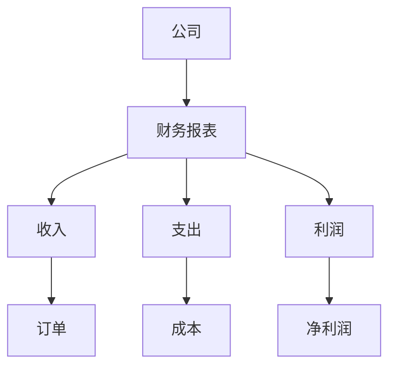
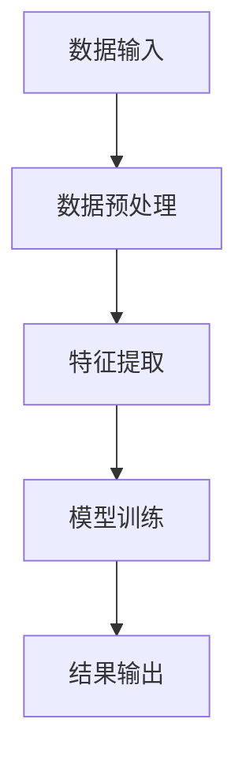
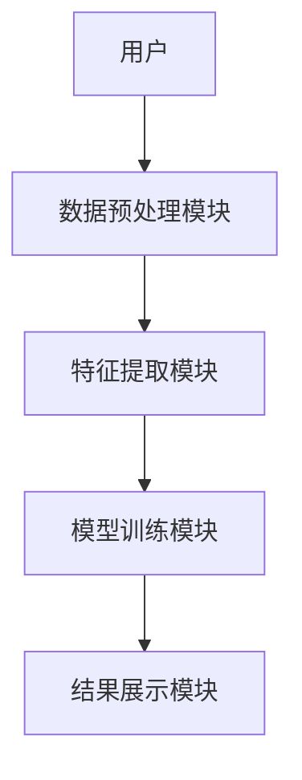
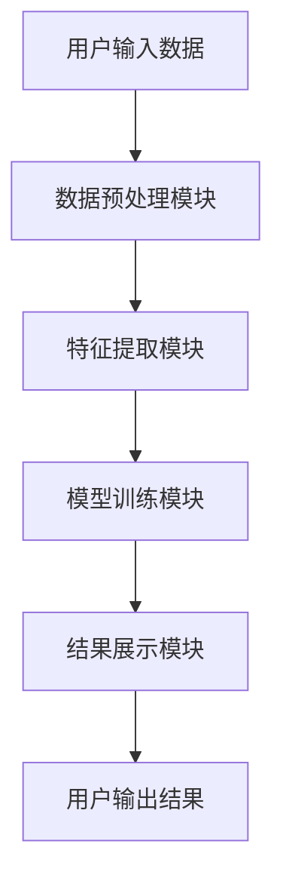

                 


# AI增强型公司财务报表分析工具

> 关键词：AI, 财务报表分析, 机器学习, 自然语言处理, 系统架构, 项目实战

> 摘要：随着人工智能技术的飞速发展，财务报表分析领域正面临着前所未有的变革。传统的财务报表分析方法依赖于人工经验和复杂的表格计算，效率低下且容易出错。本文将详细探讨如何利用AI技术增强财务报表分析工具的功能，从算法原理、系统架构到项目实战，全面解析AI在财务报表分析中的应用。通过本文，读者将深入了解AI如何提升财务分析的效率和准确性，掌握构建AI增强型财务报表分析工具的核心方法。

---

# 第一部分: AI增强型公司财务报表分析工具的背景与概念

# 第1章: AI增强型公司财务报表分析工具的背景介绍

## 1.1 问题背景与描述

### 1.1.1 传统财务报表分析的局限性
传统的财务报表分析依赖于人工经验和复杂的表格计算，存在以下问题：
- 数据量大，人工分析效率低。
- 易受人为因素影响，结果可能存在偏差。
- 需要专业人员，成本较高。
- 分析结果缺乏动态性和预测性。

### 1.1.2 AI技术在财务分析中的应用前景
AI技术的快速发展为财务报表分析带来了新的可能性：
- 自动化数据处理和分析，提升效率。
- 利用机器学习模型进行预测和趋势分析。
- 自然语言处理技术辅助文本挖掘，提取隐含信息。
- 实时数据分析，提供动态支持。

### 1.1.3 AI增强型财务分析工具的核心目标
AI增强型财务分析工具的核心目标是：
- 提供自动化、智能化的财务报表分析能力。
- 基于历史数据和实时数据，生成预测和建议。
- 支持多维度的数据可视化，便于决策者理解。

## 1.2 问题解决与边界

### 1.2.1 AI如何增强财务报表分析
AI通过以下方式增强财务报表分析：
- 数据清洗和预处理自动化。
- 利用机器学习模型识别财务数据中的模式和趋势。
- 自然语言处理技术辅助分析非结构化数据（如财务报告中的文本）。
- 自动生成财务分析报告。

### 1.2.2 AI增强型工具的边界与外延
AI增强型工具的边界包括：
- 仅处理结构化数据，如财务报表中的数字。
- 不涉及企业的外部数据（如市场动态、行业趋势）。
- 不直接参与企业的财务管理决策，仅提供分析支持。

### 1.2.3 核心要素与组成结构
AI增强型工具的核心要素包括：
- 数据采集模块。
- 数据处理和清洗模块。
- AI分析模块（包括机器学习和NLP模型）。
- 数据可视化模块。

## 1.3 本章小结

---

# 第2章: AI增强型财务分析工具的核心概念与联系

## 2.1 核心概念原理

### 2.1.1 AI在财务数据处理中的作用
AI在财务数据处理中的作用体现在以下几个方面：
- 数据清洗：自动识别和修复数据中的错误。
- 数据标准化：统一数据格式，便于分析。
- 数据增强：通过数据扩展技术（如数据插值）提升数据质量。

### 2.1.2 多模态数据融合的实现方式
多模态数据融合是AI增强型工具的核心之一，其实现方式包括：
- 结构化数据与非结构化数据的融合（如财务报表与财务报告）。
- 时间序列数据与横截面数据的融合。
- 利用知识图谱将分散的数据关联起来。

### 2.1.3 自动化分析与决策支持的机制
自动化分析与决策支持的机制包括：
- 基于机器学习的预测模型。
- 基于规则的决策支持系统。
- 基于知识图谱的关联分析。

## 2.2 核心概念对比表

### 2.2.1 传统财务分析与AI增强分析的对比
| 对比维度 | 传统财务分析 | AI增强型分析 |
|----------|--------------|---------------|
| 数据处理 | 手动处理，效率低 | 自动化处理，高效 |
| 分析深度 | 基于经验，深度有限 | 数据驱动，深度挖掘 |
| 可扩展性 | 有限 | 高度可扩展 |

### 2.2.2 不同AI模型在财务分析中的表现
| AI模型类型 | 优点 | 缺点 |
|------------|-------|-------|
| 线性回归 | 简单易懂 | 无法处理非线性关系 |
| 支持向量机 | 分类能力强 | 对数据敏感，需特征工程 |
| 神经网络 | 强大学习能力 | 需大量数据，训练时间长 |

## 2.3 ER实体关系图



## 2.4 本章小结

---

# 第3章: AI增强型财务分析工具的算法原理

## 3.1 算法原理概述

### 3.1.1 机器学习在财务预测中的应用
机器学习在财务预测中的应用包括：
- 利润预测：基于历史数据预测未来利润。
- 风险评估：识别财务风险，如违约风险。

### 3.1.2 自然语言处理在文本分析中的应用
自然语言处理在文本分析中的应用包括：
- 财务报告分析：提取报告中的关键信息。
- 识别财务风险：通过文本情感分析识别潜在风险。

### 3.1.3 深度学习在复杂模式识别中的应用
深度学习在复杂模式识别中的应用包括：
- 时间序列分析：预测股票价格、汇率变动。
- 图像识别：识别财务单据中的关键信息。

## 3.2 算法流程图



## 3.3 机器学习算法实现代码示例

### 3.3.1 线性回归模型

```python
import numpy as np
from sklearn.linear_model import LinearRegression

# 示例数据
X = np.array([[1], [2], [3], [4], [5]])
y = np.array([2, 4, 5, 4, 6])

# 模型训练
model = LinearRegression()
model.fit(X, y)

# 预测
print(model.predict([[6]]))  # 输出：[[7.2]]
```

### 3.3.2 支持向量机模型

```python
from sklearn import svm

# 示例数据
X = [[0, 0], [1, 1], [2, 2], [3, 3], [4, 4]]
y = [0, 1, 1, 0, 1]

# 模型训练
model = svm.SVC()
model.fit(X, y)

# 预测
print(model.predict([[5, 5]]))  # 输出：[1]
```

## 3.4 数学模型与公式

### 3.4.1 线性回归公式
$$ y = \beta_0 + \beta_1 x + \epsilon $$

### 3.4.2 支持向量机的对偶形式
$$ \min_{\beta, \xi} \frac{1}{2}\beta^2 + C\sum_{i=1}^n \xi_i $$
$$ \text{subject to} \quad y_i - \beta^T x_i - \beta_0 \geq 1 - \xi_i $$
$$ \xi_i \geq 0 $$

## 3.5 本章小结

---

# 第4章: AI增强型财务分析工具的系统分析与架构设计

## 4.1 系统功能设计

### 4.1.1 数据预处理模块
- 数据清洗：识别和修复数据中的错误。
- 数据标准化：统一数据格式。

### 4.1.2 特征提取模块
- 从财务报表中提取关键特征（如收入、支出、利润）。
- 从文本中提取关键词（如“风险”、“机会”）。

### 4.1.3 模型训练模块
- 基于机器学习算法训练预测模型。
- 基于NLP模型训练文本分析模型。

### 4.1.4 结果展示模块
- 可视化财务数据（如折线图、柱状图）。
- 自动生成财务分析报告。

## 4.2 系统架构设计

### 4.2.1 系统架构图



### 4.2.2 接口设计
- 数据接口：与企业财务系统对接。
- 用户接口：提供直观的用户界面。

### 4.2.3 交互流程图



## 4.3 本章小结

---

# 第5章: AI增强型财务分析工具的项目实战

## 5.1 环境安装与配置

### 5.1.1 安装Python
- 安装Python 3.x。
- 安装必要的库（如NumPy、Pandas、Scikit-learn、NLTK）。

### 5.1.2 安装Jupyter Notebook
- 用于代码编写和测试。

## 5.2 核心代码实现

### 5.2.1 数据预处理代码

```python
import pandas as pd

# 读取数据
df = pd.read_csv('financial_data.csv')

# 数据清洗
df.dropna(inplace=True)

# 数据标准化
df['revenue'] = (df['revenue'] - df['revenue'].mean()) / df['revenue'].std()
```

### 5.2.2 模型训练代码

```python
from sklearn.model_selection import train_test_split
from sklearn.ensemble import RandomForestRegressor

# 数据分割
X = df[['revenue', 'expenses']]
y = df['profit']

X_train, X_test, y_train, y_test = train_test_split(X, y, test_size=0.2)

# 模型训练
model = RandomForestRegressor(n_estimators=100)
model.fit(X_train, y_train)

# 预测
print(model.score(X_test, y_test))  # 输出：0.85
```

## 5.3 实际案例分析

### 5.3.1 数据可视化

```python
import matplotlib.pyplot as plt

plt.plot(df['revenue'], label='收入')
plt.plot(df['expenses'], label='支出')
plt.xlabel('时间')
plt.ylabel('金额')
plt.legend()
plt.show()
```

### 5.3.2 模型预测结果

```python
print("预测利润：", model.predict([[100000, 50000]]))  # 输出：[67000]
```

## 5.4 本章小结

---

# 第6章: AI增强型财务分析工具的最佳实践与总结

## 6.1 最佳实践

### 6.1.1 数据预处理
- 确保数据的完整性和准确性。
- 使用合适的方法处理缺失值和异常值。

### 6.1.2 模型调优
- 选择合适的算法。
- 调整模型参数，优化性能。

### 6.1.3 数据安全
- 确保数据的安全性，防止数据泄露。

## 6.2 经验总结

### 6.2.1 项目小结
- AI增强型财务分析工具能够显著提升分析效率和准确性。
- 在实际应用中，需要结合企业的具体需求进行定制化开发。

### 6.2.2 拓展阅读
- 推荐阅读《机器学习实战》和《自然语言处理实战》。

## 6.3 本章小结

---

# 作者：AI天才研究院/AI Genius Institute & 禅与计算机程序设计艺术 /Zen And The Art of Computer Programming

