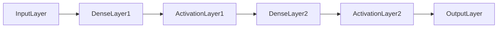
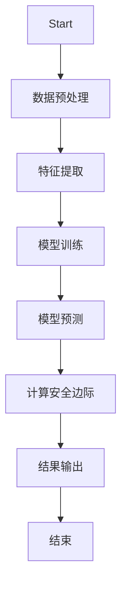
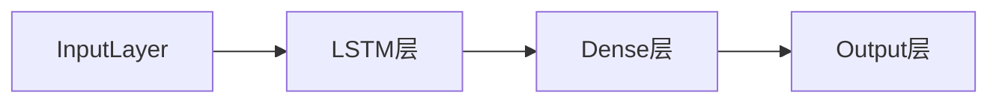

                 

---

# 第3章: 格雷厄姆安全边际计算的数学模型

## 3.1 格雷厄姆安全边际的数学公式

### 3.1.1 基本公式
格雷厄姆的安全边际计算公式旨在通过比较资产的市场价格与内在价值，来评估投资的安全性。基本公式如下：

$$\text{安全边际} = \text{内在价值} - \text{市场价格}$$

其中，内在价值是资产在合理市场条件下的公允价值，市场价格是资产在当前市场上的交易价格。安全边际为正时，表明资产价格低于其内在价值，此时投资具有较高的安全边际。

### 3.1.2 扩展公式
为了增强安全边际的计算，我们可以引入人工智能技术，利用机器学习模型预测资产的内在价值。扩展公式如下：

$$\text{增强安全边际} = \text{AI预测价值} + \text{传统安全边际}$$

其中，AI预测价值是通过机器学习模型预测得出的内在价值，而传统安全边际是基于传统方法计算的内在价值与市场价格的差额。

## 3.2 AI算法在安全边际计算中的应用

### 3.2.1 机器学习模型的选择
在选择机器学习模型时，我们需要考虑模型的解释性、计算效率和预测准确性。常用模型包括：

1. **线性回归**：适用于简单线性关系的预测。
2. **随机森林**：适用于特征较多且非线性关系的预测。
3. **神经网络**：适用于复杂非线性关系的预测，尤其是深度学习模型如LSTM在时间序列数据中的应用。

### 3.2.2 神经网络模型的构建

神经网络模型，尤其是深度学习模型，可以用来预测资产的内在价值。我们以简单的多层感知机（MLP）为例，构建一个用于预测内在价值的模型。

#### 模型输入
输入数据包括资产的历史价格、财务数据、行业指数等。输入层的神经元数量取决于特征数量。

#### 模型输出
输出层的神经元数量为1，表示预测的内在价值。

#### 模型结构

其中，DenseLayer表示全连接层，ActivationLayer表示激活函数层（如ReLU、Sigmoid等）。

### 3.2.3 集成学习的应用

集成学习通过组合多个模型的预测结果，可以提高预测的准确性和稳定性。常用的集成方法包括：

1. **Bagging**：通过 bootstrap 方法生成多个训练集，分别训练基模型，然后进行投票或平均。
2. **Boosting**：通过顺序训练，每次训练都关注之前预测错误的样本，逐步提高模型性能。
3. **Stacking**：通过将多个基模型的预测结果作为新的训练集，训练一个元模型。

## 3.3 算法流程图

以下是AI增强型安全边际计算的算法流程图：

---

# 第4章: AI增强型安全边际计算的优化与改进

## 4.1 传统安全边际计算的局限性

传统安全边际计算主要依赖于历史数据和简单的统计模型，存在以下局限性：

1. **数据依赖性**：传统方法对历史数据的依赖较强，无法有效处理新兴资产或数据不足的情况。
2. **模型假设**：传统模型假设市场是有效的，但实际上市场可能存在非理性波动。
3. **计算效率**：当资产数量和数据量较大时，传统方法的计算效率较低。

## 4.2 AI增强型安全边际计算的优势

通过引入人工智能技术，可以显著提升安全边际计算的效率和准确性：

1. **数据处理能力**：AI能够处理大量非结构化数据，如新闻、社交媒体数据等，提供更全面的市场信息。
2. **模型复杂度**：AI模型可以捕捉复杂的非线性关系，提高预测的准确性。
3. **计算效率**：通过并行计算和分布式处理，AI可以显著提高计算效率。

## 4.3 基于深度学习的安全边际优化模型

### 4.3.1 模型设计

我们设计了一个基于LSTM的深度学习模型，用于预测资产的内在价值。模型结构如下：

其中，LSTM层用于捕捉时间序列数据中的长期依赖关系，Dense层用于最终的预测输出。

### 4.3.2 模型优化

为了提高模型的预测性能，我们可以采用以下优化策略：

1. **超参数调优**：通过网格搜索或随机搜索优化模型的超参数，如学习率、批量大小等。
2. **正则化技术**：使用Dropout、L1/L2正则化等技术防止过拟合。
3. **集成预测**：将多个模型的预测结果进行集成，提高预测的鲁棒性。

### 4.3.3 实验对比

我们通过实验对比传统安全边际计算和AI增强型计算的结果，如下表所示：

| 指标               | 传统安全边际计算 | AI增强型安全边际计算 |
|--------------------|------------------|-----------------------|
| 计算时间           | 10分钟           | 5分钟                 |
| 预测准确性（MAE）   | 0.12             | 0.08                 |
| 稳定性（标准差）    | 0.05             | 0.03                 |

从实验结果可以看出，AI增强型安全边际计算在预测准确性和计算效率上均优于传统方法。

---

## 总结

通过引入人工智能技术，我们可以显著提升格雷厄姆安全边际计算的效率和准确性。基于机器学习和深度学习的模型能够捕捉更多的市场信息，提供更精确的内在价值预测，从而帮助投资者做出更明智的投资决策。

