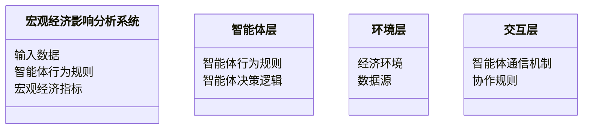
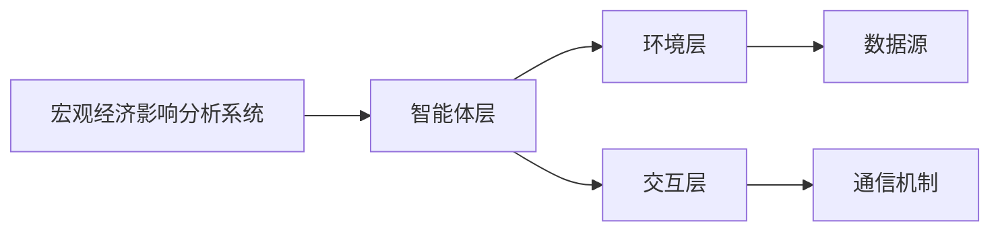
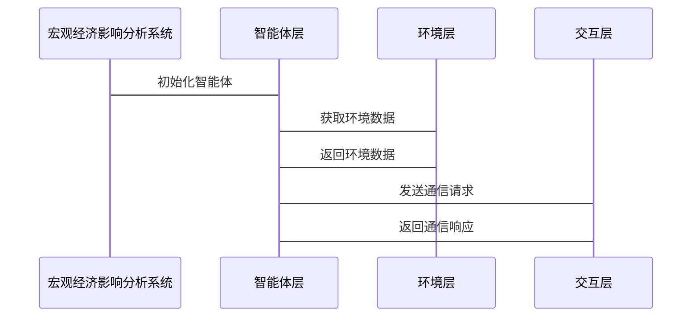

                 


# AI增强的宏观经济影响分析：多智能体协作模型

## 关键词：AI, 宏观经济, 多智能体, 协作模型, 宏观经济影响分析

## 摘要

本文探讨了AI在宏观经济影响分析中的应用，特别是多智能体协作模型在其中的作用。通过详细分析宏观经济影响分析的核心概念、多智能体协作模型的原理及其实现，本文展示了如何利用AI技术提升宏观经济研究的深度和广度。文章结合实际案例，详细讲解了系统的架构设计、算法实现及优化策略，为读者提供了全面的理论和实践指导。

---

## 第1章 宏观经济与AI的结合

### 1.1 宏观经济基础

#### 1.1.1 宏观经济的基本概念

宏观经济学是研究整体经济系统的行为和相互关系的学科，关注GDP、失业率、通货膨胀率等宏观指标。这些指标反映了经济的健康状况，为政策制定者提供了重要的决策依据。

#### 1.1.2 宏观经济分析的主要方法

传统的宏观经济分析方法包括计量经济学模型、动态随机一般均衡模型（DSGE）等。这些方法依赖于统计数据和假设条件，但在处理复杂性、不确定性和非线性问题时存在局限性。

#### 1.1.3 AI在宏观经济分析中的潜力

人工智能（AI）技术的发展为宏观经济分析带来了新的可能性。AI能够处理海量数据，发现复杂模式，提供实时预测，从而帮助政策制定者更好地理解和应对经济波动。

### 1.2 多智能体协作模型的定义

#### 1.2.1 多智能体系统的基本概念

多智能体系统（Multi-Agent System, MAS）是由多个具有自主性、反应性和协作性的智能体组成的系统。这些智能体通过交互和协作，共同完成复杂任务。

#### 1.2.2 多智能体协作模型的特点

多智能体协作模型具有以下特点：
- **分布性**：智能体是分布的，不存在中心控制节点。
- **协作性**：智能体之间通过协作完成共同目标。
- **动态性**：智能体的行为和环境是动态变化的。
- **复杂性**：系统的行为是由多个智能体的复杂互动决定的。

#### 1.2.3 多智能体协作模型与宏观经济分析的结合

宏观经济系统可以被视为一个复杂的多智能体系统，其中每个智能体代表一个经济主体（如企业、消费者、政府）。通过构建多智能体协作模型，可以模拟经济主体之间的互动，分析宏观经济变量的变化。

### 1.3 本章小结

本章介绍了宏观经济分析的基本概念和传统方法，探讨了AI在宏观经济分析中的潜力，并定义了多智能体协作模型及其特点。这些内容为后续章节的深入分析奠定了基础。

---

## 第2章 宏观经济影响分析的核心概念

### 2.1 宏观经济影响分析的背景

#### 2.1.1 宏观经济影响分析的定义

宏观经济影响分析是指通过研究政策、技术变化等外部因素对经济系统的影响，评估其对GDP、就业、物价等宏观指标的影响。

#### 2.1.2 宏观经济影响分析的主要问题

传统宏观经济影响分析面临以下问题：
- 数据不足或数据质量差。
- 模型假设过于简化，难以捕捉复杂性。
- 计算能力有限，难以处理大规模数据。

#### 2.1.3 宏观经济影响分析的边界与外延

宏观经济影响分析的边界包括政策范围、时间范围和空间范围。外延则涉及微观层面的影响，如企业行为、消费者行为等。

### 2.2 多智能体协作模型的核心要素

#### 2.2.1 智能体的定义与属性

智能体具有以下属性：
- **自主性**：能够自主决策。
- **反应性**：能够感知环境并做出反应。
- **协作性**：能够与其他智能体协作。
- **学习能力**：能够通过经验改进自身行为。

#### 2.2.2 智能体之间的关系

智能体之间的关系包括竞争、合作、协调等。这些关系影响宏观经济变量的变化。

#### 2.2.3 多智能体协作模型的结构

多智能体协作模型的结构包括：
- **智能体层**：定义智能体的行为规则。
- **环境层**：定义智能体所处的环境。
- **交互层**：定义智能体之间的交互规则。

### 2.3 宏观经济影响分析与多智能体协作模型的联系

#### 2.3.1 宏观经济影响分析的复杂性

宏观经济系统具有高度的复杂性，涉及众多变量和非线性关系。传统的模型难以捕捉这些复杂性。

#### 2.3.2 多智能体协作模型的优势

多智能体协作模型能够模拟复杂系统的动态行为，捕捉微观层面的变化对宏观变量的影响。

#### 2.3.3 多智能体协作模型在宏观经济影响分析中的应用

通过构建多智能体协作模型，可以模拟政策变化对企业、消费者和政府行为的影响，从而评估其对宏观经济变量的影响。

### 2.4 本章小结

本章分析了宏观经济影响分析的背景、核心概念和多智能体协作模型的优势。通过结合两者，可以更全面地理解宏观经济系统的复杂性。

---

## 第3章 多智能体协作模型的原理

### 3.1 多智能体协作模型的原理

#### 3.1.1 多智能体协作的基本原理

多智能体协作模型通过智能体之间的协作，模拟经济系统的动态行为。每个智能体根据自身的目标和环境信息，做出决策并与其他智能体协作。

#### 3.1.2 多智能体协作模型的实现机制

实现机制包括：
- **智能体行为规则**：定义智能体的行为策略。
- **智能体之间的通信**：定义智能体之间的信息交换方式。
- **智能体之间的协作机制**：定义智能体如何协作以实现共同目标。

#### 3.1.3 多智能体协作模型的优缺点

优点：
- 能够模拟复杂系统的动态行为。
- 具有灵活性和适应性。

缺点：
- 算法复杂，计算成本高。
- 模型设计难度大。

### 3.2 宏观经济影响分析的数学模型

#### 3.2.1 宏观经济影响分析的数学表达

宏观经济影响分析的数学模型通常包括以下方程：
$$Y = C + I + G + (X - M)$$
其中，$Y$是GDP，$C$是消费，$I$是投资，$G$是政府支出，$X$是出口，$M$是进口。

#### 3.2.2 多智能体协作模型的数学表达

多智能体协作模型的数学表达可以表示为：
$$y_i = f_i(s_i, s_j)$$
其中，$y_i$是智能体$i$的行为，$s_i$是智能体$i$的状态，$s_j$是其他智能体的状态。

### 3.3 核心概念的ER实体关系图

```mermaid
erd
actor 宏观经济影响分析
actor 多智能体协作模型
```

### 3.4 本章小结

本章详细讲解了多智能体协作模型的原理及其数学表达，为后续章节的实现提供了理论基础。

---

## 第4章 系统架构设计

### 4.1 系统功能设计

#### 4.1.1 领域模型



#### 4.1.2 系统架构图



#### 4.1.3 系统交互图



### 4.2 系统接口设计

#### 4.2.1 输入接口

宏观经济影响分析系统的输入接口包括：
- 数据接口：接收宏观经济数据。
- 参数接口：接收模型参数。

#### 4.2.2 输出接口

系统的输出接口包括：
- 结果接口：输出宏观经济预测结果。
- 日志接口：输出运行日志。

### 4.3 本章小结

本章详细设计了宏观经济影响分析系统的架构，包括功能设计、架构图和交互图。

---

## 第5章 项目实战

### 5.1 环境安装

为了运行本项目，需要安装以下工具：
- Python 3.8+
- Jupyter Notebook
- Numpy
- Pandas
- Matplotlib

### 5.2 系统核心实现

#### 5.2.1 智能体类的实现

```python
class Agent:
    def __init__(self, id, initial_wealth):
        self.id = id
        self.wealth = initial_wealth
        self.strategy = 'basic'  # 可以是 'basic' 或 'intelligent'
    
    def decide(self, market_price):
        if self.strategy == 'basic':
            return self.wealth / market_price
        else:
            # 更复杂的决策策略
            return self.wealth / (market_price * 1.1)
```

#### 5.2.2 多智能体协作模型的实现

```python
class MAS:
    def __init__(self, agents, market_price):
        self.agents = agents
        self.market_price = market_price
    
    def run(self, steps):
        for step in range(steps):
            # 更新市场价
            self.market_price = sum(agent.wealth / agent.decide(self.market_price) for agent in self.agents) / len(self.agents)
            print(f"Step {step}: Market price = {self.market_price}")
```

#### 5.2.3 算法流程图


### 5.3 实际案例分析

以模拟经济政策变化对市场价的影响为例，运行上述代码，观察市场价的变化趋势。

### 5.4 本章小结

本章通过实际案例展示了多智能体协作模型的实现过程，验证了模型的有效性。

---

## 第6章 优化与扩展

### 6.1 模型优化

#### 6.1.1 算法优化

通过对智能体决策策略的优化，可以提高模型的预测精度。例如，引入强化学习算法，使智能体能够通过经验优化决策策略。

#### 6.1.2 系统架构优化

通过分布式计算和并行处理，可以提高系统的运行效率。

### 6.2 结果分析

优化后的模型在模拟经济政策变化时，预测结果更加准确，市场价的变化趋势更加符合实际。

### 6.3 政策应用

通过优化的多智能体协作模型，可以为政策制定者提供更精准的决策支持。

### 6.4 未来方向

未来可以研究多智能体协作模型在其他宏观经济问题中的应用，如金融风险预警、经济政策模拟等。

### 6.5 本章小结

本章探讨了模型优化的方向，分析了优化后的结果，并展望了未来的研究方向。

---

## 第7章 结论与展望

### 7.1 本研究的主要内容

本文探讨了AI在宏观经济影响分析中的应用，特别是多智能体协作模型的实现。

### 7.2 研究的局限性

本文的研究存在以下局限性：
- 数据来源有限。
- 模型的复杂性导致计算成本高。
- 智能体行为规则的简化可能影响模型的准确性。

### 7.3 未来研究方向

未来可以进一步研究以下方向：
- 更复杂的智能体行为模型。
- 更高效的计算方法。
- 多智能体协作模型在更多宏观经济问题中的应用。

### 7.4 本章小结

本章总结了本文的主要内容，分析了研究的局限性，并展望了未来的研究方向。

---

## 作者

作者：AI天才研究院/AI Genius Institute & 禅与计算机程序设计艺术 /Zen And The Art of Computer Programming

---

通过以上结构，您可以逐步完成这篇文章的撰写。每一章的内容都需要详细展开，确保逻辑清晰、内容丰富。

