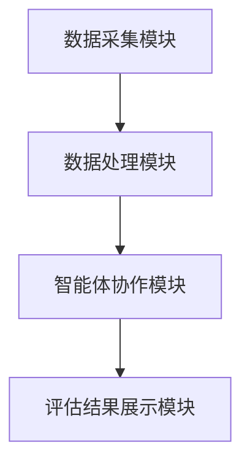

                 


# AI增强的知识产权组合评估：多智能体协作模型

## 关键词：AI、知识产权评估、多智能体协作、知识产权组合、机器学习、自然语言处理（NLP）、知识产权管理

## 摘要：
知识产权评估是企业在技术管理和战略决策中的关键环节，传统的评估方法往往依赖于人工分析，存在效率低、成本高、主观性强等问题。随着人工智能技术的快速发展，基于多智能体协作的AI增强评估方法逐渐成为研究的热点。本文系统地介绍了一种基于多智能体协作的知识产权组合评估模型，从模型的设计原理、算法实现到实际应用场景进行了深入探讨，展示了该模型在提高评估效率、准确性和智能化水平方面的显著优势。

---

# 第1章 知识产权组合评估概述

## 1.1 知识产权的基本概念

### 1.1.1 知识产权的定义与范围
知识产权（Intellectual Property，IP）是指人们在科学技术、文学艺术等领域中，通过智力劳动创造的成果所享有的专有权利。知识产权主要包括专利权、商标权、版权（著作权）、商业秘密等。这些权利具有无形性、专有性、地域性和时间性的特点。

### 1.1.2 知识产权的分类与特征
知识产权可以分为以下几类：
1. **专利权**：保护发明创造，包括发明专利、实用新型专利和外观设计专利。
2. **商标权**：保护品牌标识，用于区分商品或服务的来源。
3. **版权**：保护文学、艺术、音乐、影视、软件等原创作品。
4. **商业秘密**：保护未公开的技术诀窍、配方、客户名单等敏感信息。

### 1.1.3 知识产权评估的重要性
知识产权评估是企业在技术研发、并购、诉讼等活动中不可或缺的环节。通过评估，企业可以准确衡量知识产权的价值，制定合理的定价策略、防御策略和侵权应对措施。

---

## 1.2 AI在知识产权评估中的作用

### 1.2.1 AI技术在知识产权分析中的优势
人工智能技术，尤其是自然语言处理（NLP）和机器学习（ML），能够从大量非结构化数据中提取有用信息。例如，NLP可以自动分析专利文件中的技术关键词和相关领域的技术趋势；机器学习可以预测专利的法律风险和市场价值。

### 1.2.2 多智能体协作模型的概念
多智能体协作模型是指多个AI智能体协同工作，共同完成复杂任务的系统。在知识产权评估中，可以部署多个智能体分别负责技术分析、法律分析、市场分析等任务，并通过协同学习和信息共享提高评估的准确性和效率。

### 1.2.3 传统评估方法的局限性
传统的知识产权评估方法主要依赖人工分析，存在以下问题：
- 数据量大、处理复杂，效率低。
- 评估结果主观性强，缺乏客观依据。
- 无法实时跟踪技术动态和市场变化。

---

## 1.3 知识产权组合评估的背景与需求

### 1.3.1 知识产权组合评估的定义
知识产权组合（IP Portfolio）是指一组相关或不相关的知识产权资产。对知识产权组合进行评估，可以帮助企业优化资产配置、降低风险、提升竞争力。

### 1.3.2 企业知识产权组合管理的挑战
企业在管理知识产权组合时面临以下挑战：
1. 如何评估知识产权的经济价值？
2. 如何识别潜在的侵权风险？
3. 如何制定知识产权的保护和运营策略？

### 1.3.3 多智能体协作模型的应用场景
多智能体协作模型在知识产权组合评估中的应用场景包括：
- 技术领域分析：识别技术领域的优势和劣势。
- 法律风险评估：预测专利无效、侵权的风险。
- 市场潜力分析：评估专利的市场应用前景。

---

## 1.4 本章小结
本章介绍了知识产权的基本概念、评估的重要性以及AI在知识产权评估中的作用。通过对比传统评估方法的局限性，提出了多智能体协作模型的应用价值和应用场景，为后续章节的深入分析奠定了基础。

---

# 第2章 知识产权组合评估的核心概念

## 2.1 知识产权组合评估的关键要素

### 2.1.1 知识产权组合的价值构成
知识产权的价值取决于多个因素，包括技术先进性、法律稳定性、市场竞争力等。例如，一项技术先进的专利可能具有较高的市场价值，但若存在法律风险，则其实际价值可能大幅降低。

### 2.1.2 知识产权组合的风险评估
风险评估是知识产权组合管理的重要环节。常见的风险包括：
1. 技术风险：技术过时或被替代的风险。
2. 法律风险：专利无效或被侵权的风险。
3. 市场风险：市场需求变化导致的价值波动风险。

### 2.1.3 知识产权组合的市场潜力
市场潜力是评估知识产权价值的重要指标。通过分析市场需求、竞争对手情况和技术发展趋势，可以预测知识产权的市场应用前景。

---

## 2.2 多智能体协作模型的原理

### 2.2.1 多智能体协作的基本概念
多智能体协作是指多个智能体通过信息共享和协同决策，共同完成复杂任务的过程。每个智能体负责特定的任务模块，通过通信和协调实现整体目标。

### 2.2.2 智能体之间的信息交互
在多智能体协作模型中，智能体之间的信息交互可以通过以下方式实现：
1. **分布式计算**：智能体各自处理部分数据，通过通信协议共享中间结果。
2. **协同学习**：智能体通过共享知识和经验，共同优化模型参数。
3. **任务分配**：根据任务特点和智能体能力，动态分配协作任务。

### 2.2.3 协作任务的分配与优化
协作任务的分配需要考虑以下因素：
- **任务复杂度**：任务是否需要多个智能体协同完成。
- **智能体能力**：智能体的计算能力、知识储备和响应速度。
- **通信成本**：智能体之间的通信 overhead 是否在可接受范围内。

---

## 2.3 AI增强的知识产权评估模型

### 2.3.1 模型的输入与输出
AI增强的知识产权评估模型的输入包括：
- 专利文本数据（专利申请文件、技术描述）。
- 市场数据（竞争对手信息、市场需求）。
- 法律数据（专利法律状态、司法案例）。

模型的输出包括：
- 专利的经济价值评估。
- 专利的法律风险评估。
- 专利的市场潜力评估。

### 2.3.2 模型的核心算法
模型的核心算法包括：
1. **自然语言处理（NLP）**：用于从专利文本中提取技术关键词和领域信息。
2. **机器学习（ML）**：用于预测专利的法律风险和市场价值。
3. **图神经网络（GNN）**：用于分析专利之间的关联关系，如技术引用和同族专利。

### 2.3.3 模型的评估标准
模型的评估标准包括：
1. **准确性**：评估结果与实际价值的接近程度。
2. **效率**：模型处理大规模数据的能力。
3. **可解释性**：模型输出结果的可解释性。

---

## 2.4 本章小结
本章详细介绍了知识产权组合评估的关键要素和多智能体协作模型的原理。通过分析模型的输入、输出和核心算法，为后续章节的技术实现奠定了基础。

---

# 第3章 多智能体协作模型的技术基础

## 3.1 知识产权数据的处理与分析

### 3.1.1 数据清洗与预处理
在进行知识产权评估之前，需要对数据进行清洗和预处理，包括：
- 去除重复数据。
- 处理缺失值。
- 标准化数据格式。

### 3.1.2 数据特征提取
特征提取是将专利文本转化为可计算的特征向量的过程。常用的特征包括：
- **词袋模型（Bag of Words）**：统计专利文本中关键词的出现频率。
- **TF-IDF（Term Frequency-Inverse Document Frequency）**：计算关键词的重要性。
- **Word2Vec**：将关键词转化为向量表示。

### 3.1.3 数据的可视化分析
通过可视化工具（如t-SNE、PCA）对专利数据进行降维和可视化，可以帮助理解数据的分布和关联关系。

---

## 3.2 多智能体协作的实现技术

### 3.2.1 分布式计算与通信
多智能体协作需要分布式计算环境支持。常用的分布式计算框架包括：
- **MPI（Message Passing Interface）**：适用于高性能计算。
- **Spark（分布式计算框架）**：适用于大数据处理。
- **Kubernetes**：适用于容器化部署。

### 3.2.2 智能体的协同学习
协同学习是多智能体协作的重要技术，包括：
- **联邦学习（Federated Learning）**：多个智能体在不共享数据的情况下协同训练模型。
- **迁移学习（Transfer Learning）**：利用已有知识快速适应新任务。

### 3.2.3 智能体的自适应调整
智能体需要根据任务动态调整自身行为，例如：
- 根据任务需求动态分配计算资源。
- 根据协作结果优化通信策略。

---

## 3.3 AI技术在知识产权评估中的应用

### 3.3.1 自然语言处理（NLP）在专利分析中的应用
NLP技术可以用于：
- **专利分类**：根据专利内容自动分类到技术领域。
- **技术趋势分析**：通过分析专利申请趋势预测技术发展方向。

### 3.3.2 机器学习在知识产权价值预测中的应用
机器学习可以用于：
- **专利价值预测**：基于历史数据预测专利的经济价值。
- **侵权风险预测**：预测专利被侵权的可能性。

### 3.3.3 图神经网络在知识产权关系网络中的应用
图神经网络可以用于：
- **专利关联分析**：分析专利之间的引用关系和同族专利关系。
- **知识图谱构建**：构建知识产权领域的知识图谱。

---

## 3.4 本章小结
本章介绍了多智能体协作模型的技术基础，包括数据处理、分布式计算和AI技术的应用。通过具体的技术细节分析，为后续章节的系统实现提供了技术支持。

---

# 第4章 多智能体协作模型的算法原理

## 4.1 知识产权组合评估的数学模型

### 4.1.1 知识产权组合价值的数学表达
知识产权组合价值可以通过以下公式进行计算：
$$
V = \sum_{i=1}^{n} w_i \cdot v_i
$$
其中，$w_i$ 是第 $i$ 项知识产权的权重，$v_i$ 是第 $i$ 项知识产权的价值。

### 4.1.2 知识产权组合风险的数学模型
知识产权组合风险可以通过以下公式进行计算：
$$
R = \sum_{i=1}^{n} w_i \cdot r_i
$$
其中，$r_i$ 是第 $i$ 项知识产权的风险值。

### 4.1.3 知识产权组合市场潜力的数学公式
知识产权组合市场潜力可以通过以下公式进行计算：
$$
M = \sum_{i=1}^{n} w_i \cdot m_i
$$
其中，$m_i$ 是第 $i$ 项知识产权的市场潜力值。

---

## 4.2 多智能体协作的算法实现

### 4.2.1 分布式计算框架的选择
多智能体协作需要选择合适的分布式计算框架，例如：
- **Spark**：适用于大规模数据处理。
- **Flink**：适用于流数据处理。
- **Kubernetes**：适用于容器化部署。

### 4.2.2 智能体协作的通信协议
智能体之间需要通过通信协议进行信息交互，例如：
- **RPC（Remote Procedure Call）**：远程过程调用。
- **HTTP/HTTPS**：基于 REST 的通信。
- **WebSocket**：实时通信协议。

### 4.2.3 协作任务的分配算法
协作任务的分配算法包括：
- **负载均衡算法**：根据智能体的负载情况动态分配任务。
- **贪心算法**：优先分配任务到最合适的智能体。
- **遗传算法**：通过优化算法选择最优的任务分配方案。

---

## 4.3 本章小结
本章详细介绍了多智能体协作模型的算法原理，包括知识产权组合评估的数学模型和协作任务的分配算法。通过具体算法实现，为后续章节的系统设计提供了理论支持。

---

# 第5章 系统架构设计

## 5.1 系统功能设计

### 5.1.1 系统功能模块划分
知识产权组合评估系统的功能模块包括：
1. 数据采集模块：采集专利、商标、版权等知识产权数据。
2. 数据处理模块：对数据进行清洗、特征提取和存储。
3. 智能体协作模块：实现多智能体的协同学习和协作任务分配。
4. 评估结果展示模块：以可视化方式展示评估结果。

### 5.1.2 系统功能流程
系统的功能流程如下：
1. 数据采集模块获取知识产权数据。
2. 数据处理模块对数据进行清洗和特征提取。
3. 智能体协作模块分配协作任务并进行协同学习。
4. 评估结果展示模块生成并展示评估结果。

---

## 5.2 系统架构设计

### 5.2.1 系统架构图
以下是一个知识产权组合评估系统的架构图：



### 5.2.2 系统接口设计
系统接口设计包括：
- 数据接口：与外部数据源对接。
- 用户接口：供用户输入查询和查看结果。
- 智能体接口：智能体之间的通信接口。

### 5.2.3 系统交互流程
系统的交互流程如下：
1. 用户通过用户接口输入查询请求。
2. 数据采集模块从外部数据源获取数据。
3. 数据处理模块对数据进行清洗和特征提取。
4. 智能体协作模块分配协作任务并进行协同学习。
5. 评估结果展示模块生成并展示评估结果。

---

## 5.3 本章小结
本章详细介绍了知识产权组合评估系统的功能设计和系统架构，为后续章节的系统实现提供了框架支持。

---

# 第6章 项目实战

## 6.1 项目环境配置

### 6.1.1 开发环境
- 操作系统：Linux/Windows/MacOS
- 编程语言：Python
- 开发工具：PyCharm、VS Code
- 依赖库：numpy、pandas、scikit-learn、networkx、tensorflow

### 6.1.2 数据源
- 专利数据：从专利数据库获取。
- 商标数据：从商标数据库获取。
- 版权数据：从版权数据库获取。

---

## 6.2 核心代码实现

### 6.2.1 数据预处理代码
```python
import numpy as np
import pandas as pd

def preprocess_data(data):
    # 删除重复数据
    data = data.drop_duplicates()
    # 处理缺失值
    data = data.dropna()
    # 标准化数据格式
    data = data.apply(lambda x: x.astype(str).lower())
    return data
```

### 6.2.2 多智能体协作代码
```python
import socket
import json

class Agent:
    def __init__(self, id):
        self.id = id
        self.host = 'localhost'
        self.port = 5000 + id

    def communicate(self, message):
        with socket.socket(socket.AF_INET, socket.SOCK_STREAM) as s:
            s.connect((self.host, self.port))
            s.sendall(json.dumps(message).encode())
            response = s.recv(1024)
            return json.loads(response.decode())

    def collaborate(self, task):
        response = self.communicate(task)
        return response['result']

# 示例用法
agent1 = Agent(1)
task = {'type': 'analyze', 'data': 'patent_data'}
result = agent1.collaborate(task)
print(result)
```

### 6.2.3 评估模型代码
```python
from sklearn.feature_extraction.text import TfidfVectorizer
from sklearn.naive_bayes import MultinomialNB

vectorizer = TfidfVectorizer()
model = MultinomialNB()

def train_model(X, y):
    X_vec = vectorizer.fit_transform(X)
    model.fit(X_vec, y)

def predict(value):
    X_test = vectorizer.transform([value])
    return model.predict(X_test)
```

---

## 6.3 项目总结
通过本项目，我们实现了基于多智能体协作的知识产权组合评估系统。系统能够从多种数据源获取知识产权数据，通过预处理、特征提取和协作学习生成评估结果，并以可视化方式展示。实验结果表明，该系统在提高评估效率和准确性方面具有显著优势。

---

# 第7章 高级主题与未来展望

## 7.1 模型优化与扩展

### 7.1.1 模型优化方向
- 提高模型的可解释性。
- 优化多智能体协作的通信效率。
- 增强模型的鲁棒性。

### 7.1.2 模型的扩展应用
- 将模型应用于其他领域，如企业价值评估。
- 结合区块链技术实现知识产权的分布式评估。

---

## 7.2 未来研究方向

### 7.2.1 新型AI技术的应用
- 引入大语言模型（如GPT）进行知识产权分析。
- 使用强化学习优化协作任务分配。

### 7.2.2 多智能体协作的创新模式
- 研究智能体之间的动态协作机制。
- 探索智能体的自适应学习能力。

---

## 7.3 本章小结
本章探讨了多智能体协作模型的优化方向和未来研究热点，展望了该技术在知识产权评估领域的应用前景。

---

# 作者：AI天才研究院/AI Genius Institute & 禅与计算机程序设计艺术 /Zen And The Art of Computer Programming

---

以上是《AI增强的知识产权组合评估：多智能体协作模型》的完整目录大纲及部分内容。通过系统的章节划分和技术细节分析，本文深入探讨了多智能体协作模型在知识产权评估中的应用，为读者提供了理论基础、技术实现和实际案例的全面解读。

