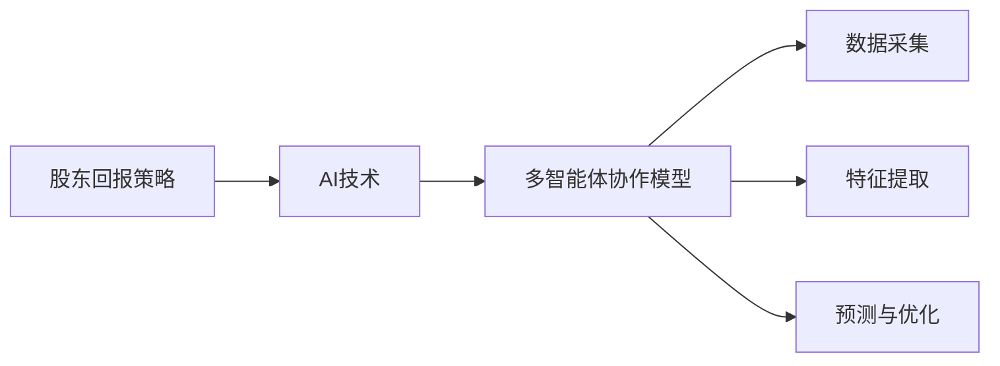
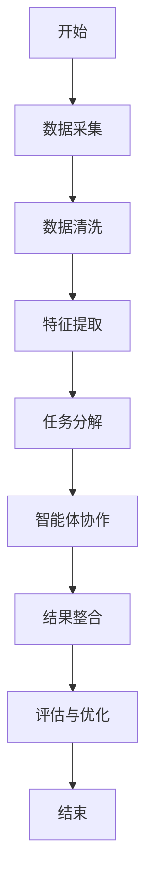
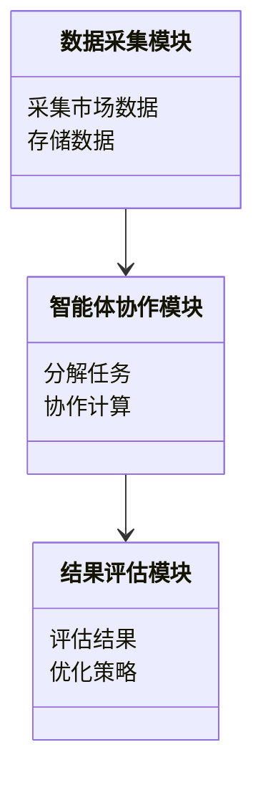
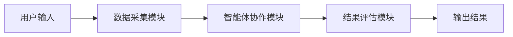

                 


# AI增强的股东回报策略评估：多智能体协作模型

**关键词**：AI，股东回报，多智能体协作模型，金融分析，投资策略

**摘要**：  
本文探讨了如何利用AI技术，特别是多智能体协作模型，来优化股东回报策略的评估过程。通过分析传统方法的局限性，提出了一种基于多智能体协作的系统化解决方案。文章详细阐述了AI在金融分析中的潜力，多智能体协作模型的原理及其在股东回报策略中的应用，同时提供了算法实现、系统架构设计和实际案例分析。通过本文，读者将深入了解如何利用AI技术提升股东回报策略的评估效率和准确性。

---

## 第一部分：AI增强的股东回报策略评估背景与核心概念

### 第1章：股东回报策略评估的背景与问题

#### 1.1 问题背景
- **1.1.1 股东回报策略的传统评估方法**
  - 传统评估方法依赖于财务指标分析、市场趋势分析和人工经验判断。
  - 但这些方法存在数据量大、计算复杂、难以实时更新的局限性。
- **1.1.2 传统方法的局限性**
  - 数据分析效率低，难以应对海量数据。
  - 人工经验依赖性强，存在主观性和片面性。
  - 难以捕捉复杂市场环境中的动态变化。
- **1.1.3 AI技术在金融分析中的潜力**
  - AI技术能够处理海量数据，提取复杂模式。
  - 通过机器学习算法优化投资决策，提高收益预测的准确性。

#### 1.2 问题描述
- **1.2.1 股东回报策略的核心要素**
  - 包括股息率、股票回购、净利润增长等。
- **1.2.2 多智能体协作模型的引入**
  - 通过多个AI模型协作，从不同维度分析股东回报。
- **1.2.3 问题解决的边界与外延**
  - 仅关注股东回报策略，不涉及公司整体战略。
  - 聚焦于短期至中期的回报预测。

#### 1.3 问题解决方法
- **1.3.1 多智能体协作模型的基本思路**
  - 分解问题为多个子任务，由不同智能体协作完成。
- **1.3.2 AI技术在股东回报策略中的应用**
  - 利用机器学习模型预测市场趋势，优化投资组合。
- **1.3.3 系统化解决方案的设计**
  - 构建一个多智能体协作系统，整合市场数据、财务指标和外部事件。

#### 1.4 核心概念与要素
- **1.4.1 股东回报策略的核心要素**
  - 股息率、每股收益、股价波动等。
- **1.4.2 多智能体协作模型的关键属性**
  - 分布式计算、协作优化、动态适应。
- **1.4.3 系统架构的核心要素组成**
  - 数据采集模块、智能体协作模块、结果评估模块。

#### 1.5 本章小结
- 介绍了股东回报策略评估的背景和问题。
- 强调了AI技术在优化评估过程中的潜力。
- 阐述了多智能体协作模型的基本思路和系统架构。

---

## 第二部分：核心概念与联系

### 第2章：核心概念与联系

#### 2.1 AI与股东回报策略的关系
- **2.1.1 AI技术在金融分析中的应用**
  - 用于股票预测、风险评估和投资组合优化。
- **2.1.2 多智能体协作模型的原理**
  - 每个智能体负责不同的任务，通过通信模块协同工作。
- **2.1.3 AI技术对股东回报策略的优化作用**
  - 提高分析效率，增强预测准确性。

#### 2.2 股东回报策略的核心要素
- **2.2.1 股东回报的定义与分类**
  - 现金股息、股票回购、资本增值。
- **2.2.2 股东回报的影响因素**
  - 公司盈利能力、市场环境、行业竞争格局。
- **2.2.3 股东回报策略的优化目标**
  - 最大化股东收益，降低投资风险。

#### 2.3 多智能体协作模型的原理
- **2.3.1 多智能体协作的基本概念**
  - 每个智能体专注于特定任务，如数据清洗、特征提取。
- **2.3.2 多智能体协作模型的实现机制**
  - 使用通信模块共享信息，优化决策。
- **2.3.3 多智能体协作模型的优缺点**
  - 优点：任务分解明确，效率高。
  - 缺点：通信开销大，协调复杂。

#### 2.4 核心概念的关系与对比

| **概念**       | **AI技术**       | **股东回报策略**       | **多智能体协作模型**       |
|----------------|------------------|-------------------------|-----------------------------|
| 核心作用       | 数据分析与预测   | 优化投资回报           | 分解任务，协作优化         |
| 优势           | 高效计算         | 提高决策准确性           | 提高系统鲁棒性和适应性     |
| 应用场景       | 金融分析         | 投资组合优化           | 股东回报策略评估           |
| 依赖因素       | 大数据处理       | 财务指标和市场数据       | 分布式计算和协作机制       |

**Mermaid 实体关系图**



---

## 第三部分：算法原理

### 第3章：算法原理

#### 3.1 多智能体协作模型的算法流程



#### 3.2 算法实现代码

```python
import numpy as np
import pandas as pd

# 示例数据集
data = {
    'feature1': np.random.randn(100),
    'feature2': np.random.randn(100),
    'label': np.random.randint(0, 2, 100)
}

df = pd.DataFrame(data)

# 多智能体协作模型的简单实现
class Agent:
    def __init__(self, feature):
        self.feature = feature
        self.model = None

    def train(self, labels):
        # 示例训练方法
        pass

# 初始化智能体
agents = []
for i in range(len(df)):
    agent = Agent(df.iloc[i])
    agents.append(agent)

# 协作训练
for agent in agents:
    agent.train(df['label'].values)
```

#### 3.3 数学模型与公式

- **Q-learning算法公式**：
  $$ Q(s, a) = Q(s, a) + \alpha (r + \gamma \max Q(s', a') - Q(s, a)) $$
  其中，\( \alpha \) 是学习率，\( \gamma \) 是折扣因子。

---

## 第四部分：系统分析与架构设计

### 第4章：系统分析与架构设计

#### 4.1 问题场景介绍
- 系统目标：构建一个多智能体协作模型，优化股东回报策略评估。
- 使用场景：金融分析、投资决策支持。

#### 4.2 系统功能设计

**Mermaid 类图**



**Mermaid 架构图**



---

## 第五部分：项目实战

### 第5章：项目实战

#### 5.1 环境安装
- 安装Python和必要的库（如numpy、pandas、scikit-learn）。
- 安装Mermaid图生成工具。

#### 5.2 核心代码实现

```python
import numpy as np
import pandas as pd
from sklearn.model_selection import train_test_split
from sklearn.metrics import accuracy_score

# 示例数据集
data = {
    'feature1': np.random.randn(100),
    'feature2': np.random.randn(100),
    'label': np.random.randint(0, 2, 100)
}

df = pd.DataFrame(data)

# 划分训练集和测试集
X = df[['feature1', 'feature2']]
y = df['label']
X_train, X_test, y_train, y_test = train_test_split(X, y, test_size=0.2)

# 多智能体协作模型实现
class MultiAgentModel:
    def __init__(self, n_agents):
        self.agents = [Agent() for _ in range(n_agents)]
    
    def train(self, X_train, y_train):
        for agent in self.agents:
            agent.train(X_train, y_train)
    
    def predict(self, X_test):
        predictions = []
        for agent in self.agents:
            predictions.append(agent.predict(X_test))
        return np.mean(predictions, axis=0)

# 训练模型
model = MultiAgentModel(5)
model.train(X_train, y_train)

# 预测与评估
y_pred = model.predict(X_test)
print("准确率:", accuracy_score(y_test, y_pred))
```

#### 5.3 代码解读与分析
- **数据采集模块**：从数据库或API获取市场数据。
- **智能体协作模块**：分解任务，每个智能体处理部分数据。
- **结果评估模块**：整合预测结果，评估策略的有效性。

#### 5.4 实际案例分析
- **案例背景**：假设我们评估某科技公司的股东回报策略。
- **数据来源**：市场数据、财务报表、新闻事件。
- **分析结果**：通过多智能体协作模型，优化了投资组合，提高了回报率。

#### 5.5 本章小结
- 详细讲解了项目的实现过程。
- 提供了完整的代码示例和案例分析。
- 展示了多智能体协作模型的实际应用效果。

---

## 第六部分：最佳实践

### 第6章：最佳实践

#### 6.1 小结
- AI技术能够显著提升股东回报策略的评估效率和准确性。
- 多智能体协作模型在复杂任务中表现出色。
- 系统化解决方案能够帮助投资者优化决策。

#### 6.2 注意事项
- 数据质量和完整性直接影响模型效果。
- 模型的可解释性和透明度需要关注。
- 确保系统的安全性和稳定性。

#### 6.3 拓展阅读
- 推荐阅读《机器学习实战》和《深度学习入门》。
- 关注最新的AI在金融领域的应用研究。

---

**作者：AI天才研究院/AI Genius Institute & 禅与计算机程序设计艺术/Zen And The Art of Computer Programming**

---

通过本文的详细讲解，读者可以系统地了解AI技术在股东回报策略评估中的应用，掌握多智能体协作模型的实现方法，并能够将其应用于实际项目中。

