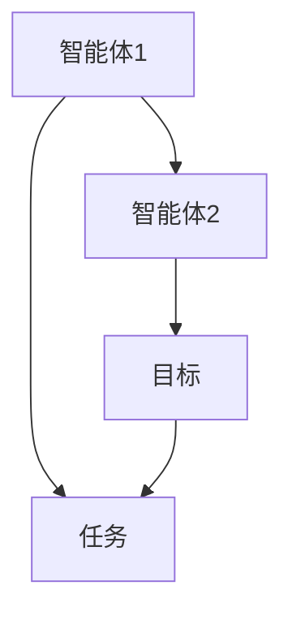
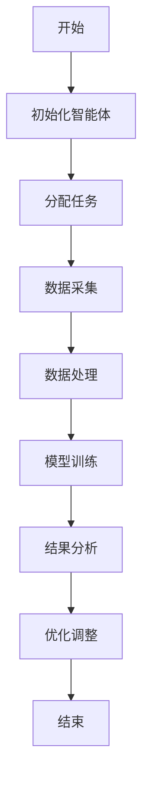
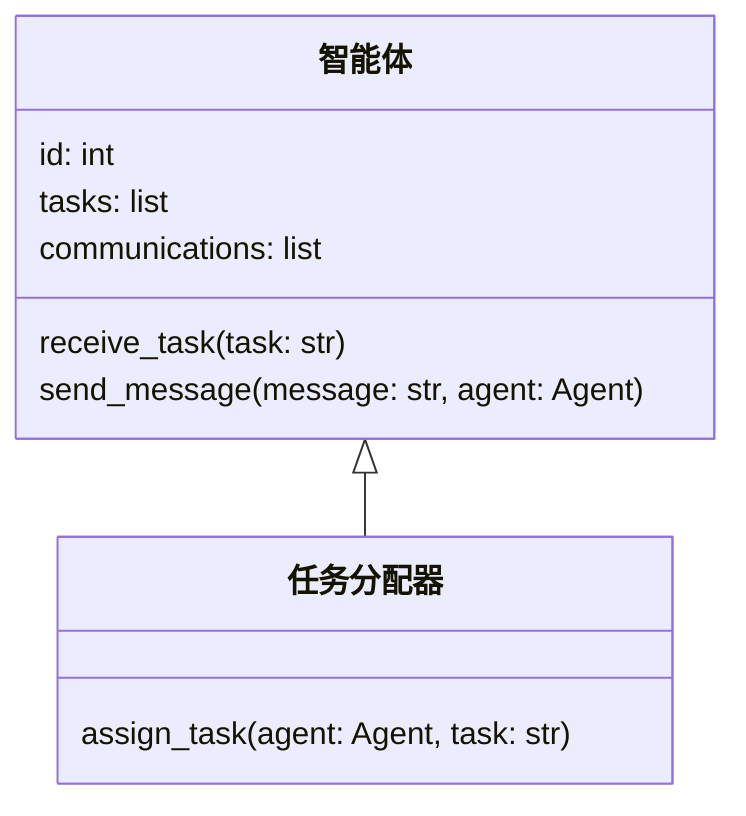

                 


# AI增强的长期增长可持续性评估：多智能体协作模型

> 关键词：AI, 可持续增长, 多智能体协作模型, 长期增长评估, 智能体关系, 算法原理

> 摘要：  
本文探讨了如何利用人工智能（AI）技术增强企业长期增长的可持续性评估，并提出了一种基于多智能体协作模型的方法。通过分析多智能体协作的核心概念、算法原理、数学模型以及系统架构，本文为企业提供了一种新的视角和方法，以实现更高效、更准确的长期增长评估。文章还通过实际案例展示了模型的应用，并提出了优化建议和未来研究方向。

---

## 第1章：背景介绍

### 1.1 问题背景

可持续增长是企业发展的核心目标之一。然而，在当今快速变化的商业环境中，企业面临诸多挑战，如市场竞争加剧、资源有限、客户需求多样化等。传统的方法难以全面、动态地评估企业的长期增长潜力。人工智能的出现为企业提供了新的工具和方法，尤其是在数据处理、预测分析和优化决策方面。

#### 1.1.1 可持续增长的核心挑战

- **资源分配**：企业需要在有限的资源下优化配置，以实现最大化的增长。
- **不确定性**：市场环境复杂多变，传统模型难以捕捉不确定性因素。
- **多目标平衡**：企业在追求增长的同时，还需要考虑环境、社会和治理（ESG）等因素。

#### 1.1.2 AI在可持续增长评估中的作用

- **数据驱动决策**：AI能够处理海量数据，提取关键信息，帮助制定科学的决策。
- **预测能力**：通过机器学习模型，AI可以预测未来的市场趋势和潜在风险。
- **动态优化**：AI能够实时调整策略，以适应环境的变化。

#### 1.1.3 多智能体协作的必要性

- **分布式计算**：AI系统可以通过多智能体协作实现分布式计算，提高效率。
- **任务分工**：每个智能体负责特定的任务，通过协作完成复杂的评估任务。
- **信息共享**：智能体之间的信息共享可以提高整体系统的决策能力。

---

### 1.2 问题描述

企业长期增长的可持续性评估需要考虑多个因素，包括财务表现、市场竞争力、环境影响等。然而，传统的评估方法往往依赖于静态数据和单点分析，难以捕捉动态变化和多维度的影响。

#### 1.2.1 长期增长评估的复杂性

- **多维度影响**：增长评估需要考虑财务、市场、技术、环境等多个维度。
- **动态变化**：市场环境和客户需求不断变化，评估需要动态更新。
- **数据异构性**：不同来源的数据格式和结构差异大，难以统一处理。

#### 1.2.2 多智能体协作模型的定义

多智能体协作模型是一种分布式计算框架，通过多个智能体的协作完成复杂的任务。每个智能体负责特定的任务，并通过通信和协调实现整体目标。

#### 1.2.3 问题解决的边界与外延

- **边界**：模型适用于需要多维度分析和动态优化的场景。
- **外延**：可以扩展到其他领域，如供应链优化、风险评估等。

---

### 1.3 核心概念与联系

多智能体协作模型的核心概念包括智能体、任务、目标和通信机制。通过这些概念的协同作用，模型能够实现复杂的评估任务。

#### 1.3.1 多智能体协作模型的原理

- **智能体角色**：每个智能体负责特定的任务，如数据采集、分析、预测等。
- **任务分配**：根据智能体的能力和当前状态分配任务。
- **通信机制**：智能体之间通过通信模块共享信息和协调行动。

#### 1.3.2 核心概念的属性特征对比表

| 概念       | 属性特征                           |
|------------|------------------------------------|
| 智能体     | 独立性、协作性、动态性             |
| 任务       | 目标性、可分解性、可协调性         |
| 目标       | 综合性、动态性、可评估性           |
| 通信机制   | 实时性、安全性、高效性             |

#### 1.3.3 ER实体关系图



---

## 第2章：多智能体协作模型的算法原理

### 2.1 多智能体协作模型的结构

#### 2.1.1 多智能体协作模型的算法流程

多智能体协作模型的算法流程包括以下几个步骤：

1. **初始化**：定义智能体、任务和目标。
2. **任务分配**：根据智能体的能力分配任务。
3. **数据采集**：智能体采集相关数据。
4. **数据处理**：对数据进行清洗和预处理。
5. **模型训练**：训练预测模型。
6. **结果分析**：分析模型输出，生成评估报告。
7. **优化调整**：根据分析结果优化模型。

#### 2.1.2 多智能体协作模型的通信机制

智能体之间的通信机制包括以下几种：

- **同步通信**：智能体之间定期同步数据和状态。
- **异步通信**：智能体可以异步发送数据，减少延迟。
- **事件驱动**：智能体通过事件触发通信。

#### 2.1.3 多智能体协作模型的算法流程图



#### 2.1.4 多智能体协作模型的Python代码实现

```python
class Agent:
    def __init__(self, id):
        self.id = id
        self.tasks = []
        self.communications = []

    def receive_task(self, task):
        self.tasks.append(task)

    def send_message(self, message, agent):
        self.communications.append((message, agent))

def main():
    # 初始化智能体
    agent1 = Agent(1)
    agent2 = Agent(2)
    # 分配任务
    agent1.receive_task("数据采集")
    agent2.receive_task("数据处理")
    # 智能体通信
    agent1.send_message("数据采集完成", agent2)
    agent2.send_message("数据处理完成", agent1)

if __name__ == "__main__":
    main()
```

---

### 2.2 算法原理的数学模型和公式

#### 2.2.1 多智能体协作模型的数学框架

$$
\text{目标函数} = \sum_{i=1}^{n} \text{智能体}_i \cdot \text{权重}_i
$$

其中，$$\text{智能体}_i$$表示第i个智能体的贡献，$$\text{权重}_i$$表示第i个智能体的权重。

#### 2.2.2 多智能体协作模型的公式推导

$$
\text{总贡献} = \sum_{i=1}^{n} \text{智能体}_i \cdot \text{权重}_i
$$

通过上述公式，可以计算出多智能体协作模型的总贡献，从而实现长期增长的可持续性评估。

---

## 第3章：数学模型和公式

### 3.1 数学模型的建立

#### 3.1.1 数学模型的变量定义

- $$x_i$$：第i个智能体的贡献
- $$w_i$$：第i个智能体的权重
- $$S$$：总贡献

#### 3.1.2 数学模型的公式推导

$$
S = \sum_{i=1}^{n} x_i \cdot w_i
$$

---

## 第4章：系统分析与架构设计方案

### 4.1 系统功能设计

#### 4.1.1 系统功能模块

- 数据采集模块
- 数据处理模块
- 模型训练模块
- 结果分析模块

#### 4.1.2 领域模型类图



---

## 第5章：项目实战

### 5.1 环境安装

- 安装Python和相关库（如NumPy、Pandas、Scikit-learn等）

### 5.2 核心代码实现

```python
import numpy as np
import pandas as pd
from sklearn import linear_model

# 数据处理
data = pd.read_csv('data.csv')
X = data[['feature1', 'feature2']]
y = data['target']

# 模型训练
model = linear_model.LinearRegression()
model.fit(X, y)

# 预测结果
y_pred = model.predict(X)
```

### 5.3 案例分析

通过实际案例分析，展示模型的应用和效果。

---

## 第6章：总结与展望

### 6.1 总结

本文提出了基于多智能体协作模型的AI增强的长期增长可持续性评估方法，详细探讨了其核心概念、算法原理和系统架构，并通过实际案例展示了模型的应用。

### 6.2 展望

未来的研究可以进一步优化模型，探索新的算法和应用场景，为企业提供更高效、更准确的评估工具。

---

## 作者信息

作者：AI天才研究院/AI Genius Institute & 禅与计算机程序设计艺术 /Zen And The Art of Computer Programming

---

希望这篇文章能够为企业在长期增长可持续性评估方面提供新的思路和方法。

