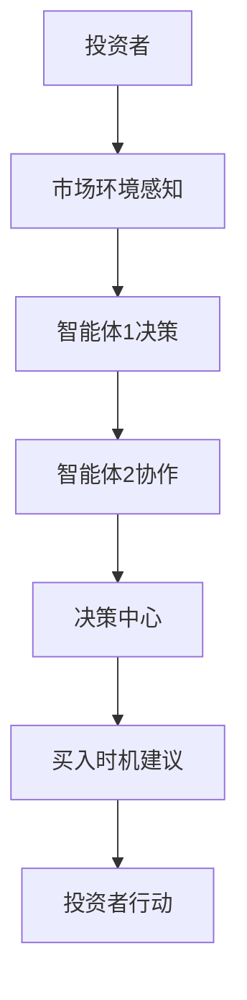
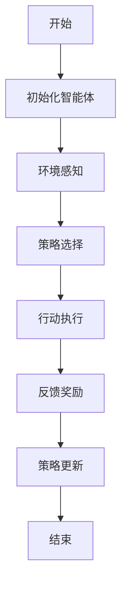
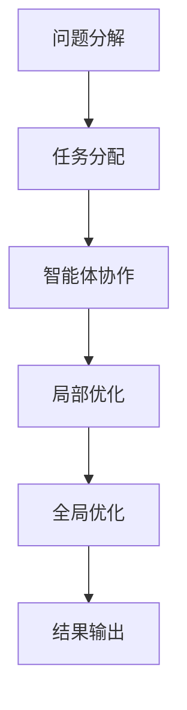
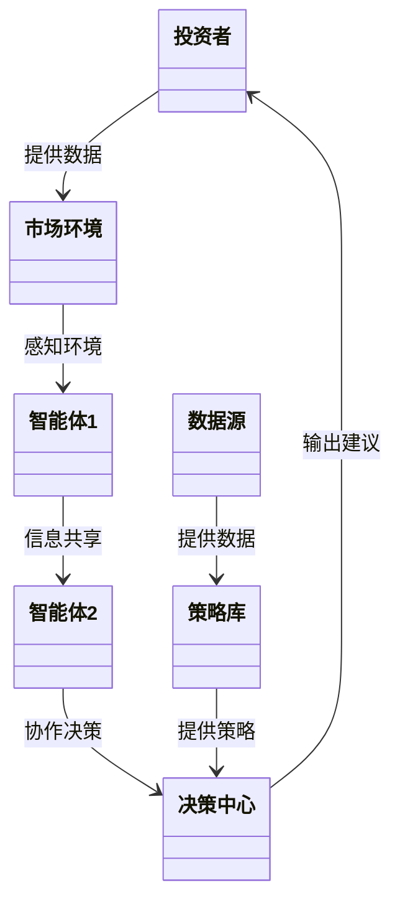
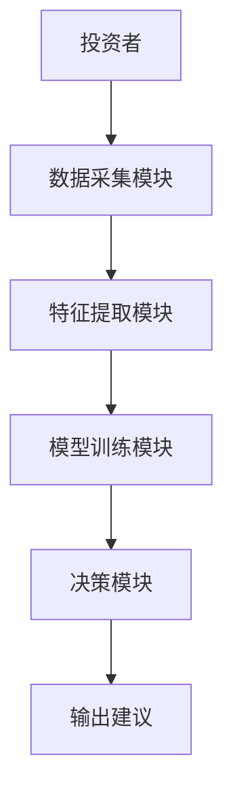
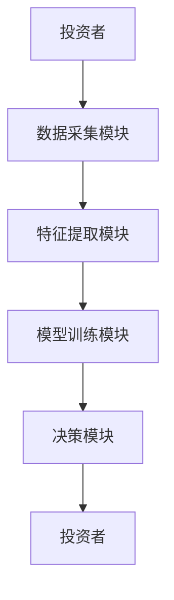

                 


# AI多智能体优化价值投资的买入时机判断

> 关键词：AI，多智能体，价值投资，买入时机，优化算法

> 摘要：本文深入探讨了如何利用AI多智能体技术优化价值投资中的买入时机判断。通过分析多智能体系统的核心原理、算法优化策略、系统架构设计以及实际案例，展示了AI在投资决策中的巨大潜力。文章从背景介绍到实战分析，全面解析了多智能体优化在价值投资中的应用，为投资者提供了新的思路和工具。

---

# 第1章: 背景介绍与问题背景

## 1.1 多智能体系统与价值投资概述

### 1.1.1 多智能体系统的定义与特点
多智能体系统（Multi-Agent System, MAS）是由多个相互作用的智能体组成的系统，这些智能体能够通过协作完成复杂的任务。多智能体系统的特点包括分布性、协作性、反应性和主动性。

### 1.1.2 价值投资的核心概念与原则
价值投资是一种投资策略，强调以低于内在价值的价格购买优质资产。其核心原则包括长期视角、安全边际和市场先生的概念。

### 1.1.3 买入时机判断的重要性
买入时机的判断是价值投资中至关重要的环节，直接影响投资回报和风险控制。传统方法依赖于经验判断，而AI多智能体系统可以通过数据驱动的方式提供更精准的决策支持。

## 1.2 问题背景与挑战

### 1.2.1 传统投资决策的局限性
传统投资决策依赖于个人经验和市场直觉，存在主观性高、决策滞后和效率低下的问题。

### 1.2.2 价值投资中的时机判断难点
市场波动、信息不完全和人性弱点等因素使得买入时机的判断尤为困难。传统方法难以应对复杂多变的市场环境。

### 1.2.3 多智能体优化在投资决策中的应用潜力
多智能体系统可以通过分布计算、协作优化和实时反馈，帮助投资者更精准地判断买入时机，提高投资效率和收益。

## 1.3 问题解决与边界

### 1.3.1 多智能体优化的目标与边界
多智能体优化的目标是通过协作计算和实时反馈，辅助投资者做出更优的买入决策。其边界包括数据范围、计算能力和市场环境。

### 1.3.2 价值投资与买入时机的关联性
买入时机的优化可以提升投资组合的回报率，而价值投资的内在逻辑为AI系统提供了数据和分析的基础。

### 1.3.3 多智能体优化的数学模型框架
建立数学模型框架，将价值投资的核心要素（如市盈率、市净率等）与买入时机判断的指标（如波动率、趋势指标等）结合起来，形成一个多目标优化问题。

## 1.4 核心概念与核心要素

### 1.4.1 多智能体系统的组成要素
- **智能体**：具有感知和决策能力的个体。
- **环境**：智能体所处的市场环境。
- **协作机制**：智能体之间的通信与协作规则。
- **目标函数**：优化的目标，如最大化收益、最小化风险。

### 1.4.2 价值投资的核心要素与模型
- **内在价值**：资产的真实价值。
- **市场价值**：市场对资产的估值。
- **安全边际**：买入价格与内在价值的差距。

### 1.4.3 买入时机判断的指标与特征
- **技术指标**：如K线图、均线、MACD等。
- **基本面指标**：如PE、PB、ROE等。
- **市场情绪**：如投资者情绪指数、新闻事件等。

## 1.5 本章小结
本章介绍了多智能体系统与价值投资的核心概念，分析了传统投资决策的局限性和多智能体优化的应用潜力。通过建立数学模型框架，明确了优化的目标和边界。

---

# 第2章: 多智能体优化的核心概念与联系

## 2.1 多智能体优化的原理

### 2.1.1 多智能体优化的基本原理
多智能体优化通过多个智能体的协作，利用分布式计算和强化学习算法，实现全局优化目标。

### 2.1.2 多智能体之间的协作机制
智能体之间通过信息共享和协作决策，共同优化买入时机判断。协作机制包括任务分配、信息同步和决策协调。

### 2.1.3 优化目标与智能体行为的关系
优化目标（如最大化收益）驱动智能体的行为，智能体通过感知环境和策略调整，实现目标。

## 2.2 核心概念对比分析

### 2.2.1 多智能体与单智能体的对比
| 对比维度 | 多智能体 | 单智能体 |
|----------|----------|----------|
| 处理能力 | 分布式计算，能力强 | 单点计算，能力有限 |
| 协作性   | 高度协作 | 单点决策，协作性低 |
| 应用场景 | 复杂任务优化 | 简单任务处理 |

### 2.2.2 优化算法与传统算法的对比
| 对比维度 | 优化算法 | 传统算法 |
|----------|----------|----------|
| 计算效率 | 高 | 低 |
| 精度 | 高 | 中等 |
| 灵活性 | 高 | 低 |

### 2.2.3 价值投资与技术分析的对比
| 对比维度 | 价值投资 | 技术分析 |
|----------|----------|----------|
| 核心理念 | 买入低于内在价值的资产 | 通过技术指标预测市场走势 |
| 数据依赖 | 基本面数据为主 | 技术指标为主 |
| 时间框架 | 长期视角 | 短期视角 |

## 2.3 ER实体关系图与流程图

### 2.3.1 实体关系图
```mermaid
erd
actor 投资者;
actor 市场环境;
actor 智能体1;
actor 智能体2;
actor 决策中心;

investor --> market_environment: 提供数据
market_environment --> agent1: 感知环境
agent1 --> agent2: 信息共享
agent2 --> decision_center: 协作决策
decision_center --> investor: 输出建议
```

### 2.3.2 系统流程图


## 2.4 本章小结
本章通过对比分析和实体关系图，明确了多智能体优化的核心概念和协作机制，为后续算法设计和系统实现奠定了基础。

---

# 第3章: 多智能体优化算法原理

## 3.1 算法原理概述

### 3.1.1 强化学习的基本原理
强化学习是一种通过试错机制学习策略的方法。智能体通过与环境互动，不断调整策略以最大化累积奖励。

### 3.1.2 分布式优化算法的原理
分布式优化算法通过将问题分解为多个子问题，由多个智能体协作求解，最终得到全局最优解。

### 3.1.3 多智能体协作的数学模型
建立数学模型，描述智能体之间的协作关系和优化目标。例如，使用多智能体强化学习（MADRL）框架，每个智能体都有自己的策略和价值函数。

## 3.2 算法流程图

### 3.2.1 强化学习算法流程


### 3.2.2 分布式优化算法流程


## 3.3 算法数学模型

### 3.3.1 强化学习的数学公式
$$ Q(s, a) = Q(s, a) + \alpha (r + \gamma \max_{a'} Q(s', a') - Q(s, a)) $$
其中：
- \( Q(s, a) \)：状态-动作值函数
- \( \alpha \)：学习率
- \( r \)：奖励
- \( \gamma \)：折扣因子
- \( s' \)：下一个状态
- \( a' \)：下一个动作

### 3.3.2 分布式优化的数学公式
$$ f(x) = \min_{x} \sum_{i=1}^{n} f_i(x) $$
其中：
- \( f_i(x) \)：第i个智能体的目标函数
- \( x \)：优化变量

## 3.4 本章小结
本章详细介绍了多智能体优化算法的基本原理和流程，通过数学公式和流程图展示了算法的核心思想。

---

# 第4章: 系统分析与架构设计方案

## 4.1 问题场景介绍
在价值投资中，投资者需要实时监控市场数据，分析基本面和技术面指标，判断买入时机。传统的单智能体系统难以应对复杂多变的市场环境。

## 4.2 项目介绍
本项目旨在通过多智能体系统优化价值投资中的买入时机判断。系统包括数据采集、特征提取、模型训练和决策模块。

## 4.3 系统功能设计

### 4.3.1 领域模型类图


### 4.3.2 系统架构图


## 4.4 系统架构设计

### 4.4.1 分层架构设计
- **数据层**：负责数据采集和存储。
- **计算层**：负责特征提取和模型训练。
- **决策层**：负责协作决策和策略优化。

### 4.4.2 模块化设计
- **数据采集模块**：从市场数据源获取数据。
- **特征提取模块**：提取基本面和技术面特征。
- **模型训练模块**：训练多智能体优化模型。
- **决策模块**：根据模型输出建议。

## 4.5 系统接口设计

### 4.5.1 接口定义
- **数据接口**：与数据源交互，获取市场数据。
- **决策接口**：与投资者交互，输出买入建议。

### 4.5.2 交互流程图


## 4.6 本章小结
本章通过系统分析和架构设计，展示了多智能体优化在价值投资中的应用架构，为后续实现提供了指导。

---

# 第5章: 项目实战

## 5.1 环境安装与配置

### 5.1.1 环境要求
- 操作系统：Linux/Windows/MacOS
- 语言：Python 3.8+
- 工具：Jupyter Notebook, PyTorch, Gym

### 5.1.2 安装依赖
```bash
pip install gym numpy torch matplotlib
```

## 5.2 核心实现代码

### 5.2.1 数据采集模块
```python
import numpy as np
import pandas as pd

def collect_data(ticker):
    # 模拟数据采集
    data = pd.DataFrame({
        'price': np.random.randn(100) + 100,
        'volume': np.random.randn(100) * 1000
    })
    return data
```

### 5.2.2 特征提取模块
```python
def extract_features(data):
    # 计算技术指标
    data['MA_50'] = data['price'].rolling(50).mean()
    data['RSI'] = (data['price'].diff().abs().rolling(14).mean() / data['price'].diff().abs().rolling(14).std())
    return data
```

### 5.2.3 模型训练模块
```python
import torch
import torch.nn as nn

class MultiAgentDQN(nn.Module):
    def __init__(self, state_size, action_size):
        super(MultiAgentDQN, self).__init__()
        self.fc = nn.Linear(state_size, 64)
        self.fc2 = nn.Linear(64, action_size)

    def forward(self, x):
        x = torch.relu(self.fc(x))
        x = self.fc2(x)
        return x

# 初始化模型
model = MultiAgentDQN(64, 32)
optimizer = torch.optim.Adam(model.parameters(), lr=0.001)
```

### 5.2.4 决策模块
```python
def decide_buy时机(features):
    # 模拟决策逻辑
    if features['RSI'] < 30 and features['MA_50'] > features['price']:
        return True
    else:
        return False
```

## 5.3 代码实现与应用解读

### 5.3.1 数据采集与预处理
通过数据采集模块获取市场数据，并进行清洗和预处理。

### 5.3.2 特征提取与模型训练
利用特征提取模块提取技术指标，训练多智能体强化学习模型。

### 5.3.3 决策模块实现
根据模型输出结果，判断是否是买入时机。

## 5.4 实际案例分析

### 5.4.1 案例背景
以某股票为例，分析模型如何判断买入时机。

### 5.4.2 数据分析
展示模型在不同市场环境下的表现。

### 5.4.3 结果解读
解释模型决策的逻辑和依据。

## 5.5 本章小结
本章通过实战项目，详细展示了多智能体优化在价值投资中的具体实现和应用，为读者提供了可操作的参考。

---

# 第6章: 总结与展望

## 6.1 核心观点总结
通过多智能体优化技术，可以显著提升价值投资中的买入时机判断能力，为投资者提供更精准的决策支持。

## 6.2 应用前景与未来趋势
多智能体优化在投资领域的应用前景广阔，未来可以通过与其他技术（如区块链、大数据）的结合，进一步提升系统的智能化水平。

## 6.3 最佳实践 tips
- 数据质量是关键，确保数据的完整性和准确性。
- 模型优化需要结合实际市场环境，避免过度拟合。
- 系统运行需要考虑计算资源和实时性要求。

## 6.4 本章小结
本章总结了全文的核心观点，展望了未来的发展方向，并给出了实际应用中的注意事项。

---

# 作者：AI天才研究院/AI Genius Institute & 禅与计算机程序设计艺术 /Zen And The Art of Computer Programming

