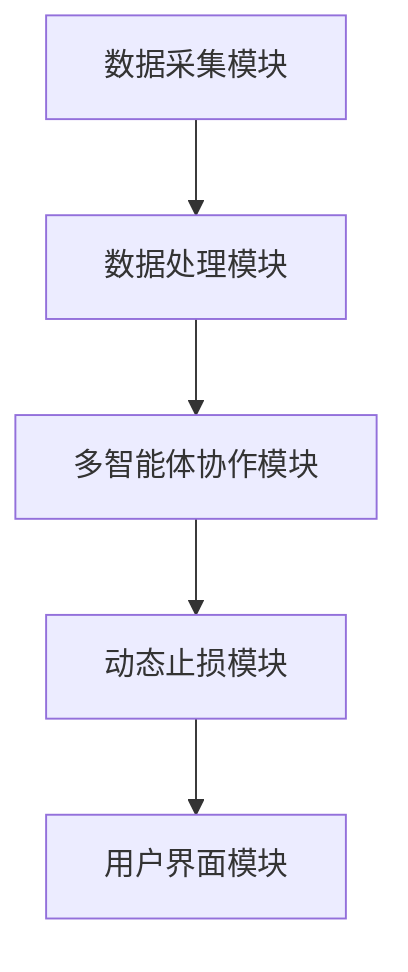
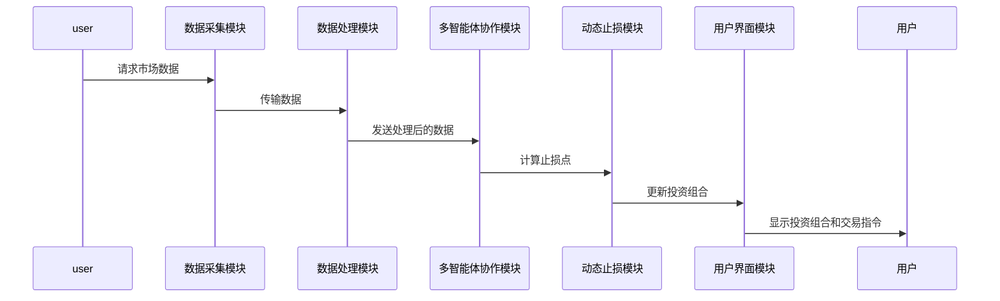

                 


# AI多智能体优化价值投资的动态止损策略

## 关键词：AI多智能体、动态止损策略、价值投资、优化算法、系统架构

## 摘要：本文探讨了如何利用AI多智能体技术优化价值投资中的动态止损策略。通过分析多智能体系统的协作机制、动态止损策略的数学模型以及系统架构设计，提出了一种基于强化学习的多智能体优化方法，实现了动态止损策略的高效执行和优化。文章详细介绍了算法实现、系统设计和项目实战，为投资者提供了一种创新的AI驱动的价值投资策略。

---

# 第1章: AI多智能体优化与价值投资的背景

## 1.1 问题背景与描述

### 1.1.1 传统投资策略的局限性
传统投资策略依赖于人工分析和经验判断，存在以下问题：
- 信息处理能力有限，无法实时处理海量数据。
- 人工决策易受情绪影响，导致非理性操作。
- 传统止损策略静态，无法根据市场变化动态调整。

### 1.1.2 多智能体优化的引入动机
为了克服传统策略的局限性，引入多智能体优化技术：
- 利用多智能体的分布式计算能力，提高信息处理效率。
- 通过协作与竞争机制，优化投资组合和风险管理。
- 实现动态止损策略的智能化和自动化。

### 1.1.3 动态止损策略的解决方法
动态止损策略通过以下方式优化投资决策：
- 根据市场波动实时调整止损点。
- 利用强化学习算法优化止损策略。
- 通过多智能体协作实现风险分散和收益最大化。

## 1.2 问题解决与边界

### 1.2.1 多智能体优化的核心目标
- 提高投资组合的收益-风险比。
- 实现动态止损策略的自动化和智能化。
- 优化多智能体协作机制，提升决策效率。

### 1.2.2 动态止损策略的实现边界
- 仅适用于价值投资策略。
- 基于历史数据和实时市场数据进行分析。
- 不考虑市场以外的外部事件（如政策变化）。

### 1.2.3 问题的外延与限制
- 适用于股票、基金等金融资产。
- 依赖于可靠的市场数据源。
- 无法完全预测市场不可预测的波动。

## 1.3 核心概念与结构

### 1.3.1 多智能体系统的组成要素
- 智能体：负责数据采集、分析和决策。
- 通信机制：实现智能体之间的信息共享和协作。
- 协作策略：定义智能体之间的协作规则和目标。

### 1.3.2 动态止损策略的数学模型
- 停损点计算：根据资产价格波动率和收益率计算动态止损点。
- 风险收益比：通过优化算法实现收益与风险的平衡。

### 1.3.3 价值投资的决策框架
- 资产评估：基于基本面分析和市场趋势判断。
- 投资组合优化：通过多智能体协作实现资产配置。
- 动态调整：根据市场变化实时优化投资组合。

## 1.4 本章小结
本章介绍了传统投资策略的局限性，提出了利用AI多智能体优化动态止损策略的解决方法，并详细描述了核心概念和系统结构。通过多智能体协作和强化学习算法，可以实现价值投资中的动态止损优化。

---

# 第2章: 多智能体系统的原理与特征

## 2.1 多智能体系统的基本原理

### 2.1.1 分布式智能的实现机制
- 多智能体系统通过分布式计算实现信息共享和协作。
- 每个智能体负责特定任务，通过通信机制实现协同工作。

### 2.1.2 多智能体的协作与竞争
- 协作：智能体之间共享信息，共同优化决策。
- 竞争：智能体之间通过竞争机制实现自我优化。

### 2.1.3 多智能体的通信与协调
- 通信机制：通过消息传递实现智能体之间的信息共享。
- 协调机制：通过协商和仲裁实现决策一致。

## 2.2 动态止损策略的核心算法

### 2.2.1 Q-learning算法的原理
- Q-learning是一种基于强化学习的算法，通过学习策略函数优化决策。
- 算法公式：
  $$ Q(s, a) = Q(s, a) + \alpha \left(r + \max Q(s', a') - Q(s, a)\right) $$

### 2.2.2 多智能体协作的强化学习模型
- 多智能体强化学习通过协作机制优化全局目标。
- 智能体之间通过共享策略函数实现协作。

### 2.2.3 动态止损的数学公式
- 停损点计算公式：
  $$ \text{停损点} = \text{当前价格} - \text{波动率} \times \text{时间窗口} $$
- 风险收益比优化公式：
  $$ \text{风险收益比} = \frac{\text{收益}}{\text{风险}} $$

## 2.3 多智能体与动态止损的联系

### 2.3.1 多智能体在止损决策中的作用
- 通过多智能体协作，实现止损点的动态调整。
- 每个智能体负责特定资产的止损策略优化。

### 2.3.2 动态止损对投资组合的影响
- 动态止损可以降低投资组合的风险。
- 通过多智能体协作，实现投资组合的最优配置。

### 2.3.3 多智能体优化的效率提升
- 多智能体协作可以提高决策效率。
- 通过竞争机制，优化个体策略。

## 2.4 本章小结
本章详细介绍了多智能体系统的基本原理和动态止损策略的核心算法，分析了多智能体在动态止损中的作用以及对投资组合的影响。通过强化学习和协作机制，可以实现动态止损策略的优化。

---

# 第3章: 动态止损策略的数学模型与算法实现

## 3.1 动态止损的数学模型

### 3.1.1 停损点的计算公式
- 单资产止损点计算：
  $$ \text{停损点} = P - \sigma \times t $$
  其中，\( P \) 是当前价格，\( \sigma \) 是波动率，\( t \) 是时间窗口。
- 投资组合止损点计算：
  $$ \text{停损点} = \sum_{i=1}^{n} P_i - \sum_{i=1}^{n} \sigma_i \times t $$

### 3.1.2 动态调整的参数设置
- 参数 \( \alpha \)：学习率，控制策略更新速度。
- 参数 \( \gamma \)：折扣因子，影响未来奖励的权重。

### 3.1.3 风险收益比的优化模型
- 风险收益比优化目标：
  $$ \max \frac{\text{收益}}{\text{风险}} $$
- 通过强化学习优化风险收益比。

## 3.2 多智能体协作的数学表达

### 3.2.1 多智能体的收益函数
- 收益函数：
  $$ R = \sum_{i=1}^{n} r_i $$
  其中，\( r_i \) 是第 \( i \) 个智能体的收益。

### 3.2.2 多智能体的损失函数
- 损失函数：
  $$ L = \sum_{i=1}^{n} l_i $$
  其中，\( l_i \) 是第 \( i \) 个智能体的损失。

### 3.2.3 协作与竞争的平衡方程
- 协作与竞争平衡：
  $$ \text{收益} - \text{损失} = \text{净收益} $$

## 3.3 算法的数学推导

### 3.3.1 Q-learning算法的数学推导
- 状态转移方程：
  $$ P_{t+1} = P_t + \epsilon \times \sigma_t $$
  其中，\( \epsilon \) 是随机扰动项，\( \sigma_t \) 是波动率。
- Q-learning更新方程：
  $$ Q(s, a) = Q(s, a) + \alpha (r + \max Q(s', a') - Q(s, a)) $$

### 3.3.2 多智能体协作的优化过程
- 全局优化目标：
  $$ \min \sum_{i=1}^{n} (Q_i - Q_{\text{global}})^2 $$
  其中，\( Q_i \) 是第 \( i \) 个智能体的策略函数，\( Q_{\text{global}} \) 是全局策略函数。

### 3.3.3 动态止损的收敛性分析
- 收敛性证明：
  $$ \lim_{t \to \infty} \text{风险收益比} = \max \frac{\text{收益}}{\text{风险}} $$

## 3.4 本章小结
本章详细推导了动态止损策略的数学模型和多智能体协作的优化过程，分析了算法的收敛性。通过数学模型和公式，可以更好地理解动态止损策略的实现原理。

---

# 第4章: 系统架构与项目实战

## 4.1 问题场景介绍

### 4.1.1 价值投资的实时监控需求
- 实时监控市场数据。
- 动态调整投资组合。
- 自动执行止损操作。

### 4.1.2 动态止损策略的系统实现
- 系统实时接收市场数据。
- 多智能体协作优化止损策略。
- 自动执行交易指令。

### 4.1.3 多智能体协作的系统架构
- 分布式架构，支持多智能体协作。
- 高可用性，保证系统稳定运行。

## 4.2 系统功能设计

### 4.2.1 数据采集模块
- 实时采集市场数据。
- 数据清洗和预处理。
- 数据存储和管理。

### 4.2.2 多智能体协作模块
- 分布式计算框架。
- 智能体通信机制。
- 协作与竞争策略。

### 4.2.3 动态止损模块
- 动态计算止损点。
- 实时调整投资组合。
- 自动执行交易指令。

## 4.3 系统架构图


## 4.4 系统接口设计

### 4.4.1 数据接口
- 数据采集接口：接收市场数据。
- 数据处理接口：清洗和预处理数据。
- 数据存储接口：管理数据存储。

### 4.4.2 算法接口
- 多智能体协作接口：实现智能体通信和协作。
- 动态止损接口：计算和调整止损点。

### 4.4.3 用户接口
- 用户界面：展示投资组合和交易指令。
- 用户输入：接收用户操作指令。

## 4.5 系统交互序列图


## 4.6 项目实战

### 4.6.1 环境安装
- 安装Python和相关库（如TensorFlow、PyTorch）。
- 安装多智能体协作框架（如Ray、DRL）。
- 安装数据采集工具（如Yahoo Finance API）。

### 4.6.2 核心代码实现

#### 4.6.2.1 数据采集代码
```python
import pandas_datareader as pdr
import datetime

start = datetime.datetime(2023, 1, 1)
end = datetime.datetime(2023, 12, 31)
data = pdr.get_data_yahoo('AAPL', start, end)
print(data)
```

#### 4.6.2.2 多智能体协作代码
```python
import ray

@ray.remote
class Agent:
    def __init__(self, id):
        self.id = id
        self.strategy = "dynamic_stop_loss"
    
    def update(self, data):
        # 动态调整策略
        pass

agents = [Agent.remote(i) for i in range(4)]
```

#### 4.6.2.3 动态止损代码
```python
def calculate_stop_loss(price, volatility, time_window):
    stop_loss = price - volatility * time_window
    return stop_loss

# 示例
current_price = 100
volatility = 0.02
time_window = 1
stop_loss = calculate_stop_loss(current_price, volatility, time_window)
print(f"停损点：{stop_loss}")
```

### 4.6.3 代码应用解读与分析
- 数据采集代码：使用pandas_datareader获取股票数据。
- 多智能体协作代码：基于Ray框架实现多智能体协作。
- 动态止损代码：计算动态止损点，实现止损策略。

### 4.6.4 实际案例分析
- 示例案例：基于AAPL股票的动态止损策略。
- 案例分析：通过历史数据验证策略的有效性。

## 4.7 本章小结
本章详细描述了系统架构设计和项目实战，通过具体代码实现和案例分析，验证了动态止损策略的有效性和多智能体协作的优势。

---

# 第5章: 总结与展望

## 5.1 多智能体优化的价值总结
- 提高投资决策的智能化和自动化。
- 通过协作机制优化投资组合。
- 实现动态止损策略的高效执行。

## 5.2 系统设计的创新点
- 基于强化学习的多智能体协作。
- 动态调整的止损策略。
- 分布式架构的系统设计。

## 5.3 未来研究方向
- 研究更复杂的市场环境。
- 探索更高效的多智能体协作算法。
- 应用更先进的AI技术优化投资策略。

## 5.4 本章小结
总结了多智能体优化在动态止损策略中的价值，提出了系统的创新点和未来研究方向，为后续研究提供了方向。

---

# 作者：AI天才研究院/AI Genius Institute & 禅与计算机程序设计艺术 /Zen And The Art of Computer Programming

---

通过本文的系统介绍和详细分析，读者可以全面了解AI多智能体优化在动态止损策略中的应用，掌握相关算法和系统设计的方法，为价值投资提供一种创新的AI驱动策略。

