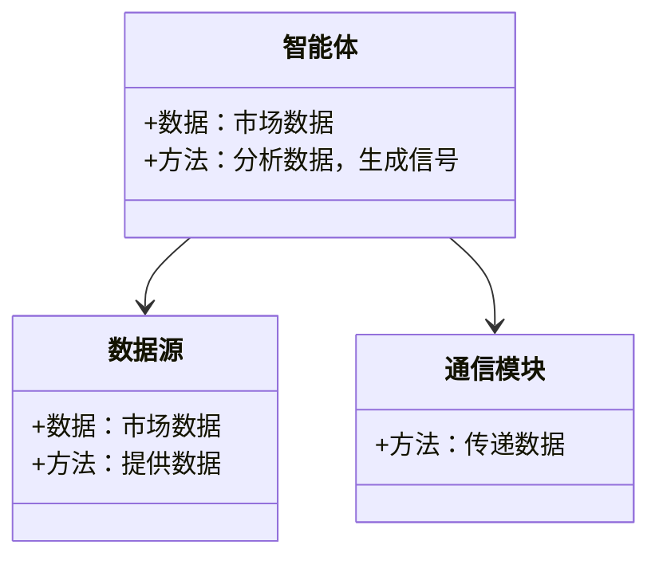
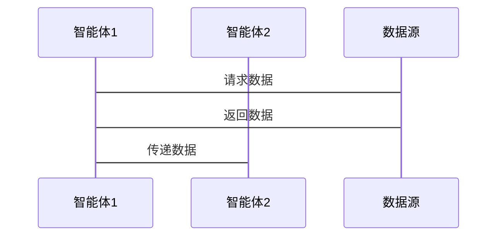

                 


# AI多智能体优化价值投资的动态行业轮动信号生成

> 关键词：多智能体系统、价值投资、动态行业轮动、信号生成、优化算法

> 摘要：本文探讨了如何利用AI多智能体系统优化价值投资中的动态行业轮动信号生成。通过分析多智能体系统的核心概念、算法原理、数学模型、系统架构以及实际项目案例，本文详细阐述了如何通过多智能体协同优化来提升投资决策的效率和准确性。文章还提供了代码实现、系统设计和最佳实践，为读者提供全面的技术指导。

---

# 第1章: 多智能体系统与价值投资的结合

## 1.1 多智能体系统的定义与特点

### 1.1.1 多智能体系统的定义
多智能体系统（Multi-Agent System, MAS）是由多个智能体（Agent）组成的分布式系统，每个智能体都有自己的目标、行为和决策机制。智能体之间通过通信和协作完成复杂任务。

### 1.1.2 多智能体系统的核心特点
- **分布式性**：智能体独立决策，但通过通信协作完成任务。
- **自主性**：智能体能够自主感知环境并采取行动。
- **社会性**：智能体之间需要协同工作，避免冲突。
- **适应性**：智能体能够根据环境变化动态调整策略。

### 1.1.3 多智能体系统与传统单智能体的区别
- **单智能体**：集中式决策，计算复杂度高。
- **多智能体**：分布式决策，降低计算复杂度，提高实时性和鲁棒性。

## 1.2 价值投资与动态行业轮动的定义

### 1.2.1 价值投资的核心理念
价值投资基于对公司内在价值的评估，寻找被市场低估的投资标的。其核心在于通过基本面分析发现低估资产。

### 1.2.2 动态行业轮动的定义与意义
动态行业轮动是指根据市场变化，及时调整投资的行业分布。其意义在于捕捉不同行业之间的轮动机会，优化投资组合的风险收益比。

### 1.2.3 价值投资与动态行业轮动的结合
结合价值投资与动态行业轮动，可以在不同市场周期中动态调整投资行业，优化投资组合的表现。

## 1.3 问题背景与研究意义

### 1.3.1 传统投资方法的局限性
- **数据处理能力有限**：传统方法难以处理海量数据。
- **决策效率低下**：依赖人工分析，耗时且易出错。
- **市场变化应对不足**：静态策略难以适应动态市场。

### 1.3.2 多智能体系统在投资中的优势
- **分布式计算**：多智能体可以同时处理不同行业数据。
- **实时协作**：智能体实时共享信息，快速调整投资策略。
- **动态优化**：通过协同优化算法，快速响应市场变化。

### 1.3.3 动态行业轮动信号生成的挑战与机遇
- **挑战**：市场数据复杂、噪声多，动态信号生成难度大。
- **机遇**：利用AI技术提升分析能力，捕捉市场机会。

---

# 第2章: 多智能体系统与动态行业轮动的核心概念

## 2.1 多智能体系统的组成与功能

### 2.1.1 多智能体系统的组成结构
- **智能体**：负责数据收集、分析、决策。
- **通信模块**：负责智能体之间的信息传递。
- **协作机制**：制定任务分配和协同规则。

### 2.1.2 各智能体的功能与角色
- **数据采集智能体**：收集市场数据。
- **分析智能体**：进行数据分析和预测。
- **决策智能体**：制定投资策略。

### 2.1.3 智能体之间的通信与协作
智能体通过消息传递机制共享数据，协同完成任务。

## 2.2 动态行业轮动的原理与机制

### 2.2.1 行业轮动的基本原理
行业轮动基于市场周期变化，选择表现较好的行业进行投资。

### 2.2.2 动态轮动的驱动因素
- **经济指标**：GDP、利率、通货膨胀等。
- **行业基本面**：行业盈利能力、增长潜力。
- **市场情绪**：投资者情绪影响市场波动。

### 2.2.3 行业轮动信号的生成方法
- **基于因子分析**：分析行业因子，生成轮动信号。
- **基于机器学习**：使用算法预测行业表现。

## 2.3 多智能体优化的价值投资模型

### 2.3.1 多智能体优化的数学模型
$$ \text{目标函数} = \sum_{i=1}^{n} f_i(x_i) $$
其中，$x_i$为第i个智能体的决策变量。

### 2.3.2 价值投资与动态轮动的结合模型
结合多智能体优化和动态行业轮动，构建投资模型。

### 2.3.3 模型的核心要素与关系
- **数据输入**：市场数据、经济指标。
- **智能体协同**：智能体分工合作，生成投资信号。

---

# 第3章: 多智能体协同优化算法

## 3.1 多智能体协同优化的基本原理

### 3.1.1 分布式计算与协作优化
智能体通过分布式计算完成优化任务。

### 3.1.2 多智能体之间的信息共享机制
智能体之间共享数据，协同完成优化。

### 3.1.3 协同优化的目标函数与约束条件
$$ \text{目标函数} = \sum_{i=1}^{n} f_i(x_i) $$
$$ \text{约束条件} = g(x_i) \leq 0 $$

## 3.2 基于多智能体的动态行业轮动算法

### 3.2.1 算法的整体流程
1. 数据采集：智能体收集市场数据。
2. 数据分析：智能体分析数据，生成预测信号。
3. 信号生成：智能体协同生成行业轮动信号。

### 3.2.2 智能体的任务分配与角色分工
- **数据采集智能体**：负责数据收集。
- **分析智能体**：负责数据分析和预测。
- **决策智能体**：负责制定投资策略。

### 3.2.3 动态调整与优化策略
根据市场变化，动态调整智能体的任务分配和决策策略。

---

# 第4章: 数学模型与公式解析

## 4.1 多智能体优化的数学模型

### 4.1.1 多智能体优化的目标函数
$$ \text{目标函数} = \sum_{i=1}^{n} f_i(x_i) $$

### 4.1.2 约束条件
$$ g(x_i) \leq 0, \quad i = 1, 2, ..., n $$

---

# 第5章: 系统分析与架构设计方案

## 5.1 问题场景介绍
多智能体系统应用于投资领域，优化动态行业轮动信号生成。

## 5.2 系统功能设计

### 5.2.1 领域模型（Mermaid 类图）


## 5.3 系统架构设计（Mermaid 架构图）
```mermaid
container 投资系统 {
    智能体1
    智能体2
    智能体3
    通信模块
}
```

## 5.4 系统接口设计
- **数据接口**：智能体与数据源之间的接口。
- **通信接口**：智能体之间的通信接口。

## 5.5 系统交互设计（Mermaid 序列图）


---

# 第6章: 项目实战

## 6.1 环境安装
安装Python、TensorFlow、Keras等工具。

## 6.2 系统核心实现源代码

### 6.2.1 数据采集智能体
```python
class DataCollector:
    def collect_data(self):
        # 数据采集逻辑
        pass
```

### 6.2.2 分析智能体
```python
class Analyzer:
    def analyze(self, data):
        # 数据分析逻辑
        pass
```

### 6.2.3 决策智能体
```python
class DecisionMaker:
    def make_decision(self, analysis_result):
        # 决策逻辑
        pass
```

## 6.3 代码应用解读与分析
解释代码功能，展示如何协同工作。

## 6.4 实际案例分析和详细讲解剖析
分析一个实际案例，展示系统的运行过程。

## 6.5 项目小结
总结项目成果，提出改进建议。

---

# 第7章: 最佳实践与小结

## 7.1 最佳实践 tips
- **数据质量**：确保数据准确。
- **模型调优**：定期调整模型参数。
- **风险管理**：控制投资风险。

## 7.2 小结
总结全文内容，强调AI多智能体系统在投资中的应用价值。

## 7.3 注意事项
提示读者注意数据隐私和模型维护。

## 7.4 拓展阅读
推荐相关书籍和论文，供读者深入学习。

---

# 结语

AI多智能体优化价值投资的动态行业轮动信号生成是一个复杂的系统工程。通过多智能体系统的协同优化，可以有效提升投资决策的效率和准确性。未来，随着技术的进步，AI多智能体系统将在投资领域发挥更大的作用。

---

# 作者：AI天才研究院/AI Genius Institute & 禅与计算机程序设计艺术 /Zen And The Art of Computer Programming

---

希望这篇文章能满足您的需求。如果需要进一步修改或补充，请随时告知！

