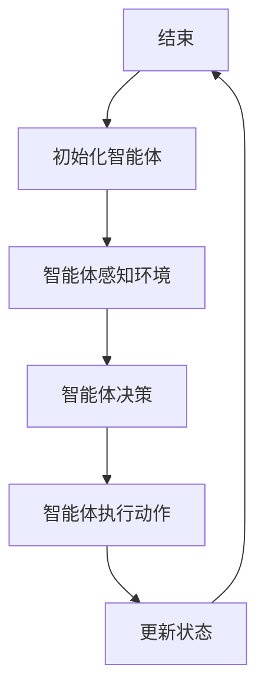
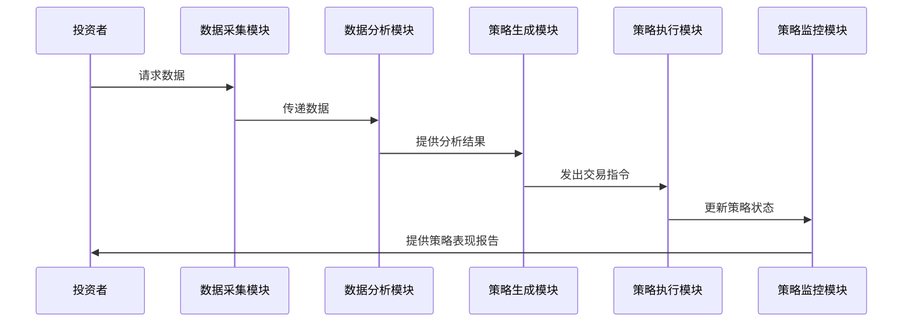

                 


# AI多智能体优化价值投资的动态行业轮动策略

## 关键词：
- AI，人工智能，多智能体优化，价值投资，动态行业轮动，金融数据分析，投资策略，系统架构设计，算法实现，数学模型

## 摘要：
本文探讨了如何利用AI多智能体优化技术来动态调整价值投资策略，实现行业轮动。通过分析市场数据，构建多智能体系统，优化投资组合，捕捉市场机会。文章详细讲解了算法原理、系统架构，并通过案例展示实现过程，提供最佳实践和未来展望。

---

## 第1章 引言

### 1.1 问题背景
#### 1.1.1 传统投资策略的局限性
传统投资策略依赖人工分析，主观性强，难以及时捕捉市场变化。动态调整困难，导致收益不稳定。

#### 1.1.2 AI在金融投资中的潜力
AI具备数据处理和模式识别优势，能快速分析大量数据，发现潜在投资机会。

#### 1.1.3 多智能体优化的必要性
多智能体系统能模拟市场参与者行为，优化投资决策，提高收益。

### 1.2 问题描述
#### 1.2.1 动态行业轮动的定义
根据市场变化，调整投资行业的配置比例。

#### 1.2.2 价值投资的核心要素
寻找被低估资产，长期持有，追求超额收益。

#### 1.2.3 AI驱动投资决策的优势
利用AI处理数据，优化决策，提高投资效率。

### 1.3 问题解决
#### 1.3.1 多智能体优化的目标
优化投资组合，最大化收益，最小化风险。

#### 1.3.2 动态行业轮动策略的设计
根据市场变化，动态调整投资行业，捕捉市场机会。

#### 1.3.3 价值投资与AI结合的可行性
AI能辅助价值投资，提高决策的科学性和及时性。

### 1.4 边界与外延
#### 1.4.1 界定问题范围
限定于AI驱动的金融投资领域，专注于动态行业轮动策略。

#### 1.4.2 相关领域的关联
涉及数据挖掘、机器学习、系统架构设计等多个领域。

#### 1.4.3 未来发展的可能性
AI技术进步将推动投资策略的不断创新。

### 1.5 概念结构与核心要素
#### 1.5.1 核心概念框架
AI、多智能体、价值投资、动态行业轮动。

#### 1.5.2 各要素之间的关系
AI驱动多智能体优化，优化价值投资策略，实现动态行业轮动。

#### 1.5.3 核心要素的详细描述
- AI：数据分析和决策工具。
- 多智能体：模拟市场参与者，优化投资决策。
- 价值投资：寻找低估资产，长期持有。
- 动态行业轮动：根据市场变化调整投资行业。

---

## 第2章 核心概念与联系

### 2.1 核心概念原理
#### 2.1.1 多智能体系统的定义
由多个智能体组成的系统，每个智能体独立决策，协同完成任务。

#### 2.1.2 智能体的特性与功能
- 智能体特性：自主性、反应性、目标导向。
- 智能体功能：信息处理、决策制定、行动执行。

#### 2.1.3 多智能体优化的目标
通过协同优化，提高整体投资收益。

### 2.2 核心概念属性特征对比
| 特性     | 单智能体       | 多智能体       |
|----------|----------------|----------------|
| 独立性    | 高             | 中             |
| 协作性    | 低             | 高             |
| 复杂性    | 低             | 高             |
| 决策速度  | 快             | 较快           |

### 2.3 ER实体关系图
使用Mermaid绘制ER图，展示系统中的实体及其关系。

```
```mermaid
er
    entity 投资者 {
        id
        资金
        风险偏好
    }
    entity 行业 {
        id
        名称
        市场表现
    }
    entity 智能体 {
        id
        策略
        数据源
    }
    投资者 -- 策略：选择策略
    智能体 --> 行业：优化
```
```

---

## 第3章 算法原理讲解

### 3.1 多智能体优化算法
#### 3.1.1 算法的基本原理
多个智能体协同优化，寻找全局最优解。

#### 3.1.2 算法的步骤分解
1. 初始化智能体。
2. 智能体感知环境。
3. 智能体决策。
4. 智能体执行动作。
5. 更新状态，重复步骤。

#### 3.1.3 算法的数学模型
目标函数：
$$
\text{Maximize } f(x) = \sum_{i=1}^{n} w_i x_i
$$
约束条件：
$$
\sum_{i=1}^{n} x_i \leq 1
$$
其中，$x_i$为投资比例，$w_i$为权重。

### 3.2 算法流程图
使用Mermaid绘制流程图，展示算法执行过程。

```

```

---

## 第4章 系统分析与架构设计

### 4.1 问题场景介绍
投资者需要根据市场变化，动态调整投资组合。系统需实时分析数据，优化投资策略。

### 4.2 项目介绍
开发一个AI驱动的金融分析系统，实现动态行业轮动策略。

### 4.3 系统功能设计
- 数据采集模块：收集市场数据。
- 数据分析模块：处理数据，提取特征。
- 策略生成模块：生成投资策略。
- 策略执行模块：执行交易指令。
- 策略监控模块：监控策略表现。

### 4.4 系统架构设计
使用Mermaid绘制架构图，展示系统模块及其交互。

```

```

### 4.5 接口设计
- 数据接口：API获取市场数据。
- 策略接口：模块间通信接口。
- 用户接口：供投资者查询和管理投资组合。

### 4.6 交互设计
使用Mermaid绘制交互序列图，展示系统交互过程。

```

```

---

## 第5章 项目实战

### 5.1 环境安装
安装Python、TensorFlow、Pandas等库。

### 5.2 核心实现
#### 5.2.1 数据采集
使用API获取市场数据。

#### 5.2.2 数据分析
使用机器学习模型预测行业表现。

#### 5.2.3 策略生成
基于多智能体优化算法生成投资策略。

#### 5.2.4 策略执行
根据策略执行交易。

#### 5.2.5 策略回测
评估策略的历史表现。

### 5.3 代码示例
```python
import numpy as np
import pandas as pd

# 数据预处理
data = pd.read_csv('market_data.csv')
data = data.dropna()

# 特征工程
from sklearn.preprocessing import StandardScaler
scaler = StandardScaler()
X = scaler.fit_transform(data.drop('target', axis=1))
y = data['target']

# 模型训练
from sklearn.ensemble import RandomForestClassifier
model = RandomForestClassifier()
model.fit(X, y)

# 模型预测
predictions = model.predict(X)
```

### 5.4 案例分析
分析某行业轮动策略的历史表现，评估其有效性。

### 5.5 代码应用解读
解释代码功能，展示如何实现动态行业轮动。

---

## 第6章 最佳实践与注意事项

### 6.1 最佳实践 tips
- 确保数据质量，避免噪声干扰。
- 定期模型调优，适应市场变化。
- 设置风险管理机制，控制投资风险。

### 6.2 小结
本文详细讲解了AI多智能体优化技术在价值投资中的应用，展示了如何构建动态行业轮动策略。

### 6.3 注意事项
- 数据隐私问题需注意。
- 模型需定期更新，适应市场变化。
- 投资者需理解策略，合理设置风险承受能力。

### 6.4 拓展阅读
推荐相关书籍和论文，供读者深入学习。

---

## 结论与展望

AI多智能体优化技术为价值投资提供了新思路。未来，随着技术进步，投资策略将更加智能化，个性化服务将成为可能。

---

## 作者

作者：AI天才研究院/AI Genius Institute & 禅与计算机程序设计艺术/Zen And The Art of Computer Programming

