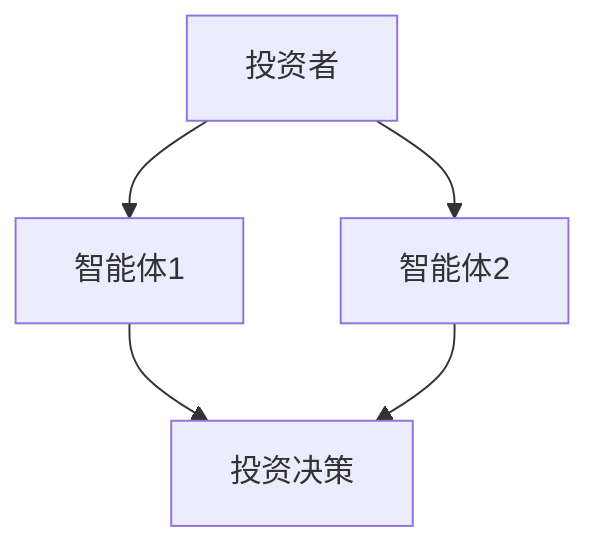
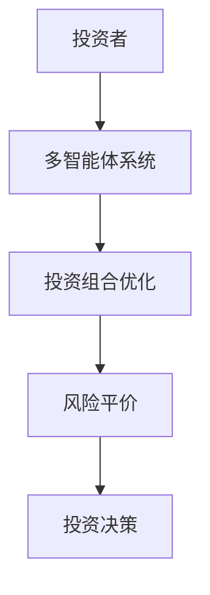
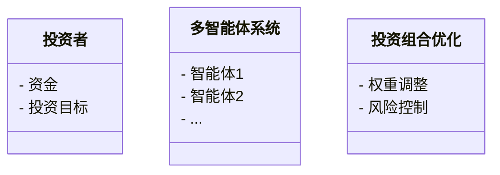

                 


# AI多智能体优化价值投资的动态风险平价策略

**关键词**：人工智能、多智能体系统、价值投资、动态风险平价、优化策略

**摘要**：本文探讨了如何利用AI多智能体系统优化价值投资策略，通过动态风险平价策略降低投资风险。文章从背景介绍、核心概念、算法原理、系统架构到项目实战，详细阐述了AI技术在金融投资中的应用，为投资者提供了新的思路和方法。

---

## 第1章 背景介绍

### 1.1 问题背景

#### 1.1.1 传统投资策略的局限性
传统的投资策略依赖于人工分析和经验判断，存在主观性强、效率低、覆盖面有限等问题。例如，基本面分析需要大量人工数据收集和模型构建，难以应对海量数据和复杂市场变化。

#### 1.1.2 人工智能在金融投资中的应用现状
近年来，人工智能技术在金融领域的应用日益广泛。机器学习算法被用于股票预测、风险评估和投资组合优化等领域。然而，大多数应用仍局限于单智能体系统，难以处理多目标优化问题。

#### 1.1.3 多智能体优化在投资策略中的潜力
多智能体系统通过分布式决策和协同优化，能够更高效地处理复杂的投资问题。通过多个智能体分别关注不同的市场因素，可以实现更精准的投资决策。

### 1.2 问题描述

#### 1.2.1 价值投资中的核心问题
价值投资的核心在于识别被低估的资产，但市场波动和信息不对称使得这一过程充满挑战。传统的价值投资策略难以动态调整，难以应对复杂多变的市场环境。

#### 1.2.2 风险平价策略的定义与目标
风险平价策略旨在通过分散投资来降低风险。动态风险平价策略要求根据市场变化实时调整投资组合，以保持风险水平的均衡。

#### 1.2.3 动态风险平价策略的挑战
动态调整投资组合需要实时数据处理和快速决策能力。传统的单智能体系统难以满足这些要求，而多智能体系统能够通过分工协作实现高效优化。

### 1.3 问题解决

#### 1.3.1 AI多智能体优化的核心思想
通过部署多个AI智能体，分别负责不同的市场分析和投资决策，利用协同优化算法实现整体投资策略的优化。

#### 1.3.2 动态风险平价策略的实现路径
基于多智能体系统的动态调整能力，实时监控市场变化，动态优化投资组合，实现风险与收益的平衡。

#### 1.3.3 多智能体协同优化的价值投资策略
通过多个智能体分别关注市场、行业、个股等因素，协同优化投资组合，实现价值投资策略的动态调整和风险控制。

### 1.4 边界与外延

#### 1.4.1 价值投资的边界条件
包括市场有效性、数据质量和模型假设等因素。

#### 1.4.2 风险平价策略的适用范围
适用于风险厌恶型投资者，尤其在市场波动较大时。

#### 1.4.3 多智能体优化的限制与扩展
受计算能力和数据质量的限制，未来可以通过分布式计算和边缘AI技术进一步扩展。

### 1.5 核心要素组成

#### 1.5.1 多智能体系统的核心要素
包括智能体数量、决策频率、通信机制和协同算法。

#### 1.5.2 动态风险平价模型的关键参数
包括风险权重、时间窗口和调整频率。

#### 1.5.3 价值投资策略的优化目标
最大化投资收益，最小化投资风险，保持投资组合的流动性。

---

## 第2章 多智能体系统的核心概念与联系

### 2.1 多智能体系统原理

#### 2.1.1 多智能体系统的定义与特点
多智能体系统由多个智能体组成，能够通过协同工作完成复杂任务。其特点包括分布式决策、协作性、自主性和适应性。

#### 2.1.2 多智能体系统的组成与功能
包括感知层、决策层和执行层。感知层负责数据采集，决策层负责策略优化，执行层负责投资操作。

#### 2.1.3 多智能体系统与传统单智能体系统的对比
| 比较维度 | 多智能体系统 | 单智能体系统 |
|----------|--------------|---------------|
| 复杂性   | 高            | 低             |
| 效率     | 高            | 中             |
| 可扩展性 | 高            | 低             |

### 2.2 多智能体系统与价值投资的结合

#### 2.2.1 多智能体系统在金融投资中的应用场景
包括实时市场监控、风险预警和投资组合优化。

#### 2.2.2 多智能体系统如何优化投资决策
通过分工协作，多个智能体分别分析市场、行业和个股，协同优化投资组合。

#### 2.2.3 多智能体系统与动态风险平价策略的关系
多智能体系统的协同优化能力为动态风险平价策略提供了技术支持，使得实时调整投资组合成为可能。

### 2.3 核心概念对比表

| 概念 | 定义 | 特点 | 优缺点 |
|------|------|------|--------|
| 单智能体 | 单个决策主体 | 高效、简单 | 无法处理复杂场景 |
| 多智能体 | 多个决策主体 | 分布式、协作 | 复杂度高、需要协调 |

### 2.4 ER实体关系图



---

## 第3章 动态风险平价策略的算法原理

### 3.1 动态风险平价策略的核心算法

#### 3.1.1 算法概述
动态风险平价策略通过实时监控市场变化，动态调整投资组合的风险水平，以实现收益与风险的平衡。

#### 3.1.2 算法步骤
1. 数据采集：获取市场数据，包括股票价格、指数表现等。
2. 风险评估：计算各资产的风险值。
3. 投资组合优化：根据风险评估结果，调整投资组合。
4. 实时监控：持续更新市场数据和投资组合。

#### 3.1.3 算法实现的数学模型
$$
\text{投资组合权重调整} = \frac{\text{风险权重}}{\sum \text{风险权重}}
$$

### 3.2 多智能体协同优化算法

#### 3.2.1 算法描述
多智能体协同优化算法通过多个智能体分别处理不同的市场因素，协同优化投资组合。

#### 3.2.2 算法实现的伪代码
```python
def multi_agent_optimization(assets, agents):
    for agent in agents:
        agent.analyze(assets)
    global_weight = sum(agent.weight for agent in agents)
    return global_weight / len(agents)
```

### 3.3 算法实现的数学模型

#### 3.3.1 CAPM模型
$$
E(r_i) = r_f + \beta_i (E(r_m) - r_f)
$$

#### 3.3.2 风险平价模型
$$
w_i = \frac{\sigma_i}{\sum \sigma_j}
$$

### 3.4 优化目标

#### 3.4.1 投资组合优化目标
最大化投资收益，同时最小化投资风险。

#### 3.4.2 动态调整目标
根据市场变化实时调整投资组合，保持风险平价。

### 3.5 案例分析

#### 3.5.1 案例背景
假设市场包含三只股票，分别为股票A、股票B和股票C。

#### 3.5.2 数据分析
股票A的风险为0.2，股票B的风险为0.3，股票C的风险为0.5。

#### 3.5.3 投资组合优化
$$
\text{总风险} = 0.2 + 0.3 + 0.5 = 1.0
$$
$$
\text{权重分配} = \frac{0.2}{1.0}, \frac{0.3}{1.0}, \frac{0.5}{1.0}
$$

#### 3.5.4 结果解读
投资组合中股票C的权重最高，表明应重点配置风险较高的资产。

---

## 第4章 系统架构设计

### 4.1 系统整体架构



### 4.2 系统功能设计

#### 4.2.1 数据采集模块
负责收集市场数据，包括股票价格、指数表现等。

#### 4.2.2 风险评估模块
计算各资产的风险值，生成风险评估报告。

#### 4.2.3 投资组合优化模块
根据风险评估结果，动态调整投资组合。

### 4.3 系统架构图



### 4.4 系统交互设计

#### 4.4.1 投资者与多智能体系统的交互
投资者向多智能体系统输入投资目标和资金，系统根据目标生成优化策略。

#### 4.4.2 多智能体系统内部交互
智能体之间通过通信模块共享数据，协同优化投资组合。

---

## 第5章 项目实战

### 5.1 项目介绍

#### 5.1.1 项目背景
本文将通过一个具体的项目案例，展示如何利用多智能体系统优化价值投资策略。

#### 5.1.2 项目目标
实现一个多智能体优化系统，用于动态调整投资组合，降低投资风险。

### 5.2 系统核心实现

#### 5.2.1 环境安装
需要安装Python、NumPy、Pandas、Scikit-learn等库。

#### 5.2.2 核心代码实现

```python
class Agent:
    def __init__(self, id):
        self.id = id
        self.assets = []
        self.risk_weights = {}

    def analyze(self, assets):
        # 计算各资产的风险值
        for asset in assets:
            self.risk_weights[asset] = calculate_risk(asset)
    
    def get_weight(self, total_risk):
        # 根据风险权重计算权重
        return {asset: risk / total_risk for asset, risk in self.risk_weights.items()}

def multi_agent_optimization(assets, num_agents):
    agents = [Agent(i) for i in range(num_agents)]
    for agent in agents:
        agent.analyze(assets)
    total_risk = sum(agent.risk_weights.values() for agent in agents)
    global_weight = {}
    for asset in assets:
        total_weight = 0
        for agent in agents:
            total_weight += agent.get_weight(total_risk)[asset]
        global_weight[asset] = total_weight / num_agents
    return global_weight
```

#### 5.2.3 代码应用解读与分析
代码实现了一个多智能体系统，每个智能体分析资产风险，协同优化投资组合。

### 5.3 实际案例分析

#### 5.3.1 数据来源
使用历史股票数据，包括收盘价、成交量等。

#### 5.3.2 数据分析与处理
计算各资产的风险值，生成风险评估报告。

#### 5.3.3 投资组合优化
根据风险评估结果，动态调整投资组合，实现风险平价。

#### 5.3.4 结果分析
通过对比优化前后的投资组合，验证策略的有效性。

### 5.4 项目小结
本项目展示了如何利用多智能体系统优化价值投资策略，实现了动态风险平价，降低了投资风险。

---

## 第6章 总结与展望

### 6.1 总结
本文探讨了AI多智能体系统在价值投资中的应用，提出了动态风险平价策略，通过多智能体协同优化，实现了投资组合的动态调整。

### 6.2 展望
未来的研究可以进一步探索多智能体系统的协同优化算法，研究如何在复杂市场环境中实现更高效的动态调整。

### 6.3 最佳实践 Tips
- 在实际应用中，建议结合市场实际情况调整参数。
- 定期监控和优化系统，确保策略的有效性。

---

**作者：AI天才研究院 & 禅与计算机程序设计艺术**

---

通过本文的详细阐述，读者可以全面了解AI多智能体优化价值投资的动态风险平价策略，掌握其核心概念、算法原理和系统架构，为实际投资决策提供有力支持。

