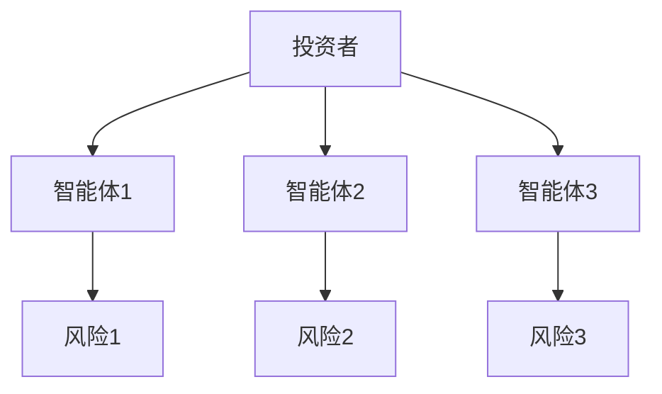
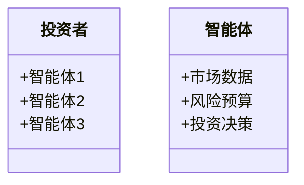
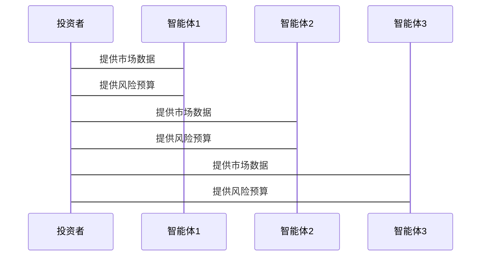

                 


# AI多智能体优化价值投资的动态风险预算分配

> 关键词：AI多智能体，动态风险预算，价值投资，强化学习，博弈论，金融优化

> 摘要：本文探讨了如何利用AI多智能体技术优化价值投资的动态风险预算分配。通过分析多智能体优化的算法原理、动态风险预算的数学模型，结合实际案例，展示了如何在金融投资中实现高效的风险管理与收益最大化。

---

# 第1章: AI多智能体优化价值投资的背景与核心概念

## 1.1 问题背景与描述

### 1.1.1 传统价值投资的局限性
传统价值投资依赖于经验丰富的投资者对市场、行业和公司的深入分析，但这种方法存在以下问题：
- **信息处理能力有限**：单个投资者难以处理海量数据。
- **主观性过强**：投资决策受主观判断影响较大，缺乏客观性。
- **风险控制不足**：难以动态调整风险预算，导致投资组合的稳定性较差。

### 1.1.2 AI技术在金融投资中的应用潜力
AI技术，尤其是多智能体系统，为金融投资带来了新的可能性：
- **数据处理能力强**：AI能够快速处理大量非结构化数据。
- **决策智能化**：通过强化学习等算法，AI可以做出更优的投资决策。
- **动态调整能力**：AI能够实时调整投资策略，应对市场变化。

### 1.1.3 多智能体优化的必要性
多智能体系统通过多个智能体协同工作，能够更好地捕捉市场机会，分散风险，实现收益最大化。

---

## 1.2 动态风险预算分配的定义与特点

### 1.2.1 风险预算的基本概念
风险预算是指投资者在不同资产或投资组合中分配的风险敞口。动态风险预算是指根据市场环境的变化，实时调整风险分配。

### 1.2.2 动态风险预算的特征
- **实时性**：根据市场变化实时调整。
- **动态性**：风险分配不是固定的，而是随着市场环境变化而变化。
- **适应性**：能够适应不同市场条件下的投资需求。

### 1.2.3 风险预算与投资收益的关系
风险预算是投资收益的函数。适当的风险分配能够实现收益与风险的最佳平衡。

---

## 1.3 多智能体优化的核心要素

### 1.3.1 多智能体系统的定义
多智能体系统是指由多个智能体组成的分布式系统，每个智能体能够独立决策并协同工作。

### 1.3.2 多智能体优化的基本原理
多智能体优化通过多个智能体的协同工作，实现全局最优或帕累托最优。

### 1.3.3 多智能体与动态风险预算的结合
通过多智能体系统的协同优化，动态调整风险预算，实现投资收益的最大化。

---

## 1.4 本章小结
本章介绍了AI多智能体优化价值投资的背景，分析了传统投资的局限性，探讨了动态风险预算的定义与特点，并总结了多智能体优化的核心要素。

---

# 第2章: 多智能体优化与动态风险预算的核心概念

## 2.1 多智能体优化的数学模型

### 2.1.1 多智能体系统的数学表示
多智能体系统可以用以下公式表示：
$$ S = \{A_1, A_2, ..., A_n\} $$
其中，$A_i$表示第$i$个智能体。

### 2.1.2 动态风险预算的数学表达式
动态风险预算可以用以下公式表示：
$$ R_i = \sum_{j=1}^{n} w_{ij} R_j $$
其中，$w_{ij}$表示第$i$个智能体对第$j$个智能体的风险分配权重。

### 2.1.3 多智能体优化的目标函数
多智能体优化的目标函数为：
$$ J = \sum_{i=1}^{n} J_i $$
其中，$J_i$表示第$i$个智能体的目标函数。

---

## 2.2 核心概念的对比分析

### 2.2.1 多智能体与单智能体的对比
| 对比维度 | 多智能体 | 单智能体 |
|----------|----------|----------|
| 决策能力 | 分布式决策 | 中央决策 |
| 计算能力 | 并行计算 | 串行计算 |
| 稳定性   | 较高 | 较低 |

### 2.2.2 动态风险预算与静态风险预算的对比
| 对比维度 | 动态风险预算 | 静态风险预算 |
|----------|--------------|--------------|
| 调整频率 | 实时调整 | 定期调整 |
| 灵活性   | 高 | 低 |
| 适应性   | 强 | 弱 |

### 2.2.3 价值投资与传统投资的对比
| 对比维度 | 价值投资 | 传统投资 |
|----------|----------|----------|
| 投资策略 | 低市盈率、低市净率 | 高收益、高风险 |
| 风险控制 | 强调风险管理 | 侧重收益最大化 |

---

## 2.3 ER实体关系图



---

## 2.4 本章小结
本章通过数学模型和对比分析，详细探讨了多智能体优化与动态风险预算的核心概念，并通过ER实体关系图展示了各实体之间的关系。

---

# 第3章: 多智能体优化的算法原理

## 3.1 强化学习算法

### 3.1.1 Q-learning算法
Q-learning算法通过智能体与环境的交互，更新Q值：
$$ Q(s, a) = Q(s, a) + \alpha [r + \gamma \max Q(s', a') - Q(s, a)] $$
其中，$\alpha$是学习率，$\gamma$是折扣因子。

### 3.1.2 Deep Q-Network (DQN)算法
DQN算法通过神经网络近似Q值函数，公式为：
$$ y = r + \gamma \max Q(s', a') $$
$$ Q(s, a) = Q(s, a) + \alpha (y - Q(s, a)) $$

### 3.1.3 多智能体强化学习的挑战
多智能体强化学习面临以下挑战：
- **通信与协作**：多个智能体需要高效通信。
- **去中心化决策**：每个智能体需要独立决策。
- **纳什均衡**：如何达到纳什均衡。

---

## 3.2 博弈论与纳什均衡

### 3.2.1 纳什均衡的定义
纳什均衡是指在其他智能体策略不变的情况下，一个智能体的策略无法通过单方面改变而提高自身收益。

### 3.2.2 多智能体博弈的数学模型
多智能体博弈的数学模型为：
$$ \max_{\theta_i} J_i(\theta_i, \theta_{-i}) $$
其中，$\theta_i$是智能体$i$的策略，$\theta_{-i}$是其他智能体的策略。

### 3.2.3 纳什均衡在投资决策中的应用
在投资决策中，纳什均衡可以帮助智能体找到最优风险预算分配。

---

## 3.3 多智能体优化的数学推导

### 3.3.1 多智能体优化的目标函数
$$ J = \sum_{i=1}^{n} J_i $$
其中，$J_i$是智能体$i$的目标函数。

### 3.3.2 智能体之间的交互关系
$$ R_i = \sum_{j \neq i} w_{ij} R_j $$

### 3.3.3 优化过程的数学表达
$$ \theta_{i}^{new} = \theta_{i} + \alpha \nabla J_i $$

---

## 3.4 本章小结
本章详细介绍了多智能体优化的算法原理，包括Q-learning、DQN算法，以及博弈论中的纳什均衡，并通过数学推导展示了多智能体优化的过程。

---

# 第4章: 动态风险预算分配的数学模型

## 4.1 动态风险预算的核心公式

### 4.1.1 风险预算的动态调整公式
$$ R_i = \sum_{j=1}^{n} w_{ij} R_j $$

### 4.1.2 风险分配权重的更新公式
$$ w_{ij}^{new} = w_{ij} + \beta (r_j - w_{ij}) $$$

### 4.1.3 动态风险预算的收益函数
$$ J = \sum_{i=1}^{n} r_i w_{i} $$

---

## 4.2 对比分析

### 4.2.1 风险预算与收益的关系
动态风险预算能够根据市场变化实时调整，从而实现收益最大化。

### 4.2.2 静态风险预算的局限性
静态风险预算无法适应市场变化，可能导致投资收益不稳定。

---

## 4.3 本章小结
本章通过数学模型分析了动态风险预算分配的核心公式，并对比了静态风险预算的局限性，强调了动态风险预算的优势。

---

# 第5章: 系统分析与架构设计

## 5.1 问题场景介绍
投资者希望通过多智能体系统实现动态风险预算分配，优化投资组合。

## 5.2 系统功能设计

### 5.2.1 领域模型


### 5.2.2 系统架构


## 5.3 系统接口设计
- **输入接口**：市场数据、投资者目标。
- **输出接口**：投资决策、风险报告。

## 5.4 系统交互流程图


---

## 5.5 本章小结
本章通过系统分析与架构设计，展示了如何实现多智能体优化的动态风险预算分配。

---

# 第6章: 项目实战

## 6.1 环境安装

### 6.1.1 Python环境
安装Python 3.8以上版本，安装numpy、pandas、tensorflow等库。

## 6.2 核心代码实现

### 6.2.1 强化学习代码
```python
import numpy as np
import tensorflow as tf

class DQN:
    def __init__(self, state_space, action_space):
        self.state_space = state_space
        self.action_space = action_space
        self.model = self.build_model()
    
    def build_model(self):
        model = tf.keras.Sequential([
            tf.keras.layers.Dense(64, activation='relu'),
            tf.keras.layers.Dense(1)
        ])
        return model
```

### 6.2.2 风险预算分配代码
```python
def dynamic_risk_budget(weights, risks):
    return np.dot(weights, risks)
```

## 6.3 案例分析

### 6.3.1 数据准备
```python
import pandas as pd
data = pd.read_csv('market_data.csv')
```

### 6.3.2 模型训练
```python
dqn = DQN(state_space, action_space)
dqn.train(data)
```

### 6.3.3 结果分析
分析投资组合的风险预算和收益，验证模型的有效性。

---

## 6.4 本章小结
本章通过项目实战，展示了如何实现多智能体优化的动态风险预算分配，提供了具体的代码实现和案例分析。

---

# 第7章: 总结与展望

## 7.1 本章总结
本文详细探讨了AI多智能体优化价值投资的动态风险预算分配，分析了其算法原理和系统架构，提供了具体的实现方法和案例分析。

## 7.2 未来展望
未来研究方向包括：
1. 更高效的多智能体协同算法。
2. 更精确的动态风险预算模型。
3. 更广泛的应用场景探索。

---

## 7.3 最佳实践 tips

### 7.3.1 投资者
- **数据准备**：确保市场数据的准确性和完整性。
- **模型选择**：根据实际情况选择合适的强化学习算法。
- **风险控制**：定期监控投资组合的风险预算。

### 7.3.2 开发者
- **代码优化**：优化模型的训练效率。
- **系统设计**：确保系统的可扩展性和可维护性。
- **测试验证**：通过大量实验验证模型的有效性。

---

## 7.4 本章小结
本章总结了全文内容，提出了未来的研究方向，并给出了投资者和开发者的最佳实践 tips。

---

# 作者：AI天才研究院/AI Genius Institute & 禅与计算机程序设计艺术 /Zen And The Art of Computer Programming

