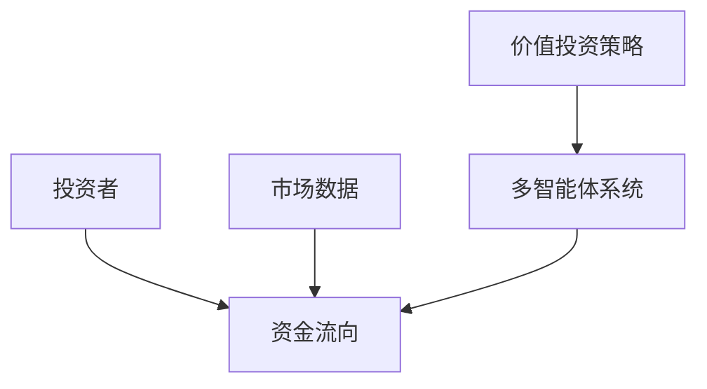
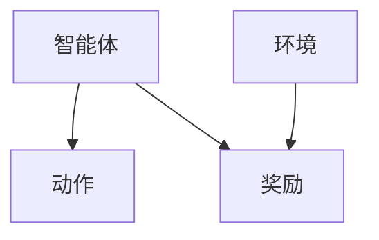
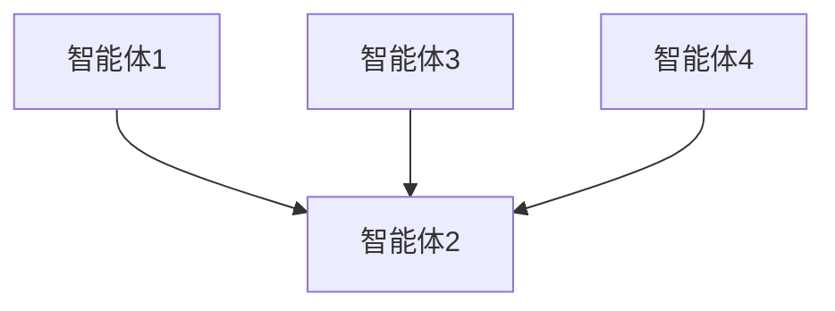
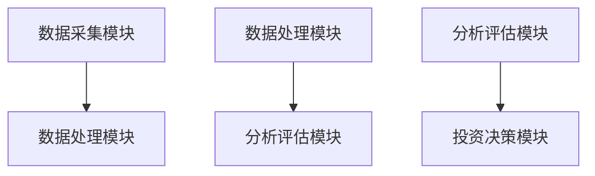
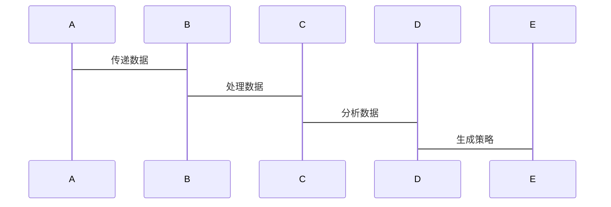

                 


# AI多智能体优化价值投资的资金流向分析

> 关键词：AI多智能体、价值投资、资金流向、优化算法、金融数据分析  
> 摘要：本文探讨了利用AI多智能体技术优化价值投资策略，通过分析资金流向，揭示市场趋势和投资机会。文章从问题背景、核心概念、算法原理、系统设计到项目实战，全面解析AI在金融投资中的应用，并提供实际案例和代码实现。

---

# 第一部分: AI多智能体优化价值投资的背景与概念

## 第1章: 问题背景与问题描述

### 1.1 问题背景
#### 1.1.1 价值投资的定义与核心要素
价值投资是一种以基本面分析为基础的投资策略，主要关注股票的内在价值，而非短期市场波动。其核心要素包括：
- **企业基本面**：盈利能力、财务状况、成长能力等。
- **市场估值**：市盈率、市净率等指标。
- **长期视角**：关注企业的长期价值，而非短期价格波动。

#### 1.1.2 传统价值投资的局限性
传统价值投资依赖于人工分析，存在以下局限性：
- **信息处理能力有限**：金融市场数据复杂，人工难以快速处理。
- **主观性**：分析师的主观判断可能导致偏差。
- **效率低下**：手动分析耗时长，难以应对高频交易的需求。

#### 1.1.3 AI技术在金融领域的应用潜力
AI技术在金融领域的应用日益广泛，尤其是在数据处理、模式识别和预测分析方面。AI多智能体系统能够通过分布式协作，优化投资决策，提高分析效率。

### 1.2 问题描述
#### 1.2.1 资金流向分析的核心问题
资金流向分析旨在通过追踪资金在市场中的流动情况，预测市场趋势和投资机会。核心问题包括：
- 如何高效采集和处理海量金融数据？
- 如何建立数学模型，准确预测资金流向？
- 如何优化投资组合，最大化收益并降低风险？

#### 1.2.2 多智能体优化在金融投资中的应用需求
多智能体系统具有分布式协作、自主决策等特点，适合应用于复杂金融市场。其需求主要体现在：
- **实时数据处理**：快速响应市场变化。
- **多维度分析**：同时考虑多个市场因素。
- **风险控制**：通过协作优化投资组合的风险。

#### 1.2.3 当前技术与实践中的挑战
当前技术面临以下挑战：
- **数据质量**：金融市场数据复杂且噪声多。
- **模型鲁棒性**：AI模型需要在复杂市场环境中保持稳定。
- **协作效率**：多智能体系统的协作机制需优化。

### 1.3 问题解决方法
#### 1.3.1 多智能体系统的基本概念
多智能体系统由多个具有自主决策能力的智能体组成，通过协作完成复杂任务。其核心特点包括：
- **分布式**：多个智能体独立运行。
- **协作**：通过通信和协调完成共同目标。
- **动态适应**：能够根据环境变化调整策略。

#### 1.3.2 AI优化的价值投资策略
AI优化的价值投资策略通过机器学习模型分析企业基本面和市场数据，辅助投资决策。其优势在于：
- **自动化**：减少人工干预，提高效率。
- **数据驱动**：基于大量数据，发现潜在投资机会。
- **实时性**：能够快速响应市场变化。

#### 1.3.3 资金流向分析的数学模型
资金流向分析需要建立数学模型，将市场数据转化为可分析的指标。常用模型包括：
- **收益预测模型**：预测股票未来收益。
- **风险评估模型**：评估投资组合的风险。

### 1.4 边界与外延
#### 1.4.1 多智能体系统的适用范围
多智能体系统适用于复杂金融市场，但目前主要限于模拟分析，实际应用需谨慎。

#### 1.4.2 价值投资的边界条件
价值投资基于长期视角，但短期市场波动可能影响策略效果。

#### 1.4.3 资金流向分析的限制与假设
- **数据限制**：依赖高质量的市场数据。
- **假设条件**：市场参与者理性，数据无重大遗漏。

### 1.5 核心概念与组成要素
#### 1.5.1 多智能体系统的组成
- **智能体**：独立决策的主体。
- **通信机制**：智能体之间的信息交互。
- **协作协议**：协调智能体行动的规则。

#### 1.5.2 价值投资的核心要素
- **企业基本面**：盈利能力、财务状况。
- **市场估值**：市盈率、市净率。
- **投资策略**：买入低估股票，长期持有。

#### 1.5.3 资金流向分析的关键指标
- **资金流入**：资金流入某只股票或市场的金额。
- **资金流出**：资金从某只股票或市场流出的金额。
- **净资金流向**：流入与流出的差值。

---

## 第2章: 多智能体系统与价值投资的核心概念

### 2.1 多智能体系统的基本原理
#### 2.1.1 多智能体系统的定义
多智能体系统是由多个智能体组成的系统，每个智能体具有自主性、反应性和协作性。

#### 2.1.2 多智能体系统的分类
多智能体系统可以分为：
- **集中式**：有一个中心节点协调各智能体。
- **分布式**：智能体之间直接协作，无中心节点。

#### 2.1.3 多智能体系统的通信与协作机制
通信机制：智能体之间通过消息传递共享信息。
协作机制：通过协商达成共识，完成共同目标。

### 2.2 价值投资的核心原理
#### 2.2.1 价值投资的哲学基础
价值投资强调购买低于内在价值的股票，长期持有。

#### 2.2.2 价值投资的关键指标
- **市盈率（P/E）**：股价与每股收益的比率。
- **市净率（P/B）**：股价与每股净资产的比率。

#### 2.2.3 价值投资的决策过程
- **数据收集**：收集企业财务数据。
- **分析评估**：评估企业价值。
- **投资决策**：决定是否投资。

### 2.3 资金流向分析的数学模型
#### 2.3.1 资金流向的定义与特征
资金流向反映资金在市场中的流动情况，是市场情绪的晴雨表。

#### 2.3.2 资金流向分析的数学表达式
$$ \text{净资金流向} = \text{资金流入} - \text{资金流出} $$

#### 2.3.3 资金流向与市场行为的关系
资金流入通常表明市场乐观，资金流出则表明市场悲观。

### 2.4 核心概念对比分析
#### 2.4.1 多智能体系统与传统优化算法的对比
| 特性         | 多智能体系统 | 传统优化算法 |
|--------------|--------------|--------------|
| 决策方式     | 分布式协作   | 集中式优化   |
| 灵活性       | 高          | 中            |
| 处理复杂性   | 高          | 中            |

#### 2.4.2 价值投资与技术分析的对比
| 特性         | 价值投资     | 技术分析     |
|--------------|--------------|--------------|
| 分析基础     | 企业基本面   | 市场走势     |
| 时间框架     | 长期         | 短期         |

#### 2.4.3 资金流向分析与其他市场预测方法的对比
| 方法         | 资金流向分析 | 其他方法     |
|--------------|--------------|--------------|
| 数据基础     | 资金流动     | 市场价格     |
| 优势         | 实时性       | 易操作性     |

### 2.5 实体关系图


---

## 第3章: 多智能体优化算法的原理与实现

### 3.1 多智能体优化算法的基本原理
#### 3.1.1 算法简介
多智能体优化算法通过多个智能体协作，优化目标函数。

#### 3.1.2 算法步骤
1. 初始化智能体。
2. 智能体之间通信，共享信息。
3. 根据信息更新决策。
4. 评估目标函数，调整策略。

### 3.2 典型算法讲解
#### 3.2.1 强化学习
强化学习通过智能体与环境互动，学习最优策略。其算法流程如下：



代码实现：
```python
import numpy as np
class Agent:
    def __init__(self, state_space, action_space):
        self.state_space = state_space
        self.action_space = action_space
        self.Q = np.zeros((state_space, action_space))
    
    def act(self, state):
        return np.argmax(self.Q[state])
    
    def update(self, state, action, reward):
        self.Q[state, action] += reward
```

#### 3.2.2 分布式优化
分布式优化通过分解问题，分配给多个智能体协作完成。其算法流程如下：



代码实现：
```python
import numpy as np
def distribute_optimize(tasks):
    agents = [Agent() for _ in range(4)]
    for task in tasks:
        agents[np.random.randint(4)].process(task)
```

### 3.3 算法数学模型
#### 3.3.1 强化学习的数学模型
$$ Q(s, a) = Q(s, a) + \alpha (r + \gamma Q(s', a') - Q(s, a)) $$

#### 3.3.2 分布式优化的数学模型
$$ f(x) = \min_{x} \sum_{i=1}^{n} f_i(x_i) $$

---

## 第4章: 系统分析与架构设计

### 4.1 问题场景介绍
我们以股票市场为例，设计一个多智能体系统，优化价值投资策略。

### 4.2 系统功能设计
- **数据采集**：采集股票价格、成交量等数据。
- **数据处理**：清洗和转换数据。
- **分析评估**：评估股票价值。
- **投资决策**：生成投资策略。

### 4.3 系统架构设计


### 4.4 接口设计与交互流程图


---

## 第5章: 项目实战

### 5.1 环境安装
安装必要的库：
```bash
pip install numpy pandas scikit-learn
```

### 5.2 核心实现
代码实现：
```python
import numpy as np
import pandas as pd
from sklearn.linear_model import LinearRegression

class ValueInvestor:
    def __init__(self, data):
        self.data = data
        self.model = LinearRegression()
    
    def train(self):
        self.model.fit(self.data[['PE', 'PB']], self.data['Price'])
    
    def predict(self, X):
        return self.model.predict(X)
```

### 5.3 案例分析
以某段时间内的资金流向为例，分析投资机会。

### 5.4 项目小结
通过多智能体系统优化价值投资策略，能够提高分析效率和准确性。

---

## 第6章: 最佳实践

### 6.1 小结
本文详细介绍了AI多智能体优化价值投资的策略，展示了其实现过程。

### 6.2 注意事项
- 数据质量影响模型效果。
- 模型需定期更新，适应市场变化。
- 风险控制至关重要。

### 6.3 扩展阅读
推荐阅读《机器学习实战》和《深入浅出人工智能》。

---

## 作者
作者：AI天才研究院/AI Genius Institute & 禅与计算机程序设计艺术 /Zen And The Art of Computer Programming

