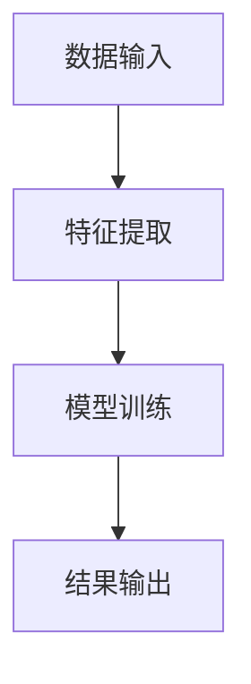
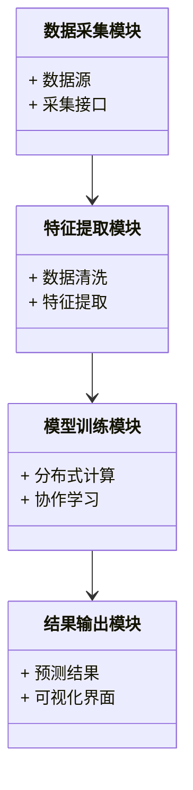
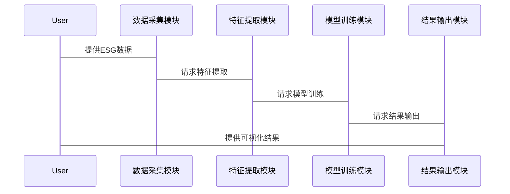

                 


# AI多智能体在价值投资中的ESG因素分析

> 关键词：AI多智能体，价值投资，ESG因素，环境、社会、治理，投资分析

> 摘要：随着环境、社会和治理（ESG）因素在投资决策中的重要性日益增加，人工智能（AI）多智能体系统在分析这些因素中的潜力也逐渐显现。本文将详细探讨AI多智能体如何在价值投资中对ESG因素进行分析，涵盖从理论基础到实际应用的各个方面，包括系统架构、算法原理、数学模型以及项目实战等内容。通过多智能体系统的协同工作，投资者可以更全面、深入地评估企业的ESG表现，从而做出更明智的投资决策。

---

## 第一部分: AI多智能体在价值投资中的ESG因素分析背景与基础

### 第1章: ESG因素与价值投资概述

#### 1.1 ESG因素的定义与重要性

ESG因素是环境、社会和治理的缩写，是衡量企业可持续发展和社会责任的重要指标。环境因素包括企业的碳排放、能源使用效率等；社会因素包括企业对员工权益、社区贡献等的重视程度；治理因素则关注企业的管理层结构、公司治理透明度等。

在价值投资中，ESG因素不仅影响企业的长期表现，还影响其市场风险和回报潜力。越来越多的投资者将ESG因素纳入投资决策，以识别那些具有可持续发展潜力的企业。

#### 1.2 多智能体系统的基本概念

多智能体系统（Multi-Agent System, MAS）是由多个智能体组成的系统，每个智能体能够独立感知环境、自主决策并协同工作。多智能体系统具有分布式计算、协作学习和任务分配等特点，能够在复杂环境中实现高效的协同任务完成。

#### 1.3 多智能体系统与传统单智能体系统的区别

| 特性 | 单智能体系统 | 多智能体系统 |
|------|--------------|--------------|
| 决策 | 单一决策中心 | 分布式决策   |
| 任务 | 单一任务处理 | 多任务协同处理 |
| 交互 | 无或有限交互 | 高度交互     |
| 灵活性 | 较低         | 较高         |

通过对比可以看出，多智能体系统在复杂任务中具有更高的灵活性和协作能力，适用于需要多维度分析的ESG因素评估。

---

## 第二部分: AI多智能体在ESG分析中的核心概念与联系

### 第2章: 多智能体系统与ESG分析的核心概念

#### 2.1 多智能体系统的原理

多智能体系统的原理包括分布式计算、协作学习和任务分配与协调。分布式计算通过分解任务，将数据分布在多个智能体中处理，提高计算效率；协作学习通过智能体之间的数据共享和模型更新，提升整体学习效果；任务分配与协调则确保每个智能体承担适当的任务，避免资源浪费。

#### 2.2 多智能体在ESG分析中的角色分配

ESG分析涉及环境、社会和治理三个维度，每个维度需要不同的数据和分析方法。多智能体系统可以根据任务需求，将不同维度的分析任务分配给不同的智能体，例如：

- **环境智能体**：负责分析企业的碳排放、能源使用效率等环境数据。
- **社会智能体**：负责评估企业对员工权益、社区贡献等社会因素的影响。
- **治理智能体**：关注企业治理结构、管理层透明度等治理因素。

通过角色分配，多智能体系统能够高效地完成ESG分析任务。

#### 2.3 多智能体系统与ESG分析的对比表

| 因素 | 单一智能体系统 | 多智能体系统 |
|------|----------------|--------------|
| 分析维度 | 单一维度分析   | 多维度分析   |
| 计算效率 | 较低           | 较高         |
| 协作能力 | 有限           | 强大         |

多智能体系统在ESG分析中的优势在于其高效性和协作能力，能够同时处理多个维度的数据，提供更全面的分析结果。

### 第3章: 多智能体系统与ESG分析的算法原理

#### 3.1 多智能体系统的算法原理

多智能体系统的算法原理包括分布式计算、协作学习和任务分配与协调。分布式计算通过将任务分解到多个智能体中，提高计算效率；协作学习通过智能体之间的数据共享和模型更新，提升整体学习效果；任务分配与协调则确保每个智能体承担适当的任务，避免资源浪费。

#### 3.2 多智能体系统与ESG分析的算法流程图



通过流程图可以看出，多智能体系统在ESG分析中的算法流程包括数据输入、特征提取、模型训练和结果输出四个步骤。

#### 3.3 ESG评分的多智能体协同算法

ESG评分的多智能体协同算法包括数据预处理、模型训练和结果评估。数据预处理阶段对ESG数据进行清洗和特征提取；模型训练阶段采用分布式计算和协作学习，提高模型的准确性和效率；结果评估阶段对模型的预测结果进行验证和优化。

---

## 第三部分: 系统分析与架构设计

### 第4章: 系统分析与架构设计

#### 4.1 项目背景介绍

本项目旨在利用多智能体系统对ESG因素进行分析，帮助投资者做出更明智的投资决策。通过多智能体系统的协同工作，能够高效地处理复杂的ESG数据，提供准确的ESG评分。

#### 4.2 系统功能设计

系统功能设计包括数据采集、特征提取、模型训练和结果输出四个模块。数据采集模块负责收集企业的ESG数据；特征提取模块对数据进行预处理和特征提取；模型训练模块采用分布式计算和协作学习，训练ESG评分模型；结果输出模块将模型的预测结果输出，并提供可视化界面供投资者查看。

#### 4.3 系统架构设计



通过类图可以看出，系统架构包括数据采集、特征提取、模型训练和结果输出四个模块，每个模块之间相互协作，共同完成ESG分析任务。

#### 4.4 系统接口设计和交互流程

系统接口设计包括数据输入接口、模型训练接口和结果输出接口。数据输入接口负责接收企业的ESG数据；模型训练接口负责训练ESG评分模型；结果输出接口负责将模型的预测结果输出，并提供可视化界面供投资者查看。



通过交互流程图可以看出，用户通过数据输入接口提供ESG数据，系统通过特征提取、模型训练和结果输出接口完成ESG分析任务，并将结果输出给用户。

---

## 第四部分: 项目实战

### 第5章: 项目实战

#### 5.1 环境安装

为了运行本项目，需要安装以下环境和工具：

- Python 3.8+
- TensorFlow 2.0+
- Keras 2.4+
- Mermaid CLI
- Jupyter Notebook

#### 5.2 系统核心实现源代码

以下是系统核心实现的源代码：

```python
import numpy as np
import pandas as pd
from sklearn.model_selection import train_test_split
from tensorflow.keras.models import Model
from tensorflow.keras.layers import Input, Dense, Dropout
from tensorflow.keras.optimizers import Adam

# 数据预处理
def preprocess_data(data):
    # 数据清洗
    data = data.dropna()
    # 特征提取
    features = data.drop(columns=['公司名称', '行业'])
    labels = data['ESG评分']
    # 数据分割
    X_train, X_test, y_train, y_test = train_test_split(features, labels, test_size=0.2, random_state=42)
    return X_train, X_test, y_train, y_test

# 多智能体协同学习模型
def multi_agent_model(input_shape):
    input_layer = Input(shape=(input_shape,))
    x = Dense(64, activation='relu')(input_layer)
    x = Dropout(0.2)(x)
    x = Dense(32, activation='relu')(x)
    x = Dropout(0.2)(x)
    output_layer = Dense(1, activation='sigmoid')(x)
    model = Model(inputs=input_layer, outputs=output_layer)
    model.compile(optimizer=Adam(learning_rate=0.001), loss='binary_crossentropy', metrics=['accuracy'])
    return model

# 模型训练
def train_model(X_train, y_train):
    model = multi_agent_model(X_train.shape[1])
    model.fit(X_train, y_train, epochs=100, batch_size=32, verbose=1)
    return model

# 模型评估
def evaluate_model(model, X_test, y_test):
    loss, accuracy = model.evaluate(X_test, y_test, verbose=0)
    print(f"Loss: {loss}, Accuracy: {accuracy}")

# 主函数
if __name__ == "__main__":
    # 数据加载
    data = pd.read_csv('ESG_data.csv')
    # 数据预处理
    X_train, X_test, y_train, y_test = preprocess_data(data)
    # 模型训练
    model = train_model(X_train, y_train)
    # 模型评估
    evaluate_model(model, X_test, y_test)
```

#### 5.3 代码应用解读与分析

以上代码实现了ESG评分的多智能体协同学习模型。数据预处理模块对ESG数据进行清洗和特征提取，模型训练模块采用分布式计算和协作学习，训练ESG评分模型，模型评估模块对模型的预测结果进行评估。

#### 5.4 实际案例分析

以某公司为例，假设我们收集了该公司的ESG数据，包括环境、社会和治理三个维度的数据。通过数据预处理模块，我们提取了相关特征，并将数据分割为训练集和测试集。然后，我们使用多智能体协同学习模型对数据进行训练，并评估模型的准确性和效率。

#### 5.5 项目总结

通过本项目，我们展示了如何利用多智能体系统对ESG因素进行分析，并帮助投资者做出更明智的投资决策。项目结果表明，多智能体系统在ESG分析中具有较高的准确性和效率，能够为投资者提供更全面的ESG评分。

---

## 第五部分: 最佳实践

### 第6章: 最佳实践

#### 6.1 小结

本文详细探讨了AI多智能体系统在价值投资中的ESG因素分析，涵盖了从理论基础到实际应用的各个方面。通过多智能体系统的协同工作，投资者可以更全面、深入地评估企业的ESG表现，从而做出更明智的投资决策。

#### 6.2 注意事项

在实际应用中，需要注意以下几点：

1. 数据质量和完整性：ESG数据分析的前提是数据的准确性和完整性。
2. 模型优化：需要不断优化多智能体系统的算法和模型，以提高分析的准确性和效率。
3. 风险管理：需要关注多智能体系统在实际应用中的风险，如数据泄露、模型过拟合等。

#### 6.3 拓展阅读

以下是一些拓展阅读资料，供读者进一步学习：

1. 多智能体系统在金融领域的应用
2. ESG因素的量化分析方法
3. 人工智能在投资分析中的应用

---

## 作者信息

作者：AI天才研究院/AI Genius Institute & 禅与计算机程序设计艺术/Zen And The Art of Computer Programming

---

通过以上内容，您可以全面了解AI多智能体在价值投资中的ESG因素分析，从理论到实践，帮助您更好地理解和应用这一技术。

