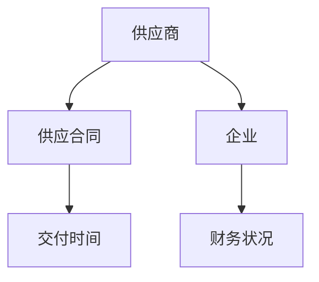
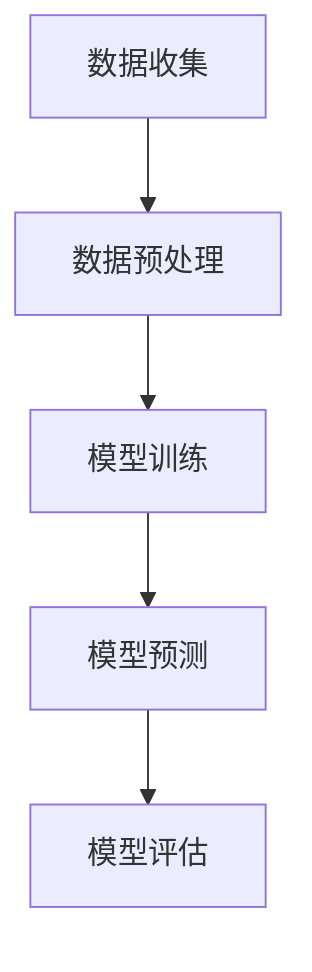
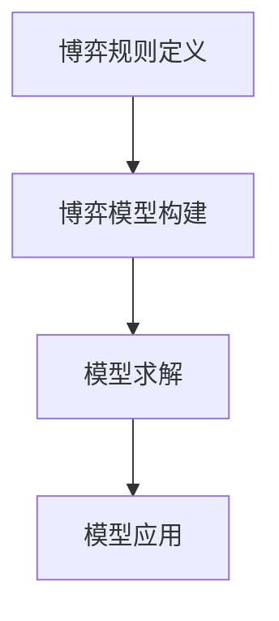
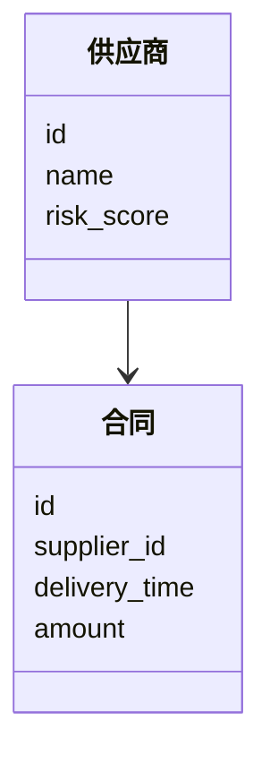
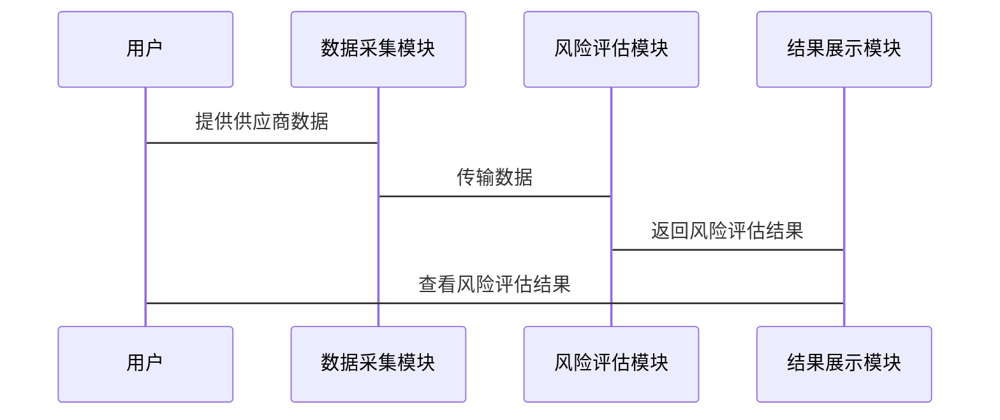
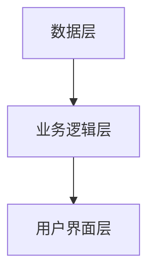
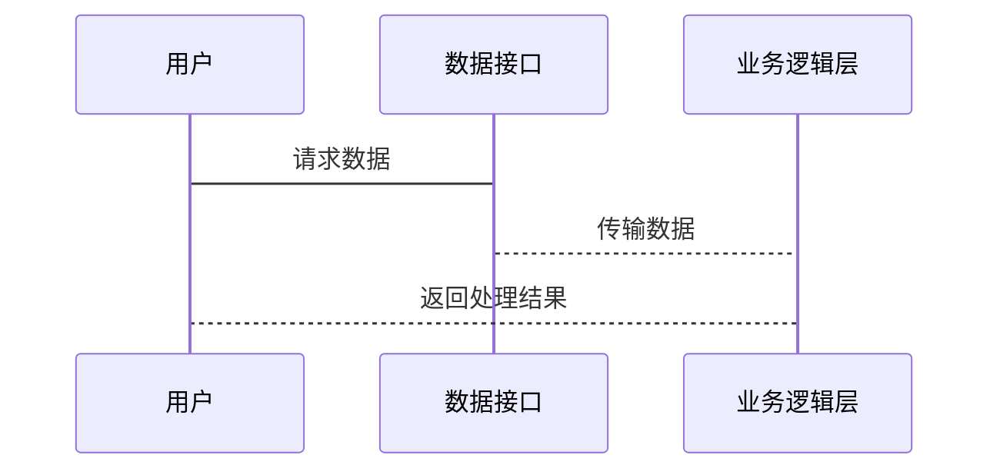
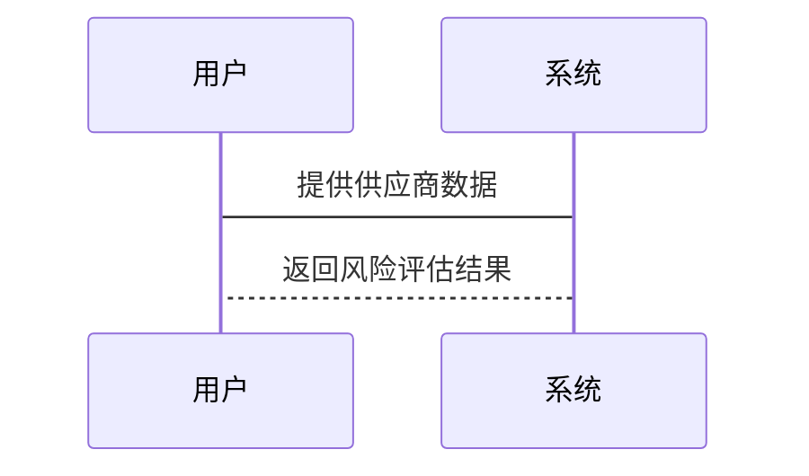

                 


# AI多智能体在价值投资中的供应商风险分析

## 关键词

- AI多智能体
- 价值投资
- 供应商风险分析
- 供应链风险管理
- 人工智能
- 金融风险管理

## 摘要

本文探讨了AI多智能体技术在价值投资中的应用，特别是如何利用多智能体系统进行供应商风险分析。通过分析多智能体协作机制、风险评估模型和博弈论模型，本文提出了优化供应商风险管理的方法，并通过实际案例展示了系统的实现与应用。

---

# 第1章: 背景介绍

## 1.1 问题背景

### 1.1.1 价值投资与供应商风险管理的重要性

价值投资是一种长期投资策略，强调通过深入分析企业的基本面来选择具有长期增长潜力的股票。在这一过程中，供应商风险管理是确保企业供应链稳定性和财务健康的关键因素。传统方法依赖于人工分析，效率低下且容易遗漏关键风险点。

### 1.1.2 AI技术在金融领域的应用现状

AI技术在金融领域的应用日益广泛，包括算法交易、风险评估和客户画像等。然而，现有的供应商风险管理方法主要依赖于静态数据分析，难以应对动态市场环境中的复杂风险。

### 1.1.3 多智能体系统在金融分析中的优势

多智能体系统通过协作和分布式计算，能够实时分析市场动态，识别潜在风险，并制定最优决策。这种分布式计算能力使得多智能体系统在金融分析中具有显著优势。

## 1.2 问题描述

### 1.2.1 供应商风险分析的核心问题

供应商风险分析需要考虑市场波动、供应链中断和企业财务状况等多个因素。传统方法难以全面捕捉这些动态因素，导致风险管理效果有限。

### 1.2.2 传统供应商风险管理的局限性

传统方法依赖于静态数据分析和人工判断，无法实时捕捉市场变化。此外，单一的分析视角难以全面评估供应商风险。

### 1.2.3 AI多智能体在供应商风险管理中的应用前景

通过AI多智能体技术，可以实时分析市场数据，识别潜在风险，并制定动态应对策略。这为供应商风险管理提供了新的可能性。

## 1.3 问题解决

### 1.3.1 AI多智能体如何优化供应商风险管理

AI多智能体系统能够实时分析市场数据，识别潜在风险，并通过协作机制制定最优决策。这种实时分析能力显著提高了风险管理的效率和准确性。

### 1.3.2 多智能体协作机制在风险评估中的作用

通过多智能体协作，系统可以在不同节点之间共享信息，识别潜在风险，并制定应对策略。这种协作机制使得风险评估更加全面和动态。

### 1.3.3 价值投资中的供应商风险分析策略

在价值投资中，供应商风险分析是评估企业长期潜力的重要因素。通过AI多智能体系统，投资者可以更全面地评估供应商风险，从而做出更明智的投资决策。

## 1.4 边界与外延

### 1.4.1 供应商风险分析的边界条件

供应商风险分析的边界包括企业的财务状况、市场波动和供应链稳定性等因素。这些因素共同构成了供应商风险管理的核心内容。

### 1.4.2 多智能体系统在供应商风险管理中的应用范围

多智能体系统适用于从风险评估到实时监控的全流程管理。通过实时数据处理和协作分析，系统能够有效应对各种市场风险。

### 1.4.3 价值投资与供应商风险管理的外延领域

除了供应商风险管理，价值投资还涉及企业基本面分析、行业趋势和市场动态等领域。通过多智能体系统，投资者可以更全面地分析这些因素，制定更科学的投资策略。

## 1.5 核心要素组成

### 1.5.1 价值投资的核心要素

价值投资的核心要素包括企业财务状况、行业地位和管理团队等因素。这些要素共同决定了企业的长期增长潜力。

### 1.5.2 供应商风险管理的关键要素

供应商风险管理的关键要素包括供应链稳定性、市场波动和企业财务状况等因素。这些要素需要通过多智能体系统进行实时监控和分析。

### 1.5.3 AI多智能体系统的核心组成

AI多智能体系统的核心组成包括智能体节点、协作机制和实时数据分析模块。这些模块共同构成了系统的分析和决策能力。

---

# 第2章: 核心概念与联系

## 2.1 AI多智能体系统的核心原理

### 2.1.1 多智能体系统的定义与特点

多智能体系统由多个智能体节点组成，每个节点具有独立决策能力，并通过协作完成复杂任务。这种分布式计算模式能够提高系统的整体性能。

### 2.1.2 AI多智能体系统的协作机制

多智能体系统的协作机制包括通信协议和任务分配策略。通过这些机制，系统可以在不同节点之间共享信息，协调行动。

### 2.1.3 多智能体系统在金融分析中的应用

在金融分析中，多智能体系统可以用于市场趋势预测和风险评估。通过实时数据处理和协作分析，系统能够提供更准确的分析结果。

## 2.2 供应商风险分析的定义与方法

### 2.2.1 供应商风险的定义

供应商风险是指企业在供应链中可能面临的各种风险，包括市场波动和供应链中断等。这些风险可能影响企业的财务状况和市场地位。

### 2.2.2 供应商风险分析的主要方法

供应商风险分析的主要方法包括定量分析和定性分析。定量分析通过数据建模评估风险，而定性分析则通过专家判断进行风险评估。

### 2.2.3 供应商风险分析的指标体系

供应商风险分析的指标体系包括供应链稳定性、市场波动和企业财务状况等因素。这些指标需要通过多智能体系统进行实时监控和分析。

## 2.3 AI多智能体与供应商风险分析的结合

### 2.3.1 多智能体系统在供应商风险分析中的作用

通过多智能体系统，可以实时分析市场数据，识别潜在风险，并制定应对策略。这种实时分析能力显著提高了风险评估的效率和准确性。

### 2.3.2 AI技术在供应商风险管理中的优势

AI技术通过机器学习和自然语言处理等技术，能够从大量数据中提取有用信息，为风险评估提供支持。这种数据处理能力显著提高了风险管理的效率和准确性。

### 2.3.3 多智能体系统与价值投资的结合

通过多智能体系统，投资者可以更全面地分析企业基本面和市场动态，制定更科学的投资策略。这种结合为价值投资提供了新的可能性。

## 2.4 核心概念对比表格

### 2.4.1 传统供应商风险管理与AI多智能体系统的对比

| 特性                | 传统方法             | AI多智能体系统         |
|---------------------|----------------------|-----------------------|
| 数据处理能力        | 依赖人工分析          | 自动化数据处理         |
| 分析效率            | 较低                 | 高                     |
| 风险识别能力        | 有限                 | 强大                   |

### 2.4.2 不同供应商风险管理方法的优缺点对比

| 方法                | 优点                 | 缺点                 |
|---------------------|----------------------|-----------------------|
| 定量分析             | 准确性高             | 依赖数据质量           |
| 定性分析             | 适应性强             | 主观性较高             |

## 2.5 ER实体关系图



---

# 第3章: 算法原理讲解

## 3.1 多智能体协作机制

### 3.1.1 多智能体协作的基本原理

多智能体协作机制通过智能体之间的通信和协作，完成复杂任务。每个智能体节点负责特定任务，并通过协作实现整体目标。

### 3.1.2 多智能体协作的通信机制

通信机制包括消息传递和数据共享。通过这些机制，智能体节点可以实时交换信息，协调行动。

### 3.1.3 多智能体协作的协调机制

协调机制包括任务分配和冲突解决策略。通过这些机制，系统可以高效地分配任务，避免冲突。

---

## 3.2 供应商风险评估模型

### 3.2.1 风险评估模型的数学模型

供应商风险评估模型可以通过线性回归或决策树等方法进行建模。例如，线性回归模型可以表示为：

$$
R = \beta_0 + \beta_1 x_1 + \beta_2 x_2 + \ldots + \beta_n x_n + \epsilon
$$

其中，R是风险评估结果，x_i是各个影响因素，β_i是回归系数，ε是误差项。

### 3.2.2 风险评估模型的实现步骤

1. 数据收集：收集供应商的相关数据，包括财务状况和市场表现。
2. 数据预处理：对数据进行清洗和标准化处理。
3. 模型训练：使用机器学习算法训练风险评估模型。
4. 模型评估：通过交叉验证等方法评估模型的性能。
5. 模型部署：将模型应用于实际场景，实时监控供应商风险。

### 3.2.3 风险评估模型的优化策略

1. 参数调优：通过网格搜索等方法优化模型参数。
2. 模型集成：使用集成学习方法提高模型的准确性和稳定性。
3. 实时更新：定期更新模型，确保其适应市场变化。

---

## 3.3 博弈论模型在风险评估中的应用

### 3.3.1 博弈论模型的基本原理

博弈论模型通过分析不同参与者的策略和行为，预测市场动态。例如，纳什均衡是一个重要的概念，表示在博弈中各参与者采取最优策略时的稳定状态。

### 3.3.2 博弈论模型在风险评估中的应用

在供应商风险管理中，博弈论模型可以用于分析供应商之间的竞争关系，预测市场变化。例如，可以通过博弈论模型预测供应商价格变动对整体市场的影响。

### 3.3.3 博弈论模型的实现步骤

1. 定义博弈规则：明确博弈的参与者、策略和收益。
2. 构建博弈模型：使用纳什均衡等概念构建模型。
3. 模型求解：通过数学方法求解模型的最优解。
4. 模型应用：将模型应用于实际场景，评估风险。

---

## 3.4 算法实现的Python代码示例

### 3.4.1 供应商风险评估模型的实现

```python
import pandas as pd
from sklearn.linear_model import LinearRegression
from sklearn.metrics import mean_squared_error

# 数据加载
data = pd.read_csv('supplier_data.csv')

# 数据预处理
X = data[['revenue', 'profit_margin', 'market_share']]
y = data['risk_score']

# 模型训练
model = LinearRegression()
model.fit(X, y)

# 模型预测
y_pred = model.predict(X)

# 模型评估
 mse = mean_squared_error(y, y_pred)
 print('均方误差:', mse)
```

### 3.4.2 博弈论模型的实现

```python
import numpy as np

# 定义博弈矩阵
 payoff_matrix = np.array([[3, 1], [1, 3]])

# 寻找纳什均衡
def find_nash_equilibrium(payoff):
    n = payoff.shape[0]
    equilibria = []
    for i in range(n):
        for j in range(n):
            if (payoff[i, j] == np.max(payoff[i, :])) and (payoff[j, i] == np.max(payoff[:, i])):
                equilibria.append((i, j))
    return equilibria

# 输出纳什均衡
print(find_nash_equilibrium(payoff_matrix))
```

---

## 3.5 算法流程图

### 3.5.1 供应商风险评估模型的流程图



### 3.5.2 博弈论模型的流程图



---

# 第4章: 系统分析与架构设计

## 4.1 系统功能设计

### 4.1.1 领域模型设计



### 4.1.2 功能模块划分

系统功能模块包括数据采集、风险评估、结果展示和决策支持等部分。

### 4.1.3 功能交互流程



## 4.2 系统架构设计

### 4.2.1 系统架构设计

系统架构包括数据层、业务逻辑层和用户界面层。数据层负责数据的存储和管理，业务逻辑层负责风险评估和决策支持，用户界面层负责与用户的交互。

### 4.2.2 系统架构图



---

## 4.3 接口设计

### 4.3.1 系统接口设计

系统接口包括数据接口和用户接口。数据接口用于与外部数据源交互，用户接口用于与用户的交互。

### 4.3.2 接口交互流程



---

## 4.4 系统交互设计

### 4.4.1 系统交互流程

系统交互流程包括用户请求、数据处理和结果反馈等步骤。

### 4.4.2 系统交互图



---

# 第5章: 项目实战

## 5.1 环境安装

### 5.1.1 开发环境要求

开发环境需要安装Python、Jupyter Notebook和相关库（如scikit-learn、pandas、mermaid等）。

### 5.1.2 安装步骤

1. 安装Python：从官网下载并安装Python 3.8或更高版本。
2. 安装Jupyter Notebook：使用pip安装`jupyter notebook`。
3. 安装相关库：使用pip安装`scikit-learn`, `pandas`, `mermaid`。

## 5.2 系统核心实现

### 5.2.1 核心代码实现

供应商风险评估模型的实现：

```python
import pandas as pd
from sklearn.linear_model import LinearRegression
from sklearn.metrics import mean_squared_error

# 数据加载
data = pd.read_csv('supplier_data.csv')

# 数据预处理
X = data[['revenue', 'profit_margin', 'market_share']]
y = data['risk_score']

# 模型训练
model = LinearRegression()
model.fit(X, y)

# 模型预测
y_pred = model.predict(X)

# 模型评估
 mse = mean_squared_error(y, y_pred)
 print('均方误差:', mse)
```

### 5.2.2 代码解读与分析

1. 数据加载：使用pandas读取CSV文件中的数据。
2. 数据预处理：选择相关特征变量，构建输入矩阵X和目标变量y。
3. 模型训练：使用线性回归模型进行训练。
4. 模型预测：利用训练好的模型进行预测。
5. 模型评估：计算均方误差，评估模型的性能。

### 5.2.3 系统实现流程

1. 数据收集：从CSV文件中加载供应商数据。
2. 数据预处理：清洗和标准化数据。
3. 模型训练：使用机器学习算法训练模型。
4. 模型预测：利用模型进行风险评估。
5. 模型评估：评估模型的性能。

## 5.3 实际案例分析

### 5.3.1 案例背景

某制造企业面临供应链中断风险，希望通过AI多智能体系统进行供应商风险管理。

### 5.3.2 数据分析

分析企业的财务数据和市场表现，识别潜在风险点。

### 5.3.3 案例分析

使用AI多智能体系统进行供应商风险评估，制定应对策略。

### 5.3.4 案例小结

通过AI多智能体系统的应用，企业成功降低了供应链风险，提高了运营效率。

---

## 5.4 项目总结

通过本项目，我们展示了AI多智能体系统在供应商风险管理中的应用。通过实际案例分析，验证了系统的有效性和实用性。未来的研究可以进一步优化算法，提高系统的实时性和准确性。

---

# 第6章: 最佳实践

## 6.1 小结

本文详细探讨了AI多智能体技术在价值投资中的应用，特别是如何利用多智能体系统进行供应商风险分析。通过分析多智能体协作机制、风险评估模型和博弈论模型，我们提出了优化供应商风险管理的方法。

## 6.2 注意事项

在实际应用中，需要注意数据质量和模型的实时更新。此外，还需要考虑系统的可扩展性和稳定性。

## 6.3 拓展阅读

推荐读者进一步阅读相关领域的最新研究，包括多智能体系统、机器学习和金融风险管理等。

---

# 作者

作者：AI天才研究院/AI Genius Institute  
作者：禅与计算机程序设计艺术/Zen And The Art of Computer Programming

