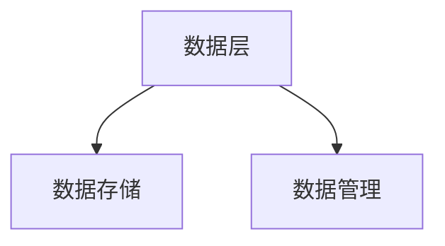
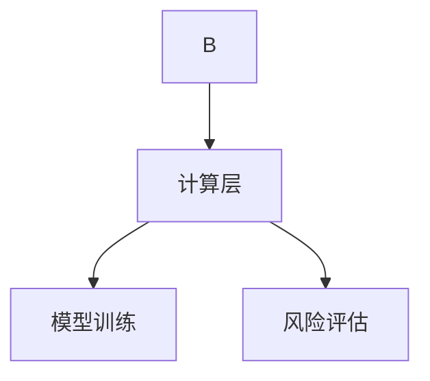
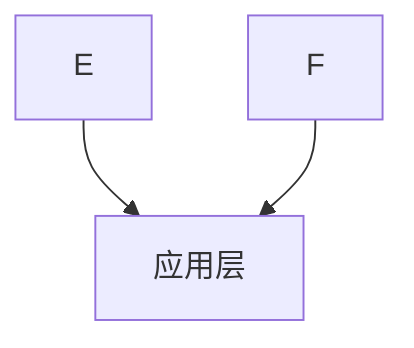

                 


# AI多智能体在价值投资中的信用风险分析

---

## 关键词：
AI多智能体，信用风险，价值投资，金融分析，风险管理

---

## 摘要：
本文探讨了如何利用AI多智能体技术在价值投资中进行信用风险分析。通过结合多智能体系统的协作优势和人工智能算法的深度学习能力，本文提出了一种创新的信用风险评估方法，能够更精准地识别和管理投资风险。文章从理论基础、算法原理、系统架构到实际应用案例进行了全面分析，展示了AI多智能体在金融领域的巨大潜力和实际价值。

---

# 第一部分：信用风险与价值投资的背景

## 第1章：信用风险的基本概念

### 1.1 信用风险的定义与特征
信用风险是指由于债务人或交易对手无法履行其义务而导致的损失。在价值投资中，信用风险的评估至关重要，因为它直接影响投资组合的稳定性和收益能力。

- **定义**：信用风险是金融领域中的核心风险之一，涉及债务人违约的可能性。
- **特征**：
  - 依赖性：与市场环境、经济周期密切相关。
  - 动态性：随时间和市场变化而变化。
  - 可测量性：通过量化模型进行评估。

### 1.2 价值投资的核心理念
价值投资是一种长期投资策略，强调以低于市场价值的价格买入优质资产。在信用风险分析中，价值投资者关注企业的基本面，通过深入分析财务报表和市场环境来评估信用风险。

- **核心理念**：
  - 寻找被市场低估的优质资产。
  - 长期持有，关注企业的持续盈利能力。
- **信用分析的关键点**：
  - 利息覆盖能力。
  - 负债结构合理性。
  - 企业盈利稳定性。

### 1.3 多智能体系统的基本概念
多智能体系统（Multi-Agent System, MAS）是由多个相互作用的智能体组成的系统，这些智能体能够通过协作完成复杂任务。

- **定义**：多智能体系统是由多个独立但协作的智能体组成的系统，每个智能体都有自己的目标和决策机制。
- **特点**：
  - 分布式：每个智能体独立运作。
  - 协作性：通过协作完成整体目标。
  - 动态性：能够适应环境变化。

## 1.4 本章小结
本章介绍了信用风险的基本概念、价值投资的核心理念以及多智能体系统的基本概念。信用风险是价值投资中不可忽视的因素，而多智能体系统为信用风险的分析提供了新的技术手段。

---

# 第二部分：多智能体系统与信用风险分析的理论基础

## 第2章：多智能体系统的原理

### 2.1 多智能体系统的组成与结构
多智能体系统由多个智能体组成，每个智能体都有自己的知识库、决策机制和行动方式。

- **组成**：
  - 智能体：具有感知、推理和行动能力。
  - 环境：智能体所处的外部环境。
  - 通信机制：智能体之间的信息交换方式。
- **结构**：
  - 分层结构：多个层次的智能体协作。
  - 网络结构：智能体通过网络进行协作。

### 2.2 多智能体系统的通信机制
通信机制是多智能体系统协作的基础，主要包括以下几种方式：

- **直接通信**：智能体之间直接交换信息。
- **间接通信**：通过中间媒介进行信息传递。
- **发布-订阅模式**：智能体发布信息，其他智能体订阅并接收。

### 2.3 多智能体系统的协作与协调
协作是多智能体系统的核心，通过协作实现整体目标。

- **协作方式**：
  - 分工协作：智能体根据自身能力分配任务。
  - 协调决策：多个智能体共同决策。
- **协调机制**：
  - 共识算法：通过共识机制达成一致。
  - 仲裁机制：解决冲突和矛盾。

## 2.4 信用风险分析的数学模型

### 2.4.1 信用评分模型
信用评分模型是信用风险分析的核心工具之一，常用的模型包括：

- **逻辑回归模型**：通过逻辑回归分析客户违约概率。
- **决策树模型**：通过树状结构进行分类。
- **随机森林模型**：基于决策树的集成方法。

### 2.4.2 信用风险的度量方法
信用风险的度量方法包括：

- **VaR（Value at Risk）**：在一定置信水平下，可能的损失金额。
- **CVaR（Conditional Value at Risk）**：VaR的条件期望损失。
- **信用等级法**：通过信用评级来度量风险。

### 2.4.3 动态信用风险模型
动态信用风险模型能够实时更新信用评分，适应市场变化。

- **时间序列分析**：利用历史数据预测未来风险。
- **马尔可夫链模型**：状态转移模型，用于描述信用等级的变化。

## 2.5 多智能体系统与信用风险分析的结合

### 2.5.1 多智能体系统在信用风险分析中的作用
多智能体系统能够通过协作分析多个影响信用风险的因素，提供更全面的评估结果。

- **信息收集**：多个智能体分别收集不同来源的数据。
- **信息处理**：通过协作处理复杂的数据。
- **决策支持**：基于协作结果提供决策支持。

### 2.5.2 多智能体系统的信用风险分析模型
多智能体系统的信用风险分析模型包括以下几个步骤：

1. **数据采集**：智能体从不同渠道采集数据。
2. **数据处理**：对数据进行清洗和预处理。
3. **模型训练**：利用机器学习算法训练模型。
4. **风险评估**：基于模型结果进行信用风险评估。

### 2.5.3 多智能体系统与传统信用风险分析的对比
| 对比维度 | 多智能体系统 | 传统信用风险分析 |
|----------|--------------|------------------|
| 数据来源 | 多源、多维    | 单一来源         |
| 处理能力 | 强大          | 较弱             |
| 决策效率 | 高            | 中等             |

---

## 第3章：多智能体系统的算法原理

### 3.1 多智能体协作算法
多智能体协作算法是实现协作的关键，常用的算法包括：

- **分布式协作算法**：每个智能体独立决策，通过通信进行协作。
- **集中式协作算法**：通过中心节点进行协调。

### 3.2 信用评分模型的实现

#### 3.2.1 算法原理
信用评分模型的实现步骤如下：

1. **数据预处理**：清洗数据，处理缺失值。
2. **特征选择**：选择重要的特征。
3. **模型训练**：训练逻辑回归模型。
4. **模型评估**：评估模型性能。

#### 3.2.2 Python代码示例
```python
import pandas as pd
from sklearn.linear_model import LogisticRegression
from sklearn.metrics import accuracy_score

# 数据加载
data = pd.read_csv('credit_data.csv')

# 特征选择
features = data[['income', 'debt', 'history']]
target = data['default']

# 模型训练
model = LogisticRegression()
model.fit(features, target)

# 模型预测
predictions = model.predict(features)
print('准确率:', accuracy_score(target, predictions))
```

---

## 第4章：多智能体系统的信用风险分析系统架构

### 4.1 系统功能设计
系统功能包括：

1. **数据采集模块**：采集信用数据。
2. **模型训练模块**：训练信用评分模型。
3. **风险评估模块**：评估信用风险。
4. **决策支持模块**：提供决策支持。

### 4.2 系统架构设计
系统架构采用分层设计，包括数据层、计算层和应用层。

#### 4.2.1 数据层
数据层负责数据的存储和管理。



#### 4.2.2 计算层
计算层负责模型的训练和计算。



#### 4.2.3 应用层
应用层负责与用户交互和提供决策支持。



---

## 第5章：项目实战与案例分析

### 5.1 项目实战

#### 5.1.1 环境安装
安装所需的Python库：

```bash
pip install pandas scikit-learn
```

#### 5.1.2 核心代码实现
实现信用评分模型：

```python
import pandas as pd
from sklearn.linear_model import LogisticRegression
from sklearn.metrics import accuracy_score

# 数据加载
data = pd.read_csv('credit_data.csv')

# 特征选择
features = data[['income', 'debt', 'history']]
target = data['default']

# 模型训练
model = LogisticRegression()
model.fit(features, target)

# 模型预测
predictions = model.predict(features)
print('准确率:', accuracy_score(target, predictions))
```

### 5.2 案例分析
通过具体案例分析，展示多智能体系统在信用风险分析中的应用。

#### 5.2.1 案例背景
某公司面临信用风险评估问题，希望通过多智能体系统进行分析。

#### 5.2.2 实施步骤
1. 数据采集：从多个数据源采集信用数据。
2. 数据处理：清洗和预处理数据。
3. 模型训练：训练逻辑回归模型。
4. 风险评估：评估信用风险等级。

---

## 第6章：总结与展望

### 6.1 本章总结
本文详细介绍了AI多智能体在价值投资中的信用风险分析，从理论基础到实际应用进行了全面探讨。

### 6.2 未来展望
未来，随着AI技术的不断发展，多智能体系统在信用风险分析中的应用将更加广泛和深入。

---

## 作者：AI天才研究院/AI Genius Institute & 禅与计算机程序设计艺术 /Zen And The Art of Computer Programming

---

通过本文的分析，读者可以全面了解AI多智能体在信用风险分析中的应用，并能够将其应用于实际的金融投资中。

