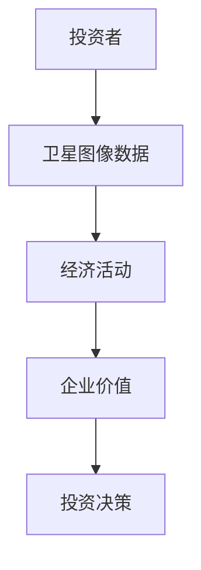

                 


# AI多智能体在价值投资中的卫星图像分析应用

> 关键词：AI多智能体、卫星图像分析、价值投资、图像处理算法、金融数据分析

> 摘要：本文探讨AI多智能体在价值投资中的应用，重点分析卫星图像如何通过多智能体系统进行数据处理和预测，以提升投资决策的准确性和效率。文章从背景、核心概念、算法原理、系统架构到项目实战，全面解析AI多智能体在卫星图像分析中的应用，为金融投资领域提供新的思路。

---

## 第一部分: AI多智能体在价值投资中的卫星图像分析应用背景

### 第1章: AI多智能体与卫星图像分析的背景介绍

#### 1.1 问题背景与问题描述
- **1.1.1 价值投资与传统金融分析的局限性**
  - 传统金融分析依赖市场数据和财务报表，难以捕捉经济活动的全貌。
  - 卫星图像提供了地理和经济活动的实时数据，为价值投资提供了新的视角。
  
- **1.1.2 卫星图像在金融分析中的潜在价值**
  - 卫星图像可以反映经济活动的变化，如工业区的扩张、港口的货物积压等。
  - 通过卫星图像分析，投资者可以更全面地评估经济状况和企业价值。

- **1.1.3 多智能体系统的优势与应用场景**
  - 多智能体系统能够协同工作，处理复杂的数据和任务。
  - 在卫星图像分析中，多智能体可以分别负责图像识别、数据处理和预测建模。

#### 1.2 问题解决与边界外延
- **1.2.1 AI多智能体如何解决卫星图像分析的挑战**
  - 多智能体系统能够高效地处理大规模图像数据。
  - 通过协作，多智能体可以提高分析的准确性和效率。

- **1.2.2 问题的边界与外延分析**
  - 卫星图像分析的边界包括图像质量、数据获取频率和分析范围。
  - 外延包括将卫星图像分析与其他数据源（如市场数据）结合，提升分析的全面性。

- **1.2.3 核心概念与关键要素的组成**
  - 核心概念：多智能体协同、卫星图像处理、价值投资模型。
  - 关键要素：图像数据、多智能体算法、投资策略。

#### 1.3 核心概念与联系
- **1.3.1 AI多智能体的核心原理**
  - 多智能体系统由多个分布式智能体组成，能够协同完成复杂任务。
  - 每个智能体负责特定任务，通过通信和协作完成整体目标。

- **1.3.2 卫星图像分析的关键技术**
  - 图像处理技术：如图像分割、目标检测。
  - 机器学习模型：如CNN、RNN用于图像识别和时间序列分析。

- **1.3.3 价值投资中的卫星图像应用模式**
  - 模式一：利用卫星图像预测企业业绩。
  - 模式二：通过卫星图像分析区域经济活动，辅助投资决策。

#### 1.4 本章小结
- 本章介绍了AI多智能体和卫星图像分析的背景，阐述了它们在价值投资中的潜在价值和应用场景。

---

## 第二部分: AI多智能体与卫星图像分析的核心概念

### 第2章: AI多智能体系统的核心原理

#### 2.1 多智能体系统的定义与特点
- **2.1.1 多智能体系统的定义**
  - 多智能体系统是由多个智能体组成的分布式系统，每个智能体具有自主性和协作性。
  - 智能体通过通信和协作完成复杂任务。

- **2.1.2 多智能体系统的特性**
  - 分布式：多个智能体独立运行。
  - 协作性：智能体之间通过协作完成共同目标。
  - 自主性：智能体能够自主决策和行动。

- **2.1.3 多智能体系统与传统AI的区别**
  - 传统AI：单点智能，集中处理数据。
  - 多智能体系统：分布式智能，多个智能体协同工作。

#### 2.2 卫星图像分析的核心技术
- **2.2.1 卫星图像处理的基本流程**
  1. 数据获取：从卫星获取图像数据。
  2. 数据预处理：去噪、增强。
  3. 图像识别：目标检测、分类。
  4. 数据分析：时间序列分析、空间分析。

- **2.2.2 常见的卫星图像处理算法**
  - 图像分割：如U-Net。
  - 目标检测：如YOLO、Faster R-CNN。
  - 时间序列分析：如LSTM、ARIMA。

- **2.2.3 卫星图像分析的挑战与解决方案**
  - 挑战：图像分辨率低、数据量大、处理复杂。
  - 解决方案：使用深度学习模型和分布式计算。

#### 2.3 价值投资中的卫星图像应用模式
- **2.3.1 卫星图像在经济活动中的间接反映**
  - 通过卫星图像分析工业区的生产情况，预测企业业绩。
  - 通过港口货物积压分析国际贸易情况。

- **2.3.2 多智能体如何协同分析卫星图像**
  - 多智能体分别负责图像处理、数据分析和预测建模。
  - 通过协作，提高分析的准确性和效率。

- **2.3.3 价值投资中的多智能体协作机制**
  - 每个智能体负责特定任务，如图像识别、数据分析。
  - 智能体之间通过通信和协作完成整体任务。

#### 2.4 核心概念对比表
| **核心概念** | **多智能体系统** | **卫星图像分析** | **价值投资应用** |
|--------------|-----------------|------------------|-------------------|
| 定义         | 分布式智能体系统 | 图像数据处理技术 | 利用图像数据辅助投资决策 |
| 特性         | 分布式、协作性 | 高分辨率、时间序列 | 提高投资准确性 |
| 应用场景     | 金融分析、经济预测 | 经济活动监测 | 企业价值评估 |

#### 2.5 ER实体关系图


#### 2.6 本章小结
- 本章详细介绍了AI多智能体系统的核心原理和卫星图像分析的关键技术，阐述了它们在价值投资中的应用模式。

---

## 第三部分: AI多智能体与卫星图像分析的算法原理

### 第3章: AI多智能体协作算法

#### 3.1 多智能体协作算法概述
- **3.1.1 多智能体协作的基本原理**
  - 多智能体通过通信和协作完成共同目标。
  - 每个智能体负责特定任务，通过协作实现整体目标。

- **3.1.2 常见的多智能体协作算法**
  - 分散式协作：智能体独立决策，通过通信协作。
  - 集中式协作：智能体通过中央控制器协调。

- **3.1.3 多智能体协作的优势与挑战**
  - 优势：提高处理效率、增强鲁棒性。
  - 挑战：通信开销大、协作复杂性高。

#### 3.2 卫星图像分析算法

---

### 3.3 多智能体协同算法实现
- **3.3.1 分散式协作算法**
  ```python
  class Agent:
      def __init__(self, id):
          self.id = id
          self.data = None

      def receive(self, message):
          # 接收消息并处理
          pass

      def send(self, message):
          # 发送消息
          pass

      def process(self, data):
          # 处理数据
          pass
  ```

- **3.3.2 分散式协作流程**
  ```mermaid
  graph TD
      A[Agent1] --> B[发送数据]
      B --> C[接收数据]
      C --> D[处理数据]
      D --> E[发送结果]
      E --> F[接收结果]
  ```

#### 3.4 卫星图像处理算法实现
- **3.4.1 图像分割算法**
  ```python
  import tensorflow as tf
  model = tf.keras.models.load_model('unet_model.h5')
  def segment_image(image):
      prediction = model.predict(image)
      return prediction
  ```

- **3.4.2 目标检测算法**
  ```python
  def detect_object(image):
      yolo_model = load_model('yolo.h5')
      boxes = yolo_model.predict(image)
      return boxes
  ```

#### 3.5 数学模型与公式
- **3.5.1 多智能体协作的目标函数**
  $$ \text{目标函数} = \sum_{i=1}^{n} f_i(x_i) $$
  其中，\(x_i\) 是第i个智能体的决策变量，\(f_i\) 是其目标函数。

- **3.5.2 卫星图像分析的约束条件**
  $$ \text{约束条件} = \{ g_j(x) \leq 0 | j = 1, 2, ..., m \} $$
  其中，\(g_j\) 是第j个约束条件。

#### 3.6 本章小结
- 本章详细介绍了多智能体协作算法和卫星图像处理算法的实现，给出了具体的Python代码和数学模型。

---

## 第四部分: AI多智能体与卫星图像分析的系统分析

### 第4章: 系统分析与架构设计

#### 4.1 问题场景介绍
- **4.1.1 系统目标**
  - 利用AI多智能体和卫星图像分析技术，提升价值投资的效率和准确性。

- **4.1.2 项目介绍**
  - 开发一个基于AI多智能体的卫星图像分析系统，用于辅助价值投资决策。

#### 4.2 系统功能设计
- **4.2.1 领域模型类图**
  ```mermaid
  classDiagram
      class Investor {
          id: int
          name: str
          investment: float
      }
      class SatelliteImage {
          id: int
          date: str
          data: bytes
      }
      class EconomicActivity {
          id: int
          type: str
          value: float
      }
      Investor --> SatelliteImage
      SatelliteImage --> EconomicActivity
  ```

- **4.2.2 系统架构设计**
  ```mermaid
  architecture
      Client
      Server
      Database
      [通信协议]
  ```

- **4.2.3 系统接口设计**
  - 接口1：投资者查询卫星图像数据。
  - 接口2：系统处理卫星图像数据并返回分析结果。

- **4.2.4 系统交互序列图**
  ```mermaid
  sequenceDiagram
      Investor ->> Server: 查询卫星图像数据
      Server ->> Database: 获取数据
      Database --> Server: 返回数据
      Server ->> Investor: 发送数据
      Investor ->> Server: 提交分析任务
      Server ->> Agent1: 分配任务
      Agent1 --> Server: 返回结果
      Server --> Investor: 发送分析结果
  ```

#### 4.3 本章小结
- 本章通过系统分析和架构设计，详细介绍了AI多智能体卫星图像分析系统的结构和功能。

---

## 第五部分: AI多智能体与卫星图像分析的项目实战

### 第5章: 项目实战与案例分析

#### 5.1 环境安装与配置
- **5.1.1 安装Python和相关库**
  - 安装Python 3.8及以上版本。
  - 安装TensorFlow、Keras、OpenCV、Pillow等库。

- **5.1.2 安装卫星图像数据源**
  - 使用公开卫星图像数据集，如Google Earth Engine。

#### 5.2 系统核心实现
- **5.2.1 多智能体协作实现**
  ```python
  class Agent:
      def __init__(self, id):
          self.id = id
          self.data = None

      def receive(self, message):
          self.data = message

      def send(self, message):
          return message

      def process(self):
          return self.data
  ```

- **5.2.2 卫星图像处理实现**
  ```python
  def process_image(image):
      # 图像预处理
      image = image.resize((256, 256))
      image = image.convert('RGB')
      return image
  ```

#### 5.3 代码应用解读与分析
- **5.3.1 代码功能解读**
  - `Agent`类：实现多智能体协作。
  - `process_image`函数：实现图像预处理。

- **5.3.2 代码运行步骤**
  1. 初始化多个智能体。
  2. 智能体接收数据并处理。
  3. 返回处理结果。

#### 5.4 实际案例分析
- **5.4.1 案例背景**
  - 分析某工业区的卫星图像，预测企业业绩。

- **5.4.2 数据获取与处理**
  - 获取工业区的卫星图像数据。
  - 进行图像分割和目标检测。

- **5.4.3 分析结果与投资决策**
  - 根据分析结果，调整投资策略。

#### 5.5 本章小结
- 本章通过项目实战，详细介绍了AI多智能体卫星图像分析系统的实现过程。

---

## 第六部分: AI多智能体与卫星图像分析的最佳实践

### 第6章: 最佳实践与经验分享

#### 6.1 最佳实践 tips
- **数据获取与处理**
  - 使用高质量的卫星图像数据。
  - 定期更新数据以保持分析的准确性。

- **算法优化**
  - 使用分布式计算优化多智能体协作。
  - 定期更新模型以适应数据变化。

- **系统维护**
  - 定期检查系统性能。
  - 及时修复系统漏洞。

#### 6.2 小结
- 本文详细介绍了AI多智能体在价值投资中的卫星图像分析应用，从背景、核心概念、算法原理到系统架构和项目实战，为读者提供了全面的指导。

#### 6.3 注意事项
- 数据隐私和安全问题。
- 系统的稳定性和可靠性。
- 多智能体协作的效率和效果。

#### 6.4 拓展阅读
- 推荐阅读相关领域的书籍和论文。
- 关注最新的技术动态和研究成果。

---

## 作者：AI天才研究院/AI Genius Institute & 禅与计算机程序设计艺术 /Zen And The Art of Computer Programming

---

以上是《AI多智能体在价值投资中的卫星图像分析应用》的技术博客文章的详细大纲和内容。

