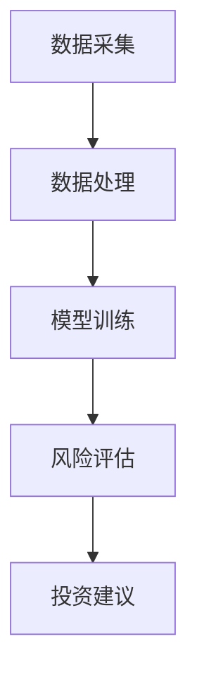

                 


# AI多智能体在价值投资中的监管风险分析

> 关键词：AI多智能体，价值投资，监管风险，金融系统，人工智能，投资策略

> 摘要：本文探讨了AI多智能体在价值投资中的应用及其面临的监管风险。通过分析AI多智能体的协作机制、算法原理以及在金融系统中的实际应用，揭示了监管风险的潜在来源和应对策略。结合实际案例，提出了优化投资策略的建议，为金融领域的技术应用提供了新的视角。

---

## 第一章：AI多智能体与价值投资的背景介绍

### 1.1 AI多智能体的基本概念
#### 1.1.1 多智能体系统的定义
多智能体系统（Multi-Agent System，MAS）由多个智能体组成，每个智能体具备独立决策能力，通过协作完成复杂任务。与传统单智能体系统相比，MAS在分布式计算和协同工作中更具优势。

#### 1.1.2 AI多智能体的核心特点
- **自主性**：智能体能够独立决策。
- **反应性**：实时感知环境并做出反应。
- **协作性**：通过通信协作完成复杂任务。
- **学习能力**：通过强化学习优化决策策略。

#### 1.1.3 多智能体与传统AI的区别
| 特性       | 多智能体系统 | 传统AI系统 |
|------------|--------------|------------|
| 决策方式   | 分布式决策   | 集中式决策 |
| 信息处理   | 实时交互     | 批处理     |
| 应用场景   | 分布式任务   | 单点任务   |

### 1.2 价值投资的基本概念
#### 1.2.1 价值投资的定义
价值投资是通过分析企业内在价值，寻找市场价格低于内在价值的投资标的。其核心在于识别市场低估的机会。

#### 1.2.2 价值投资的核心原则
- **安全边际**：买入价格低于内在价值。
- **长期视角**：关注企业的长期盈利能力。
- **逆向思维**：在市场恐慌时寻找机会。

#### 1.2.3 价值投资与AI的结合
AI技术的应用提升了价值投资的效率和准确性，通过大数据分析和机器学习模型，帮助投资者发现潜在机会。

### 1.3 AI多智能体在价值投资中的应用背景
#### 1.3.1 价值投资中的数据驱动决策
AI多智能体能够实时分析海量数据，包括财务报表、市场情绪、行业趋势等，为投资决策提供支持。

#### 1.3.2 AI多智能体在投资决策中的优势
- **高效性**：快速处理和分析数据。
- **协作性**：多个智能体协同分析不同维度的信息。
- **适应性**：动态调整投资策略以应对市场变化。

#### 1.3.3 当前研究的现状与挑战
- **现状**：AI多智能体在金融领域的应用逐渐增多。
- **挑战**：监管风险、模型的可解释性、数据质量问题。

---

## 第二章：AI多智能体与价值投资的核心概念

### 2.1 AI多智能体的原理
#### 2.1.1 多智能体系统的组成
多智能体系统由多个智能体组成，每个智能体负责特定任务，通过通信协作完成整体目标。

#### 2.1.2 AI多智能体的协作机制
- **通信协议**：定义智能体之间的信息传递方式。
- **任务分配**：根据智能体的能力分配任务。
- **协调机制**：确保任务执行的协同性。

#### 2.1.3 基于强化学习的多智能体算法
强化学习通过奖励机制训练智能体，使其在复杂环境中做出最优决策。多智能体强化学习需要考虑智能体之间的协作与竞争。

### 2.2 价值投资的核心要素
#### 2.2.1 价值评估的模型与方法
- **DCF模型**：通过现金流折现评估企业价值。
- **相对估值法**：比较同类企业进行估值。

#### 2.2.2 投资决策的关键因素
- **财务指标**：如ROE、PE等。
- **市场趋势**：行业周期、宏观经济指标。
- **竞争优势**：企业的护城河。

#### 2.2.3 价值投资中的风险分析
- **市场风险**：市场波动对企业价值的影响。
- **流动性风险**：资产变现能力。
- **信用风险**：企业违约风险。

### 2.3 AI多智能体与价值投资的联系
#### 2.3.1 多智能体在投资决策中的角色
智能体可以分别负责分析财务数据、市场趋势、竞争对手等不同维度的信息。

#### 2.3.2 AI多智能体如何优化投资策略
通过多智能体协作，综合考虑多种因素，制定更科学的投资决策。

#### 2.3.3 多智能体系统在风险控制中的应用
实时监控市场变化，及时调整投资组合以降低风险。

---

## 第三章：基于强化学习的多智能体算法

### 3.1 强化学习的基本原理
#### 3.1.1 强化学习的定义与特点
强化学习通过智能体与环境的交互，学习最优策略。其特点是基于试错学习，通过奖励机制优化决策。

#### 3.1.2 奖励机制的设计
奖励机制是强化学习的核心，合理的奖励设计能够引导智能体做出正确的决策。

#### 3.1.3 状态、动作、奖励的关系
- **状态（State）**：智能体所处的环境信息。
- **动作（Action）**：智能体的决策行为。
- **奖励（Reward）**：智能体行为的结果反馈。

### 3.2 多智能体强化学习的算法
#### 3.2.1 基于Q-learning的多智能体算法
Q-learning是一种经典的强化学习算法，适用于单智能体场景。在多智能体场景中，需要考虑多个智能体的协作。

#### 3.2.2 基于DQN的多智能体算法
DQN（Deep Q-Network）通过深度神经网络近似Q值函数，适用于复杂环境。

#### 3.2.3 基于Actor-Critic的多智能体算法
Actor-Critic算法同时学习策略（Actor）和价值函数（Critic），适用于多智能体协作场景。

### 3.3 多智能体协作的挑战与解决方案
#### 3.3.1 协作中的通信与协调问题
智能体之间的通信需要设计高效的协议，确保信息的有效传递。

#### 3.3.2 基于博弈论的协作机制
通过博弈论分析智能体之间的协作与竞争关系，设计合理的奖励机制。

#### 3.3.3 基于分布式计算的协作方案
利用分布式计算技术，提高多智能体系统的计算效率和扩展性。

---

## 第四章：AI多智能体在价值投资中的数学模型

### 4.1 价值投资的数学模型
#### 4.1.1 基于CAPM的资产定价模型
CAPM（资本资产定价模型）用于估计资产的预期收益。

#### 4.1.2 基于Fama三因子模型的扩展
Fama三因子模型将市场风险分解为多个因子，用于解释资产收益的波动。

#### 4.1.3 基于机器学习的价值预测模型
通过机器学习算法，如LSTM，预测股票价格的变化趋势。

### 4.2 AI多智能体的数学模型
#### 4.2.1 基于强化学习的价值函数
$$ V(s) = \max_a Q(s,a) $$

#### 4.2.2 基于Actor-Critic的策略优化
$$ \theta_{actor} \leftarrow \theta_{actor} + \alpha \nabla_\theta J(\theta) $$
$$ \theta_{critic} \leftarrow \theta_{critic} + \beta \nabla_\theta (Q(s,a) - V(s)) $$

---

## 第五章：系统分析与架构设计

### 5.1 问题场景介绍
#### 5.1.1 项目背景
开发一个基于AI多智能体的监管风险评估系统，用于辅助投资者做出更科学的投资决策。

#### 5.1.2 项目目标
通过多智能体协作，实时监控市场变化，评估监管风险，优化投资策略。

### 5.2 系统功能设计
#### 5.2.1 数据采集模块
采集市场数据、监管政策、公司财报等信息。

#### 5.2.2 模型训练模块
训练AI多智能体，优化其决策策略。

#### 5.2.3 风险评估模块
评估投资组合的监管风险，提供优化建议。

### 5.3 系统架构设计


### 5.4 系统接口设计
- **输入接口**：接收市场数据和监管政策。
- **输出接口**：提供风险评估结果和投资建议。

---

## 第六章：项目实战

### 6.1 环境安装
#### 6.1.1 安装Python
```bash
pip install python3
```

#### 6.1.2 安装深度学习框架
```bash
pip install tensorflow keras
```

### 6.2 系统核心实现
#### 6.2.1 多智能体协作代码
```python
import numpy as np
from tensorflow.keras import models, layers

class Agent:
    def __init__(self, state_space, action_space):
        self.model = self.build_model(state_space, action_space)
    
    def build_model(self, state_space, action_space):
        model = models.Sequential()
        model.add(layers.Dense(64, activation='relu', input_dim=state_space))
        model.add(layers.Dense(action_space, activation='linear'))
        model.compile(optimizer='adam', loss='mse')
        return model

    def act(self, state):
        return self.model.predict(state)[0]
```

#### 6.2.2 基于强化学习的训练代码
```python
import numpy as np

def train_agents(agents, environment, episodes=100):
    for episode in range(episodes):
        state = environment.reset()
        done = False
        while not done:
            actions = [agent.act(state) for agent in agents]
            next_state, rewards, done = environment.step(actions)
            for i in range(len(agents)):
                agents[i].model.fit(state, rewards[i], epochs=1, verbose=0)
            state = next_state
```

### 6.3 实际案例分析
通过具体案例，展示如何利用AI多智能体优化投资组合，降低监管风险。

---

## 第七章：最佳实践与小结

### 7.1 最佳实践
- **数据质量**：确保输入数据的准确性和完整性。
- **模型可解释性**：选择可解释的模型，便于监管审查。
- **持续优化**：定期更新模型，适应市场变化。

### 7.2 小结
本文详细探讨了AI多智能体在价值投资中的应用及其监管风险。通过理论分析和实际案例，展示了如何利用AI技术优化投资策略，降低监管风险。

---

## 作者：AI天才研究院 & 禅与计算机程序设计艺术

通过这篇文章，我详细阐述了AI多智能体在价值投资中的监管风险分析，结合理论、算法和实际案例，为读者提供了全面的视角。希望对从事金融技术研究的读者有所启发。

