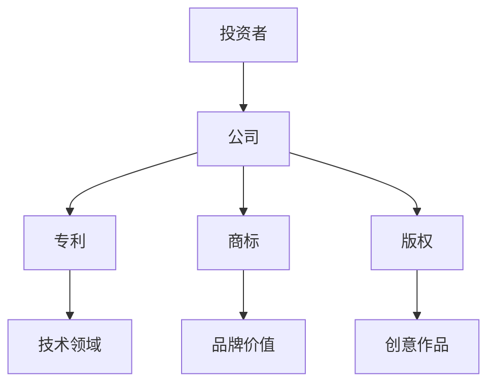
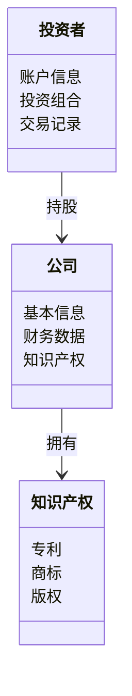
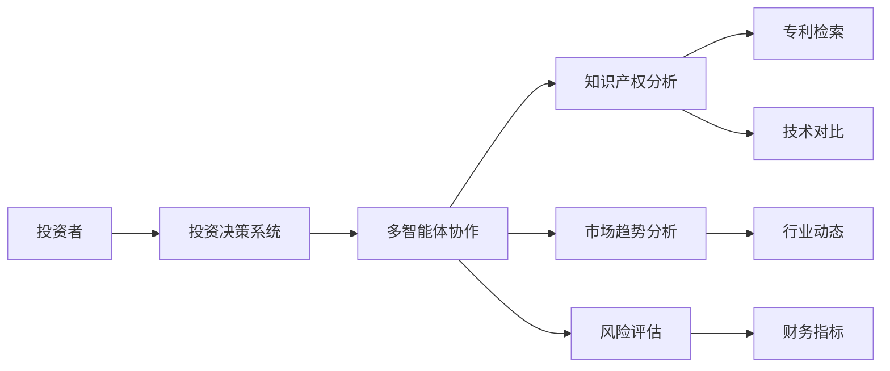

                 


# AI多智能体在价值投资中的知识产权分析

## 关键词：AI多智能体，价值投资，知识产权分析，投资决策，技术应用

## 摘要：  
本文探讨AI多智能体技术在价值投资中的应用，特别是如何通过知识产权分析辅助投资决策。文章首先介绍背景，阐述价值投资与知识产权分析的结合，分析AI多智能体的优势和应用场景。接着，详细讲解核心概念与原理，包括多智能体系统与知识产权分析的基本原理及其协同效应。然后，从算法原理与数学模型的角度，分析多智能体协作算法与知识产权分析算法的具体实现，包括数据预处理、特征提取、分类预测等步骤。随后，通过系统分析与架构设计，展示系统的功能模块、系统架构图、接口设计和交互流程。最后，通过项目实战部分，提供一个具体的案例，展示如何从环境配置、数据收集、模型训练到系统实现一步步完成项目。本文旨在为读者提供一个全面、系统的技术分析框架，帮助他们在价值投资中更好地应用AI多智能体和知识产权分析技术。

---

## 第一章: 背景介绍与问题背景

### 1.1 价值投资与知识产权分析的结合  
#### 1.1.1 价值投资的核心概念  
价值投资是一种投资策略，强调以低于公平市场价值的价格购买股票，重点关注公司的基本面，如盈利能力、财务状况和行业地位。价值投资的核心在于发现市场低估的公司，通过长期持有实现超额收益。  

#### 1.1.2 知识产权在投资中的重要性  
知识产权（Intellectual Property, IP）是企业核心竞争力的重要组成部分，包括专利、商标、版权等。在投资分析中，知识产权可以反映企业的技术创新能力、市场竞争力和未来的盈利能力。通过分析知识产权的数量、质量和分布，投资者可以更准确地评估企业的潜在价值。  

#### 1.1.3 AI技术在投资分析中的应用潜力  
人工智能（AI）技术在投资分析中的应用日益广泛，特别是在数据处理、模式识别和决策支持方面。AI可以通过分析大量的非结构化数据（如新闻、社交媒体、专利文件等）来辅助投资决策。多智能体系统（Multi-Agent System, MAS）作为一种分布式AI系统，能够通过多个智能体的协作完成复杂任务，进一步提升投资分析的准确性和效率。  

### 1.2 问题背景与问题描述  
#### 1.2.1 当前投资环境的复杂性  
当前投资环境日益复杂，市场信息量巨大，且受到宏观经济、行业动态、政策法规等多重因素的影响。传统的投资分析方法往往依赖于经验和主观判断，难以应对复杂多变的市场环境。  

#### 1.2.2 知识产权分析的必要性  
在技术创新驱动的经济中，知识产权分析已成为评估企业价值的重要手段。然而，知识产权数据通常分散、复杂，且涉及大量非结构化信息，传统方法难以高效处理。  

#### 1.2.3 AI多智能体技术的应用前景  
AI多智能体系统可以通过分布式计算和协作学习，高效处理大规模数据，提取有价值的信息。在价值投资中，多智能体系统可以分别负责不同的分析任务（如市场趋势分析、公司财务分析、知识产权评估等），并通过协作提高整体分析的准确性和效率。  

### 1.3 问题解决与边界分析  
#### 1.3.1 多智能体协作的优势  
多智能体系统通过分布式计算和协作学习，可以实现任务分解、信息共享和结果优化。与传统单智能体系统相比，多智能体系统具有更高的并行性和灵活性，能够更好地应对复杂任务。  

#### 1.3.2 知识产权分析的边界与外延  
知识产权分析的边界包括数据来源、分析范围和应用场景。外延则涉及知识产权的创造、保护、运用和管理等多个方面。  

#### 1.3.3 问题解决的可行性分析  
通过AI多智能体技术，可以实现知识产权数据的高效处理和分析，为价值投资提供更准确的决策支持。然而，实际应用中仍需解决数据隐私、模型优化和系统集成等挑战。  

### 1.4 核心概念与结构  
#### 1.4.1 核心概念的定义  
本文的核心概念包括：多智能体系统、知识产权分析、价值投资。  

#### 1.4.2 核心概念的属性特征对比  
| 概念       | 属性特征                           |  
|------------|------------------------------------|  
| 多智能体系统 | 分布式计算、协作学习、任务分解    |  
| 知识产权分析| 数据驱动、非结构化处理、多维度评估 |  
| 价值投资    | 长期持有、基本面分析、低估识别     |  

#### 1.4.3 ER实体关系图架构  


---

## 第二章: 核心概念与原理

### 2.1 AI多智能体系统  
#### 2.1.1 多智能体系统的定义与特点  
多智能体系统是由多个智能体组成的分布式系统，智能体之间通过通信和协作完成复杂任务。其特点包括：分布式性、协作性、自治性、反应性。  

#### 2.1.2 多智能体系统的协作机制  
多智能体系统的协作机制包括任务分配、信息共享、决策协调和结果优化。  

#### 2.1.3 多智能体系统的应用场景  
多智能体系统在投资分析中的应用场景包括：市场趋势预测、公司估值、风险评估和交易策略优化。  

### 2.2 知识产权分析  
#### 2.2.1 知识产权的基本概念  
知识产权包括专利、商标、版权等，是企业的核心资产之一。  

#### 2.2.2 知识产权分析的方法与工具  
知识产权分析的方法包括：专利检索、技术对比、法律评估和经济价值评估。常用的工具包括专利数据库（如PatentScope）、数据分析工具（如Python）和可视化工具（如Tableau）。  

#### 2.2.3 知识产权分析的流程与步骤  
知识产权分析的流程包括：数据收集、数据预处理、特征提取、模型训练和结果解读。  

### 2.3 多智能体与知识产权的结合  
#### 2.3.1 多智能体在知识产权分析中的作用  
多智能体系统可以通过分布式计算和协作学习，高效处理大规模知识产权数据，提取有价值的信息。  

#### 2.3.2 知识产权分析对多智能体的影响  
知识产权分析为多智能体系统提供了丰富的数据源和分析工具，帮助智能体更好地完成任务。  

#### 2.3.3 多智能体与知识产权的协同效应  
多智能体与知识产权的协同效应体现在：高效的数据处理、精准的分析结果和优化的决策支持。  

---

## 第三章: 算法原理与数学模型

### 3.1 多智能体协作算法  
#### 3.1.1 分布式计算与多智能体协作  
分布式计算是多智能体协作的基础，通过任务分解和并行计算提高效率。  

#### 3.1.2 多智能体协作的数学模型  
多智能体协作的数学模型包括：  
- 任务分配模型：$T_i = \arg\max_{j} \text{Utility}(j)$  
- 信息共享模型：$S_i = \sum_{j \in N_i} \text{Share}(j)$  

#### 3.1.3 多智能体协作的算法流程  
1. 初始化智能体和任务分配。  
2. 智能体通过通信共享信息。  
3. 协作完成任务，输出结果。  

### 3.2 知识产权分析算法  
#### 3.2.1 知识产权数据的预处理  
预处理包括数据清洗、格式转换和特征提取。  

#### 3.2.2 知识产权分析的特征提取  
特征提取包括文本处理、关键词提取和向量表示。  

#### 3.2.3 知识产权分析的分类与预测  
分类与预测算法包括：  
- 朴素贝叶斯：$P(c|x) = \frac{P(x|c)P(c)}{P(x)}$  
- 支持向量机：最大化几何间隔  

---

## 第四章: 系统分析与架构设计

### 4.1 系统功能设计  
#### 4.1.1 领域模型设计  


#### 4.1.2 系统架构设计  


#### 4.1.3 接口设计与交互流程  
系统接口包括：  
- 投资者接口：输入指令、查看结果  
- 智能体接口：接收任务、返回结果  
- 知识产权接口：数据查询、分析报告  

交互流程包括：  
1. 投资者发起请求。  
2. 系统分配任务给智能体。  
3. 智能体协作完成任务。  
4. 系统返回结果。  

---

## 第五章: 项目实战

### 5.1 环境安装与数据收集  
#### 5.1.1 环境配置  
安装Python、Pandas、Scikit-learn、TensorFlow等工具。  

#### 5.1.2 数据收集  
从专利数据库和公司财报中获取数据。  

### 5.2 系统核心实现  
#### 5.2.1 多智能体协作实现  
```python
class Agent:
    def __init__(self, id):
        self.id = id
        self.data = []
        
    def receive(self, message):
        self.data.append(message)
        
    def send(self, message):
        return message
```

#### 5.2.2 知识产权分析实现  
```python
def preprocess(data):
    # 数据清洗与特征提取
    return processed_data

def analyze(data):
    # 分类与预测
    return result
```

### 5.3 案例分析与结果解读  
#### 5.3.1 案例分析  
分析某公司的专利数量、技术领域分布和市场地位。  

#### 5.3.2 结果解读  
通过分析得出该公司的技术创新能力较强，具有投资价值。  

### 5.4 项目小结  
通过项目实战，验证了AI多智能体技术在价值投资中的应用可行性，为后续研究提供了参考。  

---

## 第六章: 最佳实践与小结

### 6.1 最佳实践  
#### 6.1.1 数据质量控制  
确保数据的准确性和完整性。  

#### 6.1.2 模型优化  
通过交叉验证和超参数调优提升模型性能。  

#### 6.1.3 系统集成  
优化系统架构，提升系统的可扩展性和可维护性。  

### 6.2 小结  
本文通过理论分析和实践验证，展示了AI多智能体技术在价值投资中的应用潜力。未来研究可以进一步探索多智能体系统的优化方法和应用场景。  

---

## 第七章: 注意事项与未来展望

### 7.1 注意事项  
#### 7.1.1 数据隐私问题  
注意保护投资者和公司的数据隐私。  

#### 7.1.2 模型局限性  
多智能体系统可能存在计算复杂性和协作效率的问题。  

#### 7.1.3 市场风险  
投资决策需要考虑市场波动和其他不确定性因素。  

### 7.2 未来展望  
未来研究可以进一步探索多智能体系统的优化方法，如分布式学习、自适应协作等。同时，可以拓展更多的应用场景，如跨境投资、风险管理等。  

---

## 作者：AI天才研究院/AI Genius Institute & 禅与计算机程序设计艺术 /Zen And The Art of Computer Programming

---

这篇文章详细阐述了AI多智能体技术在价值投资中的知识产权分析的应用，从背景介绍到项目实战，系统地分析了相关的核心概念、算法原理和系统架构。通过具体案例的分析，展示了技术的实际应用价值，并提出了未来的研究方向和注意事项。

