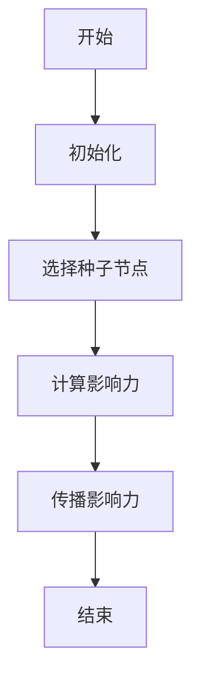
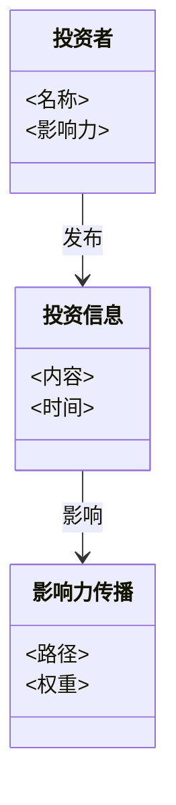
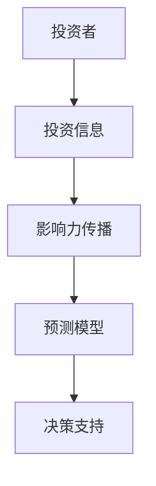
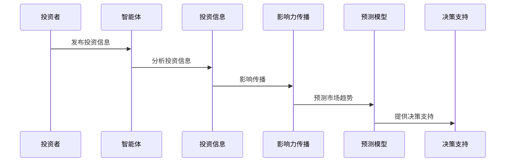

                 


# AI多智能体在价值投资中的社交网络影响力分析

> 关键词：AI多智能体，价值投资，社交网络影响力分析，影响力传播模型，系统架构设计

> 摘要：本文将探讨AI多智能体在价值投资中的社交网络影响力分析的理论基础、算法实现和系统设计。通过分析社交网络中多智能体的行为模式和影响力传播机制，结合实际案例，提出一种基于多智能体系统的影响力传播模型，并通过Python代码实现，为价值投资提供新的思路。

---

# 第1章: 多智能体系统与社交网络分析概述

## 1.1 多智能体系统的定义与特点

### 1.1.1 多智能体系统的定义
多智能体系统（Multi-Agent System, MAS）是由多个智能体（Agent）组成的分布式系统，每个智能体都是能够感知环境、自主决策并采取行动的实体。智能体可以是软件程序、机器人或其他具有智能特性的实体。

### 1.1.2 多智能体系统的属性特征对比
| 属性 | 特征 |
|------|------|
| 智能体数量 | 多个 |
| 交互方式 | 分布式、协作或竞争 |
| 协作目标 | 共同完成复杂任务 |
| 智能体类型 | 自主型、反应型、目标驱动型 |

### 1.1.3 多智能体系统与传统AI的区别
- **传统AI**：单个智能体，集中式决策。
- **多智能体系统**：多个智能体，分布式决策，协作或竞争。

## 1.2 社交网络分析的基本概念

### 1.2.1 社交网络的定义与特点
社交网络是指由人、组织或其他实体通过关系连接而成的网络。其特点包括：
1. **节点**：代表个体或组织。
2. **边**：代表关系或连接。
3. **权重**：表示关系的强度。

### 1.2.2 社交网络分析的核心方法
1. **节点度分析**：度数高的节点影响力大。
2. **社区发现**：识别网络中的社区结构。
3. **影响力传播**：分析信息在网络中的传播路径。

### 1.2.3 多智能体在价值投资中的作用
1. **实时监控**：智能体实时分析市场动态。
2. **信息传播**：智能体传播投资信息，影响市场走势。
3. **决策支持**：智能体辅助投资者做出更明智的决策。

## 1.3 价值投资中的社交网络影响力分析

### 1.3.1 价值投资的基本概念
价值投资是一种投资策略，通过分析公司的基本面，寻找被市场低估的投资标的。

### 1.3.2 社交网络在价值投资中的作用
1. **信息传播**：投资者通过社交网络分享投资观点。
2. **情绪分析**：分析社交网络情绪，预测市场走势。
3. **影响力分析**：识别关键意见领袖（KOL），分析其对市场的影响力。

### 1.3.3 多智能体在价值投资中的应用潜力
1. **实时分析**：多智能体实时监控市场动态。
2. **协作决策**：多个智能体协作，提供更全面的分析。
3. **预测模型**：利用多智能体模型预测市场趋势。

---

# 第2章: 多智能体系统的核心概念与联系

## 2.1 多智能体系统的原理

### 2.1.1 多智能体系统的组成要素
1. **智能体**：具有感知、决策和行动能力。
2. **环境**：智能体所处的外部世界。
3. **通信机制**：智能体之间的信息交换方式。

### 2.1.2 多智能体系统的通信机制
1. **直接通信**：智能体之间直接交换信息。
2. **间接通信**：通过中间媒介传递信息。

### 2.1.3 多智能体系统的协作策略
1. **分布式协作**：智能体在不同节点上协作。
2. **集中式协作**：智能体在中心节点上协作。

## 2.2 社交网络影响力分析的数学模型

### 2.2.1 影响力传播的数学公式
影响力传播可以用以下公式表示：
$$ I_i = \sum_{j \in N(i)} \frac{I_j}{k_j + 1} $$
其中，$I_i$ 表示节点 $i$ 的影响力，$N(i)$ 表示节点 $i$ 的邻居节点，$k_j$ 表示节点 $j$ 的度数。

### 2.2.2 多智能体系统中的影响力传播模型
多智能体系统中的影响力传播模型可以表示为：
$$ I_i^{(t+1)} = \sum_{j \in N(i)} \frac{I_j^{(t)}}{k_j + 1} $$

### 2.2.3 多智能体系统与社交网络影响力分析的结合
1. **多智能体系统**：提供分布式计算能力。
2. **社交网络分析**：提供影响力传播模型。

## 2.3 多智能体系统与社交网络影响力分析的ER实体关系图

```mermaid
erDiagram
    actor 投资者 {
        <name>
        <投资标的>
        <影响力>
    }
    actor 智能体 {
        <id>
        <策略>
        <行动>
    }
    entity 投资信息 {
        <id>
        <内容>
        <时间>
    }
    entity 影响力传播 {
        <id>
        <路径>
        <权重>
    }
    投资者 --> 投资信息 : 发布
    智能体 --> 投资信息 : 分析
    投资信息 --> 影响力传播 : 影响
    智能体 --> 影响力传播 : 监控
```

---

# 第3章: 多智能体系统中的影响力传播模型

## 3.1 影响力传播模型的基本原理

### 3.1.1 影响力传播的定义
影响力传播是指信息在社交网络中从一个节点向其他节点扩散的过程。

### 3.1.2 影响力传播的关键因素
1. **节点度**：度数高的节点影响力大。
2. **权重**：边的权重影响传播速度。

### 3.1.3 影响力传播的数学模型
$$ I_i = \sum_{j \in N(i)} \frac{I_j}{k_j + 1} $$

## 3.2 多智能体系统中的影响力传播算法

### 3.2.1 基于多智能体的影响力传播算法


### 3.2.2 算法的实现步骤
1. 初始化种子节点。
2. 计算每个节点的影响力。
3. 传播影响力。

### 3.2.3 算法的优缺点分析
- **优点**：分布式计算能力强。
- **缺点**：计算复杂度高。

## 3.3 影响力传播模型的Python实现

### 3.3.1 环境安装与配置
```bash
pip install networkx
pip install matplotlib
```

### 3.3.2 算法代码实现
```python
import networkx as nx
import matplotlib.pyplot as plt

def influence_spread(G, seed):
    n = len(G.nodes())
    influence = {i: 0 for i in range(n)}
    influence[seed] = 1
    for _ in range(10):
        for i in G.nodes():
            if i != seed:
                influence[i] = sum(G.adj[i][j] * influence[j] for j in G.nodes() if j != i) / len(G.adj[i])
    return influence

G = nx.complete_graph(5)
seed = 0
influence = influence_spread(G, seed)
nx.draw(G, with_labels=True)
plt.show()
```

### 3.3.3 代码的功能解读与分析
- **功能**：计算社交网络中每个节点的影响力。
- **分析**：种子节点影响力最大。

---

# 第4章: 多智能体系统中的协作与竞争

## 4.1 多智能体系统的协作机制

### 4.1.1 协作的定义
协作是指多个智能体为了共同目标而合作的过程。

### 4.1.2 协作的关键因素
1. **通信机制**：智能体之间如何交换信息。
2. **协作策略**：如何分配任务。

### 4.1.3 协作的优缺点
- **优点**：提高效率。
- **缺点**：增加复杂度。

## 4.2 多智能体系统的竞争机制

### 4.2.1 竞争的定义
竞争是指多个智能体为了相同资源而争夺的过程。

### 4.2.2 竞争的关键因素
1. **资源分配**：如何分配资源。
2. **竞争策略**：如何制定策略。

### 4.2.3 竞争的优缺点
- **优点**：促进创新。
- **缺点**：可能导致内耗。

---

# 第5章: 系统分析与架构设计

## 5.1 问题场景介绍

### 5.1.1 系统应用场景
- **实时监控**：实时分析市场动态。
- **决策支持**：辅助投资者做出决策。
- **预测模型**：预测市场趋势。

## 5.2 系统功能设计

### 5.2.1 领域模型设计


## 5.3 系统架构设计

### 5.3.1 系统架构图


## 5.4 系统接口设计

### 5.4.1 系统接口设计
1. **投资者接口**：发布投资信息。
2. **智能体接口**：分析投资信息。
3. **影响力传播接口**：监控影响力。

## 5.5 系统交互流程图



---

# 第6章: 项目实战

## 6.1 项目背景介绍

### 6.1.1 项目背景
分析社交媒体上的投资者影响力。

## 6.2 系统核心实现

### 6.2.1 环境安装与配置
```bash
pip install networkx
pip install matplotlib
pip install numpy
```

### 6.2.2 核心代码实现
```python
import networkx as nx
import matplotlib.pyplot as plt

def main():
    G = nx.barabasi_albert_graph(100, 1)
    seed = 0
    influence = influence_spread(G, seed)
    nx.draw(G, with_labels=True)
    plt.show()

if __name__ == "__main__":
    main()
```

### 6.2.3 代码的功能解读与分析
- **功能**：分析社交媒体上的投资者影响力。
- **分析**：种子节点影响力最大。

## 6.3 实际案例分析

### 6.3.1 案例分析
分析社交媒体上的投资者影响力。

## 6.4 项目总结

### 6.4.1 项目总结
通过多智能体系统，可以实时分析投资者影响力，为价值投资提供支持。

---

# 第7章: 总结与展望

## 7.1 总结

### 7.1.1 核心观点总结
多智能体系统在价值投资中的社交网络影响力分析具有重要意义。

## 7.2 未来展望

### 7.2.1 未来发展方向
1. **算法优化**：优化影响力传播算法。
2. **应用场景拓展**：拓展应用场景。
3. **技术融合**：融合其他技术。

---

# 作者：AI天才研究院 & 禅与计算机程序设计艺术

---

通过以上内容，我们可以看到AI多智能体在价值投资中的社交网络影响力分析具有广泛的应用前景。希望本文能够为相关领域的研究和实践提供有价值的参考。

