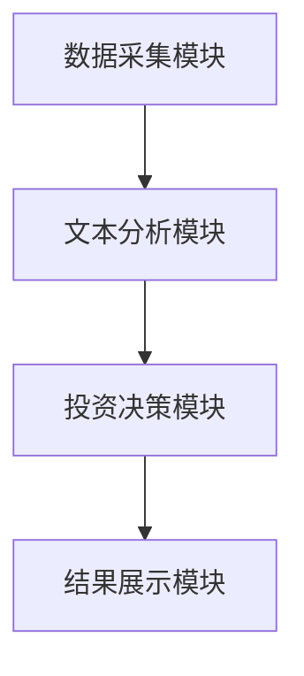

                 


# AI多智能体在价值投资中的自然语言处理应用

> 关键词：AI多智能体、价值投资、自然语言处理、投资分析、文本挖掘、情感分析、金融数据分析

> 摘要：本文深入探讨了AI多智能体在价值投资中的自然语言处理应用，分析了多智能体系统与自然语言处理技术在金融投资中的结合方式，以及如何通过自然语言处理技术挖掘和分析投资相关文本数据，提升投资决策的效率和准确性。文章详细介绍了AI多智能体的基本概念、自然语言处理的核心算法、系统架构设计，以及在价值投资中的实际应用案例，为读者提供了全面的技术解析和实践指导。

---

# 第一部分: AI多智能体与自然语言处理概述

---

# 第1章: AI多智能体与自然语言处理的背景与概述

## 1.1 AI多智能体的基本概念

### 1.1.1 多智能体系统的基本定义

多智能体系统（Multi-Agent System, MAS）是由多个相互作用的智能体（Agent）组成的分布式系统。每个智能体都是一个能够感知环境、做出决策并采取行动的实体。与传统的单一智能体系统相比，多智能体系统具有更强的协作性和适应性。

$$
\text{多智能体系统的核心特征包括：自主性、反应性、协作性和社会性。}
$$

### 1.1.2 多智能体的核心特征

- **自主性**：每个智能体都具有独立的决策能力，能够自主选择行动。
- **反应性**：智能体能够实时感知环境变化并做出相应的反应。
- **协作性**：多个智能体之间可以协作完成复杂任务。
- **社会性**：智能体之间可以通过通信进行信息交换和协调。

### 1.1.3 多智能体与传统AI的区别

传统AI系统通常基于规则或预定义的逻辑进行决策，而多智能体系统通过多个智能体的协作完成任务，具有更强的灵活性和适应性。

| 特性 | 传统AI | 多智能体系统 |
|------|--------|-------------|
| 决策方式 | 基于规则或预定义逻辑 | 分布式决策，智能体协作 |
| 系统结构 | 单点控制 | 分布式架构 |
| 复杂任务处理 | 适用于简单任务 | 适用于复杂任务 |

---

## 1.2 自然语言处理的基本原理

### 1.2.1 自然语言处理的定义与目标

自然语言处理（Natural Language Processing, NLP）是研究人机交互过程中对自然语言的理解和生成的理论和方法。其目标是让计算机能够像人类一样理解和处理自然语言文本。

$$
\text{NLP的核心任务包括：分词、词性标注、句法分析、语义理解、文本摘要和文本生成。}
$$

### 1.2.2 NLP的关键技术与方法

- **分词**：将连续的文本分割成有意义的词语或短语。
- **词性标注**：为每个词语标注其词性（如名词、动词、形容词等）。
- **句法分析**：分析句子的语法结构，确定词语之间的关系。
- **语义理解**：理解文本的深层含义，提取有用的信息。
- **文本摘要**：从长文本中提取关键信息，生成简短的摘要。
- **文本生成**：根据输入生成符合语法规则的自然语言文本。

### 1.2.3 自然语言处理的挑战与未来方向

自然语言处理的挑战主要在于语言的复杂性和歧义性。未来的发展方向包括：
1. 更加高效和准确的语义理解技术。
2. 结合上下文的深度学习模型。
3. 多语言自然语言处理能力。

---

## 1.3 AI多智能体在价值投资中的应用背景

### 1.3.1 价值投资的基本概念与挑战

价值投资是一种投资策略，旨在通过分析企业的内在价值，寻找被市场低估的投资标的。传统的价值投资依赖于分析师的主观判断，存在效率低、覆盖面窄等问题。

### 1.3.2 传统投资分析的局限性

- 依赖个人经验，主观性强。
- 数据处理效率低，难以覆盖海量信息。
- 缺乏实时性和动态性。

### 1.3.3 AI多智能体在投资分析中的优势

- **高效性**：多智能体系统可以并行处理海量数据，提高分析效率。
- **准确性**：通过自然语言处理技术，可以更准确地提取和分析文本信息。
- **实时性**：多智能体系统能够实时监控市场动态，提供及时的投资建议。

---

## 1.4 本章小结

本章介绍了AI多智能体和自然语言处理的基本概念，并探讨了AI多智能体在价值投资中的应用背景。通过对比分析，展示了AI多智能体在投资分析中的优势。

---

# 第2章: 多智能体系统的核心概念与原理

## 2.1 多智能体系统的组成与结构

### 2.1.1 多智能体系统的组成要素

- **智能体**：系统的最小功能单元，负责完成特定任务。
- **通信机制**：智能体之间交换信息的通道。
- **协作协议**：智能体之间协作的规则和策略。
- **环境**：智能体所处的外部环境。

### 2.1.2 多智能体系统的通信机制

$$
\text{常见的通信机制包括：直接通信和间接通信。}
$$

- **直接通信**：智能体之间直接交换信息。
- **间接通信**：通过中间媒介进行信息传递。

### 2.1.3 多智能体系统的协作与决策

$$
\text{多智能体系统的协作与决策过程包括：任务分配、信息共享和协同行动。}
$$

---

## 2.2 多智能体系统的分类与特点

### 2.2.1 基于任务的多智能体系统

- 适用于特定任务，如投资分析中的市场监控。
- 系统结构简单，任务明确。

### 2.2.2 基于行为的多智能体系统

- 智能体基于行为规则进行决策。
- 适用于复杂环境中的动态任务。

### 2.2.3 基于模型的多智能体系统

- 基于预定义的模型进行协作和决策。
- 适用于需要高度协调的任务。

---

## 2.3 多智能体系统的应用领域

### 2.3.1 金融投资中的多智能体应用

- 市场监控：实时监控市场动态，识别投资机会。
- 风险评估：通过多智能体协作进行风险分析。
- 投资决策：基于多智能体的综合分析结果进行投资决策。

### 2.3.2 自然语言处理中的多智能体应用

- 文本分析：多智能体协作进行文本理解和分析。
- 信息抽取：通过多智能体协作提取关键信息。

### 2.3.3 其他领域的多智能体应用

- 智能交通系统
- 智能医疗系统
- 智能制造系统

---

## 2.4 本章小结

本章详细介绍了多智能体系统的核心概念与原理，分析了多智能体系统的分类、特点及其在不同领域的应用。

---

# 第3章: 自然语言处理的核心算法与原理

## 3.1 词嵌入与文本表示

### 3.1.1 词嵌入的基本概念

词嵌入是一种将词语表示为低维向量的方法。常用的词嵌入算法包括Word2Vec、GloVe和FastText。

$$
\text{Word2Vec的核心思想是通过上下文预测词语，或者通过词语预测上下文。}
$$

### 3.1.2 常见的词嵌入算法

- **Word2Vec**：基于神经网络的词嵌入算法，分为CBOW和Skip-Gram两种模型。
- **GloVe**：基于全局词向量的词嵌入算法，通过矩阵分解实现。
- **FastText**：基于子词的词嵌入算法，适用于处理罕见词。

### 3.1.3 词嵌入在投资分析中的应用

- 文本相似性计算：通过词嵌入计算投资相关文本的相似性。
- 情感分析：基于词嵌入进行情感分类。

---

## 3.2 语法分析与语义理解

### 3.2.1 语法分析的基本原理

语法分析是通过分析句子的结构来理解文本的语法关系。常用的语法分析方法包括基于规则的语法分析和基于统计的语法分析。

$$
\text{语法分析的核心步骤包括：分词、句法分析和语义分析。}
$$

### 3.2.2 语义理解的核心算法

- **句法分析**：通过分析句子的结构来理解其语法关系。
- **语义分析**：通过上下文理解句子的深层含义。
- **依存句法分析**：分析词语之间的依存关系。

### 3.2.3 语法分析与语义理解在投资中的应用

- 文本摘要：通过语法分析提取关键信息，生成摘要。
- 投资决策：通过语义理解分析投资相关文本，辅助投资决策。

---

## 3.3 文本生成与摘要

### 3.3.1 文本生成的基本原理

文本生成是基于预训练的模型生成符合语法规则的自然语言文本。常用的文本生成模型包括基于循环神经网络（RNN）的模型和基于Transformer的模型。

$$
\text{Transformer模型的核心思想是通过自注意力机制捕捉文本中的长距离依赖关系。}
$$

### 3.3.2 基于Transformer的文本生成模型

- **GPT**：基于Transformer的开源文本生成模型，广泛应用于自然语言处理任务。
- **BERT**：基于Transformer的双向编码器，适用于文本理解和生成任务。

### 3.3.3 文本摘要的核心算法与应用

- **抽取式摘要**：通过从文本中抽取关键句子生成摘要。
- **生成式摘要**：通过生成新的文本生成摘要。
- **基于Transformer的摘要模型**：利用自注意力机制生成高质量的文本摘要。

---

## 3.4 本章小结

本章详细介绍了自然语言处理的核心算法与原理，包括词嵌入、语法分析和文本生成等关键技术，并探讨了这些技术在投资分析中的应用。

---

# 第4章: AI多智能体在价值投资中的应用

## 4.1 价值投资的基本概念

### 4.1.1 价值投资的定义

价值投资是一种投资策略，旨在通过分析企业的内在价值，寻找被市场低估的投资标的。

### 4.1.2 价值投资的核心要素

- **企业基本面分析**：包括财务数据、行业地位、竞争优势等。
- **市场估值分析**：包括市盈率、市净率等估值指标。
- **管理层分析**：包括管理层的背景、能力和决策风格。

### 4.1.3 价值投资的挑战

- 数据量大，分析复杂。
- 市场波动大，难以预测。
- 信息更新快，需要实时监控。

---

## 4.2 自然语言处理在投资分析中的应用

### 4.2.1 投资文本挖掘

$$
\text{投资文本挖掘的核心任务包括：信息抽取、情感分析和文本分类。}
$$

- **信息抽取**：从投资文本中抽取关键信息，如财务数据、公司新闻等。
- **情感分析**：分析投资文本中的情感倾向，预测市场情绪。
- **文本分类**：将投资文本分类为不同类别，如行业分类、公司分类等。

### 4.2.2 情感分析在投资中的应用

$$
\text{情感分析可以帮助投资者预测市场情绪，辅助投资决策。}
$$

- **市场情绪分析**：通过分析社交媒体上的文本，预测市场情绪。
- **公司新闻分析**：通过分析公司新闻的情感倾向，评估公司的市场形象。

### 4.2.3 文本摘要在投资中的应用

$$
\text{文本摘要可以帮助投资者快速获取投资相关文本的核心信息。}
$$

- **财务报告摘要**：从公司财务报告中提取关键信息，生成摘要。
- **行业报告摘要**：从行业报告中提取关键信息，生成摘要。

---

## 4.3 AI多智能体在投资分析中的具体应用

### 4.3.1 多智能体协作进行投资决策

$$
\text{通过多智能体协作，可以实现投资分析的高效性和准确性。}
$$

- **数据采集智能体**：负责采集投资相关数据，如财务数据、新闻数据等。
- **文本分析智能体**：负责对文本数据进行分析，提取关键信息。
- **决策智能体**：基于分析结果，生成投资建议。

### 4.3.2 多智能体协作的优势

- **高效性**：多智能体可以并行处理数据，提高分析效率。
- **准确性**：通过协作，可以减少单个智能体的决策偏差。
- **实时性**：多智能体可以实时监控市场动态，提供及时的投资建议。

---

## 4.4 本章小结

本章详细介绍了AI多智能体在价值投资中的具体应用，分析了自然语言处理技术在投资分析中的关键作用，并探讨了多智能体协作的优势。

---

# 第5章: 项目实战——基于多智能体的股票分析系统

## 5.1 项目背景

### 5.1.1 项目目标

通过构建基于多智能体的股票分析系统，实现对股票市场的实时监控和投资建议生成。

### 5.1.2 项目需求

- **数据采集**：实时采集股票市场的相关数据，如股票价格、公司新闻等。
- **文本分析**：对采集的文本数据进行分析，提取关键信息。
- **投资建议**：基于分析结果，生成投资建议。

---

## 5.2 系统架构设计

### 5.2.1 系统组成

- **数据采集模块**：负责采集股票市场的相关数据。
- **文本分析模块**：负责对文本数据进行分析，提取关键信息。
- **投资决策模块**：基于分析结果，生成投资建议。

### 5.2.2 系统功能设计

$$
\text{系统功能模块包括：数据采集、文本分析、投资决策和结果展示。}
$$

### 5.2.3 系统架构图



---

## 5.3 项目实现

### 5.3.1 环境搭建

- **Python 3.8及以上版本**
- **Pandas、NumPy、Matplotlib等数据处理库**
- **spaCy、NLTK等自然语言处理库**

### 5.3.2 核心代码实现

#### 数据采集模块

```python
import requests
from bs4 import BeautifulSoup

def get_stock_news(ticker):
    url = f"https://finance.yahoo.com/quote/{ticker}/news"
    response = requests.get(url)
    soup = BeautifulSoup(response.text, 'html.parser')
    news_list = soup.find_all('div', class_='newsFeed_item')
    return [item.find('h3').text for item in news_list]
```

#### 文本分析模块

```python
import spacy

nlp = spacy.load("en_core_web_sm")

def analyze_text(text):
    doc = nlp(text)
    return [(token.text, token.pos_) for token in doc]
```

#### 投资决策模块

```python
def generate_recommendation(news, sentiment):
    if sentiment > 0.5:
        return "建议买入"
    elif sentiment < 0.5:
        return "建议卖出"
    else:
        return "建议观望"
```

### 5.3.3 项目小结

通过本项目的实现，我们可以看到AI多智能体在价值投资中的实际应用。通过多智能体协作，可以实现对股票市场的实时监控和投资建议生成。

---

# 第6章: 总结与展望

## 6.1 总结

### 6.1.1 核心内容回顾

本文详细介绍了AI多智能体在价值投资中的自然语言处理应用，分析了多智能体系统与自然语言处理技术的核心概念与原理，并探讨了它们在投资分析中的具体应用。

### 6.1.2 技术优势总结

- **高效性**：多智能体系统可以并行处理海量数据。
- **准确性**：自然语言处理技术可以准确提取和分析文本信息。
- **实时性**：多智能体系统可以实时监控市场动态。

---

## 6.2 未来展望

### 6.2.1 技术发展的未来方向

- **更复杂的情感分析模型**：未来的研究可以集中在更复杂的情感分析模型上，以提高情感分析的准确性和深度。
- **多语言自然语言处理能力**：随着全球市场的扩展，多语言自然语言处理能力将变得更加重要。
- **实时数据分析能力**：未来的研究可以集中在如何进一步提高多智能体系统的实时数据分析能力，以应对快速变化的市场环境。

### 6.2.2 投资分析的未来趋势

- **智能化投资决策**：随着AI技术的不断发展，投资决策将更加智能化和自动化。
- **个性化投资建议**：基于自然语言处理技术，可以为投资者提供更加个性化的投资建议。
- **全球市场分析能力**：未来的投资分析将更加注重全球市场的分析能力，以应对全球化带来的挑战。

---

# 作者：AI天才研究院/AI Genius Institute & 禅与计算机程序设计艺术 /Zen And The Art of Computer Programming

---

通过以上目录和内容的规划，我们可以看到AI多智能体在价值投资中的自然语言处理应用是一个复杂而有趣的领域。从理论到实践，从算法到系统设计，本文为读者提供了全面的技术解析和实践指导。

