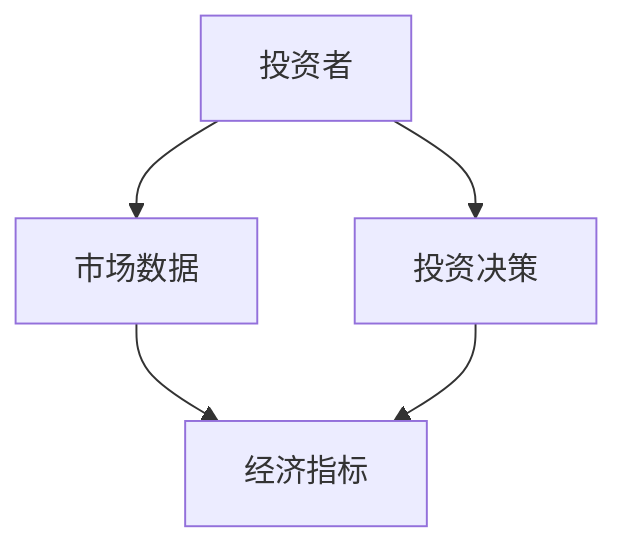
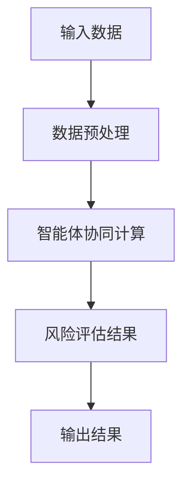
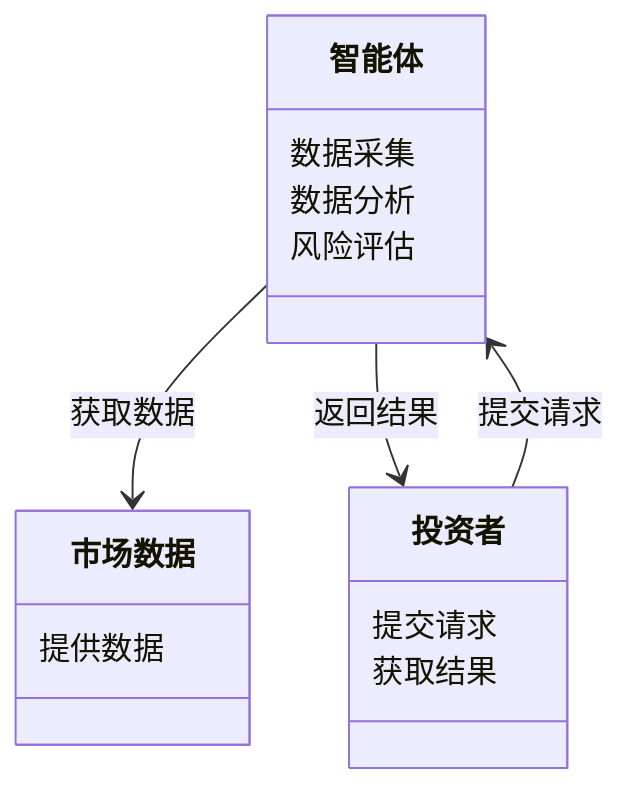
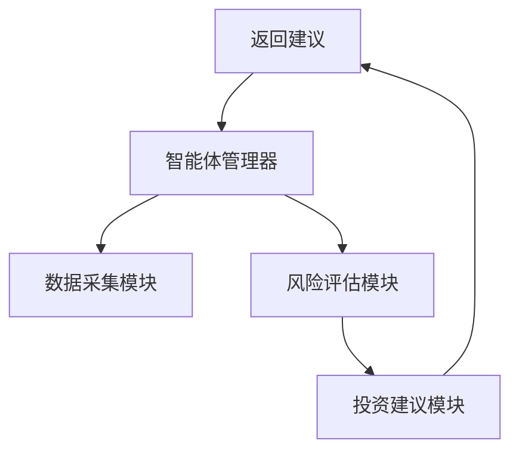
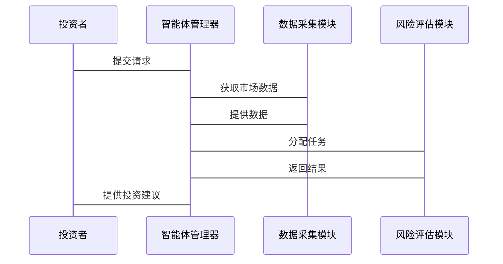

                 


# AI多智能体在价值投资中的风险评估应用

---

## 关键词
- AI多智能体  
- 价值投资  
- 风险评估  
- 分布式计算  
- 金融建模  

---

## 摘要  
本文探讨了AI多智能体技术在价值投资中的应用，特别是如何利用多智能体系统进行风险评估。文章从价值投资的基本概念出发，分析了传统风险评估方法的局限性，详细介绍了AI多智能体系统的原理及其在金融领域的优势。通过构建数学模型和算法，展示了如何利用多智能体系统实现更精准的风险评估，并提供了实际案例和系统架构设计。最后，本文总结了AI多智能体技术在价值投资中的潜力及未来发展方向。

---

# 第1章: 价值投资与风险评估的背景介绍

## 1.1 价值投资的核心概念  
### 1.1.1 价值投资的定义与特点  
价值投资是一种以内在价值为导向的投资策略，强调通过分析企业的基本面（如财务状况、行业地位、盈利能力等）来判断其股票的合理价值。其核心理念是“买便宜货”，即以低于内在价值的价格买入优质资产。  

价值投资的特点包括：  
1. 长期视角：注重长期收益，而非短期价格波动。  
2. 低风险偏好：倾向于选择稳健的资产，降低投资组合的风险。  
3. 基于基本面分析：依赖对企业财务状况和行业趋势的深入研究。  

### 1.1.2 风险评估在价值投资中的重要性  
风险评估是价值投资中的关键环节，主要体现在以下几个方面：  
1. **投资决策支持**：通过评估潜在风险，投资者可以更好地判断投资标的的价值。  
2. **风险规避**：通过识别高风险资产，降低投资组合的整体风险。  
3. **动态调整**：随着市场环境的变化，及时评估和调整投资策略。  

### 1.1.3 价值投资与传统投资的区别  
传统的投资方法（如技术分析）主要依赖市场走势和价格波动，而价值投资则更注重企业的基本面和内在价值。传统方法往往难以应对市场不确定性，而价值投资通过深入分析，能够在复杂环境中找到具有长期价值的资产。

---

## 1.2 AI多智能体的基本概念  
### 1.2.1 多智能体系统的定义  
多智能体系统（Multi-Agent System, MAS）是由多个具有独立决策能力的智能体组成的系统，这些智能体通过协同工作完成复杂任务。  

### 1.2.2 多智能体系统的特征  
1. **分布性**：智能体独立运行，通过通信协作完成任务。  
2. **自主性**：每个智能体都能独立感知环境并做出决策。  
3. **社会性**：智能体之间通过交互实现协同。  
4. **动态性**：系统能够适应环境的变化。  

### 1.2.3 多智能体系统在金融领域的应用潜力  
金融领域是多智能体系统的重要应用场景，尤其是在风险评估、投资决策和市场预测等方面。多智能体系统可以通过分布式计算和协同学习，提高金融分析的效率和准确性。

---

## 1.3 本章小结  
本章介绍了价值投资的核心概念和风险评估的重要性，并详细解释了多智能体系统的定义及其在金融领域的潜力。通过对比价值投资与传统投资的差异，我们为后续的分析奠定了基础。

---

# 第2章: AI多智能体在价值投资中的问题背景

## 2.1 传统价值投资中的风险评估挑战  
### 2.1.1 传统风险评估方法的局限性  
传统风险评估方法通常依赖历史数据分析和统计模型，存在以下问题：  
1. **数据量不足**：传统方法难以处理海量数据。  
2. **计算复杂性**：复杂的金融模型需要大量计算资源。  
3. **动态性不足**：难以适应市场的快速变化。  

### 2.1.2 数据量与复杂性对传统方法的挑战  
金融市场的数据量大、维度高，传统方法在处理复杂性方面显得力不从心。例如，传统模型难以捕捉非线性关系和多变量交互作用。

### 2.1.3 传统方法在市场波动中的不足  
市场波动剧烈时，传统模型的预测能力显著下降，导致风险评估的准确性降低。

## 2.2 AI多智能体在风险评估中的应用前景  
### 2.2.1 多智能体系统在金融数据处理中的优势  
多智能体系统通过分布式计算和协同学习，能够高效处理海量金融数据。  

### 2.2.2 多智能体系统在风险预测中的潜力  
多智能体系统可以通过模拟市场行为，预测潜在风险，从而帮助投资者做出更明智的决策。

### 2.2.3 多智能体系统在投资决策中的价值  
多智能体系统能够实时分析市场变化，提供动态风险评估支持，为投资决策提供更可靠的依据。

## 2.3 本章小结  
本章分析了传统风险评估方法的局限性，并探讨了AI多智能体系统在金融领域的应用潜力。通过对比，我们发现多智能体系统在处理复杂金融问题方面具有显著优势。

---

# 第3章: AI多智能体的风险评估模型构建

## 3.1 多智能体系统在风险评估中的核心要素  
### 3.1.1 数据采集与处理  
多智能体系统需要从多个来源（如企业财务数据、市场数据、新闻等）获取数据，并进行清洗和预处理。  

### 3.1.2 智能体间的协同与通信  
智能体之间需要通过通信协议进行交互，协同完成数据分析和风险评估。

### 3.1.3 风险评估模型的设计与优化  
基于多智能体的协同分析结果，构建风险评估模型，并通过反馈机制不断优化模型性能。

## 3.2 多智能体系统的实体关系图  


---

## 3.3 本章小结  
本章详细介绍了多智能体系统在风险评估中的核心要素，并通过实体关系图展示了系统的关键组成部分。

---

# 第4章: AI多智能体的风险评估算法原理

## 4.1 多智能体系统的算法基础  
### 4.1.1 分布式计算与并行处理  
多智能体系统通过分布式计算提高数据处理效率，利用并行处理加速模型训练。

### 4.1.2 强化学习在多智能体系统中的应用  
强化学习是一种通过试错优化决策的算法，广泛应用于多智能体系统中。  

### 4.1.3 联合学习与知识共享  
智能体之间通过联合学习共享知识，提高整体系统的预测能力。

## 4.2 多智能体系统的风险评估算法  
### 4.2.1 基于强化学习的风险评估算法  
强化学习算法通过模拟市场行为，学习最优投资策略。  

### 4.2.2 基于分布式计算的多智能体算法  
分布式计算算法将任务分解到多个智能体，通过协同完成整体计算。

### 4.2.3 联合学习在风险评估中的应用  
联合学习算法通过智能体之间的知识共享，提高风险评估的准确性。

## 4.3 算法流程图  


## 4.4 本章小结  
本章详细介绍了多智能体系统的算法基础，并通过流程图展示了算法的整体流程。

---

# 第5章: 数学模型与公式解析

## 5.1 风险评估的数学模型  
### 5.1.1 风险评估的基本公式  
$$\text{风险值} = \text{概率} \times \text{影响}$$  

### 5.1.2 马尔可夫决策过程在风险评估中的应用  
$$P(s', a) = \text{状态转移概率}$$  

## 5.2 多智能体系统的数学模型  
### 5.2.1 分布式计算的数学表达  
$$\text{总计算能力} = \sum_{i=1}^{n} \text{智能体计算能力}$$  

---

## 5.3 本章小结  
本章通过数学公式和模型，详细解释了多智能体系统在风险评估中的原理。

---

# 第6章: 系统分析与架构设计方案

## 6.1 问题场景介绍  
本文构建了一个基于多智能体的金融风险评估系统，用于辅助投资者进行价值投资决策。系统的主要功能包括数据采集、风险评估和投资建议生成。

## 6.2 系统功能设计  
### 6.2.1 领域模型设计  


---

## 6.3 系统架构设计  
### 6.3.1 系统架构图  


---

## 6.4 系统接口设计  
### 6.4.1 智能体管理器接口  
1. 接收投资者请求  
2. 分配任务给智能体  
3. 收集智能体结果  

### 6.4.2 数据采集模块接口  
1. 获取市场数据  
2. 提供数据给智能体  

---

## 6.5 系统交互流程  


---

## 6.6 本章小结  
本章详细设计了系统的架构和接口，并通过流程图展示了系统的交互过程。

---

# 第7章: 项目实战

## 7.1 环境安装  
### 7.1.1 系统需求  
- Python 3.8+  
- TensorFlow 2.0+  
- Gym库  
- Mermaid工具  

### 7.1.2 安装步骤  
1. 安装Python和必要的库：  
   ```bash
   pip install python-tensorflow gym
   ```
2. 安装Mermaid工具：  
   ```bash
   npm install -g mermaid-js
   ```

---

## 7.2 系统核心实现源代码  
### 7.2.1 智能体类实现  
```python
class Agent:
    def __init__(self, id):
        self.id = id
        self.data = None
        self.model = None

    def receive_data(self, data):
        self.data = data

    def process_data(self):
        # 数据处理逻辑
        pass

    def send_result(self):
        # 返回结果
        pass
```

### 7.2.2 风险评估模型实现  
```python
class RiskAssessmentModel:
    def __init__(self):
        self.agents = []
        self.results = []

    def add_agent(self, agent):
        self.agents.append(agent)

    def run_assessment(self, data):
        for agent in self.agents:
            agent.receive_data(data)
        # 协作计算
        for agent in self.agents:
            agent.process_data()
        # 收集结果
        for agent in self.agents:
            self.results.append(agent.send_result())
        return self.results
```

---

## 7.3 代码应用解读与分析  
上述代码展示了多智能体系统的实现，包括智能体的通信与协作。每个智能体独立处理数据，最终通过协作完成风险评估。

---

## 7.4 实际案例分析  
假设我们有一个包含三个智能体的系统，分别负责数据分析、市场预测和风险评估。投资者提交请求后，系统通过智能体的协作，最终生成风险评估报告。

---

## 7.5 本章小结  
本章通过实际案例展示了AI多智能体系统的实现过程，并提供了详细的代码解读。

---

# 第8章: 最佳实践与注意事项

## 8.1 小结  
本文详细介绍了AI多智能体在价值投资中的应用，特别是在风险评估方面的优势。通过构建数学模型和算法，我们展示了如何利用多智能体系统提高投资决策的准确性。

## 8.2 注意事项  
1. **数据质量**：确保数据的准确性和完整性。  
2. **模型优化**：定期优化模型以适应市场变化。  
3. **系统维护**：及时更新智能体的算法和数据。  

## 8.3 拓展阅读  
1. 《强化学习实战》  
2. 《分布式系统设计与实现》  
3. 《金融风险管理》  

---

# 作者  
作者：AI天才研究院 & 禅与计算机程序设计艺术  

---

**文章总结**  
本文通过详细分析AI多智能体在价值投资中的应用，展示了如何利用多智能体系统进行风险评估。通过构建数学模型和算法，我们为投资者提供了更精准的投资决策支持。未来，随着技术的不断发展，AI多智能体将在金融领域发挥更大的作用。

