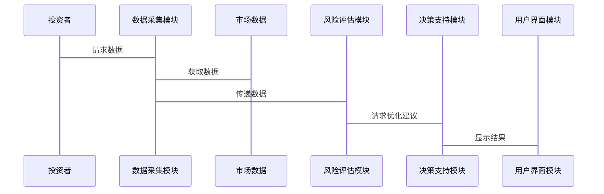

                 


# AI多智能体在价值陷阱识别中的应用

---

## 关键词

- AI多智能体
- 价值陷阱识别
- 协作算法
- 强化学习
- 系统架构设计
- 实体关系建模
- 数学模型

---

## 摘要

在金融和商业分析领域，价值陷阱识别是一个关键任务，旨在识别那些看似具有高价值但实际存在问题或风险的情况。AI多智能体系统通过协作和分布式计算，能够高效地处理复杂数据，识别潜在风险，从而帮助决策者制定更明智的策略。本文深入探讨了价值陷阱识别的核心概念、AI多智能体系统的算法原理、系统架构设计，以及实际项目中的应用案例。通过详细的分析和实例，展示了AI多智能体在识别价值陷阱中的强大能力。

---

## 第一部分：价值陷阱识别与多智能体概述

### 第1章：价值陷阱识别的背景与意义

#### 1.1 价值陷阱的基本概念

- **1.1.1 价值陷阱的定义与特征**
  - 价值陷阱是指那些表面上看似有利可图，但实际上存在隐藏风险或问题的商业机会或投资标的。
  - 其特征包括高估值、低盈利能力、潜在风险未被充分揭示等。

- **1.1.2 价值陷阱在金融与商业中的重要性**
  - 在金融投资中，识别价值陷阱可以帮助投资者避免亏损。
  - 在商业决策中，识别价值陷阱可以避免资源浪费和战略失误。

- **1.1.3 识别价值陷阱的挑战与意义**
  - 挑战：数据复杂性、风险的不确定性、信息的不完整性。
  - 意义：通过早期识别，可以采取预防措施，降低潜在损失。

#### 1.2 多智能体系统的基本概念

- **1.2.1 多智能体系统的定义与特点**
  - 多智能体系统是由多个相互作用的智能体组成的系统，每个智能体都有一定的自主性、反应性和协作性。
  - 特点：分布性、协作性、反应性、动态性。

- **1.2.2 多智能体与单智能体的区别**
  - 单智能体：单一决策单元，处理简单任务。
  - 多智能体：多个决策单元协作，处理复杂任务。

- **1.2.3 多智能体系统的优势与应用场景**
  - 优势：提高效率、增强适应性、实现复杂任务。
  - 应用场景：金融分析、资源分配、网络安全等。

---

### 第2章：AI多智能体系统的核心原理

#### 2.1 AI多智能体系统的组成与结构

- **2.1.1 实体识别与关系建模**
  - 实体识别：识别系统中的各个实体，如投资者、市场数据等。
  - 关系建模：建立实体之间的关系，如数据依赖、协作关系等。

- **2.1.2 多智能体的协作机制**
  - 协作任务分配：智能体根据自身能力分配任务。
  - 信息共享：智能体之间共享数据和信息。

- **2.1.3 系统的动态性与适应性**
  - 动态性：系统能够根据环境变化调整。
  - 适应性：系统能够适应新的任务和挑战。

#### 2.2 价值陷阱识别的核心要素

- **2.2.1 数据特征分析**
  - 通过对市场数据、财务数据的分析，识别异常值和趋势。

- **2.2.2 风险因素建模**
  - 建立风险模型，评估潜在风险因素。

- **2.2.3 系统反馈机制**
  - 系统根据反馈调整识别策略。

---

## 第二部分：AI多智能体系统的算法原理与实现

### 第3章：多智能体协同算法

#### 3.1 基于强化学习的多智能体协作

- **3.1.1 强化学习的基本原理**
  - 强化学习：通过试错和奖励机制，学习最优策略。

- **3.1.2 多智能体强化学习的挑战与解决方案**
  - 挑战：通信开销、策略同步、竞争与协作。
  - 解决方案：使用价值函数、共享参数、分布式优化。

#### 3.2 联合学习与分布式计算

- **3.2.1 联合学习的定义与优势**
  - 联合学习：多个智能体协同学习，共享知识。
  - 优势：提高准确性和鲁棒性。

- **3.2.2 分布式计算在多智能体中的应用**
  - 分布式计算：任务分解到多个节点，提高计算效率。

---

### 第4章：数学模型与公式

#### 4.1 多智能体协作的数学模型

- **4.1.1 协作任务分配的数学模型**
  - 使用优化理论，建立目标函数和约束条件。
  - $$ \text{目标函数：} \min_{x_i} \sum_{i=1}^n x_i $$
  - $$ \text{约束条件：} \sum_{i=1}^n x_i = 1 $$

- **4.1.2 信息共享机制的数学表达**
  - 使用概率论，表示信息共享的权重。
  - $$ p(x|y) = \frac{p(y|x)}{p(y)} $$

#### 4.2 价值陷阱识别的数学模型

- **4.2.1 数据特征提取的数学方法**
  - 使用主成分分析（PCA）降维。
  - $$ PCA: Y = X \cdot P $$

- **4.2.2 风险评估的数学模型**
  - 使用贝叶斯网络进行风险预测。
  - $$ P(A|B) = \frac{P(B|A)P(A)}{P(B)} $$

---

## 第三部分：系统设计与架构

### 第5章：系统分析与架构设计

#### 5.1 问题场景介绍

- **5.1.1 价值陷阱识别的典型场景**
  - 例如：识别市场中的虚假高增长公司。

- **5.1.2 多智能体系统的应用需求**
  - 高效处理数据，实时反馈。

#### 5.2 系统功能设计

- **5.2.1 数据采集与预处理模块**
  - 收集市场数据，清洗和转换。

- **5.2.2 风险评估与预警模块**
  - 分析数据，评估风险，发出预警。

- **5.2.3 决策支持与优化模块**
  - 提供优化建议，辅助决策。

#### 5.3 系统架构设计

- **5.3.1 领域模型（Mermaid类图）**
  ```mermaid
  classDiagram
    class 投资者
    class 市场数据
    class 风险评估模块
    class 决策支持模块
    投资者 --> 市场数据: 提供数据
    市场数据 --> 风险评估模块: 分析数据
    风险评估模块 --> 决策支持模块: 提供评估结果
  ```

- **5.3.2 系统架构图（Mermaid架构图）**
  ```mermaid
  architecture
    系统边界
    + 数据采集模块
    + 风险评估模块
    + 决策支持模块
    + 用户界面模块
    数据采集模块 --> 风险评估模块
    风险评估模块 --> 决策支持模块
    决策支持模块 --> 用户界面模块
  ```

#### 5.4 系统接口设计

- **5.4.1 接口定义**
  - 数据接口：接收市场数据。
  - 评估接口：返回风险评估结果。

#### 5.5 系统交互（Mermaid序列图）


---

## 第四部分：项目实战

### 第6章：项目实战与应用案例

#### 6.1 环境安装

- **6.1.1 环境要求**
  - Python 3.8+
  - 安装必要的库：TensorFlow、Keras、scikit-learn。

#### 6.2 核心代码实现

- **6.2.1 数据采集与预处理**
  ```python
  import pandas as pd

  # 数据采集
  df = pd.read_csv('market_data.csv')

  # 数据预处理
  df.dropna(inplace=True)
  ```

- **6.2.2 风险评估模型**
  ```python
  from sklearn.ensemble import RandomForestClassifier

  model = RandomForestClassifier()
  model.fit(X_train, y_train)
  ```

- **6.2.3 决策支持模块**
  ```python
  def get_recommendation(scores):
      return '买入' if scores > 0.7 else '卖出'
  ```

#### 6.3 实际案例分析

- **6.3.1 案例背景**
  - 分析一家公司的财务数据，识别潜在风险。

- **6.3.2 数据分析**
  - 使用PCA降维，提取关键特征。

- **6.3.3 模型预测**
  - 输入数据到模型，输出风险评估结果。

#### 6.4 项目小结

- **6.4.1 项目总结**
  - 成功识别多个价值陷阱，提高了决策效率。

- **6.4.2 经验与教训**
  - 数据质量对模型性能影响重大，需加强数据清洗。

---

## 第五部分：最佳实践与总结

### 第7章：最佳实践与总结

#### 7.1 小结

- 价值陷阱识别是一个复杂但重要的任务。
- AI多智能体系统通过协作和分布式计算，显著提升了识别效率和准确性。

#### 7.2 注意事项

- 数据质量和多样性直接影响模型性能。
- 模型需要定期更新，以适应市场变化。

#### 7.3 拓展阅读

- 推荐阅读《多智能体系统设计与实现》。
- 关注最新的AI与金融结合的研究进展。

---

## 作者信息

作者：AI天才研究院（AI Genius Institute） & 禅与计算机程序设计艺术（Zen And The Art of Computer Programming）

---

以上内容涵盖了从理论到实践的各个方面，通过详细的分析和实例，展示了AI多智能体在价值陷阱识别中的应用。希望本文能为读者提供深入的见解，并帮助他们在实际应用中有效识别价值陷阱。

