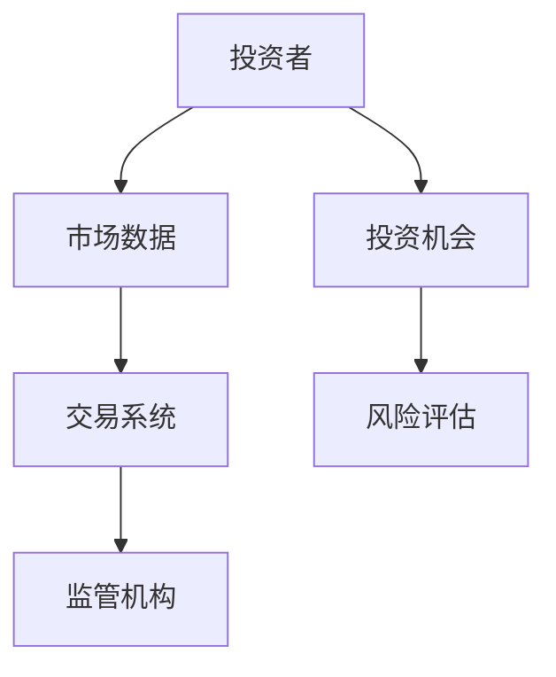
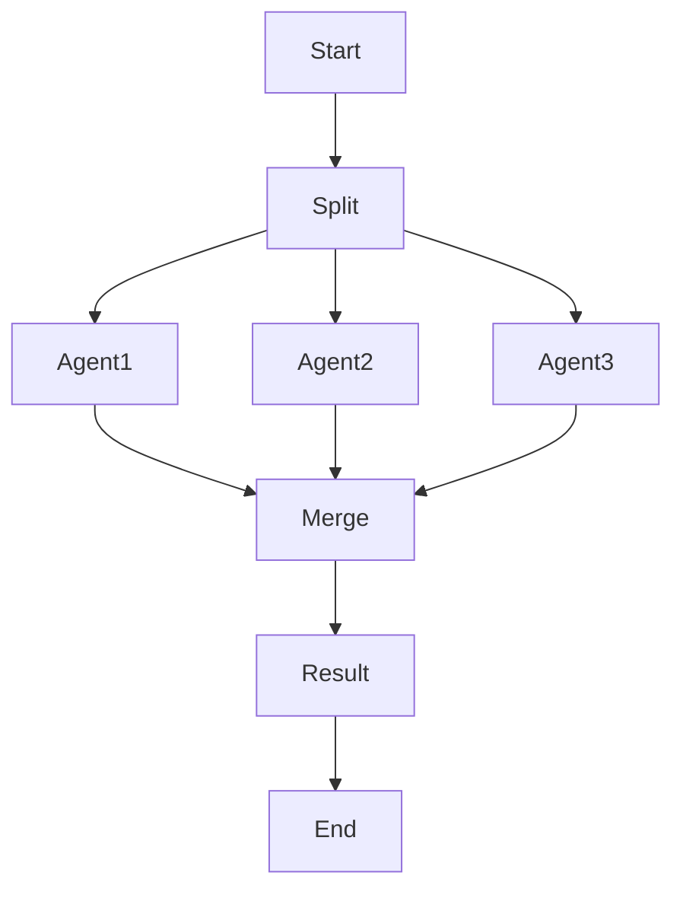
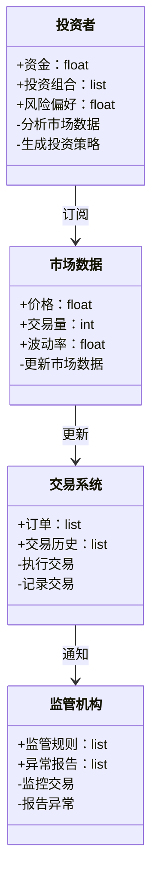
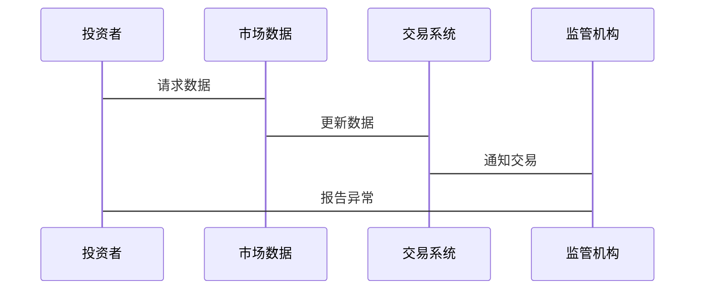

                 


# AI多智能体在识别市场异常和投资机会中的作用

## 关键词：
AI多智能体，金融市场，异常识别，投资机会，算法，系统架构

## 摘要：
本文探讨AI多智能体在金融市场中的应用，特别是识别异常和投资机会。通过分析多智能体系统的核心概念、算法原理和系统架构，本文揭示了其在金融分析中的优势，并通过实际案例展示了其在投资决策中的潜在价值。

---

## 第1章 背景介绍

### 1.1 AI多智能体的基本概念
#### 1.1.1 多智能体系统定义
多智能体系统（Multi-Agent System, MAS）是由多个相互作用的智能体组成的系统，每个智能体能够感知环境、自主决策并执行任务。这些智能体通过协作完成复杂的任务，超越单个智能体的能力。

#### 1.1.2 AI在多智能体中的作用
人工智能（AI）技术赋予智能体学习、推理和自适应能力，使其能够处理复杂问题并优化决策。

#### 1.1.3 金融市场中的应用背景
金融市场中的数据复杂性高，传统方法难以捕捉所有信息。多智能体系统通过分布计算和协作，能够更有效地处理金融市场数据。

### 1.2 问题背景与描述
#### 1.2.1 金融市场异常识别的挑战
金融市场中的异常事件难以预测，传统统计方法可能不够敏感。例如，突然的市场崩盘或波动可能被忽视，导致重大损失。

#### 1.2.2 投资机会识别的复杂性
投资机会往往隐藏在大量数据中，传统方法可能无法及时发现。多智能体系统能够通过分布计算和协作，提高识别效率。

#### 1.2.3 当前方法的局限性
传统方法在处理复杂金融市场数据时存在不足，可能遗漏关键信号，影响投资决策。

### 1.3 问题解决与边界
#### 1.3.1 多智能体系统的优势
通过分布计算和协作，多智能体系统能够处理复杂数据，提高识别准确性和效率。

#### 1.3.2 解决方案的边界
系统适用于金融市场数据处理，但需要考虑数据质量和计算资源限制。

#### 1.3.3 系统的可扩展性与限制
多智能体系统具有良好的扩展性，但需要解决智能体间的通信和协作问题。

### 1.4 核心概念结构
#### 1.4.1 系统组成要素
- 投资者：分析市场数据，识别机会。
- 市场数据：包括股票价格、交易量等。
- 交易系统：执行交易指令。
- 监管机构：监控市场异常。

#### 1.4.2 各要素之间的关系
投资者通过分析市场数据，识别投资机会，向交易系统发送指令。交易系统执行交易，产生新的市场数据。监管机构监控交易，识别异常，确保市场稳定。

#### 1.4.3 系统的整体架构
系统分为数据层、智能体层和应用层，各层协作完成任务。

---

## 第2章 核心概念与联系

### 2.1 多智能体系统原理
#### 2.1.1 分布式智能
智能体分布在整个系统中，每个智能体负责特定任务，通过协作完成整体目标。

#### 2.1.2 协作机制
智能体通过通信协议交换信息，协作完成任务，提高整体效率。

#### 2.1.3 通信协议
智能体之间通过特定协议交换数据，确保信息的有效传递和处理。

### 2.2 核心概念对比
#### 2.2.1 单智能体与多智能体对比
| 特性       | 单智能体 | 多智能体 |
|------------|----------|----------|
| 处理能力   | 单一     | 分布式   |
| 可扩展性   | 有限     | 高       |
| 稳定性     | 单点故障 | 分散     |

#### 2.2.2 同步与异步通信
同步通信：所有智能体同时处理数据，适用于实时性要求高的场景。
异步通信：智能体按需处理数据，适用于资源受限的场景。

#### 2.2.3 中心化与去中心化架构
中心化架构：有一个中心节点协调所有智能体，便于管理但可能成为瓶颈。
去中心化架构：各智能体独立决策，减少单点故障风险。

### 2.3 实体关系图


---

## 第3章 算法原理讲解

### 3.1 多智能体算法流程


#### 3.1.1 算法输入
金融市场数据，包括价格、交易量、波动率等。

#### 3.1.2 算法步骤
1. 数据预处理：清洗和标准化数据。
2. 分布计算：每个智能体处理部分数据。
3. 通信协作：智能体间交换信息，整合结果。
4. 结果输出：生成投资机会报告。

#### 3.1.3 Python代码示例
```python
import numpy as np
import pandas as pd

def preprocess(data):
    # 数据清洗
    data = data.dropna()
    # 标准化
    data = (data - data.mean()) / data.std()
    return data

def agent_task(data_slice):
    # 计算波动率
    return data_slice['price'].std()

def main():
    # 加载数据
    data = pd.read_csv('market_data.csv')
    # 数据预处理
    processed_data = preprocess(data)
    # 分割数据
    n_agents = 3
    data_slices = np.array_split(processed_data, n_agents)
    # 分配任务
    agents = [agent_task(data_slice) for data_slice in data_slices]
    # 整合结果
    results = np.mean(agents)
    print(f'平均波动率: {results}')

if __name__ == "__main__":
    main()
```

#### 3.1.4 数学模型与公式
多智能体系统的目标是最小化整体风险，数学模型如下：
$$
\min_{x_i} \sum_{i=1}^N x_i \text{ s.t. } \sum_{i=1}^N x_i = 1
$$
其中，\(x_i\) 是智能体i的权重。

#### 3.1.5 典型案例
某基金公司使用多智能体系统，成功识别某次市场崩盘，避免了重大损失。

---

## 第4章 系统分析与架构设计方案

### 4.1 项目背景
随着金融市场的复杂化，传统方法难以应对，多智能体系统提供了一种新的解决方案。

### 4.2 系统功能设计
#### 4.2.1 领域模型


#### 4.2.2 系统架构设计


### 4.3 系统接口设计
定义智能体间通信接口，确保数据的有效传递和处理。

### 4.4 系统交互


---

## 第5章 项目实战

### 5.1 环境安装
- Python 3.8+
- Jupyter Notebook
- Pandas、NumPy库

### 5.2 核心代码实现
```python
import pandas as pd
import numpy as np

# 数据预处理
def preprocess(data):
    data = data.dropna()
    data = (data - data.mean()) / data.std()
    return data

# 多智能体协作
def multi_agent_system(data, n_agents):
    data_slices = np.array_split(data, n_agents)
    agents = []
    for slice in data_slices:
        agent = {}
        agent['data'] = slice
        agent['result'] = slice['price'].std()
        agents.append(agent)
    return agents

# 系统运行
def main():
    # 加载数据
    data = pd.read_csv('market_data.csv')
    processed_data = preprocess(data)
    agents = multi_agent_system(processed_data, 3)
    # 整合结果
    results = [agent['result'] for agent in agents]
    average_result = np.mean(results)
    print(f'平均波动率: {average_result}')

if __name__ == "__main__":
    main()
```

### 5.3 案例分析
分析某次市场崩盘的数据，识别异常并制定应对策略。

### 5.4 项目小结
通过多智能体系统，成功识别市场异常，优化投资决策，减少损失。

---

## 第6章 最佳实践

### 6.1 小结
AI多智能体在金融市场中具有重要应用，能够有效识别异常和投资机会。

### 6.2 注意事项
- 数据质量：确保数据准确可靠。
- 系统架构：选择合适的架构设计。
- 智能体协作：优化协作机制，提高效率。

### 6.3 拓展阅读
- 推荐书籍：《Multi-Agent Systems: Complexity and Decentralization》
- 相关论文：《Multi-Agent Systems in Financial Markets》

---

## 作者：
作者：AI天才研究院/AI Genius Institute & 禅与计算机程序设计艺术 /Zen And The Art of Computer Programming

