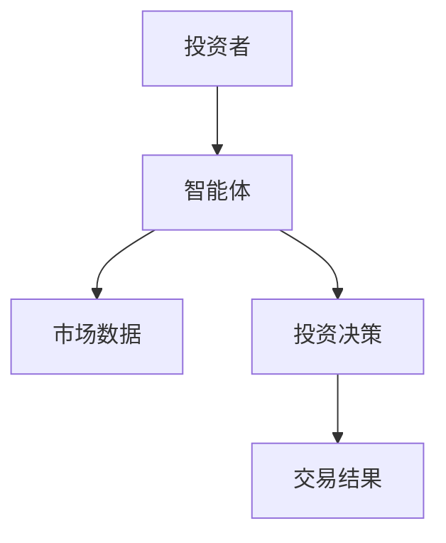
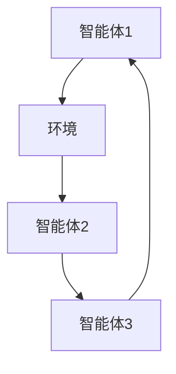
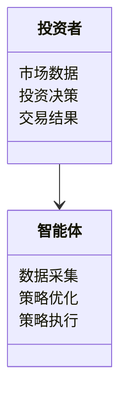
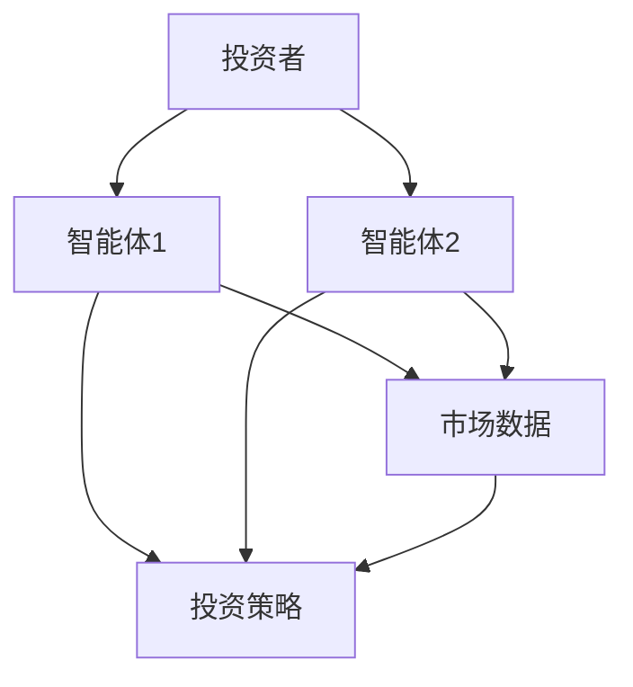
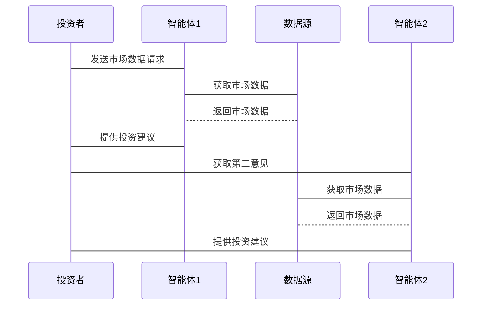

                 


# AI多智能体增强价值投资的跨市场比较分析

> **关键词**：AI多智能体、价值投资、跨市场比较、分布式强化学习、金融数据分析  
>
> **摘要**：本文探讨了AI多智能体技术在价值投资中的应用，分析了其在跨市场环境下的表现与优势。通过构建多智能体协作系统，利用强化学习算法优化投资策略，并结合跨市场数据进行比较分析，提出了一套高效的投资决策框架。文章从背景、原理、实现到实战案例，详细阐述了AI多智能体在价值投资中的潜力与应用。

---

# 第一部分: AI多智能体增强价值投资的背景与概念

## 第1章: AI多智能体增强价值投资的背景与问题描述

### 1.1 问题背景

#### 1.1.1 传统价值投资的局限性
传统价值投资依赖于对市场、行业和个股的深入分析，但存在以下局限性：
- **信息滞后性**：市场数据更新迅速，传统分析难以实时捕捉机会。
- **主观性**：依赖分析师的主观判断，存在人为误差。
- **复杂性**：面对多市场、多资产的投资组合，传统方法难以高效决策。

#### 1.1.2 AI技术在金融领域的应用现状
AI技术在金融领域的应用日益广泛：
- **数据处理**：AI能够快速处理海量金融数据，提取关键信息。
- **预测模型**：基于机器学习的预测模型在股票价格预测中表现优异。
- **自动化交易**：AI驱动的高频交易已成为金融市场的重要参与者。

#### 1.1.3 多智能体系统的优势与潜力
多智能体系统通过分布式协作，能够在复杂环境中实现高效决策：
- **分布式计算**：多个智能体协同工作，降低单点故障风险。
- **动态适应**：智能体能够根据市场变化实时调整策略。
- **决策多样性**：多个智能体从不同角度分析问题，提高决策的全面性。

### 1.2 问题描述

#### 1.2.1 价值投资中的信息不对称问题
信息不对称是金融市场的核心问题之一，价值投资者需要通过技术手段降低这种不对称性。

#### 1.2.2 多智能体协作在投资决策中的应用
通过多智能体协作，投资者能够从多个维度分析市场，制定更优策略。

#### 1.2.3 跨市场比较分析的必要性
不同市场的特性差异显著，通过跨市场比较分析，可以发现潜在投资机会。

### 1.3 问题解决思路

#### 1.3.1 AI多智能体的解决方案
通过构建AI多智能体系统，利用强化学习优化投资策略。

#### 1.3.2 跨市场数据整合与分析方法
整合多市场的数据，建立统一的数据分析框架。

#### 1.3.3 价值投资与AI技术的结合模式
将价值投资的理论与AI技术相结合，形成新的投资模式。

### 1.4 问题的边界与外延

#### 1.4.1 多智能体系统的边界条件
- 数据来源：仅限于公开市场数据。
- 系统规模：适用于中小规模的智能体系统。

#### 1.4.2 跨市场比较的范围与限制
- 市场范围：涵盖主要股票市场和债券市场。
- 数据限制：不包括非公开市场数据。

#### 1.4.3 价值投资的适用场景与非适用场景
- 适用场景：长期投资、防御性投资。
- 非适用场景：短期投机、高风险套利。

### 1.5 核心概念与关系

#### 1.5.1 核心概念对比表

| 概念       | 定义                                                                 | 属性               | 示例                     |
|------------|----------------------------------------------------------------------|--------------------|-------------------------|
| 多智能体系统 | 由多个相互作用的智能体组成的系统                               | 分布式、协作性、自主性 | 金融交易网络           |
| 价值投资   | 通过基本面分析寻找被低估资产的投资策略                         | 长期性、稳定性、防御性 | 股票、债券             |

#### 1.5.2 ER实体关系图


### 1.6 本章小结
本章介绍了AI多智能体增强价值投资的背景，分析了传统价值投资的局限性，提出了多智能体协作的解决方案，并界定了问题的范围和边界。

---

## 第2章: AI多智能体系统的原理与实现

### 2.1 多智能体系统的核心原理

#### 2.1.1 分布式智能体架构
多智能体系统采用分布式架构，每个智能体负责特定任务，通过通信模块协同工作。

#### 2.1.2 智能体之间的通信与协作
智能体之间通过消息传递机制协作，共同完成复杂任务。

#### 2.1.3 多智能体系统的状态空间与动作空间
- **状态空间**：智能体所处的环境状态。
- **动作空间**：智能体可以执行的操作。

### 2.2 价值投资的AI实现

#### 2.2.1 基于深度学习的价值评估模型
使用深度神经网络对市场数据进行特征提取和价值评估。

#### 2.2.2 强化学习在投资决策中的应用
通过强化学习优化投资策略，最大化投资回报。

#### 2.2.3 多智能体协作的数学模型
$$ V(s) = \max_{a} Q(s,a) $$

### 2.3 跨市场比较分析的算法实现

#### 2.3.1 数据预处理与特征提取
对多市场数据进行清洗和特征提取，建立统一的分析框架。

#### 2.3.2 跨市场数据对比的统计方法
使用统计方法分析不同市场的差异性。

#### 2.3.3 跨市场投资策略的优化算法
基于强化学习优化跨市场投资策略。

### 2.4 本章小结
本章详细介绍了AI多智能体系统的原理，分析了其在价值投资中的实现方法，并探讨了跨市场比较分析的算法实现。

---

## 第3章: 多智能体协同学习的算法原理

### 3.1 分布式强化学习算法

#### 3.1.1 分布式强化学习的基本概念
分布式强化学习通过多个智能体协作，共同优化投资策略。

#### 3.1.2 多智能体协作的数学模型
$$ V(s) = \max_{a} Q(s,a) $$

#### 3.1.3 多智能体协作的流程图


### 3.2 联合策略优化

#### 3.2.1 联合策略优化的数学公式
$$ \theta_{i+1} = \theta_i + \alpha \nabla_{\theta_i} J(\theta) $$

#### 3.2.2 联合策略优化的流程
1. 各智能体独立更新策略。
2. 智能体之间交换策略参数。
3. 联合优化得到最终策略。

### 3.3 跨市场比较的强化学习模型

#### 3.3.1 跨市场数据的特征提取
使用深度学习模型提取多市场的共性特征。

#### 3.3.2 跨市场比较的强化学习框架
构建跨市场的强化学习框架，优化投资策略。

### 3.4 本章小结
本章详细讲解了多智能体协同学习的算法原理，分析了其在跨市场比较中的应用。

---

# 第四部分: 系统分析与架构设计方案

## 第4章: 系统架构设计

### 4.1 问题场景介绍
构建一个AI多智能体系统，用于跨市场的价值投资。

### 4.2 系统功能设计

#### 4.2.1 领域模型


### 4.3 系统架构设计

#### 4.3.1 系统架构图


### 4.4 系统接口设计
定义智能体之间的接口，确保数据传输和策略协作的高效性。

### 4.5 系统交互流程图

#### 4.5.1 交互流程


### 4.6 本章小结
本章详细设计了AI多智能体系统的架构，明确了各模块的功能和交互流程。

---

# 第五部分: 项目实战

## 第5章: 项目实战

### 5.1 环境安装

#### 5.1.1 安装Python环境
```bash
pip install python3
```

#### 5.1.2 安装相关库
```bash
pip install numpy pandas tensorflow matplotlib
```

### 5.2 核心代码实现

#### 5.2.1 数据采集代码
```python
import pandas as pd
import numpy as np

def get_market_data(market):
    # 数据采集逻辑
    return pd.DataFrame()
```

#### 5.2.2 多智能体协作代码
```python
class Agent:
    def __init__(self, id):
        self.id = id
        self.strategy = None
    
    def update_strategy(self, strategy):
        self.strategy = strategy
```

### 5.3 代码解读与分析
详细解读代码实现，分析各部分的功能和交互。

### 5.4 案例分析
通过具体案例分析AI多智能体系统在跨市场中的表现。

### 5.5 本章小结
本章通过实战项目，详细展示了AI多智能体系统的实现过程。

---

# 第六部分: 最佳实践

## 第6章: 最佳实践

### 6.1 小结
总结AI多智能体在价值投资中的应用。

### 6.2 注意事项
- 数据质量：确保数据的准确性和实时性。
- 系统稳定性：保证智能体协作的高效性。
- 风险控制：制定合理的风险控制策略。

### 6.3 拓展阅读
推荐相关书籍和论文，供读者深入学习。

### 6.4 本章小结
本章提出了AI多智能体在价值投资中的最佳实践，为读者提供了宝贵的参考。

---

# 作者

**作者：AI天才研究院/AI Genius Institute & 禅与计算机程序设计艺术 /Zen And The Art of Computer Programming**

---

本文通过详细分析AI多智能体在价值投资中的应用，探讨了其在跨市场环境下的潜力与挑战。从理论到实践，为读者提供了一套完整的解决方案。希望本文能为金融领域的技术进步和投资决策的优化提供有价值的参考。

