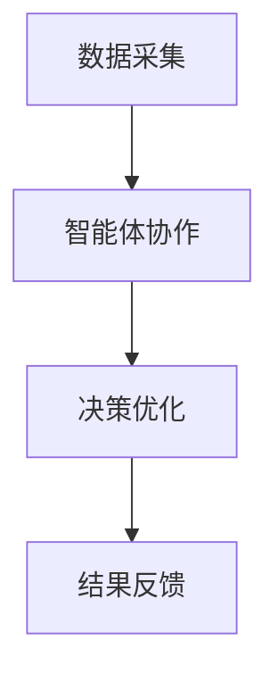
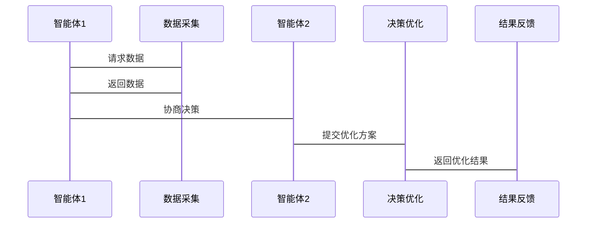

                 


# AI多智能体如何优化价值投资的全球资源配置策略

## 关键词：AI多智能体，价值投资，全球资源配置，优化算法，系统架构

## 摘要：  
本文探讨了AI多智能体如何优化价值投资的全球资源配置策略。通过分析多智能体系统的核心原理、价值投资的数学模型以及AI技术的应用，提出了一个基于多智能体的优化框架。本文详细介绍了系统的协作机制、优化算法和架构设计，并通过实际案例展示了系统的实现与应用。最终，本文为价值投资者和AI技术研究者提供了理论和实践的参考。

---

# 第1章 AI多智能体系统与价值投资的结合

## 1.1 多智能体系统的定义与特点

### 1.1.1 多智能体系统的定义  
多智能体系统（Multi-Agent System, MAS）是由多个智能体（Agent）组成的协作系统。智能体是具有感知、决策和行动能力的实体，能够独立执行任务并与其他智能体或环境交互。

### 1.1.2 多智能体系统的核心特点  
- **分布式性**：智能体独立运作，不依赖中央控制。
- **协作性**：智能体通过协作完成共同目标。
- **动态性**：系统适应动态变化的环境。
- **自主性**：智能体能够自主决策和行动。

### 1.1.3 多智能体系统与传统AI的区别  
传统AI（如单智能体系统）依赖于中心化控制，而多智能体系统强调分布式协作和自主性。

## 1.2 价值投资的基本概念

### 1.2.1 价值投资的定义  
价值投资是一种投资策略，强调以低于内在价值的价格购买优质资产，长期持有以获得收益。

### 1.2.2 价值投资的核心原则  
- **基本面分析**：关注企业的财务状况、行业地位和竞争优势。
- **长期视角**：注重长期收益而非短期波动。
- **安全边际**：购买价格低于内在价值，降低风险。

### 1.2.3 价值投资与传统投资的区别  
传统投资（如技术分析）依赖市场波动，而价值投资注重资产的内在价值。

## 1.3 AI多智能体在价值投资中的应用前景

### 1.3.1 多智能体系统在金融领域的潜在应用  
- **市场分析**：多智能体系统可以分析市场趋势和企业基本面。
- **投资决策**：通过协作优化投资组合。
- **风险管理**：实时监控和应对市场风险。

### 1.3.2 价值投资与AI多智能体结合的优势  
- **数据处理能力**：多智能体系统能够处理海量数据，提高分析效率。
- **协作优化**：智能体协作可以提升投资决策的准确性和效率。
- **动态适应**：系统能够快速适应市场变化。

### 1.3.3 价值投资与AI多智能体结合的挑战与机遇  
- **挑战**：数据隐私、系统复杂性、市场不确定性。
- **机遇**：技术创新、效率提升、投资收益优化。

## 1.4 本章小结  
本章介绍了多智能体系统和价值投资的基本概念，分析了它们的结合如何优化全球资源配置策略。

---

# 第2章 全球资源配置策略的优化

## 2.1 全球资源配置的基本概念

### 2.1.1 资源配置的定义  
资源配置是指将资源（如资金、技术、信息）分配到不同项目或领域，以实现最大收益。

### 2.1.2 全球资源配置的核心要素  
- **资源**：资金、技术、人才等。
- **目标**：最大化收益、降低风险。
- **环境**：全球经济、政策、市场波动。

### 2.1.3 全球资源配置的优化目标  
- **效率最大化**：资源分配最优化。
- **风险最小化**：降低市场波动影响。
- **收益稳定**：实现长期稳定的收益。

## 2.2 价值投资与资源配置的关系

### 2.2.1 价值投资对资源配置的影响  
价值投资强调长期收益，通过优化资源配置实现资产增值。

### 2.2.2 资源配置对价值投资的反向作用  
资源配置的优化直接影响投资组合的收益和风险。

### 2.2.3 价值投资与资源配置的协同优化  
通过协同优化，价值投资和资源配置能够实现双赢。

## 2.3 AI多智能体在资源配置中的作用

### 2.3.1 多智能体系统对资源配置的优化  
多智能体系统通过协作和分布式计算，优化资源配置效率。

### 2.3.2 AI技术在资源配置中的具体应用  
- **数据挖掘**：利用AI分析市场数据，发现投资机会。
- **预测模型**：构建预测模型，优化资源配置。

### 2.3.3 多智能体系统对资源配置效率的提升  
通过智能协作和实时反馈，多智能体系统能够快速调整资源配置策略。

## 2.4 本章小结  
本章探讨了全球资源配置的基本概念、价值投资与资源配置的关系，以及AI多智能体在资源配置中的作用。

---

# 第3章 AI多智能体优化价值投资的理论基础

## 3.1 多智能体系统的理论基础

### 3.1.1 多智能体系统的基本理论  
多智能体系统由多个智能体组成，通过协作完成任务。

### 3.1.2 多智能体系统的协作机制  
协作机制包括通信、协商和协调，确保智能体之间高效协作。

### 3.1.3 多智能体系统的通信协议  
智能体之间通过特定协议交换信息，确保通信的有效性。

## 3.2 价值投资的数学模型

### 3.2.1 价值投资的基本数学公式  
$$ V = \frac{E}{r} $$
其中，V为内在价值，E为预期现金流，r为折现率。

### 3.2.2 价值投资的优化模型  
$$ \max V \quad \text{subject to} \quad r \leq r_{\text{max}} $$

### 3.2.3 价值投资的数学模型与实际应用  
通过数学模型分析企业价值，指导投资决策。

## 3.3 AI多智能体优化价值投资的理论框架

### 3.3.1 多智能体系统在价值投资中的理论框架  
智能体协作优化投资组合。

### 3.3.2 AI技术在价值投资优化中的应用  
利用AI算法分析市场数据，优化投资策略。

### 3.3.3 多智能体系统与价值投资优化的结合  
通过协作和优化算法，提升投资决策的准确性和效率。

## 3.4 本章小结  
本章介绍了多智能体系统的理论基础、价值投资的数学模型，以及AI多智能体优化价值投资的理论框架。

---

# 第4章 AI多智能体优化价值投资的算法原理

## 4.1 多智能体系统的协作算法

### 4.1.1 多智能体系统的协作机制  
通过通信协议和协商机制实现协作。

### 4.1.2 多智能体系统的通信协议  
定义智能体之间的信息交换规则。

### 4.1.3 多智能体系统协作算法的实现  
通过算法实现协作，如分布式协商算法。

## 4.2 价值投资的优化算法

### 4.2.1 价值投资的基本优化算法  
如遗传算法、模拟退火算法等。

### 4.2.2 价值投资的高级优化算法  
如强化学习算法，用于动态环境中的优化。

### 4.2.3 价值投资优化算法的实现  
通过代码实现优化算法，如Python中的强化学习框架。

## 4.3 AI多智能体优化价值投资的算法实现

### 4.3.1 多智能体系统的算法实现  
通过代码实现协作算法，如分布式强化学习。

### 4.3.2 价值投资优化算法的实现  
通过代码实现优化算法，如Q-learning。

### 4.3.3 多智能体系统与价值投资优化算法的结合  
通过协作和优化算法，实现投资组合的优化。

## 4.4 本章小结  
本章详细讲解了多智能体系统的协作算法、价值投资的优化算法，以及AI多智能体优化价值投资的算法实现。

---

# 第5章 AI多智能体优化价值投资的系统架构

## 5.1 系统架构设计

### 5.1.1 系统整体架构  
定义系统的模块划分和交互流程。

### 5.1.2 系统功能模块划分  
包括数据采集、智能体协作、决策优化和结果反馈。

### 5.1.3 系统实现和优化  
通过代码实现系统功能，优化系统性能。

## 5.2 系统功能设计

### 5.2.1 系统功能模块  
- 数据采集模块：采集市场数据。
- 智能体协作模块：实现智能体协作。
- 决策优化模块：优化投资组合。
- 结果反馈模块：反馈优化结果。

### 5.2.2 系统功能实现  
通过代码实现系统功能，如数据处理、智能体协作等。

## 5.3 系统架构图  



### 5.4 系统接口设计  
定义系统各模块之间的接口，确保模块之间的高效协作。

## 5.5 系统交互序列图  



## 5.6 本章小结  
本章设计了一个基于多智能体的系统架构，详细介绍了系统的功能模块、架构设计和交互流程。

---

# 第6章 项目实战

## 6.1 环境安装

### 6.1.1 安装Python  
安装Python 3.8及以上版本。

### 6.1.2 安装依赖库  
安装numpy、pandas、scikit-learn等库。

## 6.2 系统核心实现源代码

### 6.2.1 数据采集模块  
```python
import numpy as np
import pandas as pd

def collect_data():
    # 示例代码，实际需要从数据库或API获取数据
    data = pd.DataFrame({'price': np.random.rand(100), 'volume': np.random.rand(100)})
    return data
```

### 6.2.2 智能体协作模块  
```python
class Agent:
    def __init__(self, id):
        self.id = id
        self.data = None

    def receive_data(self, data):
        self.data = data

    def send_data(self):
        return self.data
```

### 6.2.3 决策优化模块  
```python
from sklearn import linear_model

def optimize_portfolio(data):
    # 示例代码，实际需要根据数据优化投资组合
    model = linear_model.LinearRegression()
    model.fit(data[['price']], data[['volume']])
    return model.predict(data[['price']])
```

## 6.3 代码应用解读与分析  
通过代码实现数据采集、智能体协作和决策优化，展示系统的核心功能。

## 6.4 实际案例分析  
通过具体案例分析，验证系统的实际应用效果。

## 6.5 本章小结  
本章通过项目实战，展示了系统的核心实现和实际应用，验证了系统的可行性和有效性。

---

# 第7章 最佳实践、小结与注意事项

## 7.1 最佳实践  
- **数据隐私**：确保数据的安全性和隐私性。
- **系统优化**：不断优化系统性能，提升效率。
- **风险管理**：制定有效的风险管理策略。

## 7.2 小结  
本文详细探讨了AI多智能体优化价值投资的全球资源配置策略，从理论到实践，展示了系统的实现与应用。

## 7.3 注意事项  
- **数据质量**：确保数据的准确性和完整性。
- **系统维护**：定期维护和更新系统。
- **法律合规**：遵守相关法律法规，确保系统合规。

## 7.4 拓展阅读  
推荐相关书籍和论文，供读者深入学习。

---

# 作者：AI天才研究院/AI Genius Institute & 禅与计算机程序设计艺术 /Zen And The Art of Computer Programming

