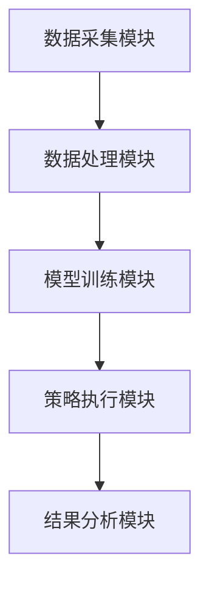

                 


# AI多智能体如何优化价值投资的税收效率

> 关键词：AI多智能体，价值投资，税收效率，强化学习，博弈论，系统架构

> 摘要：本文探讨了AI多智能体在优化价值投资中的税收效率的实现方法，从理论基础、算法设计到系统实现，详细分析了多智能体系统如何通过强化学习、博弈论和分布式计算优化投资决策中的税收效率。文章内容包括多智能体系统概述、AI多智能体在金融中的应用、强化学习与多智能体优化、多智能体进化算法、系统架构与算法实现、项目实战以及总结与展望等部分，结合实际案例和代码实现，全面解析了AI多智能体优化价值投资税收效率的核心原理与应用实践。

---

## 第一部分: AI多智能体与价值投资基础

### 第1章: 多智能体系统概述

#### 1.1 多智能体系统的定义与特点

多智能体系统（Multi-Agent System，MAS）是由多个智能体组成的分布式系统，这些智能体能够通过协作完成复杂任务。以下是多智能体系统的几个关键特点：

- **自主性**：每个智能体都有自己的决策机制，能够独立执行任务。
- **反应性**：智能体能够感知环境并实时调整行为。
- **协作性**：多个智能体通过协作完成比单个智能体更复杂的任务。
- **分布式性**：智能体之间通过分布式通信进行交互。

#### 1.2 价值投资的基本原理

价值投资是一种长期投资策略，强调以低于内在价值的价格购买优质资产。以下是价值投资的核心要素：

- **内在价值**：资产的真正价值，不完全依赖于市场波动。
- **安全边际**：购买价格与内在价值之间的差距，提供保护 against market fluctuations.
- **长期视角**：关注企业的长期盈利能力，而非短期市场波动。

#### 1.3 税收效率的优化目标

税收效率是指在满足税法规定的情况下，尽可能减少税收支出，提高投资收益。优化税收效率的核心目标包括：

- **降低税务成本**：通过合理避税和税务规划，减少税收支出。
- **合规性**：确保投资行为符合税法规定，避免税务风险。
- **优化投资回报**：通过税收优化，提高整体投资回报率。

---

### 第2章: AI多智能体在金融领域的应用

#### 2.1 多智能体在金融中的应用现状

多智能体系统在金融领域的应用广泛，包括股票交易、风险管理和资产配置等。以下是几个典型的应用案例：

- **高频交易**：多智能体通过分布式计算和协作，实现高频交易中的快速决策。
- **风险管理**：多智能体通过实时数据分析，识别和规避市场风险。
- **资产配置**：多智能体通过协作优化资产配置，提高投资收益。

#### 2.2 价值投资中的多智能体优化

在价值投资中，多智能体可以通过以下方式优化投资决策：

- **分散投资**：多个智能体分别关注不同的资产类别，降低投资风险。
- **协作决策**：智能体之间通过协作，综合分析多个因素，提高决策的准确性。
- **动态调整**：根据市场变化，智能体实时调整投资策略。

#### 2.3 税收效率优化的多智能体策略

多智能体系统可以通过以下策略优化税收效率：

- **税务规划**：智能体通过分析税法规定，制定最优的税务规划方案。
- **资产配置优化**：通过协作，优化资产配置，降低税务负担。
- **实时监控**：智能体实时监控市场变化，及时调整投资策略以应对税务变化。

---

## 第二部分: AI多智能体优化的理论基础

### 第3章: 多智能体博弈论基础

#### 3.1 博弈论的基本概念

博弈论是研究理性决策者之间策略互动的数学理论。以下是博弈论的几个核心概念：

- **参与者**：博弈中的决策者。
- **策略**：参与者为实现目标而采取的行动。
- **收益**：参与者在博弈中的所得。
- **纳什均衡**：一种策略组合，使得每个参与者在不改变自身策略的情况下，无法通过单方面改变策略而提高收益。

#### 3.2 多智能体博弈模型

多智能体博弈模型是将博弈论应用于多智能体系统中的模型。以下是多智能体博弈模型的核心要素：

- **博弈空间**：智能体行动的环境。
- **策略空间**：智能体可能采取的行动。
- **收益函数**：智能体采取某种策略后的收益。
- **决策规则**：智能体的决策机制。

#### 3.3 多智能体博弈中的纳什均衡

纳什均衡是多智能体博弈中的一个重要概念。以下是纳什均衡的计算步骤：

1. **确定博弈的收益矩阵**：列出所有可能的策略组合及其对应的收益。
2. **寻找占优策略**：如果某策略在所有可能的情况下都优于其他策略，则该策略为占优策略。
3. **计算纳什均衡**：如果没有任何智能体可以通过单方面改变策略而提高收益，则该策略组合为纳什均衡。

---

### 第4章: 强化学习与多智能体优化

#### 4.1 强化学习的基本原理

强化学习是一种通过试错机制来优化决策的算法。以下是强化学习的核心要素：

- **智能体**：执行动作的主体。
- **环境**：智能体所处的环境。
- **动作**：智能体在环境中的行为。
- **奖励**：环境对智能体行为的反馈。
- **策略**：智能体选择动作的概率分布。

#### 4.2 多智能体强化学习的算法

多智能体强化学习的算法复杂性较高，需要考虑多个智能体之间的协作与竞争。以下是几种常见的多智能体强化学习算法：

- **Q-learning**：基于值函数的强化学习算法，适用于单智能体和多智能体场景。
- **Actor-Critic**：基于策略梯度的强化学习算法，适用于多智能体协作场景。
- **Multi-Agent Q-Learning (MAQL)**：专门针对多智能体场景的强化学习算法。

#### 4.3 强化学习在税收优化中的应用

在税收优化中，强化学习可以通过以下方式优化投资决策：

- **实时决策**：智能体通过强化学习，实时调整投资策略以应对市场变化。
- **风险控制**：通过强化学习，智能体能够识别和规避高风险投资。
- **收益最大化**：通过强化学习，智能体能够优化投资组合，提高投资收益。

---

### 第5章: 多智能体进化算法

#### 5.1 进化算法的基本原理

进化算法是一种基于生物进化机制的优化算法。以下是进化算法的核心步骤：

1. **初始化种群**：随机生成一组候选解。
2. **评估适应度**：计算每个候选解的适应度值。
3. **选择优秀个体**：根据适应度值，选择优秀的个体进行繁殖。
4. **交叉和变异**：通过交叉和变异操作，生成新的候选解。
5. **重复迭代**：重复上述步骤，直到满足终止条件。

#### 5.2 多智能体进化算法的实现

多智能体进化算法通过多个智能体的协作，优化投资组合。以下是多智能体进化算法的核心步骤：

1. **初始化智能体**：生成多个智能体，每个智能体代表一个可能的投资组合。
2. **评估收益与风险**：计算每个智能体的投资收益和风险。
3. **选择优秀智能体**：根据收益与风险，选择优秀的智能体进行繁殖。
4. **交叉与变异**：通过交叉和变异操作，生成新的智能体。
5. **迭代优化**：重复上述步骤，直到找到最优投资组合。

#### 5.3 进化算法在税收优化中的应用

在税收优化中，进化算法可以通过以下方式优化投资组合：

- **全局优化**：通过进化算法，智能体能够全局搜索最优投资组合。
- **适应度函数设计**：根据税收效率目标，设计适应度函数。
- **多目标优化**：通过多目标进化算法，优化多个目标（如收益最大化和风险最小化）。

---

## 第三部分: 系统架构与算法实现

### 第6章: 系统架构设计

#### 6.1 系统功能设计

以下是优化价值投资税收效率的系统功能模块：

1. **数据采集**：采集市场数据、财务数据和税务数据。
2. **数据处理**：清洗和预处理数据，生成适合算法的输入格式。
3. **模型训练**：训练强化学习和进化算法模型。
4. **策略执行**：根据模型输出，执行投资策略。
5. **结果分析**：分析投资结果，优化投资策略。

#### 6.2 系统架构图

以下是系统架构的Mermaid图：



#### 6.3 接口设计

以下是系统接口设计的描述：

- **数据接口**：与数据源（如交易所和税务系统）对接，获取实时数据。
- **模型接口**：与强化学习和进化算法模型对接，获取投资策略。
- **用户接口**：与用户交互，展示投资结果和优化建议。

---

### 第7章: 算法实现

#### 7.1 强化学习算法实现

以下是基于Q-learning的强化学习算法实现：

```python
class QLearning:
    def __init__(self, state_space, action_space):
        self.q_table = np.zeros((state_space, action_space))
    
    def choose_action(self, state, epsilon):
        if np.random.random() < epsilon:
            return np.random.randint(action_space)
        return np.argmax(self.q_table[state])
    
    def update_q_table(self, state, action, reward, next_state, alpha, gamma):
        self.q_table[state][action] = (1 - alpha) * self.q_table[state][action] + alpha * (reward + gamma * np.max(self.q_table[next_state]))
```

#### 7.2 进化算法实现

以下是基于遗传算法的进化算法实现：

```python
def evolve_population(population, fitness_fn, mutation_rate):
    population = sorted(population, key=lambda x: fitness_fn(x), reverse=True)
    selected = population[:int(len(population)/2)]
    new_population = []
    for i in range(len(selected)):
        for j in range(i, len(selected)):
            if i != j:
                child = crossover(selected[i], selected[j])
                if random.random() < mutation_rate:
                    mutate(child)
                new_population.append(child)
    return new_population
```

---

## 第四部分: 项目实战

### 第8章: 项目实战

#### 8.1 环境搭建

以下是项目环境搭建的步骤：

1. **安装依赖**：安装Python、TensorFlow、Keras和Scikit-learn。
2. **数据准备**：收集市场数据、财务数据和税务数据。
3. **环境配置**：配置开发环境，如Jupyter Notebook或PyCharm。

#### 8.2 核心实现

以下是强化学习算法的核心实现：

```python
import numpy as np
import random

class MultiAgentQLearning:
    def __init__(self, num_agents, state_space, action_space):
        self.agents = [QLearning(state_space, action_space) for _ in range(num_agents)]
    
    def choose_actions(self, states, epsilon):
        return [agent.choose_action(state, epsilon) for agent, state in zip(self.agents, states)]
    
    def update_q_tables(self, states, actions, rewards, next_states, alpha, gamma):
        for i in range(len(self.agents)):
            self.agents[i].update_q_table(states[i], actions[i], rewards[i], next_states[i], alpha, gamma)
```

#### 8.3 实际案例分析

以下是实际案例分析的步骤：

1. **数据准备**：收集相关数据，包括股票价格、财务指标和税法规定。
2. **模型训练**：训练强化学习和进化算法模型。
3. **策略执行**：根据模型输出，执行投资策略。
4. **结果分析**：分析投资结果，优化投资策略。

---

## 第五部分: 总结与展望

### 第9章: 总结与展望

#### 9.1 总结

本文详细探讨了AI多智能体在优化价值投资税收效率中的应用。通过强化学习和进化算法，多智能体系统能够优化投资策略，提高投资收益。以下是本文的核心总结：

- **多智能体系统的优势**：通过协作和分布式计算，优化投资决策。
- **强化学习的应用**：通过实时决策和风险控制，优化投资策略。
- **进化算法的优势**：通过全局搜索和多目标优化，优化投资组合。

#### 9.2 未来研究方向

以下是未来研究的方向：

- **多智能体协同优化**：研究多智能体之间的协同优化机制。
- **复杂场景下的应用**：研究多智能体系统在复杂金融环境中的应用。
- **算法优化**：研究更高效的强化学习和进化算法。

---

## 作者信息

作者：AI天才研究院/AI Genius Institute & 禅与计算机程序设计艺术 /Zen And The Art of Computer Programming

