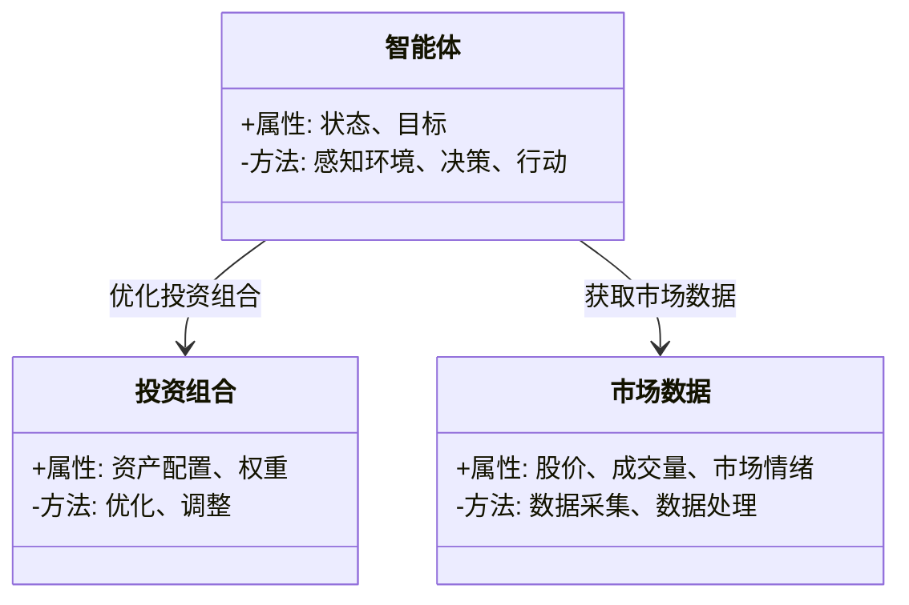
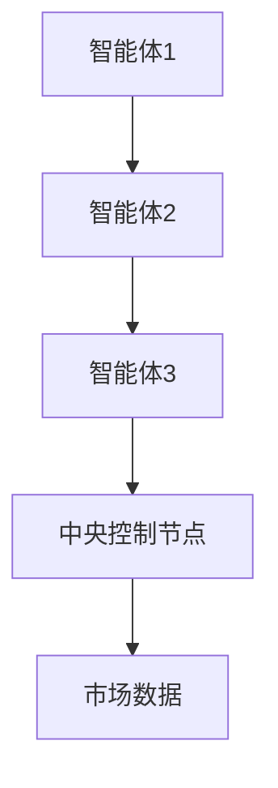
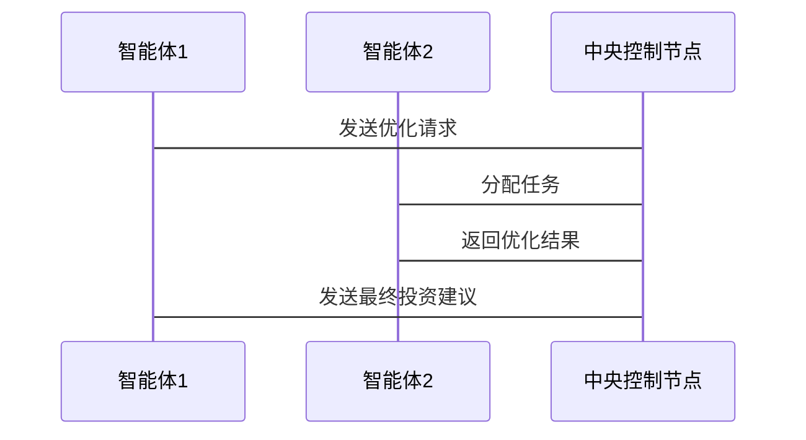

                 


# AI多智能体如何优化价值投资的资金管理策略

> 关键词：AI多智能体、价值投资、资金管理策略、优化算法、系统架构

> 摘要：本文探讨了AI多智能体技术在优化价值投资资金管理策略中的应用。通过分析多智能体系统的协作机制、价值投资模型的构建，以及基于强化学习和遗传算法的优化方法，本文详细讲解了如何利用AI技术提升资金管理效率和收益。文章还结合实际案例，展示了AI多智能体在金融投资中的潜力和优势。

---

## 第1章: 多智能体系统与价值投资的背景介绍

### 1.1 多智能体系统的基本概念

#### 1.1.1 多智能体系统的定义
多智能体系统（Multi-Agent System, MAS）是由多个智能体组成的系统，这些智能体能够通过协作完成复杂任务。每个智能体都有一定的自主性，能够感知环境并做出决策。

#### 1.1.2 多智能体系统的特征
- **自主性**：智能体能够独立决策。
- **协作性**：多个智能体通过协作完成任务。
- **反应性**：智能体能够实时感知环境并做出反应。
- **分布性**：智能体之间的任务分配和资源分配是分布式的。

#### 1.1.3 多智能体系统在金融领域的应用
在金融领域，多智能体系统可以用于股票交易、风险管理、投资组合优化等场景。通过多个智能体的协作，可以实现更高效的交易策略和更优化的投资组合。

### 1.2 价值投资的基本原理

#### 1.2.1 价值投资的定义
价值投资是一种投资策略，强调以低于内在价值的价格购买优质资产。其核心在于寻找市场低估的股票，并长期持有。

#### 1.2.2 价值投资的核心理念
- **长期投资**：关注企业的长期价值，而非短期波动。
- **安全边际**：以低于内在价值的价格买入，以降低风险。
- **基本面分析**：通过分析企业的财务状况、行业地位等因素，评估其内在价值。

#### 1.2.3 价值投资与传统投资策略的区别
传统投资策略（如技术分析）侧重于市场的短期波动，而价值投资更关注企业的长期基本面。AI多智能体系统可以通过对大量数据的分析，辅助投资者做出更明智的决策。

---

## 第2章: 资金管理策略的优化

### 2.1 资金管理的基本概念

#### 2.1.1 资金管理的定义
资金管理是指对投资资金的分配和使用进行规划和控制，以实现投资目标。

#### 2.1.2 资金管理的目标
- **最大化收益**：在风险可控的前提下，实现收益最大化。
- **控制风险**：通过合理的资产配置，降低投资风险。
- **灵活性**：根据市场变化，及时调整资金分配。

#### 2.1.3 资金管理的风险与收益平衡
在资金管理中，收益与风险是相互关联的。高收益往往伴随着高风险，因此需要通过科学的策略来平衡两者。

### 2.2 传统资金管理策略的局限性

#### 2.2.1 传统资金管理的常见问题
- **信息处理能力有限**：传统策略难以处理海量数据。
- **决策滞后**：依赖人工分析，可能导致决策延迟。
- **主观性**：依赖分析师的主观判断，存在人为误差。

#### 2.2.2 传统策略在复杂市场中的不足
随着市场的复杂化和不确定性增加，传统策略在应对复杂情况时显得力不从心。

#### 2.2.3 传统策略的优化方向
通过引入AI技术，可以提高资金管理的效率和准确性，减少人为误差，实现更优化的资产配置。

---

## 第3章: AI多智能体系统的核心概念与原理

### 3.1 多智能体系统的协作机制

#### 3.1.1 协作的定义与重要性
协作是指多个智能体为了共同目标而协同工作。协作机制是多智能体系统的核心，决定了系统能否高效完成任务。

#### 3.1.2 协作的基本原则
- **目标一致性**：所有智能体必须有共同的目标。
- **信息共享**：智能体之间需要共享信息。
- **任务分配**：根据智能体的能力和当前任务，动态分配任务。

#### 3.1.3 协作的实现方法
- **分布式协作**：智能体在没有中央控制的情况下自主协作。
- **集中式协作**：由中央控制节点协调各智能体的协作。
- **混合式协作**：结合分布式和集中式协作的优点。

### 3.2 多智能体系统的通信机制

#### 3.2.1 通信的定义
通信是指智能体之间交换信息的过程。

#### 3.2.2 通信协议的选择
- **同步通信**：智能体之间同步交换信息。
- **异步通信**：智能体之间异步交换信息。

#### 3.2.3 通信的实现方式
- **直接通信**：智能体之间直接交换信息。
- **间接通信**：通过中间媒介交换信息。

---

## 第4章: 价值投资模型的构建

### 4.1 价值投资模型的基本框架

#### 4.1.1 模型的输入变量
- **企业基本面数据**：如营业收入、净利润、资产负债率等。
- **市场数据**：如股票价格、成交量、市场情绪等。

#### 4.1.2 模型的输出变量
- **内在价值**：模型计算出的企业内在价值。
- **投资建议**：如买入、卖出或持有。

#### 4.1.3 模型的评估标准
- **准确性**：模型预测的准确性。
- **稳定性**：模型在不同市场环境下的稳定性。

### 4.2 价值投资模型的优化

#### 4.2.1 模型优化的目标
- **提高准确性**：通过优化模型参数，提高预测的准确性。
- **降低风险**：通过优化资产配置，降低投资风险。

#### 4.2.2 常用的优化方法
- **参数优化**：通过调整模型参数，找到最优解。
- **结构优化**：优化模型的结构，使其更简洁、高效。

#### 4.2.3 优化过程中的注意事项
- **避免过拟合**：模型在训练数据上表现良好，但在测试数据上表现不佳。
- **实时更新**：模型需要根据市场变化实时更新。

---

## 第5章: AI多智能体优化资金管理策略的算法原理

### 5.1 多智能体协作算法

#### 5.1.1 分布式协作算法
- **定义**：智能体在没有中央控制的情况下自主协作。
- **实现方法**：通过智能体之间的直接通信完成协作。

#### 5.1.2 集中式协作算法
- **定义**：由中央控制节点协调各智能体的协作。
- **实现方法**：中央控制节点接收各智能体的信息，然后分配任务。

#### 5.1.3 混合式协作算法
- **定义**：结合分布式和集中式协作的优点。
- **实现方法**：部分任务由中央控制节点协调，部分任务由智能体自主完成。

### 5.2 基于强化学习的协作算法

#### 5.2.1 强化学习的基本原理
- **定义**：一种通过试错学习的方法，智能体通过与环境的交互，学习策略以最大化累积奖励。

#### 5.2.2 在多智能体协作中的应用
- **场景**：多个智能体协作完成复杂任务，如股票交易。
- **实现方法**：通过强化学习训练智能体的协作策略。

---

## 第6章: 价值投资模型的优化算法

### 6.1 基于遗传算法的优化

#### 6.1.1 遗传算法的基本原理
- **定义**：一种模拟自然选择和遗传机制的优化算法。
- **步骤**：初始化种群、计算适应度、选择、交叉、变异、保留优良个体。

#### 6.1.2 在价值投资模型中的应用
- **目标**：优化投资组合，最大化收益，最小化风险。
- **实现方法**：通过遗传算法优化投资组合的权重。

---

## 第7章: 系统分析与架构设计方案

### 7.1 问题场景介绍

#### 7.1.1 项目背景
- **目标**：优化价值投资的资金管理策略。
- **需求**：提高投资效率，降低投资风险。

### 7.2 系统功能设计

#### 7.2.1 领域模型类图


### 7.3 系统架构设计

#### 7.3.1 系统架构图


### 7.4 系统接口设计

#### 7.4.1 接口设计
- **输入接口**：接收市场数据和智能体的信息。
- **输出接口**：输出投资建议和优化结果。

### 7.5 系统交互序列图



---

## 第8章: 项目实战

### 8.1 环境安装

#### 8.1.1 安装Python
- 使用Anaconda安装Python 3.8及以上版本。

#### 8.1.2 安装依赖库
```bash
pip install numpy pandas scikit-learn
```

### 8.2 系统核心实现源代码

#### 8.2.1 多智能体协作代码
```python
import numpy as np
import pandas as pd
from sklearn.decomposition import PCA

class Agent:
    def __init__(self, id):
        self.id = id
        self.state = None
        self.target = None

    def perceive(self, environment):
        self.state = environment.get_state()

    def decide(self):
        if self.state is not None:
            return self.target
        else:
            return None

class Environment:
    def __init__(self):
        self.agents = []
        self.data = None

    def add_agent(self, agent):
        self.agents.append(agent)

    def get_state(self):
        if self.data is not None:
            return self.data
        else:
            return None

# 示例环境数据
env = Environment()
agent1 = Agent(1)
agent2 = Agent(2)
env.add_agent(agent1)
env.add_agent(agent2)

env.data = "Market data"
agent1.perceive(env)
agent2.perceive(env)
```

#### 8.2.2 价值投资模型代码
```python
import numpy as np
import pandas as pd
from sklearn.decomposition import PCA

def calculate_intrinsic_value(fundamental_data):
    # 示例：计算内在价值
    pca = PCA(n_components=2)
    pca.fit(fundamental_data)
    return pca.explained_variance_ratio_

# 示例基本面数据
fundamental_data = pd.DataFrame({
    'revenue': [100, 200, 300],
    'profit': [50, 100, 150]
})

intrinsic_value = calculate_intrinsic_value(fundamental_data)
print("Intrinsic Value:", intrinsic_value)
```

### 8.3 代码应用解读与分析

#### 8.3.1 多智能体协作代码解读
- **Agent类**：定义了智能体的基本属性和方法，包括感知环境和决策。
- **Environment类**：定义了环境的基本属性和方法，包括添加智能体和获取状态。
- **协作过程**：智能体通过环境感知数据，然后做出决策。

#### 8.3.2 价值投资模型代码解读
- **calculate_intrinsic_value函数**：使用主成分分析（PCA）计算内在价值。
- **基本面数据**：包括收入和利润等数据。
- **结果**：输出内在价值。

### 8.4 实际案例分析和详细讲解剖析

#### 8.4.1 案例背景
假设我们有一个包含多个股票的基本面数据，我们需要通过AI多智能体系统优化投资组合。

#### 8.4.2 案例分析
- **数据采集**：采集相关股票的基本面数据和市场数据。
- **模型构建**：构建价值投资模型，计算内在价值。
- **优化策略**：通过多智能体协作优化投资组合。

#### 8.4.3 实施步骤
1. **数据预处理**：清洗和标准化数据。
2. **模型训练**：训练价值投资模型。
3. **优化投资组合**：通过多智能体协作优化投资组合。

### 8.5 项目小结

#### 8.5.1 项目成果
- 成功构建了AI多智能体系统。
- 优化了价值投资的资金管理策略。

#### 8.5.2 经验总结
- 数据质量对模型性能影响重大。
- 多智能体协作需要良好的通信机制。

---

## 第9章: 总结与展望

### 9.1 最佳实践 tips

#### 9.1.1 技术实现
- 确保数据质量。
- 选择合适的算法。

#### 9.1.2 项目管理
- 明确目标。
- 合理分配资源。

### 9.2 小结

#### 9.2.1 核心内容回顾
- 多智能体系统的基本概念。
- 价值投资模型的构建。
- AI优化资金管理策略的算法原理。

### 9.3 注意事项

#### 9.3.1 技术风险
- 模型过拟合。
- 算法收敛问题。

#### 9.3.2 实施风险
- 数据获取难度。
- 系统维护成本。

### 9.4 拓展阅读

#### 9.4.1 推荐书籍
- 《算法导论》
- 《机器学习实战》

#### 9.4.2 推荐论文
- 多智能体系统在金融中的应用。
- 强化学习在投资中的应用。

---

## 作者：AI天才研究院/AI Genius Institute & 禅与计算机程序设计艺术 /Zen And The Art of Computer Programming

---

以上是《AI多智能体如何优化价值投资的资金管理策略》的完整内容，涵盖了从背景介绍到实际应用的各个方面，结合了理论与实践，为读者提供了全面的指导。

