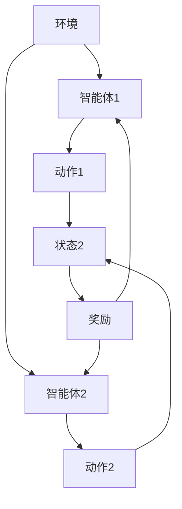

                 


---

# AI多智能体如何优化价值投资的跨境并购策略

**关键词**：AI多智能体、价值投资、跨境并购、强化学习、多智能体协同、数据驱动决策

**摘要**：  
本文探讨了AI多智能体在优化价值投资和跨境并购策略中的应用。通过分析多智能体系统的原理、价值投资的核心原则以及跨境并购的关键挑战，本文揭示了如何利用AI多智能体技术克服信息不对称、优化投资决策并提升并购成功率。文章结合算法原理、系统架构设计和实际案例，详细阐述了AI多智能体在金融领域的创新应用，并展望了未来的研究方向。

---

## 第1章: AI多智能体与价值投资的背景

### 1.1 多智能体系统的基本概念

#### 1.1.1 多智能体系统的定义  
多智能体系统（Multi-Agent System, MAS）是由多个智能体组成的分布式系统，这些智能体通过协作完成复杂任务。每个智能体都有自己的目标、知识和行为方式。

#### 1.1.2 多智能体系统的特征  
- **自主性**：智能体能够自主决策。  
- **反应性**：智能体能实时感知环境并做出反应。  
- **协作性**：智能体之间通过通信和协作完成任务。  
- **分布式性**：系统中的智能体是分布式的，没有集中控制中心。  

#### 1.1.3 多智能体系统与传统单智能体系统的区别  
| 特性 | 多智能体系统 | 单智能体系统 |  
|------|--------------|---------------|  
| 结构 | 分布式、协作式 | 集中式、单一控制 |  
| 通信 | 智能体之间有通信 | 无通信 |  
| 效率 | 可能更高，但复杂 | 较简单 |  

---

### 1.2 价值投资的基本概念

#### 1.2.1 价值投资的定义  
价值投资是一种投资策略，通过分析公司的基本面（如财务状况、行业地位、竞争优势）来寻找被市场低估的投资标的。

#### 1.2.2 价值投资的核心原则  
- **长期视角**：关注公司的长期价值，而非短期价格波动。  
- **安全边际**：买入价格低于内在价值，以降低风险。  
- **分散投资**：通过投资多个标的分散风险。  

#### 1.2.3 价值投资与其它投资策略的对比  
| 策略 | 价值投资 | 技术分析 |  
|------|----------|----------|  
| 基础 | 公司基本面 | 市场价格波动 |  
| 优点 | 长期稳定收益 | 短期趋势预测 |  
| 缺点 | 需要深入研究 | 易受市场情绪影响 |  

---

### 1.3 跨境并购策略的基本概念

#### 1.3.1 跨境并购的定义  
跨境并购是指一家公司收购另一家位于不同国家或地区的公司，涉及跨国界的资本流动和资源整合。

#### 1.3.2 跨境并购的主要类型  
- **横向并购**：收购同行业竞争对手。  
- **纵向并购**：收购供应链上下游企业。  
- **混合并购**：收购与主业无关但具有战略价值的企业。  

#### 1.3.3 跨境并购的关键成功因素  
- **目标选择**：选择具有增长潜力和竞争优势的目标企业。  
- **文化整合**：并购后的企业文化融合。  
- **法律与税务优化**：利用税收优惠和法律漏洞降低并购成本。  

---

### 1.4 AI多智能体在价值投资与并购中的应用前景

#### 1.4.1 AI多智能体在金融领域的潜力  
AI多智能体能够通过分布式协作快速分析海量数据，发现潜在的投资机会。  

#### 1.4.2 跨境并购中的信息不对称问题  
并购过程中，买方和卖方之间存在信息不对称，导致交易成本增加。AI多智能体可以通过数据挖掘和知识图谱技术解决这一问题。  

#### 1.4.3 AI多智能体如何优化价值投资策略  
AI多智能体能够实时监控市场动态，识别被低估的标的，并通过协作优化投资组合。  

---

## 第2章: AI多智能体的原理与算法

### 2.1 多智能体系统的架构

#### 2.1.1 分层架构  
分层架构将系统分为多个层次，每个层次负责不同的功能。例如，感知层负责数据采集，决策层负责制定策略。

#### 2.1.2 分布式架构  
分布式架构通过去中心化的方式分配任务，每个智能体独立决策并协同完成任务。

#### 2.1.3 协作式架构  
协作式架构强调智能体之间的协作，通过通信和协商完成共同目标。

---

### 2.2 多智能体中的通信与协作

#### 2.2.1 智能体之间的通信机制  
智能体之间可以通过消息传递、共享数据库或中间件进行通信。

#### 2.2.2 协作任务分配  
通过协商算法（如拍卖机制）将任务分配给最适合的智能体。

#### 2.2.3 冲突解决策略  
当智能体之间出现冲突时，可以通过优先级排序或仲裁机制解决。

---

### 2.3 基于强化学习的多智能体协同

#### 2.3.1 强化学习的基本原理  
强化学习通过智能体与环境的交互，学习最优策略。智能体通过试错获得奖励或惩罚，逐步优化行为。

#### 2.3.2 多智能体强化学习的挑战  
- **状态空间复杂性**：多个智能体的协作增加了状态空间的复杂性。  
- **动作协调性**：智能体需要协调动作以实现共同目标。  

#### 2.3.3 基于Q-learning的多智能体协同算法  
以下是一个简化的Q-learning算法流程图：



---

### 2.4 多智能体系统中的状态表示与动作选择

#### 2.4.1 状态表示方法  
状态表示可以通过向量、矩阵或图结构表示。例如，金融市场可以用时间序列数据表示。

#### 2.4.2 动作选择策略  
智能体可以根据当前状态选择最优动作，例如“买入”或“卖出”。

#### 2.4.3 状态-动作空间的建模  
使用马尔可夫决策过程（MDP）建模状态-动作空间：

$$ S = \{s_1, s_2, ..., s_n\} $$
$$ A = \{a_1, a_2, ..., a_m\} $$

---

## 第3章: 价值投资中的数据与特征分析

### 3.1 价值投资的关键数据来源

#### 3.1.1 财务数据  
包括收入、利润、资产负债表等。

#### 3.1.2 行业数据  
包括行业趋势、竞争格局等。

#### 3.1.3 宏观经济数据  
包括GDP、利率、通货膨胀等。

---

### 3.2 数据特征的提取与分析

#### 3.2.1 财务指标的特征提取  
提取ROE（净资产收益率）、毛利率等关键指标。

#### 3.2.2 市场情绪的特征提取  
通过自然语言处理（NLP）分析新闻、社交媒体等。

#### 3.2.3 竞争优势的特征提取  
分析企业的专利数量、市场份额等。

---

### 3.3 数据预处理与清洗

#### 3.3.1 数据清洗方法  
去除缺失值、异常值等。

#### 3.3.2 数据标准化与归一化  
使用Z-score标准化或Min-Max归一化。

#### 3.3.3 数据特征选择  
使用LASSO回归或主成分分析（PCA）进行特征选择。

---

### 3.4 数据分析与可视化

#### 3.4.1 数据可视化工具  
使用Matplotlib、Tableau等工具进行数据可视化。

#### 3.4.2 数据分析方法  
包括回归分析、聚类分析等。

#### 3.4.3 数据驱动的决策支持  
通过数据挖掘发现投资机会。

---

## 第4章: AI多智能体在并购策略中的应用

### 4.1 跨境并购中的信息不对称问题

#### 4.1.1 信息不对称的定义  
信息不对称是指交易双方掌握的信息不一致，影响交易效率。

#### 4.1.2 信息不对称对并购的影响  
可能导致并购价格偏离企业真实价值。

#### 4.1.3 如何利用AI多智能体解决信息不对称  
通过大数据分析和知识图谱技术，提高信息透明度。

---

### 4.2 并购目标的筛选与评估

#### 4.2.1 目标公司筛选标准  
包括财务健康、行业地位、竞争优势等。

#### 4.2.2 目标公司评估模型  
使用多智能体协同评估模型，综合多个维度进行评估。

#### 4.2.3 

---

### 4.3 并购过程中的风险控制

#### 4.3.1 风险识别  
通过AI多智能体识别并购中的潜在风险。

#### 4.3.2 风险评估  
使用蒙特卡洛模拟评估风险影响。

#### 4.3.3 风险控制策略  
制定应对措施，降低风险敞口。

---

## 第5章: 项目实战

### 5.1 环境安装

#### 5.1.1 安装Python  
安装Python 3.8及以上版本。

#### 5.1.2 安装依赖库  
安装TensorFlow、Keras、Scikit-learn等库。

#### 5.1.3 安装可视化工具  
安装Matplotlib、Seaborn等可视化库。

---

### 5.2 系统核心实现源代码

#### 5.2.1 多智能体协同算法实现  
以下是基于强化学习的多智能体协同算法代码：

```python
import numpy as np
import tensorflow as tf

# 定义智能体类
class Agent:
    def __init__(self, state_dim, action_dim):
        self.state_dim = state_dim
        self.action_dim = action_dim
        self.model = self.build_model()

    def build_model(self):
        model = tf.keras.Sequential()
        model.add(tf.keras.layers.Dense(64, activation='relu', input_dim=self.state_dim))
        model.add(tf.keras.layers.Dense(self.action_dim, activation='linear'))
        model.compile(optimizer='adam', loss='mse')
        return model

    def act(self, state):
        state = np.array(state).reshape(-1, self.state_dim)
        predicted_q = self.model.predict(state)[0]
        return np.argmax(predicted_q)

# 初始化环境和智能体
state_dim = 6
action_dim = 4
agent = Agent(state_dim, action_dim)

# 训练过程
for episode in range(1000):
    state = env.reset()
    while not done:
        action = agent.act(state)
        next_state, reward, done = env.step(action)
        agent.model.fit(np.array([state]), np.array([reward]), epochs=1, verbose=0)
        state = next_state
```

---

### 5.3 代码应用解读与分析

#### 5.3.1 代码功能解读  
上述代码实现了基于强化学习的多智能体协同算法，智能体通过与环境交互，学习最优策略。

#### 5.3.2 代码实现细节  
- 使用Keras构建深度Q网络模型。  
- 通过试错法优化智能体的行为策略。  

---

### 5.4 实际案例分析

#### 5.4.1 案例背景  
假设一家中国企业在寻找海外并购目标，目标是收购一家欧洲科技公司。

#### 5.4.2 数据分析  
通过AI多智能体分析目标公司的财务数据、行业地位和竞争优势。

#### 5.4.3 并购决策  
基于多智能体协同分析结果，制定并购方案，包括定价、支付方式等。

---

## 第6章: 总结与展望

### 6.1 最佳实践 Tips

#### 6.1.1 数据质量的重要性  
高质量数据是AI多智能体分析的基础。

#### 6.1.2 智能体协作的效率优化  
通过优化通信机制提高协作效率。

#### 6.1.3 风险控制的关键性  
在并购过程中，风险控制至关重要。

---

### 6.2 小结

本文详细探讨了AI多智能体在优化价值投资和跨境并购策略中的应用，通过算法原理、系统架构设计和实际案例分析，展示了AI技术在金融领域的巨大潜力。

---

### 6.3 注意事项

- AI多智能体的应用需要结合具体业务场景。  
- 数据隐私和安全问题需要高度重视。  
- 系统的可解释性是实际应用中的重要考量。

---

### 6.4 拓展阅读

- 《Reinforcement Learning: Theory and Algorithms》  
- 《Multi-Agent Systems: Complexity and Coordination》  
- 《Value Investing: The Classic Approach》  

---

## 作者：AI天才研究院/AI Genius Institute & 禅与计算机程序设计艺术 /Zen And The Art of Computer Programming

---

希望这篇文章能满足您的需求！如果需要进一步调整或补充，请随时告知。

