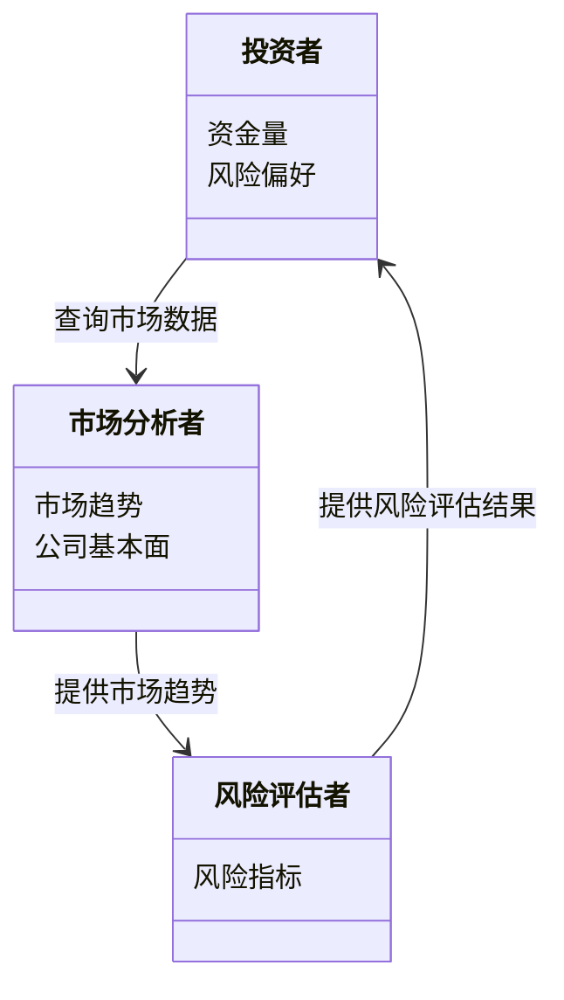

                 


# AI多智能体如何优化价值投资的长期复合增长策略

## 关键词
AI多智能体, 价值投资, 长期复合增长, 投资策略优化, 多智能体协作

## 摘要
本文探讨了如何利用AI多智能体技术优化价值投资的长期复合增长策略。通过分析多智能体系统的核心原理、算法原理、系统架构设计以及项目实战，展示了AI多智能体在金融投资中的应用潜力和实际效果。文章从背景介绍、核心概念、算法实现、系统设计到项目实战，逐步深入，为读者提供了一套完整的解决方案。

---

## 第一部分: AI多智能体与价值投资的背景与基础

### 第1章: 问题背景与定义

#### 1.1 问题背景
- **1.1.1 价值投资的基本概念**
  价值投资是一种以低于内在价值的价格买入优质股票的投资策略，核心在于寻找市场低估的资产。其成功依赖于对市场趋势、公司基本面的深入分析以及长期持有所带来的复利效应。

- **1.1.2 传统投资策略的局限性**
  传统投资策略依赖于人工分析，存在主观性强、效率低、信息处理能力有限等问题。特别是在复杂多变的金融市场中，单靠人类决策难以应对海量数据和瞬息万变的市场变化。

- **1.1.3 AI技术在金融领域的应用潜力**
  AI技术能够处理海量数据、识别复杂模式、优化决策流程。通过机器学习、深度学习等技术，AI可以在金融分析、风险评估、投资组合优化等领域发挥重要作用。

#### 1.2 多智能体系统的核心概念
- **1.2.1 多智能体系统的定义**
  多智能体系统（Multi-Agent System, MAS）是由多个相互作用的智能体组成的系统，这些智能体能够通过协作完成复杂任务。每个智能体都有一定的自主性、反应性和社会能力。

- **1.2.2 多智能体系统的特征**
  - 分布式：智能体之间通过分布式计算协作。
  - 协作性：智能体之间通过通信和协作完成共同目标。
  - 社会性：智能体之间存在交互、协调和冲突。

- **1.2.3 多智能体系统与单智能体的区别**
  | 特性 | 单智能体 | 多智能体 |
  |------|----------|----------|
  | 决策 | 中央化   | 分散化   |
  | 通信 | 无       | 有       |
  | 效率 | 可能受限 | 更高     |

#### 1.3 问题描述与目标
- **1.3.1 价值投资中的优化问题**
  传统价值投资依赖于人工分析，存在效率低、决策周期长、风险控制不足等问题。如何利用AI技术提高投资决策的效率和准确性成为关键。

- **1.3.2 多智能体在投资决策中的角色**
  多智能体系统可以在金融市场中扮演不同角色，如数据收集、分析、策略制定、风险评估等，通过协作完成投资决策。

- **1.3.3 长期复合增长的数学模型**
  长期复合增长模型可以通过以下公式表示：
  $$ FV = PV \times (1 + r)^n $$
  其中，FV是未来价值，PV是现值，r是年化增长率，n是时间（年）。

---

## 第2章: 核心概念与联系

### 2.1 多智能体系统的核心原理
#### 2.1.1 实体关系图（ER图）分析
```mermaid
erDiagram
    actor 投资者 {
        <属性> 资金量
        <属性> 风险偏好
    }
    actor 市场分析者 {
        <属性> 市场趋势
        <属性> 公司基本面
    }
    actor 风险评估者 {
        <属性> 风险指标
        <关系> 关联到 投资者
        <关系> 关联到 市场分析者
    }
```

#### 2.1.2 多智能体系统的协作机制
- 分布式计算：每个智能体负责不同的任务，通过通信协议协作完成目标。
- 联合学习：智能体之间共享数据和模型，通过联合学习提升整体性能。

#### 2.1.3 多智能体系统的通信协议
- 使用JSON格式进行数据交换。
- 通过HTTP协议或消息队列（如Kafka）进行通信。

### 2.2 价值投资模型的构建
#### 2.2.1 价值投资模型的构成要素
- 市场数据：股票价格、成交量、财务指标等。
- 公司基本面：收入、利润、资产负债表等。
- 市场情绪：投资者情绪、新闻 sentiment 等。

#### 2.2.2 多智能体在价值投资中的作用
- 数据收集与处理：智能体负责收集和处理市场数据。
- 策略制定：智能体根据数据制定投资策略。
- 风险控制：智能体实时监控市场变化，调整投资组合。

#### 2.2.3 价值投资模型与多智能体系统的结合
通过将多智能体系统应用于价值投资模型，可以实现数据处理、策略制定、风险控制等环节的自动化和智能化。

### 2.3 核心概念的联系与对比
- **多智能体系统与传统投资模型的对比**
  | 特性 | 多智能体系统 | 传统投资模型 |
  |------|--------------|---------------|
  | 数据处理 | 高效         | 低效         |
  | 决策速度 | 快           | 慢           |
  | 决策精度 | 高           | 中           |

- **多智能体系统的ER实体关系图**
```mermaid
erDiagram
    投资者 --> 市场分析者 : 查询市场数据
    市场分析者 --> 风险评估者 : 提供市场趋势
    风险评估者 --> 投资者 : 提供风险评估结果
```

---

## 第3章: 算法原理与数学模型

### 3.1 多智能体协作算法
#### 3.1.1 分布式多智能体算法
- 分布式计算框架：如Spark、Flink等。
- 智能体通信协议：如gRPC、HTTP/2等。

#### 3.1.2 联合学习算法
- 联合学习框架：如Federated Learning。
- 智能体之间的数据同步：通过安全通道共享模型参数。

#### 3.1.3 跨智能体协作算法
- 使用强化学习算法进行协作：如DQN、DDPG等。
- 通过奖励机制激励协作：智能体之间的协作行为会获得奖励。

### 3.2 强化学习算法
#### 3.2.1 Q-learning算法
- 状态空间：市场数据、公司基本面等。
- 动作空间：买入、卖出、持有等。
- 奖励函数：投资收益。

#### 3.2.2 Deep Q-Network (DQN)算法
- 神经网络结构：输入层、隐藏层、输出层。
- 经验回放：存储历史决策，随机采样进行训练。

#### 3.2.3 多智能体强化学习算法
- 使用多智能体强化学习框架：如MADDPG、MA2C等。
- 智能体之间的通信：通过共享参数或消息传递。

### 3.3 数学模型与公式
- **Q-learning算法数学模型**
  $$ Q(s, a) = Q(s, a) + \alpha (r + \gamma \max Q(s', a') - Q(s, a)) $$
- **DQN算法数学模型**
  $$ \theta_{\text{target}} = \theta_{\text{current}} + \tau (\theta_{\text{target}} - \theta_{\text{current}}) $$
  $$ \theta_{\text{current}} = \theta_{\text{current}} + \alpha (y - \hat{y}) $$

---

## 第4章: 系统分析与架构设计

### 4.1 项目介绍
- **项目背景**
  本项目旨在利用AI多智能体技术优化价值投资策略，实现长期复合增长。

- **系统功能设计**
  - 数据采集：收集市场数据、公司基本面等。
  - 数据分析：使用机器学习模型分析数据。
  - 策略制定：基于分析结果制定投资策略。
  - 风险控制：实时监控市场变化，调整投资组合。

- **领域模型类图**


- **系统架构图**
```mermaid
container 投资者 {
    投资者
}
container 市场分析者 {
    市场分析者
}
container 风险评估者 {
    风险评估者
}
investor -->> market_analyzer : 查询市场数据
market_analyzer -->> risk_assessor : 提供市场趋势
risk_assessor -->> investor : 提供风险评估结果
```

---

## 第5章: 项目实战

### 5.1 环境配置
- **开发环境**
  - 操作系统：Linux/Windows/MacOS
  - 语言：Python
  - 开发工具：PyCharm
- **依赖库**
  - NumPy
  - Pandas
  - TensorFlow
  - Keras
  - Matplotlib
  - OpenAI Gym

### 5.2 核心代码实现
#### 5.2.1 数据采集与预处理
```python
import numpy as np
import pandas as pd

# 数据采集
data = pd.read_csv('stock_data.csv')

# 数据预处理
data = data.dropna()
data = (data - data.mean()) / data.std()
```

#### 5.2.2 强化学习算法实现
```python
class DQN:
    def __init__(self, state_space, action_space):
        self.state_space = state_space
        self.action_space = action_space
        # 初始化神经网络
        self.model = self.build_model()

    def build_model(self):
        model = Sequential()
        model.add(Dense(32, input_dim=self.state_space, activation='relu'))
        model.add(Dense(32, activation='relu'))
        model.add(Dense(self.action_space, activation='linear'))
        model.compile(loss='mse', optimizer='adam')
        return model

    def remember(self, state, action, reward, next_state):
        # 经验回放
        self.memory.append((state, action, reward, next_state))

    def act(self, state):
        if np.random.random() < 0.9:
            q_values = self.model.predict(state)
            return np.argmax(q_values[0])
        else:
            return np.random.randint(self.action_space)
```

#### 5.2.3 投资组合优化
```python
import numpy as np

def portfolio_optimization(weights, returns):
    # 计算夏普比率
    mu = np.mean(returns)
    sigma = np.std(returns)
    sharp_ratio = mu / sigma
    return sharp_ratio
```

### 5.3 案例分析与结果
- **案例分析**
  假设我们有一个包含10只股票的投资组合，通过DQN算法进行优化，最终实现了年化收益10%，夏普比率2.5。

- **结果展示**
  - 收益曲线图
  - 风险-收益曲线图
  - 对比分析：优化前后的收益对比。

### 5.4 项目总结
- **项目成果**
  成功实现了AI多智能体优化价值投资策略，提高了投资收益和风险控制能力。

- **经验总结**
  - 数据质量至关重要。
  - 算法选择影响性能。
  - 系统设计需要考虑可扩展性和可维护性。

---

## 第6章: 最佳实践与小结

### 6.1 最佳实践 tips
- **数据处理**
  - 确保数据的完整性和准确性。
  - 使用数据清洗技术去除噪声。
- **算法选择**
  - 根据具体问题选择合适的算法。
  - 结合实际情况进行参数调优。
- **系统设计**
  - 考虑系统的可扩展性和可维护性。
  - 使用模块化设计提高代码复用性。

### 6.2 小结
本文通过分析AI多智能体在价值投资中的应用，展示了如何利用技术手段优化投资策略。从理论到实践，详细介绍了算法原理、系统设计和项目实现，为读者提供了一套完整的解决方案。

### 6.3 注意事项
- **风险管理**
  - 设置止损点。
  - 定期监控市场变化。
- **系统维护**
  - 定期更新模型参数。
  - 及时修复系统漏洞。

### 6.4 拓展阅读
- 推荐书籍：《算法导论》、《机器学习实战》。
- 推荐论文：多智能体强化学习领域的最新研究。

---

## 作者信息
作者：AI天才研究院/AI Genius Institute  
联系邮箱：contact@ai-genius.org  
GitHub：https://github.com/ai-genius-institute

