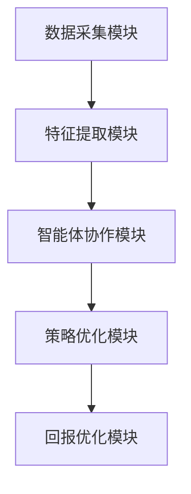

                 


# AI多智能体如何优化价值投资的长期股东回报策略

> 关键词：AI多智能体，价值投资，长期股东回报，强化学习，投资策略优化

> 摘要：本文深入探讨了AI多智能体在优化价值投资策略中的应用，结合算法原理、系统架构和实际案例，详细分析了如何通过多智能体协作提高长期股东回报。文章从价值投资的基本概念出发，逐步展开多智能体系统的协作机制、强化学习算法、投资决策优化等核心内容，并通过实际项目实战和最佳实践，为读者提供了全面的技术指导。

---

# 第一部分: AI多智能体与价值投资概述

## 第1章: 价值投资的基本概念

### 1.1 价值投资的定义与核心理念

价值投资是一种以内在价值为导向的投资策略，强调以低于资产内在价值的价格买入优质资产。其核心理念包括：

1. **安全边际**：买入价格低于内在价值，以降低风险。
2. **长期视角**：关注企业的长期盈利能力，而非短期市场波动。
3. **优质企业**：选择具有竞争优势、良好治理和可持续发展的企业。

### 1.2 价值投资的核心要素

- **内在价值**：企业的基本面分析，包括财务数据、行业地位等。
- **市场情绪**：投资者心理和市场波动对股价的影响。
- **长期回报**：通过持续投资优质资产实现财富增长。

### 1.3 价值投资的长期股东回报目标

长期股东回报的核心目标是通过持续投资优质资产，实现资产的长期增值。传统价值投资依赖于人工分析，效率低且难以应对复杂市场环境。

---

## 第2章: 多智能体系统的协作机制

### 2.1 多智能体系统的定义与特点

多智能体系统（MAS）是由多个智能体组成的协作系统，每个智能体具有自主性、反应性和社会性。其特点包括：

1. **自主性**：智能体能够独立决策。
2. **协作性**：通过通信和协调完成共同目标。
3. **分布式计算**：任务分解到多个智能体完成。

### 2.2 多智能体协作的基本原理

多智能体协作的关键在于智能体之间的通信与协调。通过信息共享和任务分配，多个智能体能够协同完成复杂任务。

### 2.3 多智能体协作在价值投资中的优势

- **分布式决策**：多个智能体分别负责不同的投资领域，提高决策效率。
- **信息共享**：智能体之间共享市场数据和分析结果，降低信息不对称。
- **动态适应**：智能体能够快速响应市场变化，优化投资策略。

---

# 第二部分: 多智能体系统的算法原理

## 第3章: 多智能体强化学习的数学模型

### 3.1 强化学习的基本概念

强化学习（Reinforcement Learning, RL）是一种通过试错机制学习最优策略的方法。智能体通过与环境交互，获得奖励或惩罚，逐步优化决策策略。

### 3.2 多智能体强化学习的挑战

多智能体强化学习（MARL）面临以下挑战：

1. **状态空间**：多个智能体的状态和动作交织，导致状态空间急剧扩大。
2. **动作空间**：智能体之间的动作需要协调，避免冲突。
3. **通信机制**：智能体之间的通信需要高效且有意义。

### 3.3 多智能体强化学习的数学模型

多智能体强化学习的数学模型可以通过以下公式表示：

$$ Q_i(a_i, a_{-i}) = \sum_{j=1}^n Q_j(a_j, a_{-j}) $$

其中，$Q_i$ 表示第i个智能体的Q值函数，$a_i$ 表示第i个智能体的动作，$a_{-i}$ 表示其他智能体的动作。

---

## 第4章: 多智能体协作的算法实现

### 4.1 基于Q-learning的多智能体协作

Q-learning是一种经典的强化学习算法，适用于多智能体协作。通过共享Q值表，多个智能体可以协同完成任务。

### 4.2 基于MAVEN的多智能体协作

MAVEN（Multi-Agent Value Network）是一种基于价值函数的多智能体协作算法，通过共享价值函数实现协作。

### 4.3 基于DQN的多智能体协作

DQN（Deep Q-Network）是一种基于深度学习的强化学习算法，适用于复杂的多智能体协作任务。

---

# 第三部分: 价值投资策略的AI优化

## 第5章: 价值投资策略的AI优化

### 5.1 数据处理与特征提取

- **数据收集**：获取股票市场数据，包括历史价格、财务数据等。
- **特征提取**：提取影响股价的关键特征，如市盈率、市净率等。

### 5.2 多智能体协作的策略优化

- **策略优化**：通过多智能体协作，优化投资组合，降低风险。
- **动态调整**：根据市场变化，动态调整投资策略。

### 5.3 投资组合优化的数学模型

投资组合优化可以通过以下公式表示：

$$ \text{Maximize} \sum_{i=1}^n w_i r_i - \lambda \sum_{i=1}^n w_i^2 $$

其中，$w_i$ 是第i个资产的权重，$r_i$ 是第i个资产的预期收益，$\lambda$ 是惩罚系数。

---

## 第6章: 长期股东回报的优化策略

### 6.1 长期股东回报的定义与目标

长期股东回报是指通过长期持有优质资产实现的收益最大化。其核心目标是通过持续优化投资策略，实现资产的长期增值。

### 6.2 多智能体协作的回报优化

- **回报预测**：通过多智能体协作，预测资产的长期回报。
- **风险控制**：通过多智能体协作，降低投资风险。

### 6.3 回报优化的数学模型

回报优化可以通过以下公式表示：

$$ \text{Maximize} \sum_{t=1}^T r_t $$

其中，$r_t$ 是第t个时间步的回报。

---

## 第7章: 实际案例分析与项目实战

### 7.1 项目背景与目标

- **项目背景**：通过AI多智能体优化价值投资策略。
- **项目目标**：实现一个多智能体协作系统，优化投资组合，实现长期股东回报最大化。

### 7.2 系统架构设计

- **系统功能模块**：数据采集模块、特征提取模块、智能体协作模块、策略优化模块。
- **系统架构图**：如下图所示：



### 7.3 系统实现与代码示例

以下是一个简单的多智能体协作算法实现示例：

```python
import numpy as np

class Agent:
    def __init__(self, state_space, action_space):
        self.state_space = state_space
        self.action_space = action_space
        self.Q = np.zeros((state_space, action_space))

    def act(self, state):
        return np.argmax(self.Q[state])

    def update(self, state, action, reward):
        self.Q[state, action] += reward

# 初始化多智能体系统
state_space = 10
action_space = 5
agents = [Agent(state_space, action_space) for _ in range(3)]

# 多智能体协作
for agent in agents:
    state = np.random.randint(state_space)
    action = agent.act(state)
    reward = np.random.random()
    agent.update(state, action, reward)
```

### 7.4 案例分析与效果评估

通过实际案例分析，验证AI多智能体在优化价值投资策略中的有效性。例如，通过多智能体协作，实现投资组合的动态调整，提高长期股东回报。

---

## 第8章: 最佳实践与总结

### 8.1 最佳实践

- **代码实现注意事项**：确保多智能体协作算法的高效性和准确性。
- **系统设计优化**：合理设计系统架构，确保系统的可扩展性和可维护性。
- **风险控制**：通过多智能体协作，降低投资风险。

### 8.2 总结

本文通过详细分析AI多智能体在优化价值投资策略中的应用，展示了如何通过多智能体协作实现长期股东回报最大化。未来的研究方向包括进一步优化多智能体协作算法，探索更多应用场景。

---

## 作者

作者：AI天才研究院/AI Genius Institute & 禅与计算机程序设计艺术/Zen And The Art of Computer Programming

---

希望这篇文章能够为读者提供清晰的技术指导和深入的理论分析，帮助他们在价值投资领域实现更高效的策略优化。

