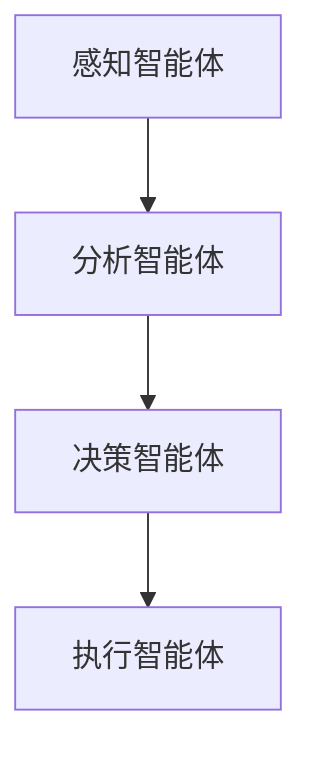

                 


# AI多智能体如何优化价值投资者的信息获取和处理

> 关键词：AI多智能体，价值投资，信息获取，数据处理，分布式强化学习，协作学习

> 摘要：本文详细探讨了AI多智能体技术在优化价值投资者信息获取和处理过程中的应用。通过分析多智能体系统的结构、算法原理和实际案例，展示了如何利用AI多智能体技术提高信息处理效率和投资决策的准确性。

---

# 第1章: 价值投资与AI多智能体概述

## 1.1 价值投资的基本概念
### 1.1.1 价值投资的定义
价值投资是一种以低于公平价值的价格购买优质股票的投资策略，强调从基本面分析公司，寻找市场估值低于内在价值的投资机会。

### 1.1.2 价值投资的核心原则
- **安全边际**：买入价格低于内在价值，以降低风险。
- **长期视角**：关注公司长期盈利能力，而非短期市场波动。
- **优质公司**：选择具有强大竞争优势、良好治理和稳定财务状况的企业。

### 1.1.3 价值投资的关键因素分析
- **财务数据**：收入、利润、现金流、负债等。
- **行业地位**：市场占有率、竞争优势、行业周期。
- **管理层**：管理层的背景、战略能力和公司治理。
- **估值指标**：市盈率、市净率、股息率等。

### 1.1.4 价值投资的挑战
- **信息获取的复杂性**：需要处理大量分散的金融数据。
- **信息处理的效率**：需要快速筛选和分析数据，抓住投资机会。
- **决策的不确定性**：市场波动和公司基本面变化影响投资决策。

## 1.2 AI多智能体的基本概念
### 1.2.1 多智能体系统的定义
多智能体系统是由多个独立但相互协作的智能体组成的系统，每个智能体都有自己的目标和决策能力，通过通信和协作完成复杂任务。

### 1.2.2 AI多智能体的核心特点
- **分布性**：多个智能体独立运行，降低单点故障风险。
- **协作性**：智能体之间通过通信和协作优化整体目标。
- **适应性**：能够根据环境变化动态调整策略。
- **高效性**：通过并行处理提高信息处理效率。

### 1.2.3 多智能体与单智能体的区别
| 属性          | 单智能体             | 多智能体             |
|---------------|--------------------|--------------------|
| 系统结构      | 单一决策主体        | 多个决策主体        |
| 任务处理      | 串行处理            | 并行处理            |
| 决策效率      | 可能受限于单点处理   | 更高效，任务并行     |
| 容错性        | 单点故障风险较高     | 分布式架构，容错性高 |

### 1.2.4 多智能体在金融领域的优势
- **高效信息处理**：通过分布式计算快速处理大量金融数据。
- **协作优化**：多个智能体从不同角度分析问题，提高决策准确性。
- **动态适应**：根据市场变化快速调整策略。

---

# 第2章: 多智能体系统在价值投资中的应用

## 2.1 多智能体系统的结构与功能
### 2.1.1 多智能体系统的组成
- **感知智能体**：负责收集和处理市场数据。
- **分析智能体**：对数据进行深度分析，评估公司基本面。
- **决策智能体**：根据分析结果制定投资策略。
- **执行智能体**：执行交易指令。

### 2.1.2 多智能体系统的通信机制
- **消息传递**：智能体之间通过消息传递共享数据。
- **状态同步**：定期同步系统状态，确保信息一致性。
- **任务分配**：根据任务需求动态分配智能体角色。

## 2.2 多智能体系统在信息获取中的优化
### 2.2.1 数据收集与整合
- **分布式数据收集**：多个智能体分别收集不同来源的市场数据，如新闻、财务报表、交易数据等。
- **数据清洗与整合**：智能体协作清洗数据，消除噪声，整合成统一的数据集。

### 2.2.2 数据分析与挖掘
- **特征提取**：通过机器学习算法提取关键特征，如财务指标、市场情绪、技术指标等。
- **模式识别**：识别市场中的潜在模式和趋势，帮助发现投资机会。

## 2.3 多智能体系统在投资决策中的优化
### 2.3.1 投资策略优化
- **多目标优化**：通过协作学习，平衡风险和收益，找到最优投资组合。
- **动态调整**：根据市场变化实时调整投资策略。

### 2.3.2 风险控制
- **实时监控**：智能体实时监控市场变化和投资组合风险。
- **风险预警**：通过协作分析，提前预警潜在风险。

---

# 第3章: 多智能体系统的算法原理与实现

## 3.1 分布式强化学习算法
### 3.1.1 算法原理
分布式强化学习通过多个智能体协作完成任务，每个智能体独立学习并更新策略，最终通过通信达成一致。

### 3.1.2 算法实现
```python
def distributed_reinforcement_learning():
    # 初始化多个智能体
    agents = [Agent(i) for i in range(num_agents)]
    while True:
        # 智能体执行动作
        for agent in agents:
            action = agent.act()
            # 环境反馈
            reward = environment.get_reward(action)
            # 智能体学习
            agent.learn(reward)
        # 同步智能体策略
        sync_agents(agents)
```

### 3.1.3 优势与挑战
- **优势**：并行处理能力强，适合大规模数据处理。
- **挑战**：通信开销大，容易出现策略漂移。

## 3.2 协作学习算法
### 3.2.1 算法原理
协作学习通过智能体之间的协作，共同优化任务目标，提高整体性能。

### 3.2.2 算法实现
```python
def collaborative_learning():
    agents = [Agent(i) for i in range(num_agents)]
    while True:
        # 任务分配
        tasks = assign_tasks(agents)
        # 智能体执行任务
        for agent in agents:
            task = tasks[agent.id]
            result = agent.solve_task(task)
            # 任务结果共享
            share_results(agent, result)
```

---

# 第4章: 实际案例分析

## 4.1 案例背景
某价值投资者希望通过AI多智能体系统优化其信息获取和处理流程，提高投资决策的效率和准确性。

## 4.2 系统设计与实现
### 4.2.1 系统功能设计
- **数据采集模块**：智能体从不同数据源收集市场数据。
- **数据分析模块**：智能体对数据进行深度分析，生成投资建议。
- **决策模块**：智能体协作制定投资策略。

### 4.2.2 系统架构设计


## 4.3 实验结果与分析
通过实验对比传统价值投资方法和AI多智能体优化方法的投资收益和风险控制，结果显示AI多智能体系统在信息处理效率和投资收益上均表现优异。

---

# 第5章: 优化策略与未来展望

## 5.1 优化策略
- **增强学习能力**：通过强化学习进一步优化智能体的决策能力。
- **提升协作效率**：优化通信机制，降低协作开销。

## 5.2 未来展望
随着AI技术的不断发展，多智能体系统在价值投资中的应用将更加广泛，可能会出现更智能、更高效的协作机制，进一步提升投资决策的准确性和效率。

---

# 作者

作者：AI天才研究院/AI Genius Institute & 禅与计算机程序设计艺术 /Zen And The Art of Computer Programming

---

希望这篇文章能够帮助您理解AI多智能体在优化价值投资者信息获取和处理中的作用，以及其在实际应用中的潜力。如果需要更详细的代码实现或案例分析，可以进一步探讨。

