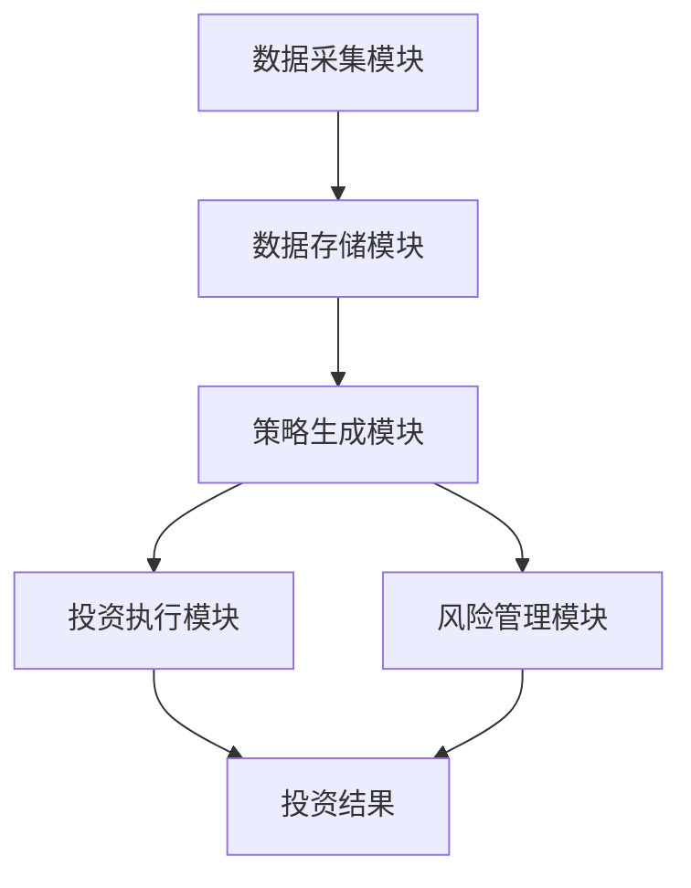

                 


# AI多智能体如何提升价值投资的规模化和个性化

> 关键词：AI多智能体，价值投资，规模化，个性化，多智能体强化学习，系统架构设计

> 摘要：本文探讨了AI多智能体在价值投资中的应用，分析了如何通过AI多智能体技术实现投资的规模化和个性化。文章首先介绍了价值投资和AI多智能体的基本概念，然后详细讲解了AI多智能体的核心原理和算法实现，接着分析了其在价值投资中的系统架构设计，并通过具体案例展示了AI多智能体在价值投资中的实际应用。最后，本文总结了AI多智能体在价值投资中的优势，并展望了未来的发展方向。

---

## 第一章: 价值投资与AI多智能体的背景

### 1.1 价值投资的定义与核心要素

#### 1.1.1 价值投资的基本概念
价值投资是一种以基本面分析为基础的投资策略，旨在通过分析公司的财务状况、行业地位、管理团队等因素，找到被市场低估的优质资产进行长期投资。

#### 1.1.2 价值投资的核心要素
- **公司基本面**：包括收入、利润、资产负债表等。
- **行业地位**：公司在行业中的竞争地位。
- **管理团队**：管理团队的能力和稳定性。
- **估值**：市盈率、市净率等估值指标。

#### 1.1.3 价值投资的边界与外延
价值投资不仅关注企业的内在价值，还需要考虑市场环境、宏观经济等因素。

### 1.2 AI多智能体的定义与特点

#### 1.2.1 AI多智能体的定义
AI多智能体是指由多个具有自主决策能力的智能体组成的系统，能够通过协作完成复杂任务。

#### 1.2.2 AI多智能体的核心特点
- **分布式智能**：每个智能体独立决策，全局目标通过局部协作实现。
- **动态协作**：智能体之间通过通信和协调完成任务。
- **自适应性**：能够根据环境变化动态调整策略。

#### 1.2.3 AI多智能体与传统AI的区别
| 特性 | 传统AI | AI多智能体 |
|------|--------|------------|
| 决策方式 | 单点决策 | 分布式决策 |
| 交互方式 | 无交互 | 有交互 |
| 应用场景 | 单任务 | 多任务协作 |

### 1.3 价值投资中规模化与个性化的挑战

#### 1.3.1 传统价值投资的局限性
- **效率低下**：手动分析耗时耗力。
- **覆盖面有限**：难以覆盖大量标的。
- **个性化不足**：难以满足不同投资者的需求。

#### 1.3.2 规模化投资的难点
- **数据处理能力**：需要处理海量数据。
- **系统稳定性**：需要确保系统的高效运行。
- **风险管理**：如何控制投资风险。

#### 1.3.3 个性化投资的挑战
- **个性化需求多样**：每个投资者的需求不同。
- **动态调整**：需要实时根据市场变化调整策略。
- **数据隐私**：如何保护投资者的隐私数据。

## 第二章: AI多智能体的核心原理

### 2.1 AI多智能体的结构与功能

#### 2.1.1 多智能体系统的组成
- **智能体**：具有感知和决策能力的实体。
- **通信机制**：智能体之间的信息交换。
- **协作机制**：智能体之间的任务分配与协调。

#### 2.1.2 各智能体之间的协作机制
- **任务分配**：根据智能体的能力分配任务。
- **信息共享**：智能体之间共享关键信息。
- **协同决策**：基于共享信息做出集体决策。

### 2.2 AI多智能体的决策机制

#### 2.2.1 分布式决策的基本原理
分布式决策是指每个智能体根据自身信息和全局信息做出决策。

#### 2.2.2 基于博弈论的决策模型
博弈论模型用于分析智能体之间的互动和决策。

#### 2.2.3 动态环境下的适应性决策
智能体能够根据环境变化动态调整决策策略。

### 2.3 AI多智能体的通信与协调

#### 2.3.1 智能体之间的通信协议
- **通信方式**：包括直接通信和间接通信。
- **通信内容**：包括状态、动作和意图。

#### 2.3.2 协作任务的分配策略
- **任务分解**：将复杂任务分解为子任务。
- **任务分配**：根据智能体的能力分配子任务。

#### 2.3.3 冲突解决机制
- **冲突检测**：检测智能体之间的冲突。
- **冲突解决**：通过协商或其他机制解决冲突。

## 第三章: AI多智能体在价值投资中的应用

### 3.1 规模化投资的实现路径

#### 3.1.1 数据采集与处理
- **数据来源**：包括股票数据、新闻数据、社交媒体数据等。
- **数据清洗**：去除噪声数据，确保数据质量。

#### 3.1.2 投资策略的自动化生成
- **策略生成**：基于数据分析生成投资策略。
- **策略优化**：通过算法优化策略。

#### 3.1.3 大规模投资组合的优化
- **组合优化**：通过优化算法找到最优投资组合。
- **风险控制**：控制投资组合的风险。

### 3.2 个性化投资的实现方法

#### 3.2.1 用户需求的精准识别
- **需求分析**：分析用户的投资目标和风险偏好。
- **需求分类**：根据需求将用户分为不同类别。

#### 3.2.2 个性化投资策略的定制
- **策略定制**：根据用户需求定制个性化策略。
- **策略动态调整**：根据市场变化动态调整策略。

#### 3.2.3 个性化风险评估与管理
- **风险评估**：评估用户的投资风险。
- **风险管理**：制定风险管理方案。

### 3.3 AI多智能体在价值投资中的优势

#### 3.3.1 高效性与准确性
AI多智能体能够快速处理大量数据，提高投资决策的准确性和效率。

#### 3.3.2 可扩展性与灵活性
AI多智能体能够轻松扩展，适应不同的投资规模和复杂性。

#### 3.3.3 个性化与智能化
AI多智能体能够根据用户需求提供个性化的投资策略，实现智能化投资。

## 第四章: AI多智能体的算法实现

### 4.1 多智能体强化学习算法

#### 4.1.1 强化学习的基本原理
强化学习是一种通过试错学习的方法，智能体通过与环境交互获得奖励，从而学习最优策略。

#### 4.1.2 多智能体强化学习的挑战
- **协调问题**：多个智能体之间的协作问题。
- **通信问题**：智能体之间的信息交换问题。

#### 4.1.3 多智能体强化学习的数学模型
多智能体强化学习的数学模型可以表示为：
$$ V(s) = \max_{a} Q(s,a) $$
其中，\( V(s) \) 是状态 \( s \) 的价值函数，\( Q(s,a) \) 是状态 \( s \) 下动作 \( a \) 的价值函数。

### 4.2 系统架构设计

#### 4.2.1 系统功能设计
- **数据采集模块**：负责采集投资相关的数据。
- **策略生成模块**：负责生成投资策略。
- **投资执行模块**：负责执行投资策略。
- **风险管理模块**：负责管理投资风险。

#### 4.2.2 系统架构图


### 4.3 项目实战

#### 4.3.1 环境安装
需要安装以下工具：
- Python 3.8+
- TensorFlow 2.0+
- Gym库

#### 4.3.2 核心代码实现
以下是实现多智能体强化学习的Python代码：
```python
import gym
import numpy as np

class MultiAgent:
    def __init__(self, env):
        self.env = env
        self.agents = [self.Agent() for _ in range(env.n_agents)]
    
    class Agent:
        def __init__(self):
            self.state_space = ...  # 状态空间
            self.action_space = ...  # 动作空间
            self.q_table = np.zeros((self.state_space, self.action_space))
        
        def get_action(self, state):
            return np.argmax(self.q_table[state])
    
    def train(self, episodes=1000):
        for episode in range(episodes):
            state = self.env.reset()
            done = False
            while not done:
                actions = [agent.get_action(s) for agent, s in zip(self.agents, state)]
                next_state, rewards, done, _ = self.env.step(actions)
                for i in range(len(self.agents)):
                    self.agents[i].q_table[state[i]][actions[i]] += rewards[i]
                state = next_state
```

#### 4.3.3 案例分析
通过上述代码实现一个多智能体强化学习系统，训练多个智能体在虚拟股票市场中进行投资，最终实现投资收益的最大化。

## 第五章: 总结与展望

### 5.1 总结
本文详细介绍了AI多智能体在价值投资中的应用，分析了其在规模化和个性化投资中的优势，并通过具体案例展示了其实际应用。

### 5.2 展望
未来，AI多智能体技术将在价值投资中发挥更大的作用，尤其是在复杂市场环境下的投资决策和风险管理方面。

---

# 作者：AI天才研究院/AI Genius Institute & 禅与计算机程序设计艺术 /Zen And The Art of Computer Programming

