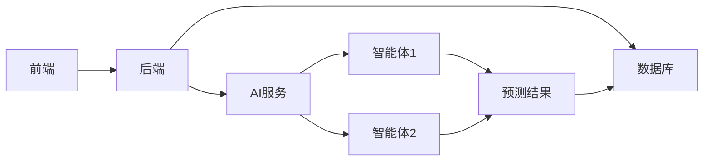

                 


# AI多智能体如何提升对公司未来现金流的预测准确性

> 关键词：AI多智能体，现金流预测，预测准确性，分布式计算，机器学习，协作预测

> 摘要：随着企业对现金流预测需求的增加，传统的单一智能体预测方法在面对复杂多变的市场环境时显得力不从心。通过引入AI多智能体技术，企业能够更好地处理多维度数据，提升预测的准确性和实时性。本文将详细探讨AI多智能体在现金流预测中的应用背景、核心原理、算法实现、系统设计及项目实战，为读者提供全面的技术解析。

---

## 第一部分: AI多智能体与现金流预测的背景介绍

### 第1章: 多智能体系统概述

#### 1.1 多智能体系统的定义与特点
- **1.1.1 多智能体系统的定义**
  - 多智能体系统是由多个独立但协作的智能体组成的系统。
  - 每个智能体都有自己的目标、状态和决策机制。
- **1.1.2 多智能体系统的五大核心特点**
  - 分布式计算能力：多个智能体协同工作，避免单点故障。
  - 多维度数据处理：智能体之间可以共享和整合多种数据源。
  - 高度协作性：智能体通过通信和协调完成共同目标。
  - 自适应性：系统能够根据环境变化动态调整。
  - 并行处理能力：多个智能体可以同时处理不同任务。
- **1.1.3 多智能体系统与传统单智能体模型的对比**
  - 单智能体模型：集中式计算，依赖单一模型，处理能力受限。
  - 多智能体系统：分布式协作，多维度数据处理，灵活性高。

#### 1.2 多智能体系统的实体关系图

```mermaid
graph
    node [智能体1] --> 环境
    node [智能体2] --> 环境
    node [环境] --> 目标
    node [智能体1] --> 目标
    node [智能体2] --> 目标
```

---

### 第2章: 现金流预测的挑战与需求

#### 2.1 现金流预测的重要性
- **2.1.1 现金流预测在企业财务管理中的地位**
  - 现金流是企业生存和发展的关键指标。
  - 准确的现金流预测有助于企业优化资金分配。
- **2.1.2 现金流预测对企业战略决策的价值**
  - 支持投资决策：评估项目的可行性和风险。
  - 优化运营效率：合理安排生产和库存。
  - 管理财务风险：预测潜在的财务危机。

#### 2.2 现金流预测的传统方法与局限性
- **2.2.1 时间序列分析法**
  - 常见方法：ARIMA、ARIMAX等。
  - 优点：适合处理时间序列数据。
  - 局限性：难以处理多维度数据和复杂关系。
- **2.2.2 机器学习模型的应用与不足**
  - 优点：能够捕捉非线性关系，适合大数据分析。
  - 局限性：单模型预测能力有限，难以应对复杂场景。

---

### 第3章: AI多智能体在现金流预测中的应用背景

#### 3.1 多智能体系统在金融领域的优势
- **3.1.1 分布式计算能力**
  - 多智能体可以同时处理多个数据源，提升计算效率。
- **3.1.2 多维度数据处理能力**
  - 系统能够整合市场、行业、公司等多方面数据，提供更全面的预测。
- **3.1.3 高度协作能力**
  - 智能体之间可以共享信息，协同完成复杂预测任务。

#### 3.2 现金流预测的复杂性与多智能体系统的契合点
- **3.2.1 多因素影响的现金流预测**
  - 现金流受市场、政策、行业等多种因素影响。
  - 多智能体系统能够分别处理不同因素，然后协同得出综合预测。
- **3.2.2 多智能体协作的优势**
  - 通过协作，系统可以更准确地捕捉数据之间的关系，提升预测准确性。

---

## 第二部分: AI多智能体的核心概念与联系

### 第4章: 多智能体系统的原理与核心要素

#### 4.1 多智能体系统的协作机制
- **4.1.1 分布式计算与协作**
  - 智能体之间通过分布式计算，减少单点依赖。
- **4.1.2 智能体之间的通信与协调**
  - 通信方式：消息传递、共享数据库等。
  - 协调机制：任务分配、冲突解决等。

#### 4.2 多智能体系统的实体关系图

```mermaid
graph
    node [智能体1] --> 环境
    node [智能体2] --> 环境
    node [环境] --> 目标
    node [智能体1] --> 目标
    node [智能体2] --> 目标
```

---

## 第三部分: 算法原理

### 第5章: 多智能体协同预测的算法实现

#### 5.1 分布式计算与联合学习
- **5.1.1 分布式计算流程**
  - 数据预处理：每个智能体负责处理部分数据。
  - 模型训练：智能体独立训练，然后共享结果。
  - 结果融合：将各智能体的预测结果进行加权融合。
- **5.1.2 联合学习的数学模型**
  - 预测结果融合公式：
  $$ y_{\text{final}} = \sum_{i=1}^{n} w_i y_i $$
  - 其中，$w_i$是智能体i的权重，$y_i$是智能体i的预测结果。

#### 5.2 代码实现与解读

```python
import numpy as np
from sklearn.linear_model import LinearRegression

# 初始化两个智能体
agent1 = LinearRegression()
agent2 = LinearRegression()

# 数据预处理
X1 = np.random.rand(100, 1)
y1 = np.random.rand(100, 1)

X2 = np.random.rand(100, 1)
y2 = np.random.rand(100, 1)

# 智能体训练
agent1.fit(X1, y1)
agent2.fit(X2, y2)

# 预测结果
y_pred1 = agent1.predict(X1)
y_pred2 = agent2.predict(X2)

# 结果融合
weights = [0.6, 0.4]
final_pred = weights[0] * y_pred1 + weights[1] * y_pred2
```

---

## 第四部分: 系统分析与架构设计

### 第6章: 系统设计与架构图

#### 6.1 项目背景与需求分析
- 项目背景：企业需要更精准的现金流预测，以优化财务决策。
- 需求分析：多维度数据处理、高实时性、高准确性。

#### 6.2 系统功能设计
- **功能模块**：
  - 数据采集模块：从多个数据源获取现金流相关数据。
  - 模型训练模块：训练多个智能体，完成预测任务。
  - 预测评估模块：评估预测结果的准确性，调整模型参数。

#### 6.3 系统架构设计



---

## 第五部分: 项目实战

### 第7章: 项目实现与案例分析

#### 7.1 项目环境安装
- 安装Python、TensorFlow、Keras等库。
- 配置开发环境，如Jupyter Notebook或VS Code。

#### 7.2 核心代码实现
- 数据预处理：清洗和整合多维度数据。
- 模型训练：训练多个智能体，完成预测任务。
- 结果融合：将各智能体的预测结果进行加权融合。

#### 7.3 案例分析与结果解读
- 以某公司为例，分析其历史现金流数据。
- 使用多智能体系统进行预测，对比传统方法的准确性。

---

## 第六部分: 最佳实践与小结

### 第8章: 最佳实践与注意事项

#### 8.1 数据质量的重要性
- 确保数据的完整性和准确性。
- 处理缺失值和异常值。

#### 8.2 模型调优的技巧
- 调整智能体的权重和参数。
- 使用交叉验证评估模型性能。

#### 8.3 系统维护与优化
- 定期更新模型参数。
- 监控系统运行状态，及时调整架构。

### 第9章: 总结与展望

#### 9.1 全文总结
- AI多智能体在现金流预测中的优势明显。
- 通过协作预测，企业能够提升预测的准确性和实时性。

#### 9.2 对未来发展的展望
- 结合更多数据源，提升预测精度。
- 引入更复杂的智能体协作机制，如强化学习。
- 探索多智能体在其他领域的应用。

---

## 作者：AI天才研究院/AI Genius Institute & 禅与计算机程序设计艺术/Zen And The Art of Computer Programming

---

### 总结
通过本文的详细分析，我们了解了AI多智能体在现金流预测中的应用价值和实现方法。从背景介绍到算法实现，再到系统设计和项目实战，读者可以全面掌握如何利用多智能体技术提升现金流预测的准确性。未来，随着技术的进步，AI多智能体将在更多领域发挥重要作用。

