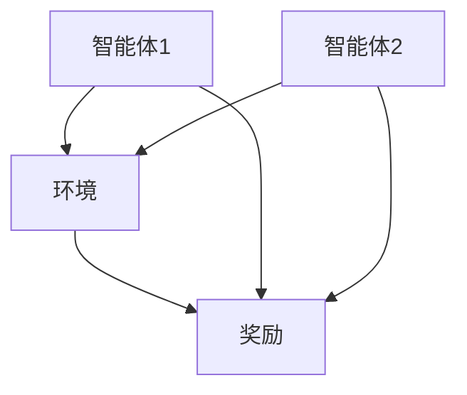
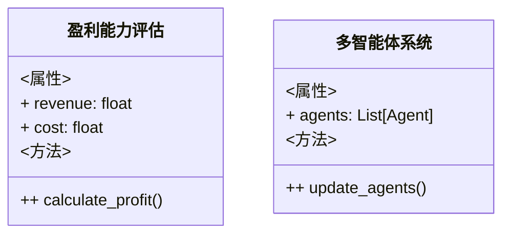
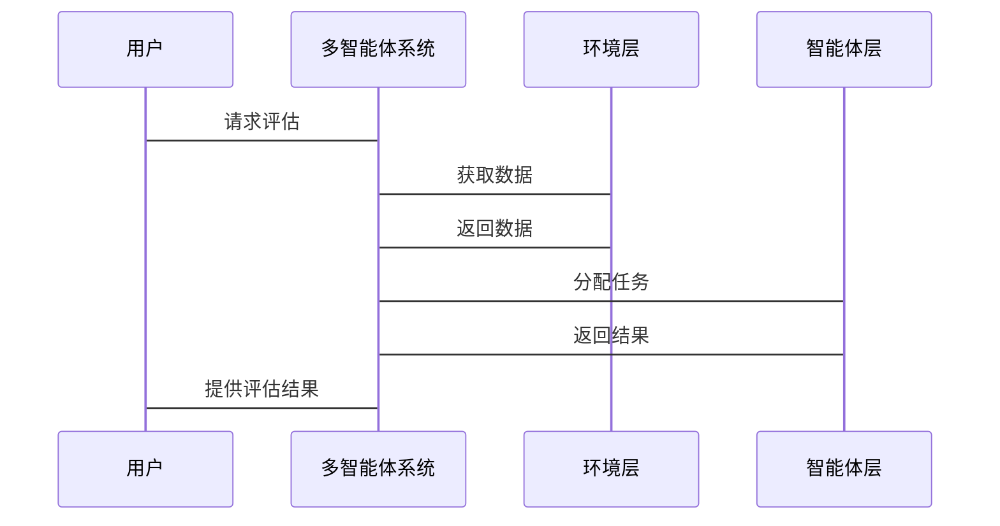

                 


# AI多智能体如何提升对公司长期盈利能力的评估

> 关键词：AI多智能体、长期盈利能力、企业决策、协作式强化学习、收益预测模型、系统架构设计、风险评估

> 摘要：本文探讨了AI多智能体技术如何通过协作式强化学习、数学建模和系统架构设计提升公司长期盈利能力的评估。文章从背景、核心概念、算法原理、系统架构、项目实战等多维度进行详细分析，结合实际案例和代码实现，展示了AI多智能体在企业决策中的应用价值。

---

# 第一部分: AI多智能体与公司长期盈利能力评估的背景与概述

## 第1章: AI多智能体与公司长期盈利能力评估的背景

### 1.1 问题背景与描述
#### 1.1.1 传统公司盈利能力评估的局限性
传统的企业盈利能力评估方法通常依赖于财务数据和历史表现，缺乏对市场动态、竞争环境和内部资源配置的实时优化能力。这种方法在面对复杂多变的市场环境时，往往显得滞后且不够精准。

#### 1.1.2 AI多智能体技术的兴起
随着人工智能技术的快速发展，多智能体系统逐渐成为企业决策的重要工具。多智能体系统通过分布式协作和自适应学习，能够更好地应对复杂的商业环境。

#### 1.1.3 多智能体技术在企业决策中的潜力
多智能体系统可以在企业资源分配、市场预测、风险评估等方面提供更高效、更智能的解决方案，从而显著提升企业的长期盈利能力。

### 1.2 AI多智能体技术的核心概念
#### 1.2.1 多智能体系统的定义
多智能体系统是指由多个相互作用的智能体组成的系统，每个智能体能够独立感知环境、做出决策并进行协作。

#### 1.2.2 多智能体系统的特征
| 特征 | 描述 |
|------|------|
| 分布式智能 | 每个智能体独立运行，共同完成任务。 |
| 协作与竞争 | 智能体之间可以协作，也可以存在竞争关系。 |
| 自适应性 | 系统能够根据环境变化动态调整策略。 |

#### 1.2.3 多智能体系统与单智能体系统的对比
| 对比维度 | 单智能体系统 | 多智能体系统 |
|----------|--------------|--------------|
| 决策方式 | 单点决策 | 分布式决策 |
| 计算复杂度 | 较低 | 较高 |
| 应用场景 | 简单任务 | 复杂任务 |

### 1.3 AI多智能体技术的应用场景
#### 1.3.1 企业资源优化配置
通过多智能体系统，企业可以优化资源配置，提高运营效率。

#### 1.3.2 市场预测与决策支持
多智能体系统能够实时分析市场数据，提供更精准的市场预测和决策支持。

#### 1.3.3 风险评估与管理
多智能体系统可以帮助企业识别和管理潜在风险，降低损失。

### 1.4 本章小结
本章介绍了AI多智能体技术的背景、核心概念及其在企业决策中的潜力，为后续章节的深入分析奠定了基础。

---

# 第二部分: AI多智能体的核心概念与原理

## 第2章: AI多智能体的核心概念与联系

### 2.1 多智能体系统的核心原理
#### 2.1.1 分布式智能
多智能体系统通过分布式计算，将任务分解为多个子任务，由不同的智能体分别完成。

#### 2.1.2 协作与竞争
智能体之间可以通过协作提高整体效率，也可以通过竞争机制激发创新。

#### 2.1.3 自适应与学习
多智能体系统能够通过机器学习技术，不断优化自身的决策策略。

### 2.2 多智能体系统与企业盈利能力的关系
#### 2.2.1 多智能体系统的协作对企业决策的影响
通过协作，智能体可以更好地协调资源，提高决策的准确性。

#### 2.2.2 多智能体系统的自适应能力对市场变化的响应
多智能体系统能够快速适应市场变化，帮助企业及时调整策略。

#### 2.2.3 多智能体系统的预测能力对盈利能力的提升
通过预测市场趋势，多智能体系统可以帮助企业提前布局，提升盈利能力。

### 2.3 多智能体系统的ER实体关系图
```mermaid
er
actor: 公司
actor: 市场环境
actor: 决策者
entity: 盈利能力评估
entity: 多智能体系统
entity: 市场数据
```

### 2.4 本章小结
本章详细介绍了多智能体系统的核心原理及其与企业盈利能力的关系，并通过ER图展示了系统的构成。

---

# 第三部分: AI多智能体的算法原理与数学模型

## 第3章: AI多智能体的算法原理

### 3.1 多智能体系统的算法概述
#### 3.1.1 协作式强化学习
协作式强化学习通过多个智能体的协作，实现共同目标的最大化。

#### 3.1.2 分散式决策算法
分散式决策算法允许每个智能体独立做出决策，同时与其他智能体保持协作。

#### 3.1.3 联合学习算法
联合学习算法通过多个智能体的联合学习，提高整体的决策能力。

### 3.2 协作式强化学习的实现流程


### 3.3 多智能体系统协作算法的Python实现
#### 3.3.1 环境类定义
```python
class Environment:
    def __init__(self):
        self.state = None
        self.reward = 0
```

#### 3.3.2 智能体类定义
```python
class Agent:
    def __init__(self, env):
        self.env = env
        self.strategy = "collaborative"
```

#### 3.3.3 协作学习算法实现
```python
def collaborative_learning(agents, env):
    for agent in agents:
        agent.env.state = env.update_state()
        agent.env.reward = env.calculate_reward(agent.action)
```

### 3.4 本章小结
本章详细介绍了多智能体系统的算法原理，并通过Python代码示例展示了协作式强化学习的实现流程。

---

## 第4章: 多智能体系统的数学模型与公式

### 4.1 多智能体系统的收益预测模型
#### 4.1.1 收益预测公式
$$R = \sum_{i=1}^{n} w_i x_i$$

#### 4.1.2 收益预测模型的优化
$$\theta = \theta + \alpha \cdot (y - \hat{y})$$

### 4.2 多智能体系统的智能体协作机制
#### 4.2.1 协作机制的数学表达
$$C = \sum_{i=1}^{m} a_i \cdot s_i$$

#### 4.2.2 竞争机制的数学表达
$$D = \max_{i} (a_i \cdot s_i)$$

### 4.3 本章小结
本章通过数学公式详细阐述了多智能体系统的收益预测模型和协作机制，为后续的系统设计提供了理论基础。

---

# 第四部分: 系统分析与架构设计方案

## 第5章: 系统分析与架构设计

### 5.1 项目场景介绍
#### 5.1.1 项目背景
企业希望通过多智能体系统优化资源配置，提升长期盈利能力。

#### 5.1.2 项目目标
设计并实现一个多智能体系统，用于企业盈利能力的预测与优化。

### 5.2 系统功能设计
#### 5.2.1 领域模型


#### 5.2.2 系统架构


#### 5.2.3 系统接口
- API接口：用于与其他系统的数据交互。
- 用户接口：用于用户与系统的交互。

#### 5.2.4 系统交互流程


### 5.3 本章小结
本章通过系统分析与架构设计，明确了多智能体系统的实现路径和关键组件。

---

# 第五部分: 项目实战与案例分析

## 第6章: 项目实战

### 6.1 环境安装与配置
#### 6.1.1 安装Python
```bash
pip install python3
```

#### 6.1.2 安装依赖库
```bash
pip install numpy matplotlib
```

### 6.2 系统核心实现
#### 6.2.1 环境类实现
```python
class Environment:
    def __init__(self):
        self.state = None
        self.reward = 0

    def update_state(self):
        # 更新环境状态
        pass

    def calculate_reward(self, action):
        # 计算奖励
        pass
```

#### 6.2.2 智能体类实现
```python
class Agent:
    def __init__(self, env):
        self.env = env
        self.strategy = "collaborative"

    def take_action(self):
        # 执行动作
        pass
```

#### 6.2.3 协作学习算法实现
```python
class CollaborativeLearning:
    def __init__(self, agents, env):
        self.agents = agents
        self.env = env

    def run(self):
        for agent in self.agents:
            agent.env.state = self.env.update_state()
            agent.env.reward = self.env.calculate_reward(agent.take_action())
```

### 6.3 项目实战案例分析
#### 6.3.1 案例背景
某企业希望通过多智能体系统优化资源配置，提升长期盈利能力。

#### 6.3.2 数据分析与处理
使用历史数据训练模型，评估系统的预测能力。

#### 6.3.3 系统优化与调优
通过实验调整参数，优化系统的性能。

### 6.4 本章小结
本章通过项目实战，详细展示了多智能体系统的实现过程，并通过案例分析验证了系统的有效性。

---

## 第7章: 总结与展望

### 7.1 最佳实践 Tips
- 在实际应用中，建议根据具体需求选择合适的算法和模型。
- 定期更新模型参数，保持系统的适应性。

### 7.2 本章小结
本章总结了全文的主要内容，并对未来的研究方向进行了展望。

### 7.3 注意事项
- 系统的复杂性可能增加维护成本。
- 数据隐私和安全问题需要特别注意。

### 7.4 拓展阅读
建议读者进一步阅读相关领域的最新研究成果，如多智能体系统的分布式优化算法。

---

# 作者：AI天才研究院/AI Genius Institute & 禅与计算机程序设计艺术 /Zen And The Art of Computer Programming

---

本文通过详细分析AI多智能体技术的核心概念、算法原理和系统架构设计，展示了其在公司长期盈利能力评估中的巨大潜力。希望本文能够为读者提供有价值的参考，帮助企业更好地利用AI技术提升决策能力。

