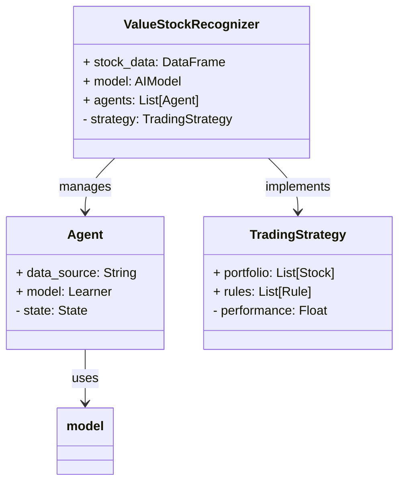

                 


# AI多智能体如何提升对新兴市场价值股的识别

> 关键词：AI多智能体，新兴市场，价值股识别，分布式计算，实时决策，机器学习

> 摘要：本文探讨了如何利用AI多智能体技术提升对新兴市场中价值股的识别能力。通过分析多智能体系统的核心原理、算法设计、系统架构以及实际案例，本文详细阐述了AI多智能体在金融分析中的应用及其优势。文章旨在为金融从业者和AI技术爱好者提供理论与实践相结合的指导。

---

## 第一部分：背景介绍

### 第1章：问题背景与核心概念

#### 1.1 问题背景
- **传统股票分析的局限性**：传统股票分析依赖于人工经验和技术指标，难以应对新兴市场中复杂多变的数据和非线性关系。
- **新兴市场的特点与挑战**：新兴市场数据异质性强，市场波动剧烈，信息不透明，传统方法难以捕捉潜在价值。
- **多智能体技术的引入动机**：多智能体系统能够通过分布式计算和协作学习，有效处理复杂金融数据，提升价值股识别的准确性和实时性。

#### 1.2 问题描述
- **新兴市场价值股识别的复杂性**：新兴市场的公司规模、行业结构差异大，数据来源多样，传统模型难以捕捉潜在价值。
- **数据异质性与非线性关系**：新兴市场数据分布不均匀，非线性关系复杂，传统线性模型效果有限。
- **多智能体协作的优势**：通过多智能体协作，能够从不同角度分析数据，挖掘潜在价值，提高识别效率。

#### 1.3 问题解决路径
- **多智能体系统的解决方案**：利用多智能体系统的分布式计算和协作学习，提升数据处理能力。
- **数据驱动与知识驱动的结合**：结合大数据分析和领域知识，构建更精准的价值股识别模型。
- **分布式计算与实时决策**：通过分布式计算和实时反馈机制，实现快速决策和动态调整。

#### 1.4 边界与外延
- **多智能体系统的边界条件**：系统规模、数据源数量、计算能力等对系统性能的影响。
- **与其他金融分析方法的对比**：与传统统计模型和单一AI模型的对比，分析多智能体的优势和适用场景。
- **新兴市场的动态变化与系统适应性**：系统如何应对市场环境的变化，保持识别能力。

#### 1.5 核心要素组成
- **数据来源与特征提取**：从财务数据、市场行为、新闻情绪等多维度提取特征。
- **多智能体协作机制**：智能体之间的任务分配、信息共享和协同决策。
- **决策模型与反馈机制**：基于多智能体协作的结果，构建决策模型并进行实时反馈。

---

## 第二部分：核心概念与联系

### 第2章：AI多智能体系统的核心原理

#### 2.1 多智能体系统的基本原理
- **多智能体系统的定义与特点**：
  - 多智能体系统是由多个相互作用的智能体组成的分布式系统。
  - 智能体具有自主性、反应性、协作性和学习性。
  - 多智能体系统通过局部决策实现全局优化。

- **多智能体系统的协作机制**：
  - 任务分配：智能体根据自身能力和当前状态分配任务。
  - 信息共享：通过通信协议共享数据和信息。
  - 协同决策：基于共享信息，进行集体决策。

#### 2.2 AI在多智能体系统中的应用
- **机器学习与强化学习的结合**：
  - 机器学习用于特征提取和模式识别。
  - 强化学习用于动态决策和策略优化。

- **大数据分析与实时决策**：
  - 利用分布式计算处理海量数据。
  - 实时反馈机制优化决策策略。

- **分布式计算与实时决策**：
  - 分布式计算提升系统处理能力。
  - 实时决策提高交易和投资的及时性。

#### 2.3 多智能体系统与分布式计算的联系
- **分布式计算的优势**：
  - 提高计算效率和资源利用率。
  - 支持大规模数据处理和实时分析。

- **多智能体系统的特点**：
  - 智能体之间的协作与竞争。
  - 分布式决策与全局优化。

#### 2.4 多智能体系统与实时决策的联系
- **实时决策的重要性**：
  - 新兴市场数据变化快，需要快速响应。
  - 实时反馈机制优化决策策略。

- **多智能体系统的实时性**：
  - 分布式计算支持实时数据处理。
  - 协作学习提升决策效率。

---

## 第三部分：算法原理讲解

### 第3章：多智能体协同学习算法

#### 3.1 多智能体协同学习的基本原理
- **多智能体协同学习的定义**：
  - 多个智能体通过协作学习共同完成任务。
  - 学习过程涉及任务分配、信息共享和策略优化。

- **协同学习的关键步骤**：
  1. 任务分配：根据智能体能力和当前状态分配任务。
  2. 信息共享：智能体之间共享数据和信息。
  3. 策略优化：基于共享信息，优化决策策略。

#### 3.2 基于强化学习的多智能体协作算法
- **强化学习的基本原理**：
  - 通过试错学习，智能体通过与环境交互获得奖励，优化策略。
  - Q-learning和Actor-Critic是常用的强化学习算法。

- **多智能体强化学习的挑战**：
  - 多智能体之间的策略协调。
  - 竞争与合作的平衡。
  - 系统的收敛性问题。

#### 3.3 多智能体协同学习的数学模型
- **Q-learning算法**：
  - Q值更新公式：
  $$ Q(s,a) = Q(s,a) + \alpha [r + \max Q(s',a') - Q(s,a)] $$
  - 其中，$Q(s,a)$是状态-动作值，$\alpha$是学习率，$r$是奖励，$\max Q(s',a')$是下一状态的最大Q值。

- **Actor-Critic算法**：
  - 动作策略（Actor）和价值函数（Critic）的结合。
  - 动作策略通过梯度上升优化，价值函数通过TD误差更新：
  $$ \theta_{\text{actor}} = \theta_{\text{actor}} + \alpha \nabla J $$
  $$ \theta_{\text{critic}} = \theta_{\text{critic}} + \alpha [r + \gamma V(s') - V(s)] $$

#### 3.4 实际案例分析
- **案例：股票交易中的多智能体协同**：
  - 多个智能体分别负责不同的市场数据和分析任务。
  - 通过协同学习优化交易策略，提高价值股识别准确率。

---

## 第四部分：系统分析与架构设计

### 第4章：系统架构设计方案

#### 4.1 问题场景介绍
- **新兴市场价值股识别的复杂性**：
  - 数据来源多样，特征异质性强。
  - 市场波动剧烈，需要实时决策。

#### 4.2 系统功能设计
- **领域模型（Domain Model）**：
  - 定义系统的核心实体和关系。
  - 使用mermaid类图展示系统的模块结构。



- **系统架构设计**：
  - 使用mermaid架构图展示系统的整体结构。


- **接口设计**：
  - API接口定义：
    - `/api/train`: 训练模型。
    - `/api/predict`: 预测价值股。
    - `/api/strategy`: 获取交易策略。

- **交互设计**：
  - 使用mermaid序列图展示系统交互流程。

```mermaid
sequenceDiagram
    client -> server: POST /api/train
    server -> AIModel: train_model
    AIModel -> Agent1, Agent2, Agent3: start_learning
    Agent1 -> database: fetch_data
    Agent1 -> Agent2: share_data
    Agent1 -> Agent3: share_data
    AIModel -> server: model_trained
    server -> client: training_complete
    client -> server: POST /api/predict
    server -> AIModel: predict_value_stock
    AIModel -> Agent1, Agent2, Agent3: get_prediction
    Agent1 -> database: fetch_updated_data
    Agent1 -> Agent2: get_prediction
    Agent1 -> Agent3: get_prediction
    AIModel -> server: prediction_result
    server -> client: predict_result
```

---

## 第五部分：项目实战

### 第5章：项目实战与实现

#### 5.1 环境安装
- **安装Python环境**：
  - 使用Anaconda或virtualenv创建独立环境。
  - 安装必要的库：numpy、pandas、scikit-learn、keras、tensorflow、ray。

- **安装其他工具**：
  - 数据库连接工具（如pymysql）。
  - 可视化工具（如matplotlib、seaborn）。

#### 5.2 系统核心实现源代码
- **多智能体协作框架**：
  - 使用Ray框架实现多智能体协作。

```python
import ray
from ray import tune

@ray.remote
class Agent:
    def __init__(self, agent_id):
        self.agent_id = agent_id
        self.data = None

    def process_data(self, data):
        self.data = data
        return f"Agent {self.agent_id} processed data."

# 启动Ray集群
ray.init()

# 启动多个智能体
agents = [Agent.remote(i) for i in range(4)]

# 分配任务
for agent in agents:
    result = agent.process_data.remote([i for i in range(10)])
```

- **强化学习算法实现**：
  - 使用Keras和TensorFlow实现Q-learning或Actor-Critic算法。

```python
import tensorflow as tf
from tensorflow.keras.layers import Dense, Input
from tensorflow.keras.models import Model

# 定义Actor网络
input_layer = Input(shape=(state_space,))
dense_layer = Dense(32, activation='relu')(input_layer)
output_layer = Dense(action_space, activation='softmax')(dense_layer)
actor = Model(inputs=input_layer, outputs=output_layer)

# 定义Critic网络
input_layer = Input(shape=(state_space,))
dense_layer = Dense(32, activation='relu')(input_layer)
output_layer = Dense(1, activation='linear')(dense_layer)
critic = Model(inputs=input_layer, outputs=output_layer)
```

#### 5.3 代码实现与解读
- **数据预处理**：
  - 从数据库中读取股票数据。
  - 进行特征工程和标准化处理。

- **模型训练**：
  - 使用分布式训练框架（如Ray Tune）训练多智能体模型。
  - 设置合适的超参数，如学习率、批量大小等。

- **模型推理**：
  - 使用训练好的模型进行价值股预测。
  - 输出预测结果并进行可视化分析。

#### 5.4 实际案例分析
- **案例：新兴市场价值股预测**：
  - 选取新兴市场的几只股票，使用多智能体系统进行预测。
  - 对比传统方法和多智能体方法的预测准确率。

#### 5.5 项目小结
- **项目总结**：
  - 多智能体系统在价值股识别中的优势。
  - 项目实现的关键点和难点。
  - 可能的改进方向和未来研究。

---

## 第六部分：最佳实践与注意事项

### 第6章：最佳实践与注意事项

#### 6.1 最佳实践
- **数据质量控制**：
  - 确保数据来源可靠，数据清洗和预处理。
  - 处理缺失值和异常值。

- **模型调优**：
  - 使用交叉验证和网格搜索优化超参数。
  - 定期更新模型，适应市场变化。

- **系统维护与监控**：
  - 实时监控系统性能和交易结果。
  - 定期维护和升级系统。

#### 6.2 小结
- **核心要点回顾**：
  - 多智能体系统的分布式计算和协作学习。
  - 强化学习在实时决策中的应用。
  - 系统架构设计的重要性。

#### 6.3 注意事项
- **数据隐私与安全**：
  - 确保数据处理符合隐私保护法规。
  - 防止数据泄露和攻击。

- **系统稳定性**：
  - 设计容错机制，确保系统稳定运行。
  - 定期进行压力测试。

- **市场适应性**：
  - 系统应具备良好的适应性，应对市场变化。
  - 定期更新模型和策略。

#### 6.4 拓展阅读
- **推荐书籍**：
  - 《Reinforcement Learning: Theory and Algorithms》
  - 《Multi-Agent Systems: Algorithmic, Complexity, and Theory》

- **推荐论文**：
  - "Multi-Agent Reinforcement Learning: A Survey"（2020）
  - "Distributed Machine Learning in Financial Markets"（2021）

---

## 作者

作者：AI天才研究院/AI Genius Institute & 禅与计算机程序设计艺术 /Zen And The Art of Computer Programming

