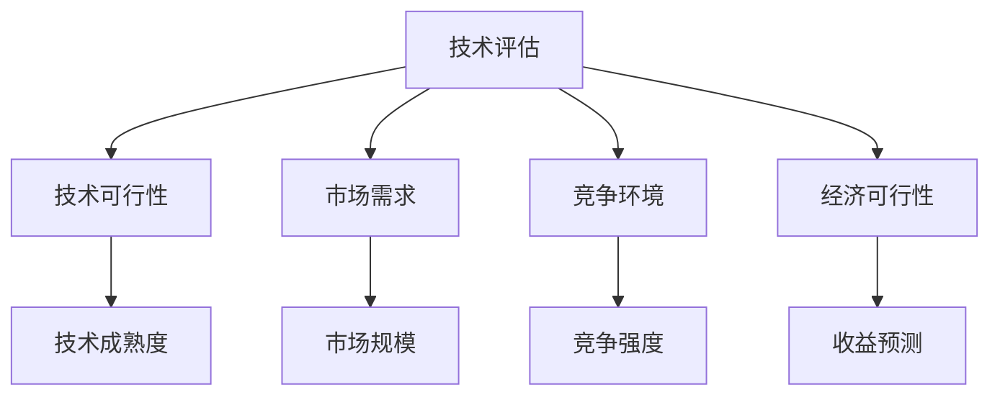
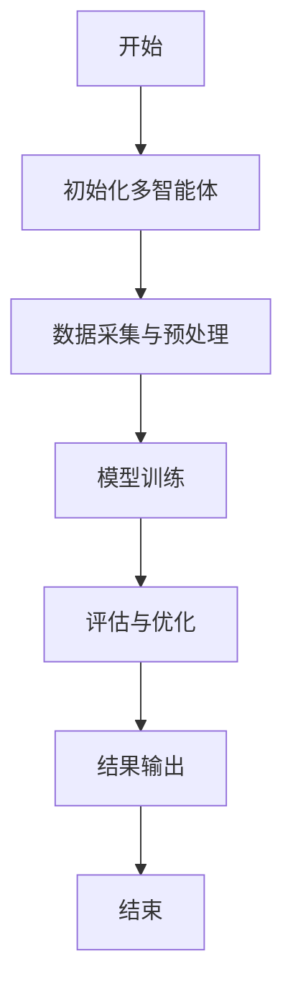
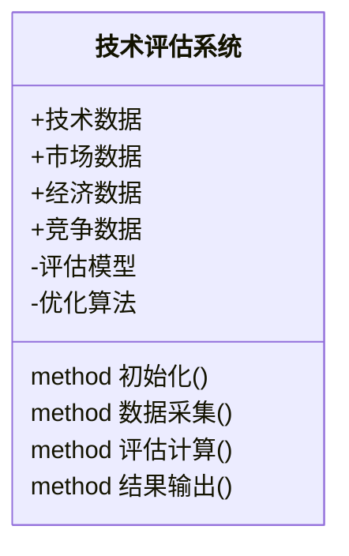

                 


# AI多智能体如何提升对新兴技术商业化潜力的评估

## 关键词：AI多智能体，新兴技术，商业化潜力，技术评估，算法原理

## 摘要：  
本文探讨了AI多智能体在评估新兴技术商业化潜力中的应用，通过背景分析、核心概念、算法原理、系统架构、项目实战和最佳实践等多维度的详细分析，揭示了AI多智能体在技术评估中的优势和实现路径，为读者提供系统的知识框架和实践指导。

---

# 第一部分: AI多智能体与新兴技术商业化潜力评估概述

## 第1章: 背景介绍

### 1.1 问题背景

#### 1.1.1 新兴技术商业化的核心挑战  
新兴技术的商业化潜力评估是一个复杂且充满不确定性的过程。传统评估方法依赖于人类专家的经验和市场调研，但随着技术的快速发展，这种方法逐渐显现出效率低、覆盖面有限、评估结果主观性过强等问题。  

#### 1.1.2 AI多智能体在技术评估中的作用  
AI多智能体通过分布式计算、协同学习和实时数据分析，能够高效地处理复杂的技术评估任务。多智能体系统能够从多个维度（技术可行性、市场需求、竞争环境等）对新兴技术进行综合评估，并提供数据驱动的决策支持。  

#### 1.1.3 问题解决的必要性与边界  
评估新兴技术的商业化潜力，不仅需要考虑技术本身的可行性和创新性，还需要结合市场、政策、资本等多方面因素。AI多智能体的引入，能够显著提升评估的效率和准确性，但同时也需要明确其适用范围和边界。  

### 1.2 核心概念与问题描述

#### 1.2.1 AI多智能体的定义与特点  
AI多智能体是指多个具有自主决策能力的智能体通过协同工作，共同完成复杂任务的系统。其特点包括分布式计算、自主性、协作性和动态适应性。  

#### 1.2.2 技术商业化潜力的评估维度  
技术商业化潜力的评估通常包括以下几个维度：  
1. **技术可行性**：技术的成熟度、可实现性。  
2. **市场需求**：目标市场的规模、用户需求的强度。  
3. **竞争环境**：现有竞争者的技术水平和市场占有率。  
4. **经济可行性**：技术的开发成本、商业化后的收益预测。  

#### 1.2.3 问题解决的路径与方法  
通过构建AI多智能体系统，分别从技术、市场、经济等多个维度对新兴技术进行评估，最终整合各维度的评估结果，得出技术的商业化潜力指数。  

---

## 第2章: AI多智能体的核心概念与联系

### 2.1 核心概念原理

#### 2.1.1 多智能体系统的基本原理  
多智能体系统由多个智能体组成，每个智能体都有自己的目标和行为规则，通过通信和协作完成复杂任务。  

#### 2.1.2 AI在多智能体中的应用  
AI技术（如机器学习、自然语言处理）为多智能体系统提供了数据处理、模式识别和决策支持的能力。  

### 2.2 核心概念属性特征对比表

| **属性**       | **单智能体评估**                     | **多智能体评估**                     |
|----------------|------------------------------------|------------------------------------|
| 评估维度       | 仅考虑单一维度（如技术可行性）       | 多维度综合评估（技术、市场、经济等） |
| 评估效率       | 较低，依赖人工分析                   | 较高，自动化处理多个数据源           |
| 决策准确性       | 易受主观因素影响                     | 更客观，基于多维度数据综合判断       |

### 2.3 ER实体关系图架构



---

## 第3章: AI多智能体评估算法原理

### 3.1 算法原理讲解

#### 3.1.1 算法流程图（使用mermaid）



#### 3.1.2 算法代码实现

```python
def multi_agent_system():
    # 初始化多智能体
    agents = initialize_agents()
    # 数据采集与预处理
    data = preprocess_data()
    # 模型训练
    train_agents(agents, data)
    # 评估与优化
    results = evaluate_agents(agents)
    # 结果输出
    return results
```

### 3.2 数学模型与公式

#### 3.2.1 智能体协作模型

$$ V = \sum_{i=1}^{n} v_i $$  
其中，$v_i$ 表示第i个智能体的贡献值。

#### 3.2.2 技术潜力评估公式

$$ P = \alpha \cdot T + \beta \cdot E $$  
其中，$T$ 表示技术成熟度，$E$ 表示经济可行性，$\alpha$ 和 $\beta$ 是权重系数。

---

## 第4章: 系统架构设计

### 4.1 系统功能设计

#### 4.1.1 领域模型（使用mermaid类图）



#### 4.1.2 系统架构设计（使用mermaid架构图）


---

## 第5章: 项目实战

### 5.1 环境安装

```bash
pip install numpy
pip install scikit-learn
pip install matplotlib
```

### 5.2 核心代码实现

```python
import numpy as np
from sklearn import linear_model

def initialize_agents(n=5):
    return [{'id': i, 'data': []} for i in range(n)]

def preprocess_data(data):
    # 数据预处理逻辑
    pass

def train_agents(agents, data):
    # 模型训练逻辑
    pass

def evaluate_agents(agents):
    # 评估与优化逻辑
    pass
```

---

## 第6章: 最佳实践

### 6.1 小结  
AI多智能体通过分布式计算和多维度分析，显著提升了新兴技术商业化潜力评估的效率和准确性。  

### 6.2 注意事项  
在实际应用中，需注意数据质量和模型的可解释性问题，确保评估结果的可靠性和实用性。  

### 6.3 拓展阅读  
推荐阅读《Multi-Agent Systems: Complexity and Intelligence》和《Artificial Intelligence in Business》等书籍，深入了解多智能体系统的理论与应用。

---

## 作者：AI天才研究院/AI Genius Institute & 禅与计算机程序设计艺术 /Zen And The Art of Computer Programming

---

希望这篇文章能够为读者提供清晰的思路和实用的指导，帮助他们在实际应用中更好地利用AI多智能体技术来评估新兴技术的商业化潜力。

