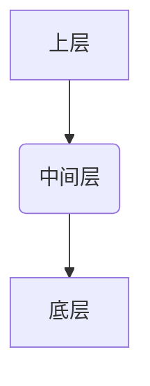
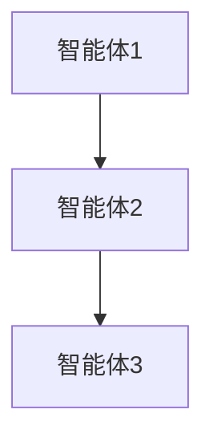
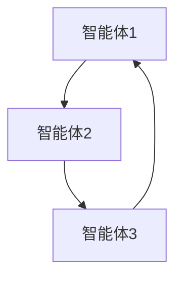
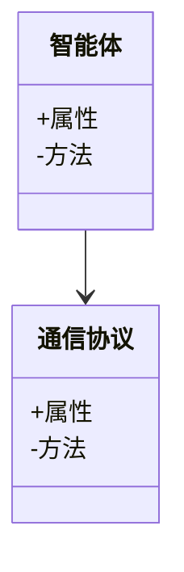

                 


# AI多智能体如何提升对新兴行业价值链的分析

> 关键词：AI多智能体，行业价值链分析，协作优化，系统架构，人工智能

> 摘要：本文探讨AI多智能体在新兴行业价值链分析中的应用，分析多智能体系统的协作机制、优化策略，并通过实际案例展示其在智能制造和绿色能源行业的应用，提出未来发展的方向与挑战。

---

# 第1章: AI多智能体与新兴行业价值链概述

## 1.1 AI多智能体的定义与核心概念

### 1.1.1 多智能体系统的定义
多智能体系统（Multi-Agent System, MAS）是由多个智能体（Agent）组成的分布式系统，这些智能体能够自主决策、协作和通信。智能体可以是软件程序、机器人或其他实体，具备感知环境、自主决策和执行任务的能力。

### 1.1.2 AI多智能体的核心属性
AI多智能体结合了人工智能技术，具备以下核心属性：
1. **自主性**：智能体能够自主决策，无需外部干预。
2. **反应性**：能够实时感知环境变化并做出反应。
3. **协作性**：多个智能体之间能够通信和协作，共同完成任务。
4. **分布式性**：智能体分布在网络中，通过通信进行协作。

### 1.1.3 多智能体与单一智能体的对比
| 对比维度 | 单一智能体 | 多智能体 |
|----------|------------|----------|
| 决策方式 | 中央决策 | 分布式决策 |
| 通信需求 | 无需通信 | 需要通信 |
| 任务复杂度 | 单任务 | 多任务协作 |

---

## 1.2 新兴行业价值链的构成与特点

### 1.2.1 行业价值链的基本结构
行业价值链包括从原材料采购、生产、分销到最终用户的整个过程。新兴行业通常具有快速变化的特点，价值链中的各个环节需要高效协作。

### 1.2.2 新兴行业的特点与挑战
1. **快速变化**：新兴行业通常伴随着技术快速迭代和市场需求的变化。
2. **复杂性**：价值链涉及多个环节和参与者，协调难度大。
3. **数据驱动**：新兴行业依赖于大数据分析和人工智能技术。

### 1.2.3 价值链优化的目标与意义
1. **目标**：通过优化价值链，提高效率、降低成本、增强竞争力。
2. **意义**：优化价值链能够帮助企业在快速变化的市场中保持竞争优势。

---

## 1.3 AI多智能体在行业价值链分析中的作用

### 1.3.1 提高决策效率
AI多智能体能够实时分析数据，快速做出决策，提高整体决策效率。

### 1.3.2 优化资源配置
通过协作和通信，AI多智能体能够优化资源分配，避免浪费。

### 1.3.3 支持创新与协作
多智能体系统能够支持跨部门、跨企业的协作，促进创新。

---

## 1.4 本章小结
本章介绍了AI多智能体的核心概念、行业价值链的构成与特点，以及AI多智能体在行业价值链分析中的作用。

---

# 第2章: 多智能体系统的技术基础

## 2.1 多智能体系统的架构

### 2.1.1 分层架构
分层架构将系统分为多个层次，每个层次负责不同的功能。



### 2.1.2 分布式架构
分布式架构中，智能体分布在不同的节点上，通过通信进行协作。



### 2.1.3 协作式架构
协作式架构强调智能体之间的协作，共同完成任务。



---

## 2.2 多智能体的通信与协作机制

### 2.2.1 通信协议
通信协议定义了智能体之间交换信息的方式。常用的通信协议包括HTTP、WebSocket等。

### 2.2.2 协作算法
协作算法用于智能体之间的协作。例如，基于图灵测试的协作算法：

```python
def turing_test(agent1, agent2):
    # 智能体1和智能体2进行通信
    message = agent1.send_message(agent2)
    response = agent2.receive_message(agent1)
    return message == response
```

### 2.2.3 冲突解决机制
冲突解决机制用于处理智能体之间的冲突。例如，基于协商的冲突解决算法：

```python
def resolve_conflict(agent1, agent2):
    # 协商过程
    proposal = agent1.propose_solution()
    response = agent2.receive_proposal(proposal)
    return response == "accept"
```

---

## 2.3 AI在多智能体中的应用

### 2.3.1 机器学习在多智能体中的应用
机器学习用于智能体的决策和预测。例如，基于神经网络的决策模型：

```latex
$$ y = f(x) $$
```

### 2.3.2 自然语言处理在多智能体中的应用
自然语言处理用于智能体之间的通信和理解。

### 2.3.3 计算机视觉在多智能体中的应用
计算机视觉用于智能体的感知和识别。

---

## 2.4 本章小结
本章介绍了多智能体系统的架构、通信与协作机制，以及AI在多智能体中的应用。

---

# 第3章: 多智能体系统在行业价值链分析中的应用

## 3.1 行业数据的采集与预处理

### 3.1.1 数据来源
数据来源包括传感器、数据库和外部API。

### 3.1.2 数据清洗
数据清洗是去除噪声数据，确保数据质量。

### 3.1.3 数据转换
数据转换包括数据格式转换和数据归一化。

---

## 3.2 多智能体系统的建模与仿真

### 3.2.1 系统建模
系统建模用于描述系统的结构和功能。例如，基于UML的系统建模：



### 3.2.2 仿真过程
仿真过程包括初始化、执行和终止。

### 3.2.3 模型优化
模型优化通过调整参数和算法来提高模型性能。

---

## 3.3 基于多智能体的行业价值链优化

### 3.3.1 优化目标
优化目标包括提高效率、降低成本和增强竞争力。

### 3.3.2 优化策略
优化策略包括资源分配优化和流程优化。

### 3.3.3 优化效果评估
优化效果评估包括效率提升和成本降低。

---

## 3.4 本章小结
本章介绍了多智能体系统在行业价值链分析中的应用，包括数据采集、建模与仿真、优化策略等。

---

# 第4章: 多智能体系统优化策略

## 4.1 多智能体系统的协作优化

### 4.1.1 协作机制设计
协作机制设计包括通信机制和协作算法。

### 4.1.2 协作效果评估
协作效果评估包括协作效率和协作质量。

### 4.1.3 协作策略调整
协作策略调整根据评估结果进行优化。

---

## 4.2 多智能体系统的性能优化

### 4.2.1 计算效率优化
计算效率优化通过优化算法和减少计算量。

### 4.2.2 通信效率优化
通信效率优化通过优化通信协议和减少数据传输量。

### 4.2.3 资源分配优化
资源分配优化通过优化资源分配策略。

---

## 4.3 多智能体系统的鲁棒性与适应性

### 4.3.1 系统鲁棒性设计
系统鲁棒性设计通过设计容错机制和冗余机制。

### 4.3.2 系统适应性调整
系统适应性调整通过动态调整系统参数和结构。

### 4.3.3 系统容错机制
系统容错机制通过检测和修复系统故障。

---

## 4.4 本章小结
本章介绍了多智能体系统的优化策略，包括协作优化、性能优化和鲁棒性设计。

---

# 第5章: 多智能体系统在新兴行业的实际案例分析

## 5.1 案例一：智能制造行业

### 5.1.1 行业背景
智能制造行业是新兴行业之一，具有高度自动化和智能化的特点。

### 5.1.2 多智能体系统的应用
多智能体系统在智能制造中的应用包括生产优化和质量控制。

### 5.1.3 应用效果分析
应用效果包括提高生产效率和降低生产成本。

---

## 5.2 案例二：绿色能源行业

### 5.2.1 行业背景
绿色能源行业是新兴行业之一，致力于减少碳排放和能源浪费。

### 5.2.2 多智能体系统的应用
多智能体系统在绿色能源中的应用包括能源管理和服务优化。

### 5.2.3 应用效果分析
应用效果包括提高能源利用效率和降低运营成本。

---

## 5.3 本章小结
本章通过两个实际案例展示了多智能体系统在新兴行业中的应用效果。

---

# 第6章: 未来发展趋势与挑战

## 6.1 未来发展趋势

### 6.1.1 技术创新
技术创新包括人工智能和多智能体系统的结合。

### 6.1.2 应用扩展
应用扩展包括在更多新兴行业的应用。

### 6.1.3 标准化建设
标准化建设包括多智能体系统的标准化。

---

## 6.2 当前挑战

### 6.2.1 技术挑战
技术挑战包括计算效率和通信效率的提升。

### 6.2.2 应用挑战
应用挑战包括系统的可扩展性和可维护性。

### 6.2.3 伦理挑战
伦理挑战包括数据隐私和算法透明性。

---

## 6.3 本章小结
本章展望了AI多智能体系统的未来发展趋势，并分析了当前面临的主要挑战。

---

# 附录: 多智能体系统开发工具与资源

## 附录A: 开发工具

### A.1 多智能体开发框架
常用的多智能体开发框架包括Jason、OMG-VSM和Dennam。

### A.2 人工智能开发工具
人工智能开发工具包括TensorFlow、PyTorch和Keras。

---

## 附录B: 学习资源

### B.1 在线课程
推荐的在线课程包括Coursera上的《Multi-Agent Systems》和edX上的《Introduction to AI》。

### B.2 书籍推荐
推荐的书籍包括《Multi-Agent Systems: Algorithm and Applications》和《Artificial Intelligence: A Modern Approach》。

---

# 作者：AI天才研究院/AI Genius Institute & 禅与计算机程序设计艺术 /Zen And The Art of Computer Programming

