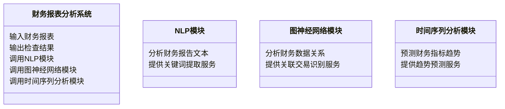
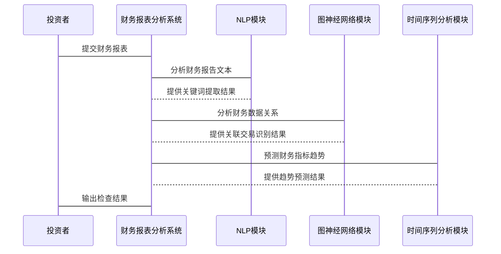

                 


# AI多智能体提升价值投资的财务报表一致性检查

## 关键词：AI多智能体，价值投资，财务报表一致性，自然语言处理，强化学习，图神经网络

## 摘要：本文探讨了如何利用AI多智能体技术提升价值投资中财务报表一致性检查的效率和准确性。通过分析多智能体协作的原理、算法实现及系统架构，结合实际案例，展示了如何在价值投资中构建高效的财务报表分析系统。

---

# 第1章: 问题背景与核心概念

## 1.1 问题背景介绍

### 1.1.1 价值投资的基本概念

价值投资是一种投资策略，旨在通过分析企业的基本面，寻找被市场低估的投资标的。财务报表是评估企业基本面的核心工具，包括资产负债表、利润表和现金流量表等。然而，财务报表的复杂性和多样性使得手动检查一致性变得耗时且容易出错。

### 1.1.2 财务报表一致性检查的重要性

财务报表一致性是指企业在不同会计期间或不同财务报表中的数据是否逻辑一致。一致性检查能够识别潜在的财务造假行为，评估企业的财务健康状况，从而为价值投资提供可靠依据。

### 1.1.3 当前财务报表分析的局限性

传统财务报表分析依赖人工检查，存在效率低、主观性强、覆盖面窄等问题。尤其是在处理大量数据和复杂业务逻辑时，容易出现疏漏。此外，市场环境的变化和企业经营策略的调整，使得财务报表分析需要更灵活和智能的解决方案。

## 1.2 问题描述与目标

### 1.2.1 价值投资中的财务报表分析挑战

价值投资者需要快速、准确地分析企业的财务报表，以识别投资机会。然而，财务报表的复杂性和多样性使得手动检查变得困难，尤其是在处理大量企业数据时。

### 1.2.2 多智能体协作的必要性

单靠一个智能体难以覆盖财务报表分析的所有方面，例如，同时处理文本分析、趋势预测和关系推理。因此，引入多智能体协作，通过分工合作，可以提高分析效率和准确性。

### 1.2.3 提升财务报表一致性的目标

通过AI多智能体技术，实现对企业财务报表的自动化、智能化分析，识别不一致数据，评估企业财务健康状况，为价值投资提供可靠依据。

## 1.3 问题解决思路

### 1.3.1 多智能体协作的基本思路

将财务报表分析任务分解为多个子任务，每个子任务由一个智能体负责，通过智能体之间的协作完成整体分析。

### 1.3.2 AI技术在财务报表分析中的应用

利用自然语言处理（NLP）分析财务报告文本，使用图神经网络推理财务数据之间的关系，通过强化学习优化智能体的协作策略。

### 1.3.3 一致性检查的优化方向

通过多智能体协作，优化财务报表数据的检查逻辑，提高检查的全面性和准确性。

## 1.4 核心概念与边界

### 1.4.1 多智能体系统的定义与特点

多智能体系统是由多个智能体组成的协作系统，每个智能体负责特定任务，通过通信和协作完成整体目标。

### 1.4.2 财务报表一致性的定义与标准

财务报表一致性是指企业在不同会计期间或不同报表中的数据是否一致，通常包括数据逻辑性、会计政策的一致性等。

### 1.4.3 问题的边界与外延

本研究仅关注财务报表一致性检查，不涉及企业外部因素分析，例如市场环境和行业趋势。

## 1.5 核心概念结构

### 1.5.1 多智能体系统的核心要素

- 智能体：负责特定任务的独立实体
- 通信协议：智能体之间交互的规则
- 协作机制：任务分配和结果汇总的方式

### 1.5.2 财务报表分析的关键维度

- 财务数据的逻辑性
- 会计政策的连续性
- 财务指标的合理性

### 1.5.3 一致性检查的逻辑框架

- 数据收集与预处理
- 单项数据检查
- 跨数据检查
- 综合评估

## 1.6 本章小结

本章介绍了价值投资中财务报表一致性检查的重要性，提出了多智能体协作的解决方案，并分析了核心概念和系统结构。

---

# 第2章: AI多智能体的核心原理

## 2.1 多智能体系统的原理

### 2.1.1 多智能体的基本架构

多智能体系统由多个智能体组成，每个智能体负责特定任务，通过通信协作完成整体目标。

### 2.1.2 智能体之间的协作机制

智能体通过共享信息和任务分配实现协作，例如分布式计算和任务分解。

### 2.1.3 基于强化学习的决策过程

智能体通过强化学习优化决策策略，例如使用Q-learning算法。

## 2.2 AI在财务报表分析中的应用

### 2.2.1 自然语言处理在文本分析中的应用

NLP技术用于分析财务报告中的文本，识别关键词和情感倾向。

### 2.2.2 图神经网络在关系分析中的应用

图神经网络用于分析财务数据之间的关系，例如识别关联交易。

### 2.2.3 时间序列分析在趋势预测中的应用

时间序列分析用于预测财务指标的趋势，例如预测企业的销售收入。

## 2.3 多智能体协作的算法原理

### 2.3.1 基于马尔可夫决策过程的智能体行为建模

智能体的行为可以看作是马尔可夫决策过程，通过状态、动作和奖励进行建模。

### 2.3.2 联合强化学习的协作机制

多智能体通过联合强化学习优化协作策略，例如使用分布式Q-learning。

### 2.3.3 分布式计算与通信协议

智能体之间的通信采用分布式架构，例如使用消息队列进行数据交换。

## 2.4 核心概念对比分析

### 2.4.1 多智能体与单智能体的对比

多智能体能够处理更复杂的任务，但实现起来更复杂。

### 2.4.2 不同AI技术在财务分析中的效果对比

NLP适用于文本分析，图神经网络适用于关系推理，时间序列分析适用于趋势预测。

### 2.4.3 一致性检查的指标对比

绝对一致性检查和相对一致性检查在准确性和效率上存在 trade-off。

## 2.5 本章小结

本章详细介绍了AI多智能体的核心原理，分析了不同AI技术在财务报表分析中的应用，探讨了协作机制和算法原理。

---

# 第3章: 财务报表一致性检查的数学模型

## 3.1 财务报表分析的基本模型

### 3.1.1 数据预处理模型

数据预处理模型包括数据清洗和标准化，例如：

$$
\text{归一化公式} = \frac{x - \mu}{\sigma}
$$

其中，$\mu$是均值，$\sigma$是标准差。

### 3.1.2 数据关联性分析模型

使用协方差矩阵分析数据之间的关系：

$$
\text{协方差}(X, Y) = \frac{1}{n-1} \sum_{i=1}^{n} (X_i - \bar{X})(Y_i - \bar{Y})
$$

### 3.1.3 数据逻辑性分析模型

通过规则引擎检查数据是否符合会计准则，例如：

- 资产=负债+所有者权益
- 利润=收入-费用

## 3.2 基于强化学习的一致性检查模型

### 3.2.1 状态空间定义

状态空间包括当前检查的财务指标和历史检查结果。

### 3.2.2 动作空间定义

动作包括继续检查、标记异常、提交报告等。

### 3.2.3 奖励函数设计

奖励函数根据检查结果的准确性进行奖励，例如：

$$
R = 0.5 \times \text{准确率} + 0.5 \times \text{召回率}
$$

### 3.2.4 策略网络设计

使用深度神经网络作为策略网络，输出动作的概率分布。

### 3.2.5 经验回放机制

通过经验回放机制优化策略，避免策略陷入局部最优。

## 3.3 多智能体协作的一致性检查模型

### 3.3.1 分工协作机制

将财务报表分析任务分解为多个子任务，例如文本分析、数据关联性分析和逻辑性分析。

### 3.3.2 通信协议设计

智能体之间通过共享检查结果和任务状态进行协作。

### 3.3.3 联合学习机制

通过分布式训练优化多智能体的协作策略。

## 3.4 本章小结

本章介绍了财务报表一致性检查的数学模型，探讨了基于强化学习和多智能体协作的模型设计。

---

# 第4章: 系统分析与架构设计

## 4.1 问题场景介绍

### 4.1.1 价值投资中的财务报表分析需求

投资者需要快速、准确地分析财务报表，识别投资机会。

### 4.1.2 系统目标

设计一个多智能体协作的财务报表分析系统，实现自动化、智能化的一致性检查。

## 4.2 系统功能设计

### 4.2.1 领域模型设计

使用Mermaid绘制领域模型类图：



### 4.2.2 系统架构设计

使用Mermaid绘制系统架构图：

```mermaid
container 财务报表分析系统 {
    财务报表输入模块
    多智能体协作模块
    检查结果输出模块
}

container NLP模块 {
    文本分析服务
}

container 图神经网络模块 {
    关系分析服务
}

container 时间序列分析模块 {
    趋势预测服务
}
```

### 4.2.3 系统接口设计

系统接口包括：

- 财务报表输入接口
- 多智能体协作接口
- 检查结果输出接口

### 4.2.4 系统交互流程

使用Mermaid绘制序列图：



## 4.3 本章小结

本章分析了系统的功能需求，设计了系统的架构和接口，明确了系统的交互流程。

---

# 第5章: 项目实战

## 5.1 环境安装

### 5.1.1 安装Python环境

使用Anaconda安装Python 3.8及以上版本。

### 5.1.2 安装相关库

安装NLP库（如spaCy）、图神经网络库（如NetworkX）、时间序列分析库（如statsmodels）。

### 5.1.3 安装深度学习框架

安装TensorFlow或PyTorch框架。

## 5.2 系统核心实现源代码

### 5.2.1 多智能体协作模块

实现一个简单的分布式协作模块，例如：

```python
import threading

class Agent:
    def __init__(self, task):
        self.task = task
        self.result = None

    def run(self):
        # 处理任务
        self.result = self.task.execute()
        # 通知主程序
        self.task.notify_agent(self)

def task_execute(tasks, agents):
    for i in range(len(tasks)):
        agent = Agent(tasks[i])
        agent.run()
```

### 5.2.2 财务报表一致性检查模块

实现一个简单的检查模块，例如：

```python
import pandas as pd

def check_consistency(df):
    # 检查数据完整性
    if df.isnull().values.any():
        return False
    # 检查数据逻辑性
    if not (df['资产'] == df['负债'] + df['所有者权益']).all():
        return False
    return True
```

### 5.2.3 自然语言处理模块

使用spaCy进行关键词提取，例如：

```python
import spacy

nlp = spacy.load("en_core_web_sm")
doc = nlp("The company's revenue increased by 10% last year.")
keywords = [token.text for token in doc if token.is_stop == False]
```

## 5.3 代码应用解读与分析

### 5.3.1 多智能体协作模块

该模块通过线程实现多智能体协作，每个智能体负责特定任务，通过结果共享完成整体分析。

### 5.3.2 财务报表一致性检查模块

该模块通过数据预处理和逻辑检查，识别财务报表中的不一致数据。

### 5.3.3 自然语言处理模块

该模块使用NLP技术提取财务报告中的关键词，帮助分析企业经营状况。

## 5.4 实际案例分析

### 5.4.1 案例背景

某企业财务报表中收入与成本不匹配，可能存在虚假收入。

### 5.4.2 数据预处理

将财务报表数据清洗和标准化，例如：

```python
df = pd.read_csv('financial_report.csv')
df = df.dropna()
df['收入'] = (df['收入'].astype(float)).round(2)
```

### 5.4.3 一致性检查

检查收入与成本的匹配性，例如：

```python
if not (df['收入'] == df['成本'] * 1.2).all():
    print("数据不一致")
```

### 5.4.4 自然语言处理分析

分析财务报告文本，识别关键词，例如：

```python
doc = nlp("The company's revenue increased by 10% last year.")
keywords = [token.text for token in doc if token.is_stop == False]
print("关键词:", keywords)
```

### 5.4.5 图神经网络分析

识别关联交易，例如：

```python
import networkx as nx

G = nx.Graph()
G.add_edge('公司A', '公司B', weight=0.8)
nx.dijkstra(G, '公司A', '公司B')
```

## 5.5 项目小结

本章通过实际案例展示了系统的实现过程，验证了多智能体协作在财务报表一致性检查中的有效性。

---

# 第6章: 最佳实践、小结、注意事项和拓展阅读

## 6.1 最佳实践

### 6.1.1 系统优化

定期更新模型参数，优化系统性能。

### 6.1.2 数据安全

确保财务数据的安全存储和传输。

### 6.1.3 智能体协作

合理分配任务，提高协作效率。

## 6.2 小结

本文详细介绍了AI多智能体在价值投资中的应用，从理论到实践，展示了如何通过多智能体协作提升财务报表一致性检查的效率和准确性。

## 6.3 注意事项

### 6.3.1 数据隐私

遵守数据隐私法规，保护企业数据安全。

### 6.3.2 系统维护

定期维护系统，确保其稳定运行。

### 6.3.3 智能体协作

注意智能体协作中的通信延迟和计算资源分配问题。

## 6.4 拓展阅读

建议读者进一步研究多智能体协作的优化算法、自然语言处理的深度学习模型以及图神经网络的应用。

---

# 作者：AI天才研究院/AI Genius Institute & 禅与计算机程序设计艺术 /Zen And The Art of Computer Programming

