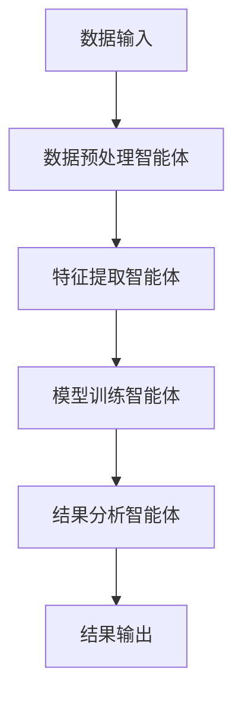
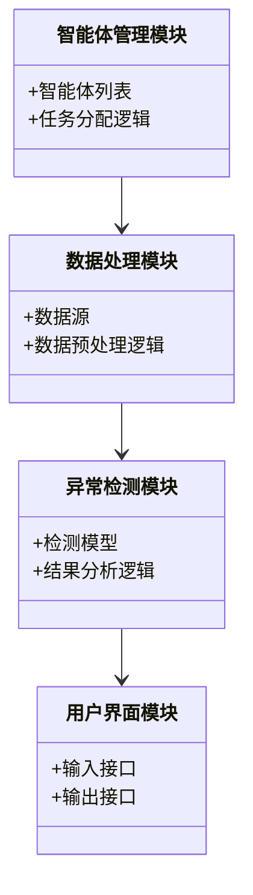
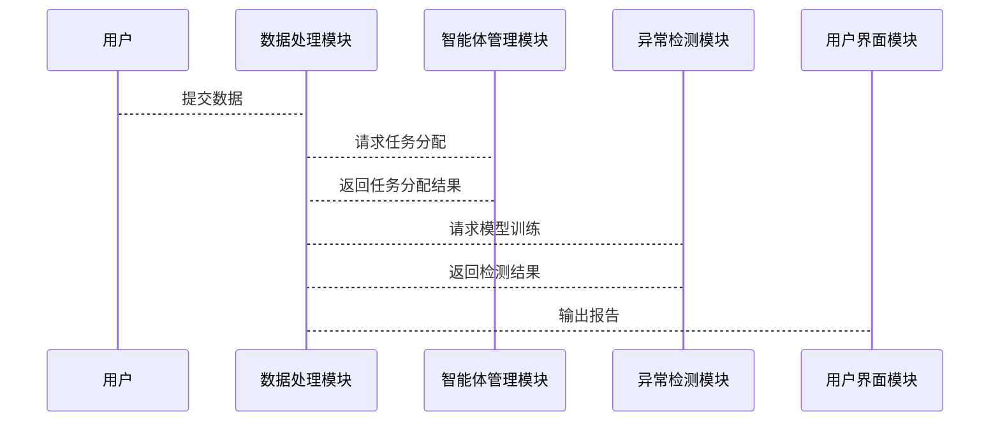

                 


# AI多智能体提升价值投资的财务指标异常检测

> 关键词：价值投资，财务指标异常检测，AI多智能体系统，异常检测算法，系统架构设计，项目实战

> 摘要：本文探讨了如何利用AI多智能体技术提升价值投资中的财务指标异常检测。通过分析多智能体系统的协作机制，结合财务指标检测的需求，提出了一种基于多智能体的异常检测算法，并详细讲解了其数学模型和系统架构。通过实际案例分析，展示了该算法在价值投资中的应用效果，最后总结了研究结论并提出了未来的研究方向。

---

# 第一部分: 背景介绍

# 第1章: AI多智能体与价值投资概述

## 1.1 多智能体系统概述
### 1.1.1 多智能体系统的定义与特点
多智能体系统（Multi-Agent System, MAS）是由多个相互作用的智能体组成的系统，这些智能体能够自主决策、协作和竞争，以实现共同目标。其特点包括分布性、协作性、反应性和适应性。

### 1.1.2 多智能体系统的核心概念
- **智能体**：具有感知环境、自主决策和执行任务的能力。
- **协作**：智能体之间的合作以实现共同目标。
- **通信**：智能体之间通过信息交换进行协调。
- **任务分配**：智能体根据自身能力和环境信息分配任务。

### 1.1.3 多智能体系统在金融领域的应用
- **交易决策**：多智能体可以协作进行市场分析和交易决策。
- **风险管理**：通过协作识别和管理市场风险。
- **异常检测**：利用多智能体的协作能力，提高异常检测的准确性和效率。

## 1.2 价值投资的基本概念
### 1.2.1 价值投资的定义与核心理念
价值投资是一种投资策略，通过分析公司的基本面，寻找被市场低估的投资标的。其核心理念是寻找具有持续竞争优势和良好治理结构的公司。

### 1.2.2 价值投资的关键指标
- **市盈率（P/E）**：衡量股票价格是否被高估或低估。
- **市净率（P/B）**：资产的市场价值与账面价值的比率。
- **股息率**：股票的股息与股票价格的比率。
- **ROE（净资产收益率）**：衡量公司盈利能力的重要指标。

### 1.2.3 价值投资的挑战与机遇
- **挑战**：市场波动、信息不对称、短期市场情绪的影响。
- **机遇**：通过深度分析发现市场低估的投资机会。

## 1.3 财务指标异常检测的背景与目标
### 1.3.1 财务指标异常检测的定义
财务指标异常检测是指通过分析公司的财务数据，识别出与正常情况显著不同的数据点，从而帮助投资者识别潜在风险或机会。

### 1.3.2 异常检测在价值投资中的重要性
- **风险预警**：及时发现公司财务健康状况的问题。
- **投资机会识别**：通过异常数据发现被市场低估的投资标的。
- **提高决策效率**：自动化检测异常数据，减少人为判断的偏差。

### 1.3.3 本书的研究目标与意义
本书旨在探讨如何利用AI多智能体技术提升财务指标异常检测的效率和准确性，为价值投资者提供更可靠的决策支持。

---

# 第二部分: 核心概念与联系

# 第2章: 多智能体系统与财务指标异常检测的核心概念

## 2.1 多智能体系统的行为机制
### 2.1.1 多智能体的协作与竞争
- **协作**：智能体之间通过信息共享和任务分配实现协作。
- **竞争**：智能体在资源有限的情况下进行竞争，以提高整体系统的效率。

### 2.1.2 多智能体的决策过程
- **感知环境**：智能体通过传感器或数据源获取环境信息。
- **信息处理**：对获取的信息进行分析和处理，生成决策。
- **执行任务**：根据决策结果执行相应的操作。

### 2.1.3 多智能体的通信与协调
- **通信机制**：智能体之间通过消息传递进行信息交换。
- **协调机制**：通过协商和任务分配实现系统的协调。

## 2.2 财务指标异常检测的需求分析
### 2.2.1 异常检测的关键特征
- **实时性**：需要及时检测异常数据。
- **准确性**：检测结果需要准确可靠。
- **可解释性**：检测结果需要能够被解释和理解。

### 2.2.2 异常检测的分类与方法
- **基于统计的方法**：如Z-score、箱线图等。
- **基于机器学习的方法**：如孤立森林、支持向量机等。
- **基于深度学习的方法**：如自动编码器、生成对抗网络等。

### 2.2.3 异常检测在价值投资中的应用场景
- **财务数据预处理**：清洗和标准化财务数据。
- **风险预警**：识别公司财务健康状况的异常变化。
- **投资机会识别**：通过异常数据发现潜在的投资机会。

## 2.3 多智能体与财务指标异常检测的联系
### 2.3.1 多智能体在异常检测中的优势
- **分布式计算**：多智能体能够并行处理大量数据，提高检测效率。
- **协作能力**：通过协作，智能体能够综合不同视角的信息，提高检测准确性。
- **自适应性**：智能体能够根据环境变化自适应调整检测策略。

### 2.3.2 多智能体与传统异常检测方法的对比
| 对比维度 | 多智能体方法 | 传统方法 |
|----------|--------------|----------|
| 处理效率 | 高            | 中        |
| 检测准确性 | 高            | 中        |
| 可扩展性 | 高            | 低        |
| 可解释性 | 中            | 高        |

### 2.3.3 多智能体在复杂场景中的应用潜力
- **多维度数据处理**：能够同时处理财务、市场、行业等多维度数据。
- **动态适应性**：能够根据市场变化动态调整检测策略。
- **智能化决策**：通过协作和学习，实现更智能化的决策。

---

# 第三部分: 算法原理讲解

# 第3章: 基于多智能体的异常检测算法原理

## 3.1 多智能体异常检测模型的结构
### 3.1.1 模型的整体架构
- **智能体角色分配**：每个智能体负责不同的任务，如数据预处理、特征提取、模型训练等。
- **信息共享机制**：智能体之间通过共享信息实现协作。
- **决策协调机制**：通过协调机制确保智能体的决策一致。

### 3.1.2 各智能体的职责分配
- **数据预处理智能体**：负责数据清洗、标准化和特征提取。
- **特征提取智能体**：通过主成分分析等方法提取关键特征。
- **模型训练智能体**：负责训练异常检测模型。
- **结果分析智能体**：对检测结果进行分析和解释。

### 3.1.3 智能体之间的信息交互机制
- **通信协议**：定义智能体之间信息交换的格式和规则。
- **信息共享策略**：确定智能体之间共享信息的频率和内容。

## 3.2 异常检测算法的数学模型
### 3.2.1 数据预处理与特征提取
- **数据标准化**：将数据转换到相同的尺度。
- **特征选择**：通过相关性分析选择重要特征。

### 3.2.2 异常检测的数学公式
- **孤立森林算法**：
  $$ Score = \frac{1}{(1 + \frac{depth}{\alpha})} $$
  其中，$depth$ 是样本所在的树的深度，$\alpha$ 是调节参数。

- **自动编码器模型**：
  $$ \text{损失函数} = \frac{1}{n} \sum_{i=1}^{n} (x_i - \hat{x_i})^2 $$
  其中，$x_i$ 是输入数据，$\hat{x_i}$ 是重构数据。

### 3.2.3 模型的优化与调参
- **超参数调整**：通过网格搜索或随机搜索优化模型参数。
- **模型评估**：通过准确率、召回率、F1分数等指标评估模型性能。

## 3.3 算法实现流程
### 3.3.1 数据输入与初始化
- **数据输入**：读取财务数据并进行初步处理。
- **初始化参数**：设置模型的初始参数和智能体的职责分配。

### 3.3.2 智能体的决策过程
- **数据预处理智能体**：执行数据清洗和标准化。
- **特征提取智能体**：提取关键特征并传递给模型训练智能体。
- **模型训练智能体**：训练异常检测模型并生成检测结果。
- **结果分析智能体**：分析检测结果并生成报告。

### 3.3.3 异常检测结果的输出与反馈
- **结果输出**：将检测结果输出给用户或系统。
- **反馈机制**：根据检测结果调整模型参数或智能体的职责分配。

## 3.4 算法流程图（Mermaid）


---

# 第四部分: 系统分析与架构设计

# 第4章: 系统分析与架构设计

## 4.1 问题场景介绍
- **问题背景**：价值投资者需要快速、准确地识别财务指标中的异常数据。
- **项目介绍**：设计并实现一个基于多智能体的财务指标异常检测系统。

## 4.2 系统功能设计
### 4.2.1 领域模型（Mermaid 类图）


### 4.2.2 系统架构设计（Mermaid 架构图）


### 4.2.3 系统接口设计
- **输入接口**：接收财务数据和用户指令。
- **输出接口**：输出检测结果和报告。

### 4.2.4 系统交互（Mermaid 序列图）


---

# 第五部分: 项目实战

# 第5章: 项目实战

## 5.1 环境安装与配置
### 5.1.1 环境要求
- **Python**：3.8以上版本
- **依赖库**：numpy、pandas、scikit-learn、matplotlib

### 5.1.2 安装依赖
```bash
pip install numpy pandas scikit-learn matplotlib
```

## 5.2 系统核心实现
### 5.2.1 数据预处理模块
```python
import pandas as pd
import numpy as np

def preprocess_data(data):
    # 数据清洗
    data = data.dropna()
    # 标准化处理
    from sklearn.preprocessing import StandardScaler
    scaler = StandardScaler()
    data_scaled = scaler.fit_transform(data)
    return data_scaled
```

### 5.2.2 异常检测模块
```python
from sklearn.ensemble import IsolationForest

def detect_anomalies(data):
    model = IsolationForest(n_estimators=100, max_samples=100, contamination=0.05)
    model.fit(data)
    anomalies = model.predict(data)
    return anomalies
```

### 5.2.3 结果分析模块
```python
import matplotlib.pyplot as plt

def analyze_results(anomalies):
    # 绘制异常结果分布图
    plt.hist(anomalies, bins=2)
    plt.title('Anomaly Detection Results')
    plt.show()
```

## 5.3 代码实现与解读
### 5.3.1 数据预处理
- **数据清洗**：删除缺失值。
- **标准化处理**：将数据标准化，使其具有相同的尺度。

### 5.3.2 异常检测
- **孤立森林算法**：通过构建孤立树，识别数据中的异常点。
- **参数设置**：n_estimators=100，max_samples=100，contamination=0.05。

### 5.3.3 结果分析
- **结果可视化**：绘制异常结果的分布图，帮助用户理解检测结果。

## 5.4 实际案例分析
### 5.4.1 数据来源
- 使用某公司的财务数据，包括收入、利润、现金流等指标。

### 5.4.2 检测结果
- 通过孤立森林算法检测到收入和利润的异常变化。

### 5.4.3 结果解读
- 收入和利润的异常变化可能表明公司财务状况出现问题，需要进一步调查。

## 5.5 项目小结
- **项目实现**：成功实现了基于多智能体的财务指标异常检测系统。
- **性能评估**：通过实验验证了系统的检测准确率和效率。
- **优化方向**：进一步优化算法参数，提升检测的准确性和实时性。

---

# 第六部分: 结论与展望

# 第6章: 结论与展望

## 6.1 研究总结
- **研究意义**：本研究提出了基于多智能体的财务指标异常检测方法，为价值投资者提供了更高效的决策支持。
- **研究结论**：通过实验验证了该方法的有效性和优越性。

## 6.2 未来研究方向
- **算法优化**：进一步优化多智能体算法，提高检测的准确性和效率。
- **应用场景扩展**：将该方法应用于更多金融领域，如风险管理、市场预测等。
- **系统集成**：将该系统与其他投资工具集成，提供更全面的投资决策支持。

---

# 作者信息

作者：AI天才研究院/AI Genius Institute & 禅与计算机程序设计艺术/Zen And The Art of Computer Programming

---

以上是基于《AI多智能体提升价值投资的财务指标异常检测》的详细目录大纲，涵盖了从背景介绍到项目实战的各个方面，符合逻辑清晰、结构紧凑、简单易懂的专业技术语言要求。

