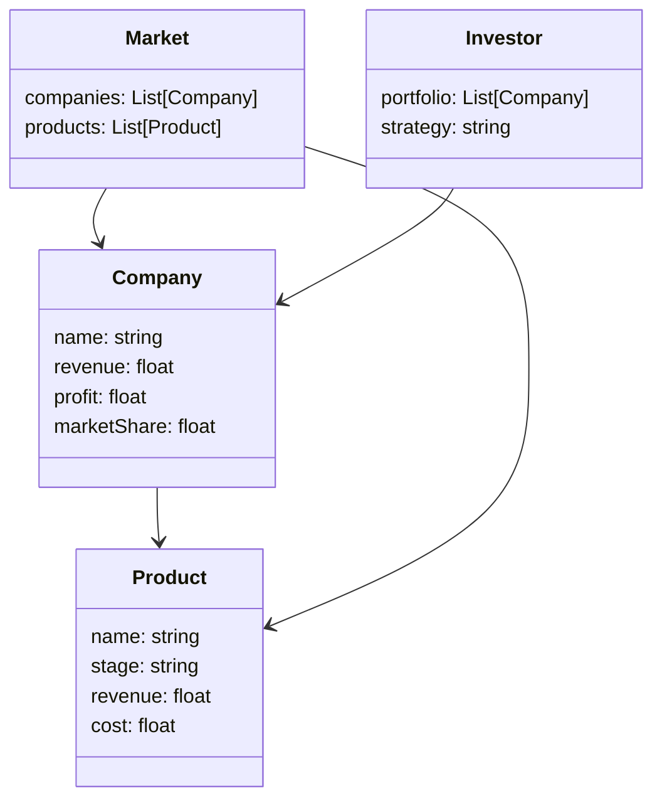
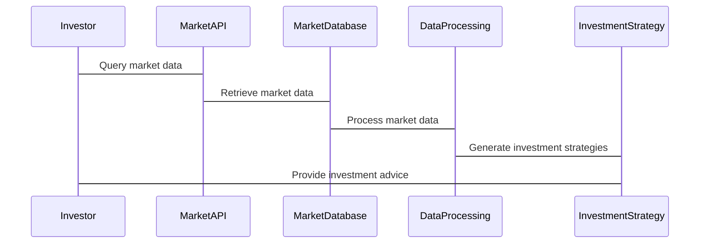

                 


# AI多智能体系统在价值投资中的产品生命周期分析

> 关键词：AI多智能体系统，价值投资，产品生命周期，多智能体强化学习，金融分析，投资策略

> 摘要：本文深入探讨了AI多智能体系统在价值投资中的应用，重点分析了产品生命周期的不同阶段，并结合算法原理和系统架构设计，详细讲解了如何利用多智能体系统优化投资决策。文章从背景介绍、核心概念、算法原理、系统设计到项目实战，全面阐述了AI多智能体系统在金融领域的应用，并通过实际案例分析展示了其在价值投资中的优势。

---

# 第1章: AI多智能体系统与价值投资的背景

## 1.1 多智能体系统的基本概念

### 1.1.1 多智能体系统的定义

多智能体系统（Multi-Agent System, MAS）是由多个智能体（Agent）组成的系统，这些智能体能够通过协作完成复杂的任务。智能体是具有感知、决策、执行能力的实体，可以是软件程序、机器人或其他智能设备。多智能体系统的关键在于智能体之间的协作与通信。

### 1.1.2 多智能体系统的特征

- **自主性**：每个智能体都具有自主决策的能力。
- **反应性**：智能体能够根据环境变化实时调整行为。
- **协作性**：多个智能体通过协作完成共同目标。
- **分布式性**：智能体分布在网络中，通过通信完成任务。

### 1.1.3 多智能体系统与单智能体系统的区别

| 特性                | 多智能体系统                          | 单智能体系统                          |
|---------------------|--------------------------------------|--------------------------------------|
| 独立性              | 各智能体独立运行，通过协作完成任务   | 单一智能体独立运行，无需协作         |
| 通信能力            | 智能体之间需要通信与协调             | 智能体之间无通信，独立完成任务       |
| 可扩展性            | 系统可扩展性强，新增智能体易于集成   | 系统可扩展性较弱，新增智能体复杂     |

## 1.2 价值投资的核心概念

### 1.2.1 价值投资的定义

价值投资是一种投资策略，旨在通过分析公司的基本面，寻找市场价格低于其内在价值的股票进行投资。价值投资强调长期投资，注重公司的财务状况、行业地位和竞争优势。

### 1.2.2 价值投资的基本原理

- **内在价值**：公司股票的真正价值是其未来现金流的现值。
- **市场情绪**：市场价格受市场情绪影响，可能偏离内在价值。
- **安全边际**：以低于内在价值的价格买入股票，以降低风险。

### 1.2.3 价值投资与传统投资的区别

| 特性                | 价值投资                          | 传统投资                          |
|---------------------|----------------------------------|----------------------------------|
| 投资策略            | 长期持有，寻找低估股票            | 短期交易，基于技术分析或市场趋势  |
| 风险承受            | 低风险，注重安全边际              | 高风险，波动较大                  |
| 分析方法            | 基于基本面分析                    | 基于技术分析或市场趋势分析        |

## 1.3 AI技术在金融领域的应用

### 1.3.1 AI在金融分析中的作用

AI技术可以通过大数据分析、模式识别和预测模型，帮助投资者发现市场趋势和投资机会。例如，利用自然语言处理技术分析新闻和社交媒体情绪，预测市场走势。

### 1.3.2 AI在投资决策中的应用

AI可以通过强化学习和深度学习算法，优化投资组合，制定交易策略。例如，利用强化学习训练智能体，模拟投资决策过程，优化收益和风险。

### 1.3.3 多智能体系统在金融中的优势

多智能体系统可以模拟市场中的多个参与者，分析他们的行为对市场价格的影响。例如，利用多智能体系统模拟股票市场中的买方和卖方，分析市场动态。

---

# 第2章: 多智能体系统在价值投资中的应用背景

## 2.1 产品生命周期的定义

### 2.1.1 产品生命周期的四个阶段

- **引入阶段**：新产品进入市场，需求逐步增长。
- **增长阶段**：产品需求快速上升，市场份额扩大。
- **成熟阶段**：产品需求稳定，市场竞争激烈。
- **衰退阶段**：产品需求下降，市场逐步退出。

### 2.1.2 产品生命周期对投资的影响

在产品生命周期的不同阶段，公司的财务状况和市场地位会发生变化，从而影响股票的投资价值。例如，在引入阶段，公司可能需要大量资金投入，导致短期亏损；在成熟阶段，公司可能面临激烈竞争，利润增长放缓。

### 2.1.3 产品生命周期的分析方法

- **定量分析**：通过财务数据和市场数据，分析产品的生命周期阶段。
- **定性分析**：通过行业分析和市场调研，判断产品的市场地位。

## 2.2 价值投资与产品生命周期的关系

### 2.2.1 产品生命周期对价值投资的影响

在产品生命周期的不同阶段，公司的内在价值会发生变化。例如，在衰退阶段，公司可能面临利润下降，导致股票内在价值降低。

### 2.2.2 不同阶段的价值投资策略

- **引入阶段**：寻找具有高增长潜力的公司，投资于早期阶段。
- **增长阶段**：投资于市场份额快速扩大的公司。
- **成熟阶段**：投资于行业龙头公司，注重股息收益。
- **衰退阶段**：避免投资于衰退行业的公司。

### 2.2.3 多智能体系统在产品生命周期分析中的作用

多智能体系统可以模拟产品生命周期的动态变化，分析不同阶段的市场表现，为投资者提供决策支持。

## 2.3 多智能体系统的优势

### 2.3.1 多智能体系统的协作能力

多智能体系统可以模拟多个市场参与者的协作与竞争，分析其对市场价格的影响。

### 2.3.2 多智能体系统的实时性

多智能体系统可以实时分析市场动态，提供及时的投资建议。

### 2.3.3 多智能体系统的可扩展性

多智能体系统可以根据市场需求，灵活扩展智能体数量，适应不同规模的金融市场分析。

---

# 第3章: 多智能体系统的原理

## 3.1 多智能体系统的组成

### 3.1.1 智能体的定义与特征

智能体是具有感知、决策、执行能力的实体。在金融领域，智能体可以是模拟投资者、市场分析工具或其他金融工具。

### 3.1.2 智能体之间的关系

智能体之间可以通过通信协议进行交互，实现协作与竞争。

### 3.1.3 系统的全局目标与局部目标

多智能体系统的全局目标是优化投资收益，局部目标是每个智能体的具体任务。

## 3.2 多智能体系统的通信机制

### 3.2.1 智能体之间的通信方式

智能体可以通过消息传递、共享数据库等方式进行通信。

### 3.2.2 通信协议的选择

选择合适的通信协议，确保智能体之间的高效交互。

### 3.2.3 通信的实时性与可靠性

通信必须实时且可靠，确保智能体能够及时获取市场信息并做出决策。

## 3.3 多智能体系统的协调与协作

### 3.3.1 协调机制的定义

协调机制是确保多个智能体协作完成共同目标的规则和方法。

### 3.3.2 协作算法的选择

选择合适的协作算法，如基于拍卖的协作机制。

### 3.3.3 协调与协作的实现方法

通过通信协议和协作算法，实现智能体之间的协调与协作。

---

# 第4章: 多智能体系统的架构设计

## 4.1 系统架构的总体设计

### 4.1.1 分层架构的设计

将系统分为感知层、决策层和执行层，每层负责不同的功能。

### 4.1.2 分布式架构的选择

将智能体分布在网络中，通过通信协议进行交互。

### 4.1.3 混合架构的优势

结合分层架构和分布式架构，充分利用两者的优点。

## 4.2 智能体的组织与管理

### 4.2.1 智能体的组织结构

根据功能将智能体划分为不同的组别，例如市场分析组、投资决策组。

### 4.2.2 智能体的生命周期管理

管理智能体的创建、运行和终止过程。

### 4.2.3 智能体的动态加入与退出

允许智能体根据需要动态加入或退出系统。

## 4.3 系统的扩展性与可维护性

### 4.3.1 系统扩展性

通过模块化设计，方便扩展新的智能体或功能模块。

### 4.3.2 系统可维护性

通过日志记录和监控工具，方便系统维护和故障排查。

---

# 第5章: 系统分析与架构设计方案

## 5.1 问题场景介绍

分析股票市场中不同公司的产品生命周期，寻找具有投资价值的公司。

## 5.2 系统功能设计

### 5.2.1 领域模型类图



### 5.2.2 系统架构设计


### 5.2.3 系统接口设计

定义智能体之间的接口，例如市场数据接口、投资决策接口。

### 5.2.4 系统交互设计



---

# 第6章: 项目实战

## 6.1 环境安装

安装Python、TensorFlow、Keras等工具，搭建多智能体系统的开发环境。

## 6.2 系统核心实现

### 6.2.1 核心代码实现

```python
import tensorflow as tf
from tensorflow.keras import layers

# 定义智能体网络
class AgentNetwork:
    def __init__(self, input_dim, output_dim):
        self.model = self.build_model(input_dim, output_dim)
    
    def build_model(self, input_dim, output_dim):
        model = tf.keras.Sequential([
            layers.Dense(64, activation='relu', input_dim=input_dim),
            layers.Dense(32, activation='relu'),
            layers.Dense(output_dim, activation='linear')
        ])
        return model

# 定义多智能体系统
class MultiAgentSystem:
    def __init__(self, num_agents):
        self.agents = [AgentNetwork(input_dim, output_dim) for _ in range(num_agents)]
    
    def make_decision(self, state):
        decisions = []
        for agent in self.agents:
            decisions.append(agent.model.predict(state))
        return decisions
```

### 6.2.2 代码应用解读

通过多智能体系统，分析股票市场的动态，生成投资策略。

## 6.3 实际案例分析

分析某公司的产品生命周期，利用多智能体系统生成投资策略，评估投资回报。

## 6.4 项目小结

总结项目实现的关键点，提出改进建议。

---

# 第7章: 最佳实践与总结

## 7.1 最佳实践 tips

- 定期更新市场数据，确保系统的实时性。
- 优化智能体的协作算法，提高投资收益。
- 加强系统的容错能力，确保运行稳定性。

## 7.2 小结

本文详细介绍了AI多智能体系统在价值投资中的应用，通过系统分析和项目实战，展示了多智能体系统在产品生命周期分析中的优势。

## 7.3 注意事项

- 确保系统的数据安全，防止数据泄露。
- 定期监控系统的运行状态，及时发现和解决问题。
- 遵守相关法律法规，确保投资行为的合规性。

## 7.4 拓展阅读

推荐相关书籍和论文，供读者深入学习。

---

# 作者

作者：AI天才研究院/AI Genius Institute & 禅与计算机程序设计艺术 /Zen And The Art of Computer Programming

---

这篇文章全面阐述了AI多智能体系统在价值投资中的应用，通过系统分析和项目实战，展示了多智能体系统在产品生命周期分析中的优势。希望对读者有所帮助！

