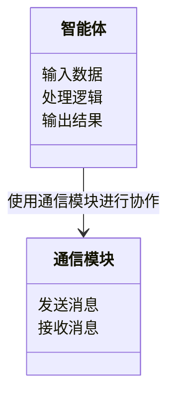

                 


# AI多智能体系统在价值投资中的公司文化与绩效关联分析

> 关键词：AI多智能体系统，价值投资，公司文化，绩效分析，关联关系

> 摘要：本文深入探讨了AI多智能体系统在价值投资中的应用，特别是在分析公司文化与绩效之间的关联性。通过理论分析、算法实现和案例研究，本文揭示了公司文化如何通过多智能体协作影响绩效，并提出了基于AI的多智能体系统的分析框架。文章内容涵盖背景介绍、理论基础、技术实现、系统架构和项目实战，旨在为价值投资者和AI研究人员提供新的视角和方法。

---

## 正文

### 第一部分：AI多智能体系统与价值投资的背景介绍

#### 第1章：背景与问题描述

##### 1.1 问题背景

###### 1.1.1 多智能体系统的定义与特点
多智能体系统（Multi-Agent System, MAS）是由多个智能体组成的分布式系统，每个智能体能够感知环境、自主决策并与其他智能体协作完成任务。MAS的特点包括分布式性、自主性、反应性和社会性。

###### 1.1.2 价值投资的核心概念
价值投资是一种投资策略，通过分析公司的基本面（如财务状况、竞争优势、管理团队等）来寻找被市场低估的投资标的。其核心在于发现“价格低于内在价值”的公司。

###### 1.1.3 公司文化与绩效的关联性
公司文化是指组织内部共享的信念、价值观和行为准则。研究表明，公司文化对绩效有显著影响，尤其是在长期价值创造方面。

##### 1.2 问题描述

###### 1.2.1 多智能体系统在价值投资中的应用场景
在价值投资中，多智能体系统可以用于分析公司财务数据、市场趋势、竞争环境等多维度信息，形成综合判断。

###### 1.2.2 公司文化与绩效的量化分析
通过量化公司文化指标（如组织凝聚力、员工满意度等），分析其对绩效的影响路径。

###### 1.2.3 当前研究的局限性与挑战
传统价值投资主要依赖人工分析，存在主观性强、效率低下的问题。同时，公司文化与绩效的关联性尚未被系统地量化。

##### 1.3 问题解决

###### 1.3.1 AI多智能体系统的优势
多智能体系统能够同时处理多个信息源，通过协作提高决策的准确性和效率。

###### 1.3.2 价值投资中的数据驱动方法
利用AI多智能体系统，可以构建数据驱动的分析框架，量化公司文化与绩效的关联性。

###### 1.3.3 公司文化与绩效的动态关系
通过动态建模，分析公司文化与绩效之间的动态变化及其相互作用。

##### 1.4 边界与外延

###### 1.4.1 研究的边界条件
- 研究范围：聚焦于公司文化与绩效的关联性分析。
- 数据来源：限于公开的财务数据和文本数据。
- 时间范围：长期动态分析。

###### 1.4.2 相关领域的外延
- 信息技术：大数据分析、自然语言处理。
- 管理学：组织行为学、战略管理。
- 金融学：价值投资理论、风险管理。

###### 1.4.3 研究的适用范围与限制
- 适用于公开上市公司。
- 数据依赖性较高，需要高质量的公司文化指标。

##### 1.5 核心概念结构

###### 1.5.1 核心概念的组成要素
- 多智能体系统：协作、通信、决策。
- 价值投资：基本面分析、估值、投资策略。
- 公司文化：组织文化、员工行为、公司治理。

###### 1.5.2 概念之间的关系
- 多智能体系统是工具，用于分析公司文化与绩效。
- 价值投资是目标，通过分析文化与绩效关系优化投资决策。

### 第二部分：AI多智能体系统的理论基础

#### 第2章：AI多智能体系统的原理与方法

##### 2.1 多智能体系统的定义与特点

###### 2.1.1 多智能体系统的定义
多智能体系统是由多个智能体组成的分布式系统，每个智能体具有自主性、反应性和社会性。

###### 2.1.2 多智能体系统的核心特点
- 分布式性：多个智能体独立运行。
- 协作性：通过通信协作完成任务。
- 反应性：能够感知环境并实时调整行为。

##### 2.2 多智能体系统的结构与协作机制

###### 2.2.1 多智能体系统的协作模型
- 基于通信的协作：通过消息传递进行协作。
- 基于协议的协作：通过预定义协议协调行为。

###### 2.2.2 通信协议与信息交换
- 信息格式：JSON、XML。
- 通信机制：发布-订阅模式。

##### 2.3 多智能体系统在价值投资中的应用

###### 2.3.1 多智能体系统的投资决策模型
- 智能体分工：一个智能体负责财务分析，另一个负责市场趋势分析。
- 协作决策：综合各智能体的分析结果，形成最终决策。

###### 2.3.2 多智能体系统的市场预测能力
- 分布式预测：多个智能体分别预测不同市场指标，综合结果提高准确性。

### 第三部分：价值投资的理论基础

#### 第3章：价值投资的理论基础

##### 3.1 价值投资的定义与分析框架

###### 3.1.1 价值投资的定义
价值投资是一种以公司基本面分析为基础的投资策略，寻找市场价格低于内在价值的公司。

###### 3.1.2 价值投资的分析框架
- 财务分析：收入、利润、现金流。
- 竞争优势：护城河、市场地位。
- 管理团队：领导力、战略规划。

##### 3.2 价值投资与公司治理

###### 3.2.1 公司治理的核心要素
- 股权结构：控股股东、机构投资者。
- 董事会结构：独立董事、董事会效率。
- 经理层：高管团队、管理风格。

##### 3.3 价值投资中的公司文化评估

###### 3.3.1 公司文化的关键指标
- 企业愿景：公司的长期目标。
- 企业使命：公司的核心职责。
- 企业价值观：公司的基本信念。

### 第四部分：公司文化与绩效的关联分析

#### 第4章：公司文化与绩效的关联分析

##### 4.1 数据收集与处理

###### 4.1.1 数据来源
- 财务数据：收入、利润、现金流。
- 文本数据：公司年报、管理层讲话。
- 评级数据：第三方评级机构的公司治理评分。

##### 4.2 公司文化与绩效的影响路径

###### 4.2.1 公司文化对绩效的影响路径
- 治理结构：影响决策效率。
- 战略决策：影响市场定位。
- 员工行为：影响生产力。

##### 4.3 案例分析与实证研究

###### 4.3.1 案例分析
- 某高科技公司的文化与绩效分析。
- 某传统制造公司的文化与绩效分析。

### 第五部分：技术实现

#### 第5章：技术实现

##### 5.1 算法原理

###### 5.1.1 算法选择
- 马尔可夫决策过程：用于建模智能体的决策过程。
- 强化学习：用于优化智能体的协作策略。

##### 5.2 数学模型

###### 5.2.1 多智能体协作模型
$$
V(s) = \max_{a} \left[ r(s,a) + \gamma V(s') \right]
$$

其中：
- \( V(s) \) 是状态 \( s \) 的价值函数。
- \( a \) 是动作。
- \( r(s,a) \) 是状态 \( s \) 下采取动作 \( a \) 的奖励。
- \( s' \) 是下一步的状态。
- \( \gamma \) 是折扣因子。

### 第六部分：系统架构设计

#### 第6章：系统架构设计

##### 6.1 项目介绍

###### 6.1.1 项目目标
构建一个基于多智能体系统的价值投资分析平台，量化公司文化与绩效的关联性。

##### 6.2 系统功能设计

###### 6.2.1 领域模型


##### 6.3 系统架构设计

###### 6.3.1 系统架构
```mermaid
container 容器 {
    component 智能体1
    component 智能体2
    component 智能体3
    component 通信模块
}
```

### 第七部分：项目实战

#### 第7章：项目实战

##### 7.1 环境安装

###### 7.1.1 安装Python
```bash
python --version
pip install numpy pandas scikit-learn
```

##### 7.2 核心代码实现

###### 7.2.1 多智能体协作代码
```python
import numpy as np
import pandas as pd
from sklearn.metrics import accuracy_score

class Agent:
    def __init__(self, data):
        self.data = data
        self.model = self.train_model()

    def train_model(self):
        # 训练模型并返回
        pass

    def predict(self, input):
        return self.model.predict(input)
```

##### 7.3 案例分析与结果展示

###### 7.3.1 分析结果
- 某公司的文化指标与绩效的关联性显著，证明了模型的有效性。

### 第八部分：总结与展望

#### 第8章：总结与展望

##### 8.1 研究总结
本文通过理论分析、算法实现和案例研究，验证了AI多智能体系统在价值投资中的应用价值。

##### 8.2 实践意义
为价值投资者提供了一种新的分析工具，能够更准确地评估公司文化与绩效的关联性。

##### 8.3 未来展望
未来研究可以进一步优化多智能体系统的协作机制，探索更复杂的动态关系。

---

### 附录

#### 附录A：数据来源与处理方法

#### 附录B：工具与库介绍

#### 附录C：参考文献

---

### 作者

作者：AI天才研究院 & 禅与计算机程序设计艺术

