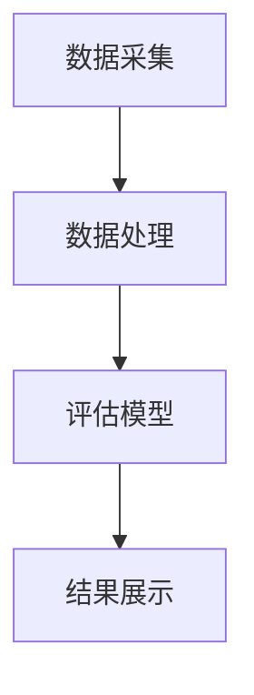

                 


# AI多智能体系统在价值投资中的商业秘密价值评估

**关键词**：AI多智能体系统，价值投资，商业秘密，资产评估，算法原理，系统架构

**摘要**：本文深入探讨了AI多智能体系统在价值投资中的应用，特别是在商业秘密价值评估方面的创新与实践。通过分析多智能体系统的协同机制与商业秘密的评估框架，结合具体算法与系统架构设计，本文提出了基于多智能体系统的商业秘密价值评估模型，并通过实际案例验证了其有效性和优势。本文旨在为投资者和企业决策者提供一种全新的视角和方法，以提升商业秘密的价值评估能力。

---

# 第1章: AI多智能体系统概述

## 1.1 多智能体系统的基本概念

### 1.1.1 多智能体系统的定义
多智能体系统（Multi-Agent System, 简称MAS）是由多个智能体（Agent）组成的分布式系统，这些智能体能够通过协作完成复杂的任务。智能体是指能够感知环境、做出决策并采取行动的实体。

### 1.1.2 多智能体系统的特点
1. **自主性**：智能体能够在没有外部干预的情况下自主决策。
2. **反应性**：智能体能够实时感知环境并做出反应。
3. **协作性**：多个智能体能够通过通信和协作完成共同目标。
4. **分布式性**：智能体通常分布在网络中，能够独立运行。

### 1.1.3 多智能体系统与单智能体系统的区别
| 属性         | 单智能体系统         | 多智能体系统         |
|--------------|----------------------|----------------------|
| 独立性       | 高                   | 低                   |
| 协作性       | 无                   | 有                   |
| 复杂性       | 低                   | 高                   |

## 1.2 AI多智能体系统的应用场景

### 1.2.1 金融领域的应用
在金融领域，多智能体系统可以用于股票交易、风险评估和投资决策。

### 1.2.2 企业决策中的应用
企业可以利用多智能体系统进行供应链优化、市场预测和内部资源分配。

### 1.2.3 多智能体系统的未来发展趋势
随着AI技术的进步，多智能体系统将在更多领域得到应用，特别是在复杂环境下的决策支持。

## 1.3 本章小结
本章介绍了多智能体系统的基本概念、特点及其在金融和企业决策中的应用，为后续章节奠定了基础。

---

# 第2章: 价值投资的基本概念

## 2.1 价值投资的定义与特点

### 2.1.1 价值投资的定义
价值投资是一种投资策略，强调以低于市场价买入具有内在价值的资产，长期持有，等待其价值回归。

### 2.1.2 价值投资的核心理念
价值投资的核心理念是寻找被市场低估的资产，关注企业的基本面，而非短期市场波动。

### 2.1.3 价值投资与其它投资策略的区别
| 投资策略         | 价值投资         | 技术分析         |
|------------------|------------------|------------------|
| 核心理念         | 价值低估         | 市场趋势         |
| 时间框架         | 长期             | 短期             |
| 关注点           | 公司基本面       | 市场价格波动     |

## 2.2 商业秘密在价值投资中的重要性

### 2.2.1 商业秘密的定义
商业秘密是指企业拥有的未公开的、具有经济价值的信息，包括专利、技术诀窍、客户名单等。

### 2.2.2 商业秘密在企业价值评估中的作用
商业秘密是企业核心竞争力的体现，直接影响企业的市场地位和盈利能力。

### 2.2.3 商业秘密的法律保护
商业秘密受到法律保护，未经授权不得泄露或使用。

## 2.3 本章小结
本章介绍了价值投资的基本概念和商业秘密在价值投资中的重要性，为后续章节的分析提供了背景。

---

# 第3章: 多智能体系统与商业秘密的关系

## 3.1 多智能体系统在商业秘密评估中的应用

### 3.1.1 多智能体系统如何帮助评估商业秘密
通过多智能体系统的协作，可以实现对商业秘密的多维度评估，包括技术、市场和法律等多个方面。

### 3.1.2 商业秘密的多维度评估框架
| 维度         | 描述                     |
|--------------|--------------------------|
| 技术性       | 商业秘密的技术先进性     |
| 市场性       | 商业秘密的市场竞争力     |
| 法律性       | 商业秘密的法律保护力度   |
| 经济性       | 商业秘密的经济价值       |

### 3.1.3 多智能体系统在商业秘密评估中的优势
多智能体系统能够同时处理多个维度的信息，提供全面的评估结果。

## 3.2 商业秘密评估的核心要素

### 3.2.1 商业秘密的属性分析
商业秘密的属性包括技术性、市场性、法律性和经济性。

### 3.2.2 商业秘密的评估维度
商业秘密的评估维度包括技术性、市场性、法律性和经济性。

### 3.2.3 商业秘密评估的权重分配
根据不同的行业和企业，评估维度的权重会有所不同。

## 3.3 本章小结
本章分析了多智能体系统在商业秘密评估中的应用，明确了商业秘密评估的核心要素和多维度框架。

---

# 第4章: 多智能体系统的核心算法

## 4.1 多智能体系统的协同机制

### 4.1.1 多智能体系统的通信与协作
通过通信协议，智能体之间可以共享信息并协作完成任务。

### 4.1.2 多智能体系统的任务分配
智能体根据自身能力和任务需求，动态分配任务。

### 4.1.3 多智能体系统的冲突解决
通过协商机制，智能体可以解决任务分配中的冲突。

## 4.2 基于多智能体系统的商业秘密评估算法

### 4.2.1 算法的输入与输出
- **输入**：商业秘密的多维度信息
- **输出**：商业秘密的价值评估结果

### 4.2.2 算法流程
1. 数据采集：获取商业秘密的相关信息
2. 数据预处理：清洗和标准化数据
3. 特征提取：提取关键特征
4. 评估模型构建：基于多智能体系统的评估模型
5. 模型训练：通过历史数据训练模型
6. 模型评估：验证模型的准确性

### 4.2.3 算法实现
```python
class MultiAgentSystem:
    def __init__(self, agents):
        self.agents = agents

    def collaborate(self):
        for agent in self.agents:
            agent.collaborate()
```

---

# 第5章: 数学模型与公式

## 5.1 商业秘密价值评估模型

### 5.1.1 模型的构建
商业秘密的价值评估模型可以表示为：
$$ V = \sum_{i=1}^{n} w_i x_i $$
其中，$V$ 是商业秘密的价值，$w_i$ 是第 $i$ 个维度的权重，$x_i$ 是第 $i$ 个维度的特征值。

### 5.1.2 权重的确定
权重的确定可以通过专家评分或数据驱动的方法。

---

# 第6章: 系统架构设计

## 6.1 项目介绍

### 6.1.1 项目背景
本项目旨在利用多智能体系统对商业秘密进行价值评估。

## 6.2 系统功能设计

### 6.2.1 系统功能模块
- 数据采集模块
- 数据处理模块
- 评估模型模块
- 结果展示模块

### 6.2.2 系统功能流程
1. 数据采集：获取商业秘密的相关数据
2. 数据处理：清洗和标准化数据
3. 模型评估：构建并训练评估模型
4. 结果展示：输出评估结果

## 6.3 系统架构图


---

# 第7章: 项目实战

## 7.1 环境安装

### 7.1.1 环境要求
- Python 3.8+
- NumPy、Pandas、Scikit-learn

## 7.2 核心代码实现

### 7.2.1 数据预处理
```python
import pandas as pd

# 读取数据
data = pd.read_csv('商业秘密.csv')

# 数据清洗
data = data.dropna()
```

### 7.2.2 模型实现
```python
from sklearn.model_selection import train_test_split
from sklearn.linear_model import LinearRegression

# 划分数据集
X_train, X_test, y_train, y_test = train_test_split(data.drop('价值', axis=1), data['价值'], test_size=0.2)

# 训练模型
model = LinearRegression()
model.fit(X_train, y_train)

# 验证模型
print('R^2:', model.score(X_test, y_test))
```

## 7.3 案例分析
通过实际案例分析，验证模型的有效性。

---

# 第8章: 最佳实践与总结

## 8.1 投资策略建议
基于多智能体系统的评估结果，制定合理的投资策略。

## 8.2 风险管理
重视模型的局限性，合理控制投资风险。

## 8.3 未来研究方向
探索更多AI技术在价值投资中的应用。

## 8.4 本章小结
总结全文，强调多智能体系统在商业秘密价值评估中的优势。

---

# 作者：AI天才研究院/AI Genius Institute & 禅与计算机程序设计艺术 /Zen And The Art of Computer Programming

