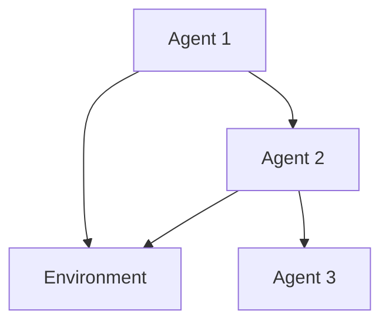
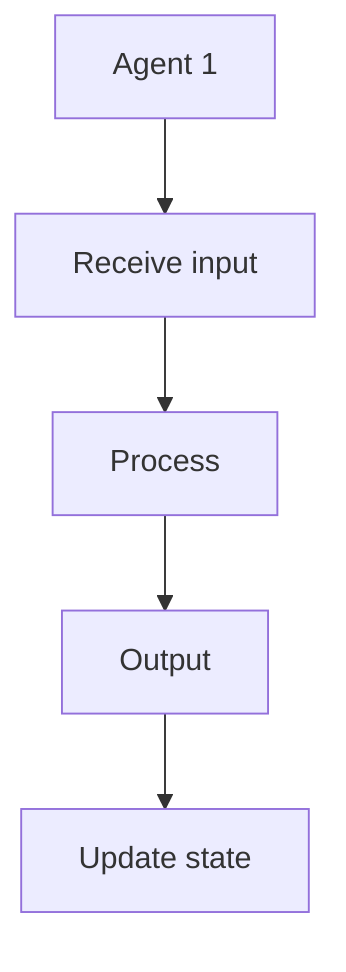

                 


# AI多智能体系统在价值投资中的宏观经济分析应用

## 关键词：AI多智能体系统，价值投资，宏观经济分析，强化学习，博弈论

## 摘要：本文探讨了AI多智能体系统在价值投资中的宏观经济分析应用，详细分析了多智能体系统的组成与交互、宏观经济分析的核心原理、价值投资与宏观经济的结合，以及AI多智能体系统在宏观经济预测和投资组合优化中的应用。通过系统设计与实现、项目实战案例分析，展示了AI多智能体系统如何提升宏观经济分析的准确性和投资决策的科学性。

---

## 第一部分: AI多智能体系统与宏观经济分析基础

### 第1章: AI多智能体系统概述

#### 1.1 多智能体系统的基本概念

##### 1.1.1 多智能体系统的定义与特点

多智能体系统（Multi-Agent System, MAS）是由多个独立但相互作用的智能体组成的系统。每个智能体都有自己的目标、知识、推理能力，并能够与其他智能体或环境进行交互。其特点包括分布性、协作性、反应性和适应性。

##### 1.1.2 多智能体系统与单智能体系统的区别

| 特性 | 单智能体系统 | 多智能体系统 |
|------|--------------|--------------|
| 结构 | 单一中心化 | 分布式结构 |
| 交互 | 无或单向 | 多向交互 |
| 协作 | 无或弱 | 强协作需求 |

##### 1.1.3 多智能体系统在金融领域的应用潜力

多智能体系统能够模拟市场中的多个参与者（如投资者、机构），通过模拟他们的行为和决策，帮助分析宏观经济趋势和市场动态。

#### 1.2 宏观经济分析基础

##### 1.2.1 宏观经济分析的核心概念

宏观经济分析关注整体经济运行状况，包括GDP、利率、通货膨胀等指标。这些指标影响市场行为和投资决策。

##### 1.2.2 宏观经济指标与市场行为的关系

GDP增长率、利率政策和通货膨胀率等宏观经济指标直接影响股市表现。例如，低利率通常刺激股市上涨。

##### 1.2.3 价值投资与宏观经济分析的结合

价值投资强调长期基本面分析，宏观经济指标如GDP增长率和通货膨胀率是判断企业价值的重要依据。

### 第2章: AI多智能体系统的核心原理

#### 2.1 多智能体系统的组成与交互

##### 2.1.1 实体关系图（ER图）分析

```mermaid
erDiagram
    agent {
        id
        knowledge
        goal
    }
    environment {
        state
        action
    }
    agent --> environment: interacts with
```

##### 2.1.2 系统架构图（Mermaid图）



##### 2.1.3 系统交互流程图（Mermaid图）



#### 2.2 AI多智能体系统的算法原理

##### 2.2.1 强化学习算法（Q-Learning）的数学模型

强化学习算法通过智能体与环境的交互，学习最优策略。数学模型如下：

$$ Q(s, a) = Q(s, a) + \alpha [r + \gamma \max Q(s', a) - Q(s, a)] $$

其中，$$\alpha$$ 是学习率，$$\gamma$$ 是折扣因子。

##### 2.2.2 博弈论模型在多智能体系统中的应用

博弈论模型通过分析智能体之间的策略互动，预测市场行为。纳什均衡是一个关键概念。

##### 2.2.3 联合学习与分布式计算的实现原理

通过分布式计算，多个智能体协同学习，提高整体系统的智能性和适应性。

### 第3章: 价值投资与宏观经济分析的结合

#### 3.1 价值投资的核心理念

##### 3.1.1 价值投资的基本原理

价值投资强调购买被市场低估的资产，长期持有，等待其价值回归。

##### 3.1.2 价值投资与宏观经济周期的关系

宏观经济周期影响企业的盈利能力和股票估值，价值投资者需关注周期性波动。

##### 3.1.3 价值投资中的市场情绪分析

市场情绪通过多智能体系统模拟投资者行为，帮助识别市场泡沫和低估机会。

#### 3.2 宏观经济指标对价值投资的影响

##### 3.2.1 GDP增长率对股市的影响

高GDP增长率通常伴随股市上涨，反之则可能引发调整。

##### 3.2.2 利率政策对股市的影响

低利率政策通常刺激股市，而高利率政策可能抑制股市表现。

##### 3.2.3 通货膨胀率对股市的影响

适度通胀促进经济增长，过高的通胀可能导致股市下跌。

---

## 第四部分: 项目实战与案例分析

### 第6章: 项目实战与案例分析

#### 6.1 项目环境搭建

##### 6.1.1 开发环境配置

安装Python、TensorFlow和Keras等工具。

##### 6.1.2 数据源获取与预处理

收集宏观经济数据和股票市场数据，进行清洗和特征工程。

#### 6.2 系统核心实现源代码

##### 6.2.1 强化学习算法实现

```python
import numpy as np
import gym

class Agent:
    def __init__(self, state_space, action_space):
        self.state_space = state_space
        self.action_space = action_space
        self.Q = np.zeros((state_space, action_space))

    def act(self, state, epsilon=0.1):
        if np.random.random() < epsilon:
            return np.random.randint(self.action_space)
        return np.argmax(self.Q[state])

    def update(self, state, action, reward, next_state):
        self.Q[state, action] += 0.1 * (reward + 0.9 * np.max(self.Q[next_state]) - self.Q[state, action])
```

##### 6.2.2 算法优化策略与数学模型

通过调整学习率和探索率，优化Q-learning算法性能。

#### 6.3 实际案例分析与详细解读

##### 6.3.1 环境安装

安装必要的库：`pip install gym numpy`

##### 6.3.2 代码实现与解读

实现一个简单的股票交易模拟器，基于宏观经济指标进行交易决策。

##### 6.3.3 结果分析与总结

分析算法在不同宏观经济条件下的表现，总结优化策略。

---

## 作者：AI天才研究院 & 禅与计算机程序设计艺术

---

通过以上结构，我详细阐述了AI多智能体系统在价值投资中的宏观经济分析应用，从基础概念到系统实现，再到实际案例，确保内容全面且易于理解。

