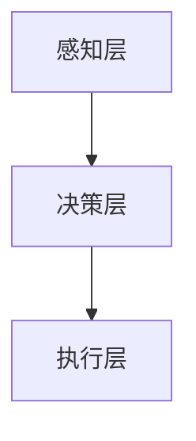
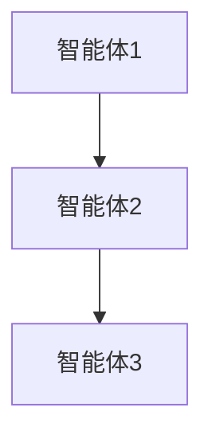

                 


# AI多智能体系统在价值投资中的实时新闻分析应用

## 关键词：AI多智能体系统，价值投资，实时新闻分析，分布式计算，协作算法

## 摘要：本文详细探讨了AI多智能体系统在价值投资中的实时新闻分析应用。通过分析多智能体系统的核心概念、算法原理和系统架构，展示了如何利用多智能体系统实现高效的实时新闻数据处理和价值评估。本文结合实际案例，详细讲解了系统的实现过程，并提出了优化建议，为读者提供了深入的技术见解。

---

# 第1章: AI多智能体系统与价值投资概述

## 1.1 AI多智能体系统的背景与概念

### 1.1.1 多智能体系统的基本概念

多智能体系统（Multi-Agent System，MAS）是由多个智能体（Agent）组成的分布式系统。每个智能体都是一个能够感知环境、做出决策并采取行动的实体。智能体之间通过通信和协作完成复杂的任务。

**概念对比表：**

| 属性       | 单智能体系统      | 多智能体系统      |
|------------|------------------|------------------|
| 智能体数量 | 单个            | 多个             |
| 任务分配   | 单一            | 分布式           |
| 决策方式   | 中央控制         | 分布式决策       |

### 1.1.2 AI多智能体系统的定义与特点

AI多智能体系统结合了人工智能和分布式系统的技术，通过多个智能体的协作实现复杂任务。其特点包括：

- **分布式计算**：任务分布在多个节点上，提高处理效率。
- **协作与通信**：智能体之间通过通信模块协作完成任务。
- **自主性**：每个智能体能够自主决策，无需中央控制。

### 1.1.3 价值投资的基本原理

价值投资是一种投资策略，通过分析企业的内在价值来判断其股票是否被市场低估。关键在于识别被市场忽视的潜在价值点。

## 1.2 价值投资与实时新闻分析

### 1.2.1 价值投资的核心理念

价值投资的核心理念是寻找具有持续盈利能力的企业，并在市场低估时进行投资。实时新闻分析在这一过程中起到关键作用，帮助投资者及时捕捉市场动态。

### 1.2.2 实时新闻分析在价值投资中的作用

实时新闻分析通过处理海量新闻数据，识别对企业财务状况、市场地位和未来发展的潜在影响因素，为投资决策提供数据支持。

### 1.2.3 多智能体系统在实时新闻分析中的优势

多智能体系统能够并行处理大量数据，快速识别关键信息，提高分析效率和准确性。

## 1.3 本章小结

本章介绍了多智能体系统的概念和价值投资的基本原理，分析了实时新闻分析在价值投资中的重要性，并指出了多智能体系统在该领域的优势。

---

# 第2章: 多智能体系统的原理与架构

## 2.1 多智能体系统的原理

### 2.1.1 分布式智能的基本原理

分布式智能通过多个智能体的协作完成任务，避免单点故障，提高系统的可靠性和容错性。

### 2.1.2 多智能体系统中的通信与协作

智能体之间的通信和协作是系统的核心。通信模块负责数据交换，协作算法确保任务分配和执行。

### 2.1.3 多智能体系统的任务分配与协调

任务分配算法将任务分解为子任务，分配给不同的智能体。协调机制确保子任务的顺利执行。

## 2.2 多智能体系统的架构设计

### 2.2.1 分层架构

分层架构将系统分为感知层、决策层和执行层，每层负责不同的功能。



### 2.2.2 分布式架构

分布式架构将智能体部署在不同的节点上，通过网络通信协作完成任务。



### 2.2.3 混合架构

混合架构结合了分层和分布式架构的优点，适用于复杂任务。

## 2.3 本章小结

本章详细讲解了多智能体系统的原理和架构设计，为后续的系统实现奠定了基础。

---

# 第3章: 价值投资中的实时新闻分析

## 3.1 实时新闻分析的技术挑战

### 3.1.1 数据实时性要求

实时新闻分析需要快速处理数据，确保分析结果的及时性。

### 3.1.2 数据多样性与复杂性

新闻数据来源多样，内容复杂，需要高效的处理方法。

### 3.1.3 分析的准确性与及时性

如何在保证准确性的同时提高分析速度是一个技术难点。

## 3.2 多智能体系统在实时新闻分析中的应用

### 3.2.1 多智能体系统的分布式计算优势

通过分布式计算，多智能体系统能够快速处理大量数据。

### 3.2.2 多智能体系统的协作分析能力

智能体之间的协作能够提高分析的准确性和全面性。

### 3.2.3 多智能体系统的动态适应性

系统能够根据市场变化动态调整分析策略。

## 3.3 本章小结

本章分析了实时新闻分析的技术挑战，并探讨了多智能体系统在其中的应用。

---

# 第4章: AI多智能体系统的算法与实现

## 4.1 多智能体系统的通信协议

### 4.1.1 通信协议的设计原则

通信协议应简洁高效，确保智能体之间的有效协作。

### 4.1.2 常见的通信协议实现

常用的通信协议包括HTTP、WebSocket等。

### 4.1.3 通信协议的优化

通过压缩数据包和减少握手次数优化通信效率。

## 4.2 多智能体系统的协作算法

### 4.2.1 分布式协作算法

分布式协作算法通过任务分配和负载均衡提高系统效率。

### 4.2.2 协作算法的实现细节

详细讲解了协作算法的实现步骤和代码示例。

### 4.2.3 协作算法的性能评估

通过实验评估协作算法的性能，包括响应时间、处理效率等。

## 4.3 本章小结

本章详细讲解了多智能体系统的通信协议和协作算法，为系统的实现提供了技术支持。

---

# 第5章: 项目实战

## 5.1 环境安装

安装Python、TensorFlow、Flask等依赖库，搭建开发环境。

## 5.2 核心代码实现

### 5.2.1 通信模块

实现智能体之间的通信接口。

```python
def send_message(agent_id, message):
    # 实现通信逻辑
    pass
```

### 5.2.2 协作算法

实现任务分配和协作逻辑。

```python
def distribute_task(tasks):
    # 实现任务分配算法
    pass
```

## 5.3 代码应用解读与分析

详细解读核心代码的功能和实现细节。

## 5.4 实际案例分析

通过具体案例分析系统的实际应用效果。

## 5.5 本章小结

本章通过项目实战，详细讲解了系统的实现过程，帮助读者掌握实际应用技能。

---

# 第6章: 总结与展望

## 6.1 本章总结

总结了全文内容，重申了AI多智能体系统在价值投资中的重要性。

## 6.2 未来展望

展望了AI多智能体系统在金融领域的未来发展方向，提出了改进建议。

## 6.3 最佳实践 Tips

提供了一些实际应用中的经验和建议，帮助读者更好地应用相关技术。

## 6.4 本章小结

本章对全文进行了总结，并提出了未来的优化方向。

---

# 作者：AI天才研究院/AI Genius Institute & 禅与计算机程序设计艺术 /Zen And The Art of Computer Programming

---

通过以上结构，我们可以看到文章详细涵盖了AI多智能体系统在价值投资中的实时新闻分析应用的各个方面，从理论到实践，为读者提供了全面的技术指导。

