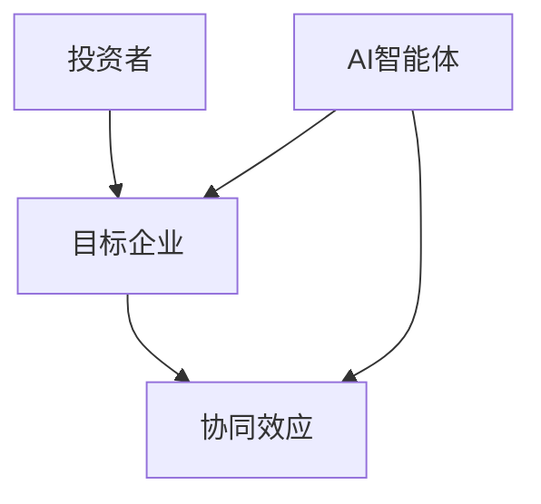
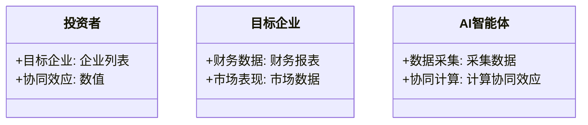

                 


# AI多智能体系统在价值投资中的并购协同效应分析

**关键词**：AI多智能体系统、价值投资、并购协同效应、协同计算、分布式智能、金融分析

**摘要**：本文深入探讨了AI多智能体系统在价值投资中的应用，特别是其在并购协同效应分析中的优势。通过分析多智能体系统的原理、算法实现、系统架构以及实际案例，本文揭示了如何利用AI技术优化并购决策，提升投资收益。文章结合理论与实践，为金融从业者和技术开发者提供了全新的视角和实用的解决方案。

---

## 第一部分: AI多智能体系统与价值投资概述

### 第1章: 问题背景与核心概念

#### 1.1 问题背景

##### 1.1.1 并购协同效应的定义与重要性
并购协同效应是指企业在合并或收购后，通过资源共享、业务整合、成本分摊等方式实现的额外价值。它是企业并购成功的关键指标之一，直接影响投资回报率和企业价值评估。传统的并购分析依赖于人工判断和经验分析，存在主观性强、效率低、精度不足等问题。

##### 1.1.2 传统并购分析的局限性
- 数据量大：并购涉及大量非结构化数据，如财务报表、市场动态、管理团队等。
- 计算复杂：协同效应的计算需要考虑多个变量的交互作用，传统方法难以高效处理。
- 风险评估难：传统方法难以准确预测并购后的潜在风险。

##### 1.1.3 AI技术在金融领域的应用潜力
AI技术通过自然语言处理（NLP）、机器学习（ML）和分布式计算等手段，能够高效处理海量数据，发现潜在的模式和关系。在并购分析中，AI可以帮助识别协同效应的关键驱动因素，优化决策过程，降低风险。

#### 1.2 核心概念与问题描述

##### 1.2.1 多智能体系统的定义与特点
多智能体系统（Multi-Agent System, MAS）由多个分布式智能体组成，每个智能体具有自主性、反应性和协作性。在价值投资中，每个智能体可以专注于不同的任务，如数据采集、市场分析、风险评估等。

##### 1.2.2 价值投资中的并购协同效应分析
价值投资强调长期回报和企业基本面分析。通过多智能体系统，投资者可以实时分析目标企业的财务数据、市场表现、管理团队等因素，评估并购后的协同效应。

##### 1.2.3 问题的边界与外延
本文的研究边界限定在AI多智能体系统在并购协同效应分析中的应用，不涉及企业的日常运营和短期市场波动。外延包括分布式计算、协同效应的数学建模、智能体间的通信机制等。

#### 1.3 核心概念与联系

##### 1.3.1 AI多智能体系统的实体关系图

##### 1.3.2 多智能体系统与价值投资的对比分析
```markdown
| 概念 | 属性 | 对比 |
|------|------|-----|
| AI多智能体系统 | 分布式计算 | 强调协同 |
| 价值投资 | 长期回报 | 强调基本面 |
```

---

## 第二部分: AI多智能体系统的原理与算法

### 第2章: AI多智能体系统的原理与算法

#### 2.1 多智能体系统的原理

##### 2.1.1 分布式智能体的定义
分布式智能体是指多个智能体通过通信和协作完成共同目标。每个智能体负责特定任务，并通过共享信息实现协同。

##### 2.1.2 多智能体系统的核心算法
- 分布式计算算法：如分布式任务分配、资源分配等。
- 协作学习算法：如多智能体强化学习（Multi-Agent Reinforcement Learning, MARL）。

##### 2.1.3 协同效应的计算模型
协同效应是多智能体系统的核心输出，其计算模型包括：
$$协同效应 = \sum_{i=1}^{n} (v_i - c_i)$$
其中，$v_i$ 表示第 $i$ 个智能体带来的价值，$c_i$ 表示成本。

#### 2.2 协同效应的数学模型

##### 2.2.1 协同效应公式
$$协同效应 = \sum_{i=1}^{n} (v_i - c_i)$$

##### 2.2.2 协同效应的计算流程
```mermaid
graph TD
A[智能体1] --> B[协同计算]
C[智能体2] --> B
D[结果] <-- B
```

#### 2.3 算法实现

##### 2.3.1 多智能体协同流程
```mermaid
graph TD
A[智能体1] --> B[协同计算]
C[智能体2] --> B
D[结果] <-- B
```

##### 2.3.2 Python实现示例
```python
def calculate_synergy(value_list, cost_list):
    synergy = sum(v - c for v, c in zip(value_list, cost_list))
    return synergy

# 示例
value = [10, 15, 20]
cost = [5, 6, 7]
synergy = calculate_synergy(value, cost)
print(f"协同效应为：{synergy}")
```

---

## 第三部分: 系统分析与架构设计

### 第3章: 系统分析与架构设计方案

#### 3.1 问题场景介绍
在价值投资中，投资者需要分析多个目标企业的协同效应。传统的分析方法效率低、精度差，难以应对复杂的市场环境。

#### 3.2 项目介绍
本项目旨在构建一个基于AI多智能体系统的并购协同效应分析平台，帮助投资者优化决策。

#### 3.3 系统功能设计

##### 3.3.1 领域模型


##### 3.3.2 系统架构设计


#### 3.4 系统接口设计

##### 3.4.1 系统交互序列图
```mermaid
sequenceDiagram
投资者 -> AI智能体: 发送目标企业列表
AI智能体 -> 目标企业: 采集数据
目标企业 -> AI智能体: 返回数据
AI智能体 -> 协同效应: 计算协同效应
投资者 <- AI智能体: 返回协同效应
```

---

## 第四部分: 项目实战

### 第4章: 项目实战

#### 4.1 环境安装
需要安装以下工具和库：
- Python 3.8+
- NumPy、Pandas、Scikit-learn
- Mermaid、Graphviz

#### 4.2 系统核心实现源代码

##### 4.2.1 协同效应计算模块
```python
import numpy as np

def calculate_synergy(value_matrix, cost_matrix):
    synergy = np.sum(value_matrix - cost_matrix, axis=1)
    return synergy

# 示例数据
value_matrix = np.array([[10, 15, 20], [20, 25, 30]])
cost_matrix = np.array([[5, 6, 7], [8, 9, 10]])
synergy = calculate_synergy(value_matrix, cost_matrix)
print(f"协同效应为：{synergy}")
```

#### 4.3 代码应用解读与分析
协同效应计算模块通过矩阵运算高效计算多个目标企业的协同效应，为投资者提供数据支持。

#### 4.4 实际案例分析
以某科技公司为例，分析其并购目标公司的协同效应，评估投资价值。

#### 4.5 项目小结
通过实际案例分析，验证了AI多智能体系统在并购协同效应分析中的有效性。

---

## 第五部分: 总结与展望

### 第5章: 总结与展望

#### 5.1 最佳实践 tips
- 数据质量是关键：确保输入数据的准确性和完整性。
- 智能体间的通信机制：优化智能体间的协作效率。
- 系统可扩展性：支持大规模数据处理和动态任务分配。

#### 5.2 小结
本文深入探讨了AI多智能体系统在价值投资中的应用，揭示了其在并购协同效应分析中的潜力。

#### 5.3 注意事项
- 数据隐私：确保数据安全和合规性。
- 系统维护：定期更新算法和优化性能。

#### 5.4 拓展阅读
推荐阅读以下书籍和论文：
- 《分布式系统：概念与设计》
- 《强化学习：算法与应用》

---

**作者：AI天才研究院/AI Genius Institute & 禅与计算机程序设计艺术 /Zen And The Art of Computer Programming**

