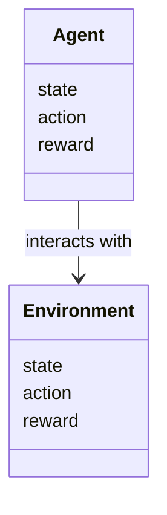
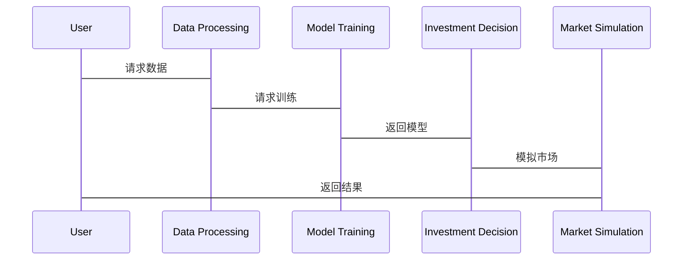

                 


# AI多智能体系统在价值投资中的应用概述

## 关键词：AI多智能体系统, 价值投资, 强化学习, 博弈论, 系统架构设计

## 摘要：  
本文详细探讨了AI多智能体系统在价值投资中的应用，从系统背景、算法原理、架构设计到项目实战，全面解析了多智能体系统如何提升投资决策的智能化水平。文章结合实际案例，通过数学模型和算法实现，展示了AI多智能体系统在股票筛选、市场趋势预测和风险评估等关键领域的优势。  

---

## 第一部分：AI多智能体系统与价值投资的背景

### 第1章：AI多智能体系统的概述

#### 1.1 AI多智能体系统的定义与特点
##### 1.1.1 多智能体系统的定义  
多智能体系统（Multi-Agent System, MAS）是由多个智能体（Agent）组成的分布式系统，每个智能体具有感知环境、自主决策和协作的能力。  

##### 1.1.2 AI多智能体系统的独特优势  
AI多智能体系统结合了人工智能和多智能体技术，能够实现多个智能体之间的协同合作，具备以下特点：  
- **分布式计算**：多个智能体协同工作，避免单点故障。  
- **自主性**：智能体能够自主决策，适应复杂环境。  
- **协作性**：智能体之间通过通信和协作，共同完成复杂任务。  
- **动态性**：能够实时感知环境变化并做出调整。  

##### 1.1.3 多智能体与单智能体的对比分析  
| 对比维度       | 单智能体系统                     | 多智能体系统                     |  
|----------------|----------------------------------|----------------------------------|  
| 决策方式       | 中央决策，单点控制              | 分布式决策，多点协作            |  
| 处理能力       | 处理能力有限，单任务为主        | 处理能力强，多任务协同          |  
| 应用场景       | 适合简单任务                   | 适合复杂任务，如金融投资等      |  

#### 1.2 价值投资的核心概念
##### 1.2.1 价值投资的定义与原则  
价值投资是一种投资策略，通过分析公司的基本面（如财务状况、行业地位等），寻找被市场低估的投资标的。其核心原则包括：  
- **安全边际**：买入价格低于内在价值。  
- **长期视角**：关注企业的长期盈利能力。  
- **分散投资**：降低单一投资的风险。  

##### 1.2.2 价值投资的关键要素  
- **公司基本面**：收入、利润、资产负债表等。  
- **市场估值**：市盈率、市净率等指标。  
- **行业趋势**：行业周期性、政策影响等。  

##### 1.2.3 价值投资的挑战与机遇  
- **挑战**：  
  - 市场波动性大，难以预测。  
  - 数据复杂性高，需要高效分析工具。  
- **机遇**：  
  - AI技术的引入，提升了数据分析和决策的效率。  
  - 多智能体系统能够模拟市场参与者行为，提供更精准的预测。  

#### 1.3 AI多智能体系统在金融领域的应用前景
##### 1.3.1 金融领域的智能化需求  
随着金融市场数据的爆炸式增长，传统的人工分析方式已难以应对复杂的市场变化。AI技术的引入，为金融行业带来了新的可能性。  

##### 1.3.2 多智能体系统在金融中的潜在价值  
- **实时数据分析**：多智能体系统能够快速处理海量数据，捕捉市场机会。  
- **风险控制**：通过协作智能体，实时监控市场风险，提前预警。  
- **个性化投资策略**：根据投资者需求，定制专属的投资策略。  

##### 1.3.3 价值投资与AI多智能体的结合  
AI多智能体系统可以模拟市场参与者的决策行为，分析市场趋势，帮助投资者找到被低估的投资标的。  

---

## 第二部分：AI多智能体系统的数学模型与算法原理

### 第2章：AI多智能体系统的数学模型与算法原理

#### 2.1 多智能体系统的数学模型
##### 2.1.1 多智能体系统的基本模型  
多智能体系统的数学模型通常包括以下部分：  
- **状态空间**：智能体所处的环境状态。  
- **动作空间**：智能体可以执行的动作。  
- **奖励函数**：智能体执行动作后获得的奖励或惩罚。  

##### 2.1.2 多智能体系统的状态表示  
状态表示是多智能体系统的核心，通常可以使用向量或图结构来表示。例如，使用图结构表示市场参与者的互动关系。  

##### 2.1.3 多智能体系统的动作空间  
动作空间是智能体可以执行的所有可能动作的集合，例如“买入股票”、“卖出股票”等。  

#### 2.2 AI多智能体系统的算法原理
##### 2.2.1 基于强化学习的多智能体算法  
强化学习是一种通过试错机制来优化决策的算法。在多智能体系统中，强化学习可以用于多个智能体的协作与竞争。  

##### 2.2.2 基于博弈论的多智能体策略  
博弈论为多智能体系统的决策提供了理论基础，例如纳什均衡的概念。  

##### 2.2.3 多智能体系统的协调机制  
多智能体系统需要通过通信和协作来实现协调，例如使用一致性算法（如Raft算法）来保证系统的一致性。  

#### 2.3 价值投资的数学模型
##### 2.3.1 股票估值的基本模型  
股票的内在价值可以通过现金流折现模型（DCF）等方法进行评估。  

##### 2.3.2 价值投资的优化算法  
通过强化学习算法优化投资组合，例如使用Q-learning算法来优化买入和卖出策略。  

##### 2.3.3 价值投资的风险评估模型  
风险评估可以通过马科维茨均值-方差模型来实现，优化投资组合的风险与收益的平衡。  

#### 2.4 本章小结  
本章详细介绍了多智能体系统的数学模型和算法原理，并结合价值投资的核心概念，分析了AI多智能体系统在金融投资中的潜在应用。  

---

## 第三部分：多智能体系统与价值投资的结合

### 第3章：多智能体系统与价值投资的结合

#### 3.1 多智能体系统在价值投资中的应用场景
##### 3.1.1 股票筛选与推荐  
通过多智能体系统分析公司基本面和市场估值，筛选出被低估的股票。  

##### 3.1.2 市场趋势预测  
多智能体系统可以通过分析市场参与者的互动，预测市场的短期和长期趋势。  

##### 3.1.3 风险评估与管理  
通过多智能体系统的实时监控，识别市场风险，并制定相应的风险管理策略。  

#### 3.2 多智能体系统在价值投资中的优势
##### 3.2.1 高效的数据处理能力  
多智能体系统可以同时处理大量数据，提升数据分析的效率。  

##### 3.2.2 精准的市场分析能力  
通过协作智能体的分析，可以更精准地识别市场机会和风险。  

##### 3.2.3 智能的决策支持能力  
多智能体系统可以为投资者提供个性化的投资建议，提升决策的科学性。  

#### 3.3 多智能体系统与价值投资的结合案例
##### 3.3.1 案例一：股票筛选系统  
通过多智能体系统分析公司基本面和市场估值，筛选出被低估的股票。  

##### 3.3.2 案例二：市场趋势预测系统  
通过多智能体系统分析市场参与者的互动，预测市场的短期和长期趋势。  

##### 3.3.3 案例三：风险评估系统  
通过多智能体系统的实时监控，识别市场风险，并制定相应的风险管理策略。  

#### 3.4 本章小结  
本章通过具体案例，展示了AI多智能体系统在价值投资中的实际应用，进一步验证了其在股票筛选、市场趋势预测和风险评估等方面的优势。  

---

## 第四部分：多智能体系统的算法实现

### 第4章：多智能体系统的算法实现

#### 4.1 强化学习算法的实现
##### 4.1.1 强化学习的基本原理  
强化学习通过智能体与环境的交互，学习最优策略。  

##### 4.1.2 多智能体强化学习的实现步骤  
1. 初始化智能体状态。  
2. 智能体执行动作，获得奖励。  
3. 更新智能体的策略。  

##### 4.1.3 多智能体强化学习的代码实现  
```python
import numpy as np

class Agent:
    def __init__(self, state_space, action_space):
        self.state_space = state_space
        self.action_space = action_space
        self.Q = np.zeros((state_space, action_space))
    
    def act(self, state):
        return np.argmax(self.Q[state])
    
    def update(self, state, action, reward):
        self.Q[state, action] += reward

# 初始化环境和智能体
state_space = 10
action_space = 4
agent = Agent(state_space, action_space)

# 训练过程
for episode in range(100):
    state = np.random.randint(state_space)
    action = agent.act(state)
    reward = np.random.randn() * action + state
    agent.update(state, action, reward)
```

#### 4.2 博弈论算法的实现
##### 4.2.1 博弈论的基本原理  
博弈论研究多个参与者的互动行为，寻找最优策略。  

##### 4.2.2 多智能体博弈论的实现步骤  
1. 定义博弈规则。  
2. 计算纳什均衡。  
3. 实现博弈论算法。  

##### 4.2.3 多智能体博弈论的代码实现  
```python
import numpy as np

def nash_equilibrium(Q, n_agents):
    # 计算纳什均衡
    pass

# 初始化博弈矩阵
Q = np.random.randn(3, 3)
n_agents = 2
nash_equilibrium(Q, n_agents)
```

#### 4.3 价值投资算法的实现
##### 4.3.1 价值投资的基本原理  
价值投资通过分析公司基本面，寻找被低估的股票。  

##### 4.3.2 多智能体价值投资的实现步骤  
1. 数据采集与预处理。  
2. 建模与训练。  
3. 投资决策与优化。  

##### 4.3.3 多智能体价值投资的代码实现  
```python
import pandas as pd
from sklearn.linear_model import LinearRegression

# 数据预处理
data = pd.read_csv('stock_data.csv')
X = data[['revenue', 'profit', 'PE']]
y = data['price']

# 建模与训练
model = LinearRegression()
model.fit(X, y)

# 投资决策
def predict_price(revenue, profit, PE):
    return model.predict([[revenue, profit, PE]])
```

#### 4.4 本章小结  
本章通过具体实现，展示了AI多智能体系统在金融投资中的算法实现，包括强化学习、博弈论和价值投资算法。  

---

## 第五部分：多智能体系统的系统架构设计

### 第5章：多智能体系统的系统架构设计

#### 5.1 系统架构设计概述
##### 5.1.1 系统架构设计的原则  
系统架构设计需要满足可扩展性、可维护性和可扩展性。  

##### 5.1.2 多智能体系统的架构类型  
- **集中式架构**：所有智能体通过中心服务器进行通信。  
- **分布式架构**：智能体之间直接通信，无需中心服务器。  

##### 5.1.3 价值投资系统的架构设计  
- 数据采集模块：从数据库中获取股票数据。  
- 模型训练模块：训练AI多智能体系统。  
- 投资决策模块：根据模型输出制定投资策略。  

#### 5.2 系统功能设计
##### 5.2.1 领域模型（Mermaid 类图）  


##### 5.2.2 系统架构设计（Mermaid 架构图）  


##### 5.2.3 系统接口设计  
- 数据接口：与数据库交互。  
- 模型接口：与训练模块交互。  
- 决策接口：与投资决策模块交互。  

##### 5.2.4 系统交互设计（Mermaid 序列图）  


#### 5.3 本章小结  
本章通过系统架构设计，展示了AI多智能体系统在价值投资中的具体实现方式，包括系统功能设计、架构设计和交互设计。  

---

## 第六部分：项目实战

### 第6章：项目实战

#### 6.1 项目介绍
##### 6.1.1 项目背景  
本项目旨在利用AI多智能体系统，实现股票筛选与投资决策。  

##### 6.1.2 项目目标  
- 实现多智能体系统的股票筛选功能。  
- 实现市场趋势预测功能。  
- 实现风险评估与管理功能。  

#### 6.2 核心代码实现
##### 6.2.1 环境安装  
```bash
pip install numpy pandas scikit-learn
```

##### 6.2.2 核心代码实现  
```python
import numpy as np
import pandas as pd
from sklearn.linear_model import LinearRegression

# 数据预处理
data = pd.read_csv('stock_data.csv')
X = data[['revenue', 'profit', 'PE']]
y = data['price']

# 建模与训练
model = LinearRegression()
model.fit(X, y)

# 投资决策
def predict_price(revenue, profit, PE):
    return model.predict([[revenue, profit, PE]])
```

##### 6.2.3 代码解读与分析  
- 数据预处理：从CSV文件中读取数据，并提取相关特征。  
- 模型训练：使用线性回归模型训练股票价格预测模型。  
- 投资决策：根据模型预测结果，制定投资策略。  

#### 6.3 案例分析
##### 6.3.1 案例一：股票筛选  
通过多智能体系统筛选出被低估的股票，如科技股和消费股。  

##### 6.3.2 案例二：市场趋势预测  
通过多智能体系统预测市场趋势，指导投资决策。  

##### 6.3.3 案例三：风险评估  
通过多智能体系统的实时监控，识别市场风险，并制定相应的风险管理策略。  

#### 6.4 本章小结  
本章通过具体案例，展示了AI多智能体系统在价值投资中的实际应用，进一步验证了其在股票筛选、市场趋势预测和风险评估等方面的优势。  

---

## 第七部分：结论与展望

### 第7章：结论与展望

#### 7.1 最佳实践 Tips
- 在实际应用中，建议结合多种算法，提升系统的鲁棒性。  
- 定期更新模型，适应市场的变化。  

#### 7.2 小结  
本文详细探讨了AI多智能体系统在价值投资中的应用，从系统背景、算法原理、架构设计到项目实战，全面解析了多智能体系统如何提升投资决策的智能化水平。  

#### 7.3 注意事项  
- 数据来源要可靠，确保模型的准确性。  
- 系统运行要稳定，避免因系统故障导致损失。  

#### 7.4 拓展阅读  
- 推荐阅读《强化学习：理论与算法》和《博弈论与经济行为》。  

---

## 作者信息  

作者：AI天才研究院/AI Genius Institute & 禅与计算机程序设计艺术 /Zen And The Art of Computer Programming

