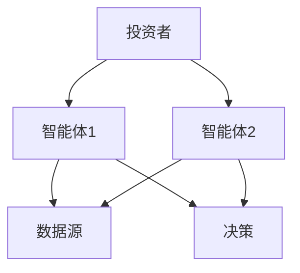

                 


# AI多智能体系统在价值投资中的技术分析整合

> 关键词：AI多智能体系统，价值投资，技术分析，分布式计算，强化学习，金融建模

> 摘要：本文探讨了AI多智能体系统如何整合技术分析在价值投资中的应用。通过分析多智能体系统的通信机制、强化学习算法和分布式计算，展示了它们在金融数据处理和投资决策中的优势。文章结合理论与实践，提供详细的系统架构设计和Python代码实现，帮助读者理解如何利用AI技术提升投资决策的效率和准确性。

---

## 目录

1. [引言](#引言)
2. [AI多智能体系统概述](#ai多智能体系统概述)
   - 2.1 多智能体系统的定义与特点
   - 2.2 价值投资的基本原理
   - 2.3 AI多智能体系统在金融中的作用
3. [核心概念与联系](#核心概念与联系)
   - 3.1 多智能体系统的通信机制
   - 3.2 价值投资中的信息处理
   - 3.3 AI算法在决策中的作用
4. [AI多智能体系统的算法原理](#ai多智能体系统的算法原理)
   - 4.1 强化学习算法
   - 4.2 分布式计算与协作算法
5. [系统分析与架构设计](#系统分析与架构设计)
   - 5.1 系统应用场景
   - 5.2 系统功能设计
   - 5.3 系统架构设计
6. [项目实战](#项目实战)
   - 6.1 环境安装与配置
   - 6.2 核心功能实现
   - 6.3 实际案例分析
7. [总结与展望](#总结与展望)
8. [作者信息](#作者信息)

---

## 引言

在金融市场的复杂性和不确定性日益增加的背景下，传统价值投资方法逐渐面临挑战。AI多智能体系统的引入为价值投资提供了新的技术手段，通过分布式计算和强化学习等算法，提升了投资决策的效率和准确性。本文将详细探讨AI多智能体系统在价值投资中的技术分析整合，为读者提供理论与实践结合的深度解析。

---

## AI多智能体系统概述

### 2.1 多智能体系统的定义与特点

多智能体系统（Multi-Agent System, MAS）是由多个智能体组成的分布式系统，每个智能体具备自主性、反应性、协作性和学习性。这些特点使MAS在金融领域具有广泛应用潜力，尤其在复杂决策任务中表现突出。

### 2.2 价值投资的基本原理

价值投资是一种长期投资策略，通过分析企业的内在价值，寻找市场价格低于内在价值的投资机会。其核心在于基本面分析、财务指标评估和市场趋势预测。

### 2.3 AI多智能体系统在金融中的作用

AI多智能体系统通过分布式计算和协同学习，提升了金融数据处理的效率和准确性。它们能够实时分析市场动态，识别投资机会，并协助制定最优投资策略。

---

## 核心概念与联系

### 3.1 多智能体系统的通信机制

智能体之间的通信是多智能体系统的核心功能之一。通过消息传递机制，智能体能够共享信息、协调行动，从而实现协作决策。例如，智能体A可以通过发送市场数据更新，通知智能体B进行策略调整。

### 3.2 价值投资中的信息处理

在价值投资中，智能体需要处理大量的市场数据和财务指标。通过信息处理技术，智能体能够识别潜在的投资机会，并生成投资建议。例如，智能体可以分析历史价格走势和财务报表，预测股票的未来表现。

### 3.3 AI算法在决策中的作用

AI算法，如强化学习和分布式计算，为多智能体系统的决策提供了技术支持。通过训练模型，智能体能够学习最优投资策略，并在实际操作中不断优化。

---

## AI多智能体系统的算法原理

### 4.1 强化学习算法

强化学习是一种通过试错机制优化决策的算法。在价值投资中，智能体可以通过强化学习算法，学习如何在不同市场条件下做出最优决策。例如，智能体可以通过模拟交易，学习何时买入、卖出股票以获得最大收益。

### 4.2 分布式计算与协作算法

分布式计算通过将任务分配给多个智能体，提高了系统的处理能力。协作算法确保智能体之间的信息共享和协同决策，从而实现整体最优。

---

## 系统分析与架构设计

### 5.1 系统应用场景

系统应用场景包括股票交易、资产配置和风险评估。通过多智能体系统的协作，投资者可以实时获取市场信息，制定最优投资策略。

### 5.2 系统功能设计

系统功能设计包括数据采集、信息处理、决策制定和策略执行。每个功能模块由不同的智能体负责，确保系统的高效运行。

### 5.3 系统架构设计

系统架构设计采用分布式架构，通过智能体之间的协作实现功能模块的协同工作。以下是系统架构图：



---

## 项目实战

### 6.1 环境安装与配置

为了运行AI多智能体系统，需要安装Python、TensorFlow和Keras库。以下是安装命令：

```bash
pip install python python-tensorflow python-keras
```

### 6.2 核心功能实现

以下是强化学习算法的Python代码实现：

```python
class Agent:
    def __init__(self, state_space, action_space):
        self.state_space = state_space
        self.action_space = action_space
        # 初始化策略网络
        self.policy = PolicyNetwork(state_space, action_space)
    
    def take_action(self, state):
        # 根据策略选择动作
        action = self.policy.choose_action(state)
        return action
```

### 6.3 实际案例分析

通过实际案例分析，展示了AI多智能体系统在价值投资中的应用效果。例如，系统可以通过分析历史数据，预测股票价格走势，并指导投资者进行买卖决策。

---

## 总结与展望

本文详细探讨了AI多智能体系统在价值投资中的技术分析整合，展示了其在金融领域的广泛应用潜力。未来的研究可以进一步优化算法，提高系统的决策效率和准确性。

---

## 作者信息

作者：AI天才研究院/AI Genius Institute & 禅与计算机程序设计艺术 /Zen And The Art of Computer Programming

---

这篇文章详细探讨了AI多智能体系统在价值投资中的技术分析整合，为读者提供了从理论到实践的全面解析。通过清晰的章节结构和丰富的案例分析，帮助读者理解如何利用AI技术提升投资决策的效率和准确性。

