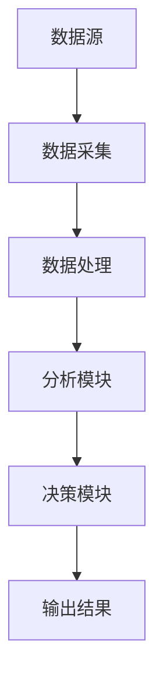
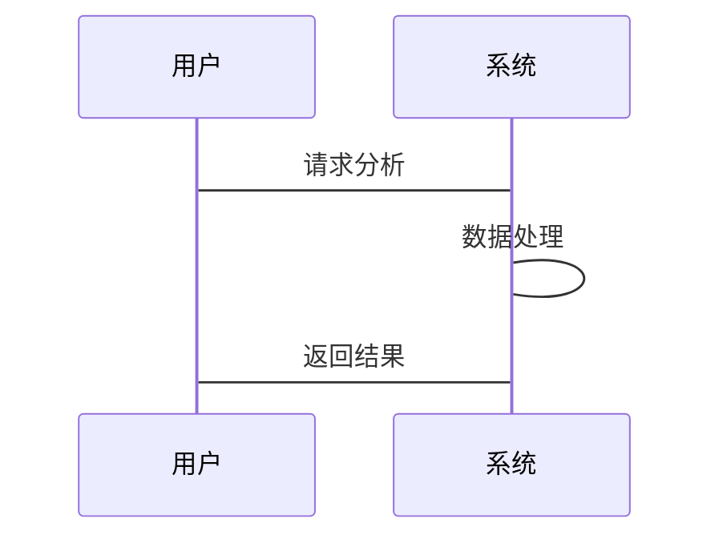

                 


# AI多智能体系统在价值投资中的研发效率评估

> 关键词：AI多智能体系统，价值投资，研发效率，金融应用，算法原理

> 摘要：本文深入探讨了AI多智能体系统在价值投资中的应用及其研发效率评估。通过分析多智能体系统的结构与协作机制，结合实际案例，详细阐述了其在金融领域的优势与挑战，并提出了提升研发效率的方法和策略。

## 第一部分：背景介绍

### 第1章：AI多智能体系统概述
1.1 多智能体系统的定义与特点
- 多智能体系统的定义：由多个独立智能体组成的系统，通过协作完成复杂任务。
- 特点：分布式、协作性、自主性、反应性。

1.2 价值投资的基本概念
- 价值投资定义：以内在价值为导向，寻找被市场低估的投资标的。
- 核心理念：长期投资、安全边际、市场先生。

1.3 AI多智能体系统在金融领域的应用背景
- 金融市场的复杂性：多因素影响、高频交易、信息不对称。
- AI技术的优势：数据处理能力强、实时分析、非线性关系捕捉。
- 多智能体系统优势：分布式决策、协作优化、适应性高。

### 第2章：AI多智能体系统在价值投资中的问题背景
2.1 价值投资中的传统方法与挑战
- 传统方法：基本面分析，依赖经验和直觉。
- 挑战：数据量大、信息不全、人为因素干扰。

2.2 AI多智能体系统在价值投资中的问题描述
- 数据分析的深度与广度不足。
- 系统协作效率低下。
- 研发效率评估标准不明确。

2.3 多智能体系统如何解决价值投资中的问题
- 分布式分析：多维度数据处理。
- 协作优化：提高决策质量。
- 实时反馈：动态调整投资策略。

## 第二部分：核心概念与联系

### 第3章：AI多智能体系统的原理与结构
3.1 多智能体系统的组成与结构
- 组成要素：智能体、通信机制、协作协议。
- 通信机制：消息传递、状态共享。
- 协作协议：任务分配、决策同步。

3.2 多智能体系统与价值投资的结合
- 价值评估：多智能体协作进行企业估值。
- 风险评估：分布式风险分析。
- 投资决策：群体智能辅助决策。

3.3 多智能体系统在价值投资中的核心要素
- 数据源：财务数据、市场数据、行业信息。
- 智能体角色：数据分析师、估值专家、策略制定者。
- 交互方式：信息共享、决策协商、结果反馈。

## 第三部分：算法原理讲解

### 第4章：多智能体协作算法
4.1 分布式多智能体协作算法
- 分层架构：高层决策、底层执行。
- 协作机制：任务分配、资源协调。

4.2 强化学习在多智能体系统中的应用
- 策略网络：智能体间策略同步。
- 奖励机制：个体与全局奖励结合。

4.3 联合学习算法
- 知识共享：经验迁移。
- 集群学习：群体智慧提升决策。

### 第5章：价值投资中的算法实现
5.1 价值评估算法
- 财务指标分析：ROE、PE、PB。
- 市场情绪分析：自然语言处理。

5.2 风险评估算法
- 风险因子模型：VaR、CVaR。
- 系统性风险评估：波动率分析。

5.3 投资决策算法
- 多因素回归：预测股价走势。
- 群体决策：多智能体共识。

## 第四部分：数学模型与公式

### 第6章：数学模型
6.1 价值评估模型
$$ V = \sum_{t=1}^{n} \frac{CF_t}{(1 + r)^t} $$
- 其中，V为内在价值，CF_t为第t年的现金流，r为折现率。

6.2 风险评估模型
$$ R = \sqrt{\frac{252}{N} \sum_{i=1}^{N} (r_i - \bar{r})^2} $$
- R为波动率，r_i为收益率，N为数据点数。

6.3 投资组合优化模型
$$ \text{max} \mu w - 0.5 w^T \Sigma w $$
- w为权重向量，Σ为协方差矩阵。

## 第五部分：系统分析与架构设计

### 第7章：系统分析
7.1 问题场景分析
- 数据源分散：如何整合多源数据。
- 系统实时性：如何保证快速响应。
- 系统可扩展性：如何支持大规模数据处理。

7.2 系统功能设计
- 数据采集模块：收集财务、市场数据。
- 数据处理模块：清洗、转换数据。
- 分析模块：估值、风险评估。
- 决策模块：生成投资策略。

### 第8章：系统架构设计
8.1 系统架构图（mermaid）


8.2 接口设计
- 数据接口：API调用。
- 交互接口：用户界面。

8.3 交互流程图（mermaid）


## 第六部分：项目实战

### 第9章：环境安装与核心实现
9.1 环境安装
- Python 3.8+
- 安装依赖：numpy、pandas、scikit-learn。

9.2 核心功能实现
- 数据处理代码示例：
```python
import pandas as pd
data = pd.read_csv('data.csv')
print(data.head())
```

- 算法实现示例：
```python
from sklearn import svm
model = svm.SVC()
model.fit(X, y)
```

### 第10章：案例分析
10.1 案例背景
- 公司A：财务数据、市场表现。

10.2 实施步骤
- 数据采集：收集过去5年数据。
- 数据处理：清洗、转换。
- 分析评估：估值、风险分析。
- 决策制定：投资建议。

10.3 分析结果
- 内在价值计算。
- 风险评估结果。
- 投资策略建议。

## 第七部分：最佳实践

### 第11章：总结与建议
11.1 总结
- 多智能体系统的优势。
- 研发效率提升的关键点。

11.2 最佳实践
- 数据质量管理：确保数据准确。
- 算法优化：提升计算效率。
- 系统维护：定期更新模型。

### 第12章：注意事项与拓展
12.1 注意事项
- 系统安全性：防止数据泄露。
- 系统稳定性：确保无故障运行。
- 知识产权：保护算法创新。

12.2 拓展阅读
- 推荐书籍：《Python机器学习实战》。
- 推荐博客：AI多智能体系统研究博客。

## 作者

作者：AI天才研究院/AI Genius Institute & 禅与计算机程序设计艺术 /Zen And The Art of Computer Programming

---

这篇博客文章详细探讨了AI多智能体系统在价值投资中的应用，从背景介绍到系统设计，再到项目实战，全面分析了如何利用多智能体系统提升研发效率。文章结构清晰，内容详实，为读者提供了深入的技术见解和实践指导。

