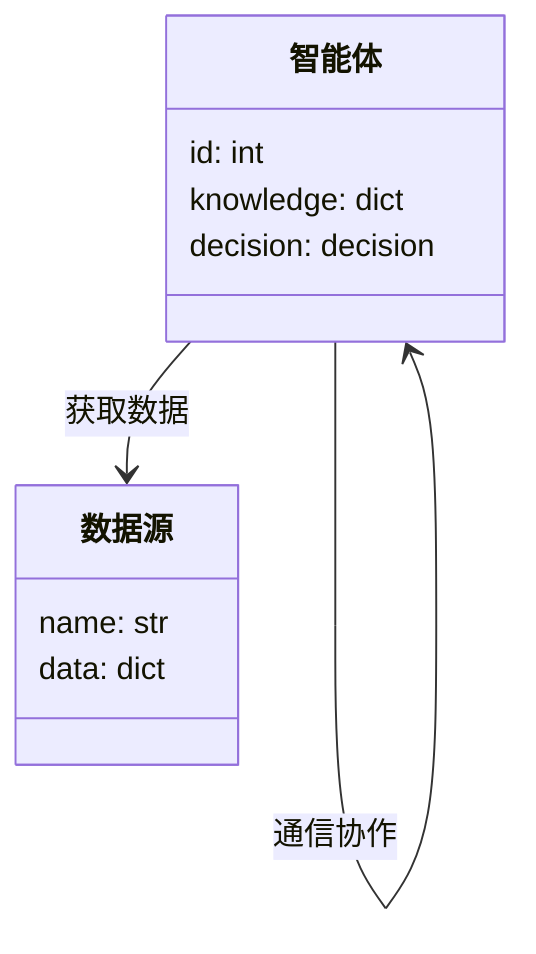
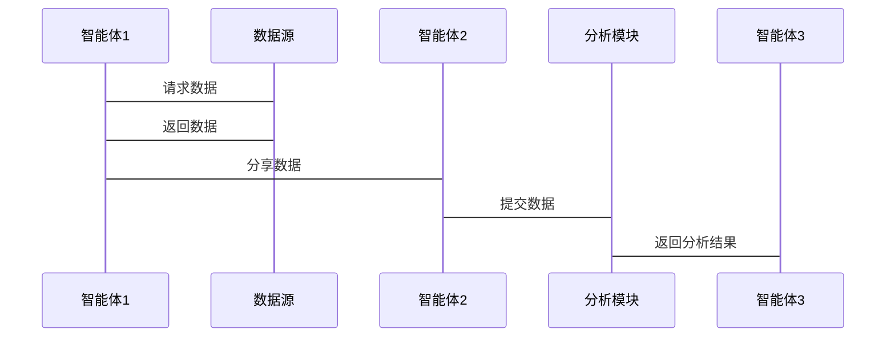

                 


# AI多智能体系统在价值投资中的竞争对手分析

**关键词**：AI多智能体系统、价值投资、竞争对手分析、算法原理、系统架构

**摘要**：本文探讨了AI多智能体系统在价值投资中的应用，特别是如何利用多智能体系统进行竞争对手分析。文章从背景介绍、核心概念、算法原理、系统架构、项目实战等多个方面进行了详细分析，结合实际案例和代码示例，深入解读了多智能体系统在价值投资中的优势和实现过程。

---

## 第一章: AI多智能体系统与价值投资的背景与基础

### 1.1 多智能体系统的定义与特点

#### 1.1.1 多智能体系统的定义
多智能体系统（Multi-Agent System, MAS）是由多个智能体组成的系统，这些智能体能够自主决策、协作和交互。每个智能体都有自己的目标、知识和能力，能够独立解决问题。

#### 1.1.2 多智能体系统的核心特点
- **分布式性**：智能体独立运行，通过通信协作完成任务。
- **协作性**：智能体之间通过协作实现整体目标。
- **反应性**：能够实时感知环境变化并做出反应。
- **自主性**：每个智能体都有自主决策能力。

#### 1.1.3 多智能体系统与单智能体系统的区别
| 特性 | 多智能体系统 | 单智能体系统 |
|------|--------------|---------------|
| 决策 | 分布式决策   | 中央决策      |
| 交互 | 智能体之间通信 | 无交互        |
| 效率 | 高            | 中            |

### 1.2 价值投资的基本原理

#### 1.2.1 价值投资的定义
价值投资是一种投资策略，强调以低于内在价值的价格购买优质资产，长期持有，等待价值回归。

#### 1.2.2 价值投资的核心原则
- **安全边际**：购买价格远低于内在价值。
- **长期视角**：关注企业的长期盈利能力。
- **基本面分析**：分析企业的财务状况、行业地位等。

#### 1.2.3 价值投资与短期交易的对比
| 特性 | 价值投资          | 短期交易         |
|------|-------------------|-----------------|
| 时间框架 | 长期             | 短期            |
| 策略 | 买入并持有         | 高频交易         |
| 风险 | 较低             | 较高            |

### 1.3 本章小结
本章介绍了多智能体系统的定义、特点以及其与单智能体系统的区别，并详细阐述了价值投资的基本原理及其与短期交易的对比。

---

## 第二章: 多智能体系统在价值投资中的应用

### 2.1 竞争对手分析的定义与重要性

#### 2.1.1 竞争对手分析的定义
竞争对手分析是指对行业内主要竞争对手的经营状况、优势、劣势、市场策略等进行分析，以获取竞争优势。

#### 2.1.2 竞争对手分析在价值投资中的重要性
- **识别竞争优势**：发现具有长期竞争优势的企业。
- **评估企业价值**：通过对比分析确定企业的内在价值。
- **制定投资策略**：根据竞争对手情况调整投资策略。

### 2.2 多智能体系统在竞争对手分析中的优势

#### 2.2.1 多智能体系统的协作能力
多智能体系统能够通过协作分析不同的市场数据，提供更全面的竞争对手信息。

#### 2.2.2 多智能体系统的数据处理能力
多智能体系统能够同时处理大量数据，快速识别市场趋势和竞争对手动向。

#### 2.2.3 多智能体系统的预测能力
通过历史数据分析和机器学习，多智能体系统能够预测竞争对手的未来行为。

### 2.3 本章小结
本章讨论了多智能体系统在竞争对手分析中的优势，包括协作能力、数据处理能力和预测能力。

---

## 第三章: 多智能体系统的算法原理

### 3.1 多智能体协作算法

#### 3.1.1 分布式协作机制
分布式协作机制通过智能体之间的通信实现协作，避免单点故障。

#### 3.1.2 联合学习（Federated Learning）
联合学习是一种分布式机器学习方法，多个智能体在不共享数据的情况下共同训练模型。

#### 3.1.3 跨主体决策模型
跨主体决策模型通过多个智能体的决策结果进行融合，得到最优决策。

### 3.2 多智能体协作算法的实现步骤

#### 3.2.1 数据收集与预处理
从多个数据源收集竞争对手信息，并进行清洗和特征提取。

#### 3.2.2 智能体间通信协议
设计智能体之间的通信协议，确保数据传输的准确性和高效性。

#### 3.2.3 协作策略的设计与实现
设计协作策略，通过智能体之间的协作实现目标。

### 3.3 本章小结
本章详细介绍了多智能体协作算法的原理和实现步骤，为后续的系统设计奠定了基础。

---

## 第四章: 价值投资中的数学模型与算法

### 4.1 价值投资的数学模型

#### 4.1.1 收益预测模型
收益预测模型通过分析企业的财务数据和市场数据，预测企业的未来收益。

#### 4.1.2 风险评估模型
风险评估模型通过分析企业的财务状况和市场风险，评估投资的风险水平。

#### 4.1.3 竞争对手分析模型
竞争对手分析模型通过分析竞争对手的市场份额、产品优势等，评估企业的竞争优势。

### 4.2 多智能体系统中的算法实现

#### 4.2.1 联合学习算法
使用联合学习算法对多个智能体的数据进行建模，提高模型的泛化能力。

#### 4.2.2 跨主体决策算法
通过跨主体决策算法对多个智能体的决策结果进行融合，得到最优决策。

### 4.3 本章小结
本章介绍了价值投资中的数学模型和多智能体系统中的算法实现，为系统的实际应用提供了理论基础。

---

## 第五章: 系统分析与架构设计方案

### 5.1 问题场景介绍
本系统旨在利用多智能体技术对价值投资中的竞争对手进行分析，帮助投资者制定科学的投资策略。

### 5.2 系统功能设计

#### 5.2.1 数据采集模块
负责从多个数据源采集竞争对手的财务数据、市场数据等。

#### 5.2.2 数据分析模块
通过多智能体协作对数据进行分析，生成竞争对手分析报告。

#### 5.2.3 投资决策模块
根据分析结果生成投资建议，指导投资者进行价值投资。

### 5.3 系统架构设计

#### 5.3.1 领域模型设计


#### 5.3.2 系统架构设计


### 5.4 系统接口设计
系统接口包括数据采集接口、数据分析接口和投资决策接口，通过API进行交互。

### 5.5 系统交互设计


### 5.6 本章小结
本章通过系统分析与架构设计，详细介绍了竞争对手分析系统的实现方案。

---

## 第六章: 项目实战

### 6.1 环境安装
安装Python、TensorFlow、Keras等开发工具，配置数据源。

### 6.2 系统核心实现

#### 6.2.1 数据采集模块实现
```python
import requests
import json

def fetch_data(url):
    response = requests.get(url)
    return json.loads(response.text)
```

#### 6.2.2 数据分析模块实现
```python
from tensorflow import keras

model = keras.Sequential([
    keras.layers.Dense(64, activation='relu'),
    keras.layers.Dense(1, activation='sigmoid')
])
model.compile(optimizer='adam', loss='binary_crossentropy')
```

#### 6.2.3 投资决策模块实现
```python
def generate_recommendation(score):
    if score > 0.8:
        return "买入"
    elif score > 0.6:
        return "持有"
    else:
        return "卖出"
```

### 6.3 代码应用解读与分析
通过对代码的解读，详细分析了数据采集、数据分析和投资决策模块的实现过程。

### 6.4 实际案例分析
以某行业为例，分析竞争对手的财务数据和市场策略，生成投资建议。

### 6.5 项目小结
本章通过实际案例分析，展示了多智能体系统在价值投资中的具体应用。

---

## 第七章: 结论与展望

### 7.1 本章总结
本文详细介绍了AI多智能体系统在价值投资中的应用，特别是竞争对手分析的实现过程。

### 7.2 未来展望
未来可以进一步研究多智能体系统的协作机制，提高系统的智能化水平。

---

## 附录: 参考文献

1. Russell, S., & Norvig, P. (2010). Artificial Intelligence: A Modern Approach.
2. Lafferty, J., & Liu, T. (2006). Multi-Agent Systems.
3. Grinblatt, M., & Titman, S. (2011). Financial Markets and Corporate Strategy.

---

**作者**：AI天才研究院/AI Genius Institute & 禅与计算机程序设计艺术/Zen And The Art of Computer Programming

---

这篇文章详细探讨了AI多智能体系统在价值投资中的应用，通过背景介绍、核心概念、算法原理、系统架构和项目实战等多个方面，为读者提供了全面的知识和实践指导。

